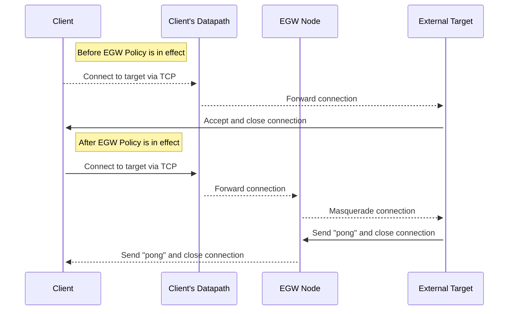

# egw

This directory contains utilities for performing scale tests on Cilium's Egress
Gateway feature.

An additional docker image is utilized to perform the test, which can be found
within the [cilium/scaffolding](https://github.com/cilium/scaffolding/tree/main/egw-scale-utils)
repository.

## Pod Masquerade Delay

This test measures the amount of time it takes for a Pod's network traffic to
be masqueraded through an EGW node to an external target.

### Test Overview

At a high-level, the test works by creating an EGW policy to target a workload
Pod that attempts to open a TCP connection to a pre-deployed external target.
If the pre-deployed external target sees that the source address of the TCP
connection is the pre-set EGW Node IP, then the external target will reply
with "pong" and close the connection. If the source address is not the pre-set
EGW Node IP, then the external target will close the connection without sending
any reply traffic.

When the client connects to the external target and does not receive any reply
traffic, the connection attempt is deemed a "miss". The client will continue
to connect to the external target until it receives "pong" in reply, allowing
for the implementation delay of an EGW policy for a new Pod to be measured.

A baseline test can be executed by running the test without deploying the
EGW Policy and by configuring the external target to always respond with
"pong" to any incoming requests.

### Client Pod Metrics

| Name                                            | Description                                                                                              |
| ----------------------------------------------- | -------------------------------------------------------------------------------------------------------- |
| `egw_scale_test_leaked_requests_total`          | The total number of leaked requests a client made when trying to access the external target.             |
| `egw_scale_test_masquerade_delay_seconds_total` | The number of seconds between a client pod starting and hitting the external target.                     |
| `egw_scale_test_failed_tests_total`             | Incremented when a client Pod is unable to connect to the external target after a preconfigured timeout. |

### Environment Details

The cluster needs to be created with four types of nodes:

1. At least one Node for the EGW clients to be deployed onto, labeled with
   `role.scaffolding/egw-client: true`.
2. At least one node to act as the EGW Node, labeled with
   `role.scaffolding/egw-node: true`.
3. A node to deploy the external target onto, labeled with
   `cilium.io/no-schedule "true"`. This label will prevent Cilium from being
   scheduled onto the node, tricking Cilium Agents running on other nodes into
   believing the node is external to the cluster.
4. A node to deploy monitoring infrastructure onto, to isolate
   monitoring-related traffic and resource usage from the test, labeled
   with `role.scaffolding/monitoring: true`.

### Test Set Up

After the cluster is created, use the `preflight.sh` script to perform setup tasks.

The components of the test rely on two pieces of information to be hardcoded
into their manifests:

1. The address of the dedicated EGW Node, which the external target uses
   to differentiate masqueraded versus non-masqueraded traffic.
2. The address of the external target, which is needed by the client to send
   requests and needed by the EGW Policy to understand the destination CIDR
   of outgoing connections that needs to be masqueraded.

Grabbing and hardcoding these two addresses ahead of time simplifies the
test execution and limits the overall scope of components under test.
For instance, using a hardcoded address for the external target allows
for the client to make a direct connection without the need for a Service
or DNS.

The `preflight.sh` script will grab the two addresses, fill out manifest
templates and apply the EGW policy.

**If running a baseline test, execute `preflight.sh baseline`,
which will cause the preflight script to configure the manifests for a baseline
test and skip applying the EGW policy.**

### Test Execution

The test is executed via [ClusterLoader2](https://github.com/kubernetes/perf-tests/tree/master/clusterloader2).
The config for the test is named `config.yml`. It executes the following steps
to run the test:

0. Deploy a PodMonitor to target the Prometheus endpoint of test client Pods.
1. Deploy the external target Pod and wait for it to be running and ready.
2. Deploy a single test client Pod and wait for it to be ready. Timeouts are
   configured in a way where, if the client Pod is unable to successfully
   connect to the external target through EGW, the test will fail. This
   step ensures that the EGW policy has been plumbed into the datapath.
3. Deploy `N` test client Pods and wait for them to be ready. The number
   of deployed client pods and the rate at which they are deployed can be
   configured. See the next section for details.
4. Sleep, to allow for the metrics exposed by each client Pod to be scraped.
5. Collect and export metrics. See the next section for details regarding
   the metrics which are exported.

### Test Metrics

| Name                                     | Description                                                                                                                   |
| ---------------------------------------- | ----------------------------------------------------------------------------------------------------------------------------- |
| `EGW Total Number of Client Pods`        | The total number of client pods that were deployed during the test.                                                           |
| `EGW Total Number of Failed Client Pods` | The total number of client pods that were unable to connect to the external target through EGW within the configured timeout. |
| `EGW Leaked Pings - Nth Percentile`      | The Nth percentile of pings that were leaked across all client pods.                                                          |
| `EGW Leaked Pings - Total`               | The total number of pings that were leaked across all client pods.                                                            |
| `EGW Masquerade Delay - Nth Percentile`  | The Nth percentile of the masquerade delay across all client pods.                                                            |

### Test Configuration

The following environment variables are available to modify the CL2 config:

1. `CL2_NUM_EGW_CLIENTS`: The total number of client Pods which the test will
   deploy.
2. `CL2_EGW_CLIENTS_QPS`: The number of client Pods to deploy per second.
