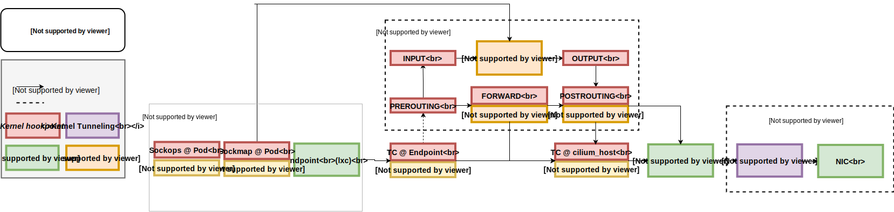

.. only:: not (epub or latex or html)

    WARNING: You are looking at unreleased Cilium documentation.
    Please use the official rendered version released here:
    http://docs.cilium.io

.. _arch_guide:

############
Architecture
############

This document describes the Cilium architecture. It focuses on
documenting the BPF datapath hooks to implement the Cilium datapath, how
the Cilium datapath integrates with the container orchestration layer, and the
objects shared between the layers e.g. the BPF datapath and Cilium agent.

Datapath
========

The Linux kernel supports a set of BPF hooks in the networking stack
that can be used to run BPF programs. The Cilium datapath uses these
hooks to load BPF programs that when used together create higher level
networking constructs.

The following is a list of the hooks used by Cilium and a brief
description. For a more thorough documentation on specifics of each
hook see :ref:`bpf_guide`.

* **XDP:** The XDP BPF hook is at the earliest point possible in the networking driver
  and triggers a run of the BPF program upon packet reception. This
  achieves the best possible packet processing performance since the
  program runs directly on the packet data before any other processing
  can happen. This hook is ideal for running filtering programs that
  drop malicious or unexpected traffic, and other common DDOS protection
  mechanisms.

* **Traffic Control Ingress/Egress:** BPF programs attached to the traffic
  control (tc) ingress hook are attached to a networking interface, same as
  XDP, but will run after the networking stack has done initial processing
  of the packet. The hook is run before the L3 layer of the stack but has
  access to most of the metadata associated with a packet. This is ideal
  for doing local node processing, such as applying L3/L4 endpoint policy
  and redirecting traffic to endpoints. For networking facing devices the
  tc ingress hook can be coupled with above XDP hook. When this is done it
  is reasonable to assume that the majority of the traffic at this
  point is legitimate and destined for the host.
  
  Containers typically use a virtual device called a veth pair which acts
  as a virtual wire connecting the container to the host. By attaching to
  the TC ingress hook of the host side of this veth pair Cilium can monitor
  and enforce policy on all traffic exiting a container. By attaching a BPF
  program to the veth pair associated with each container and routing all
  network traffic to the host side virtual devices with another BPF program
  attached to the tc ingress hook as well Cilium can monitor and enforce
  policy on all traffic entering or exiting the node.
  
  Depending on the use case, containers may also be connected through ipvlan
  devices instead of a veth pair. In this mode, the physical device in the
  host is the ipvlan master where virtual ipvlan devices in slave mode are
  set up inside the container. One of the benefits of ipvlan over a veth pair
  is that the stack requires less resources to push the packet into the
  ipvlan slave device of the other network namespace and therefore may
  achieve better latency results. This option can be used for unprivileged
  containers. The BPF programs for tc are then attached to the tc egress
  hook on the ipvlan slave device inside the container's network namespace
  in order to have Cilium apply L3/L4 endpoint policy, for example, combined
  with another BPF program running on the tc ingress hook of the ipvlan master
  such that also incoming traffic on the node can be enforced.

* **Socket operations:** The socket operations hook is attached to a specific
  cgroup and runs on TCP events. Cilium attaches a BPF socket operations
  program to the root cgroup and uses this to monitor for TCP state transitions,
  specifically for ESTABLISHED state transitions. When
  a socket transitions into ESTABLISHED state if the TCP socket has a node
  local peer (possibly a local proxy) a socket send/recv program is attached.

* **Socket send/recv:** The socket send/recv hook runs on every send operation
  performed by a TCP socket. At this point the hook can inspect the message
  and either drop the message, send the message to the TCP layer, or redirect
  the message to another socket. Cilium uses this to accelerate the datapath redirects
  as described below.

Combining the above hooks with a virtual interfaces (cilium_host, cilium_net),
an optional overlay interface (cilium_vxlan), Linux kernel crypto support and
a userspace proxy (Envoy) Cilium creates the following networking objects.

* **Prefilter:** The prefilter object runs an XDP program and
  provides a set of prefilter rules used to filter traffic from the network for best performance. Specifically,
  a set of CIDR maps supplied by the Cilium agent are used to do a lookup and the packet
  is either dropped, for example when the destination is not a valid endpoint, or allowed to be processed by the stack. This can be easily
  extended as needed to build in new prefilter criteria/capabilities.

* **Endpoint Policy:** The endpoint policy object implements the Cilium endpoint enforcement.
  Using a map to lookup a packets associated identity and policy this layer
  scales well to lots of endpoints. Depending on the policy this layer may drop the
  packet, forward to a local endpoint, forward to the service object or forward to the
  L7 Policy object for further L7 rules. This is the primary object in the Cilium
  datapath responsible for mapping packets to identities and enforcing L3 and L4 policies.

* **Service:** The Service object performs a map lookup on the destination IP
  and optionally destination port for every packet received by the object.
  If a matching entry is found, the packet will be forwarded to one of the
  configured L3/L4 endpoints. The Service block can be used to implement a
  standalone load balancer on any interface using the TC ingress hook or may
  be integrated in the endpoint policy object.

* **L3 Encryption:** On ingress the L3 Encryption object marks packets for
  decryption, passes the packets to the Linux xfrm (transform) layer for
  decryption, and after the packet is decrypted the object receives the packet
  then passes it up the stack for further processing by other objects. Depending
  on the mode, direct routing or overlay, this may be a BPF tail call or the
  Linux routing stack that passes the packet to the next object. The key required
  for decryption is encoded in the IPsec header so on ingress we do not need to
  do a map lookup to find the decryption key.

  On egress a map lookup is first performed using the destination IP to determine
  if a packet should be encrypted and if so what keys are available on the destination
  node. The most recent key available on both nodes is chosen and the
  packet is marked for encryption. The packet is then passed to the Linux
  xfrm layer where it is encrypted. Upon receiving the now encrypted packet
  it is passed to the next layer either by sending it to the Linux stack for
  routing or doing a direct tail call if an overlay is in use.

* **Socket Layer Enforcement:** Socket layer enforcement use two
  hooks the socket operations hook and the socket send/recv hook to monitor
  and attach to all TCP sockets associated with Cilium managed endpoints, including
  any L7 proxies. The socket operations hook
  will identify candidate sockets for accelerating. These include all local node connections
  (endpoint to endpoint) and any connection to a Cilium proxy.
  These identified connections will then have all messages handled by the socket
  send/recv hook and will be accelerated using sockmap fast redirects. The fast
  redirect ensures all policies implemented in Cilium are valid for the associated
  socket/endpoint mapping and assuming they are sends the message directly to the
  peer socket. This is allowed because the sockmap send/recv hooks ensures the message
  will not need to be processed by any of the objects above.

* **L7 Policy:** The L7 Policy object redirect proxy traffic to a Cilium userspace
  proxy instance. Cilium uses an Envoy instance as its userspace proxy. Envoy will
  then either forward the traffic or generate appropriate reject messages based on the configured L7 policy.

These components are connected to create the flexible and efficient datapath used
by Cilium. Below we show the following possible flows connecting endpoints on a single
node, ingress to an endpoint, and endpoint to egress networking device. In each case
there is an additional diagram showing the TCP accelerated path available when socket layer enforcement is enabled.

Endpoint to Endpoint
--------------------
First we show the local endpoint to endpoint flow with optional L7 Policy on
egress and ingress. Followed by the same endpoint to endpoint flow with
socket layer enforcement enabled. With socket layer enforcement enabled for TCP
traffic the
handshake initiating the connection will traverse the endpoint policy object until TCP state
is ESTABLISHED. Then after the connection is ESTABLISHED only the L7 Policy
object is still required.

.. image:: _static/cilium_bpf_endpoint.svg

Egress from Endpoint
--------------------

Next we show local endpoint to egress with optional overlay network. In the
optional overlay network traffic is forwarded out the Linux network interface
corresponding to the overlay. In the default case the overlay interface is
named cilium_vxlan. Similar to above, when socket layer enforcement is enabled
and a L7 proxy is in use we can avoid running the endpoint policy block between
the endpoint and the L7 Policy for TCP traffic. An optional L3 encryption block
will encrypt the packet if enabled.

Ingress to Endpoint
-------------------

Finally we show ingress to local endpoint also with optional overlay network.
Similar to above socket layer enforcement can be used to avoid a set of
policy traversals between the proxy and the endpoint socket. If the packet
is encrypted upon receive it is first decrypted and then handled through
the normal flow.

.. image:: _static/cilium_bpf_ingress.svg

veth-based versus ipvlan-based datapath
---------------------------------------

.. note:: The ipvlan-based datapath is currently only in technology preview
          and to be used for experimentation purposes. This restriction will
          be lifted in future Cilium releases.

By default Cilium CNI operates in veth-based datapath mode which allows for
more flexibility in that all BPF programs are managed by Cilium out of the host
network namespace such that containers can be granted privileges for their
namespaces like CAP_NET_ADMIN without affecting security since BPF enforcement
points in the host are unreachable for the container. Given BPF programs are
attached from the host's network namespace, BPF also has the ability to take
over and efficiently manage most of the forwarding logic between local containers
and host since there always is a networking device reachable. However, this
also comes at a latency cost as in veth-based mode the network stack internally
needs to be re-traversed when handing the packet from one veth device to its
peer device in the other network namespace. This egress-to-ingress switch needs
to be done twice when communicating between local Cilium endpoints, and once
for packet that are arriving or sent out of the host.

For a more latency optimized datapath, Cilium CNI also supports ipvlan L3/L3S mode
with a number of restrictions. In order to support older kernel's without ipvlan's
hairpin mode, Cilium attaches BPF programs at the ipvlan slave device inside
the container's network namespace on the tc egress layer, which means that
this datapath mode can only be used for containers which are not running with
CAP_NET_ADMIN and CAP_NET_RAW privileges! ipvlan uses an internal forwarding
logic for direct slave-to-slave or slave-to-master redirection and therefore
forwarding to devices is not performed from the BPF program itself. The network
namespace switching is more efficient in ipvlan mode since the stack does not
need to be re-traversed as in veth-based datapath case for external packets.
The host-to-container network namespace switch happens directly at L3 layer
without having to queue and reschedule the packet for later ingress processing.
In case of communication among local endpoints, the egress-to-ingress switch
is performed once instead of having to perform it twice.

For Cilium in ipvlan mode there are a number of additional restrictions in
the current implementation which are to be addressed in upcoming work: NAT64
cannot be enabled at this point as well as L7 policy enforcement via proxy.
Service load-balancing to local endpoints is currently not enabled as well
as container to host-local communication. If one of these features are needed,
then the default veth-based datapath mode is recommended instead.

The ipvlan mode in Cilium's CNI can be enabled by running the Cilium daemon
with e.g. ``--datapath-mode=ipvlan --ipvlan-master-device=bond0`` where the
latter typically specifies the physical networking device which then also acts
as the ipvlan master device. Note that in case ipvlan datapath mode is deployed
in L3S mode with Kubernetes, make sure to have a stable kernel running with the
following ipvlan fix included: `d5256083f62e <https://git.kernel.org/pub/scm/linux/kernel/git/davem/net.git/commit/?id=d5256083f62e2720f75bb3c5a928a0afe47d6bc3>`_.

This completes the datapath overview. More BPF specifics can be found in the
:ref:`bpf_guide`. Additional details on how to extend the L7 Policy
exist in the :ref:`envoy` section.

Scale
=====

BPF Map Limitations
-------------------

All BPF maps are created with upper capacity limits. Insertion beyond the limit
will fail and thus limits the scalability of the datapath. The following table
shows the default values of the maps. Each limit can be bumped in the source
code. Configuration options will be added on request if demand arises.

======================== ================ =============== =====================================================
Map Name                 Scope            Default Limit   Scale Implications
======================== ================ =============== =====================================================
Connection Tracking      node or endpoint 1M TCP/256K UDP Max 1M concurrent TCP connections, max 256K expected UDP answers
Endpoints                node             64k             Max 64k local endpoints + host IPs per node
IP cache                 node             512K            Max 256K endpoints (IPv4+IPv6), max 512k endpoints (IPv4 or IPv6) across all clusters
Load Balancer            node             64k             Max 64k cumulative backends across all services across all clusters
Policy                   endpoint         16k             Max 16k allowed identity + port + protocol pairs for specific endpoint
Proxy Map                node             512k            Max 512k concurrent redirected TCP connections to proxy
Tunnel                   node             64k             Max 32k nodes (IPv4+IPv6) or 64k nodes (IPv4 or IPv6) across all clusters
======================== ================ =============== =====================================================

Kubernetes Integration
======================

The following diagram shows the integration of iptables rules as installed by
kube-proxy and the iptables rules as installed by Cilium.

.. image:: _static/kubernetes_iptables.svg
