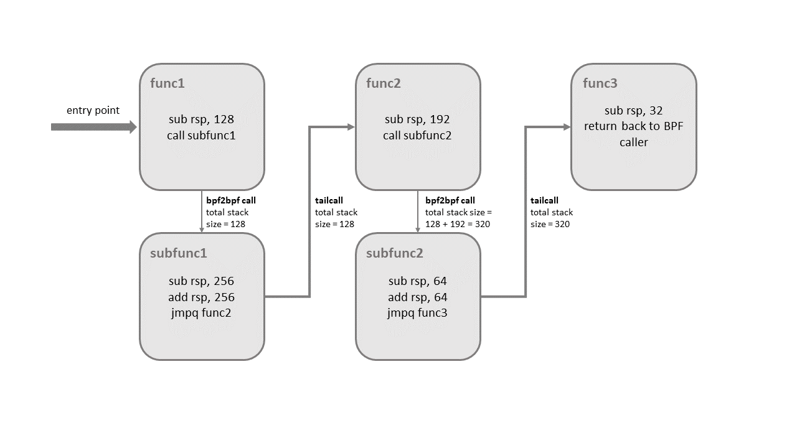

.. only:: not (epub or latex or html)

    WARNING: You are looking at unreleased Cilium documentation.
    Please use the official rendered version released here:
    https://docs.cilium.io

.. _bpf_guide:

***************************
BPF and XDP Reference Guide
***************************

.. note:: This documentation section is targeted at developers and users who
          want to understand BPF and XDP in great technical depth. While
          reading this reference guide may help broaden your understanding of
          Cilium, it is not a requirement to use Cilium. Please refer to the
          :ref:`gs_guide` and :ref:`ebpf_datapath` for a higher level
          introduction.

BPF is a highly flexible and efficient virtual machine-like construct in the
Linux kernel allowing to execute bytecode at various hook points in a safe
manner. It is used in a number of Linux kernel subsystems, most prominently
networking, tracing and security (e.g. sandboxing).

Although BPF exists since 1992, this document covers the extended Berkeley
Packet Filter (eBPF) version which has first appeared in Kernel 3.18 and
renders the original version which is being referred to as "classic" BPF
(cBPF) these days mostly obsolete. cBPF is known to many as being the packet
filter language used by tcpdump. Nowadays, the Linux kernel runs eBPF only and
loaded cBPF bytecode is transparently translated into an eBPF representation
in the kernel before program execution. This documentation will generally refer
to the term BPF unless explicit differences between eBPF and cBPF are being
pointed out.

Even though the name Berkeley Packet Filter hints at a packet filtering specific
purpose, the instruction set is generic and flexible enough these days that
there are many use cases for BPF apart from networking. See :ref:`bpf_users`
for a list of projects which use BPF.

Cilium uses BPF heavily in its data path, see :ref:`ebpf_datapath` for further
information. The goal of this chapter is to provide a BPF reference guide in
order to gain understanding of BPF, its networking specific use including loading
BPF programs with tc (traffic control) and XDP (eXpress Data Path), and to aid
with developing Cilium's BPF templates.

BPF Architecture
================

BPF does not define itself by only providing its instruction set, but also by
offering further infrastructure around it such as maps which act as efficient
key / value stores, helper functions to interact with and leverage kernel
functionality, tail calls for calling into other BPF programs, security
hardening primitives, a pseudo file system for pinning objects (maps,
programs), and infrastructure for allowing BPF to be offloaded, for example, to
a network card.

LLVM provides a BPF back end, so that tools like clang can be used to
compile C into a BPF object file, which can then be loaded into the kernel.
BPF is deeply tied to the Linux kernel and allows for full programmability
without sacrificing native kernel performance.

Last but not least, also the kernel subsystems making use of BPF are part of
BPF's infrastructure. The two main subsystems discussed throughout this
document are tc and XDP where BPF programs can be attached to. XDP BPF programs
are attached at the earliest networking driver stage and trigger a run of the
BPF program upon packet reception. By definition, this achieves the best
possible packet processing performance since packets cannot get processed at an
even earlier point in software. However, since this processing occurs so early
in the networking stack, the stack has not yet extracted metadata out of the
packet. On the other hand, tc BPF programs are executed later in the kernel
stack, so they have access to more metadata and core kernel functionality.
Apart from tc and XDP programs, there are various other kernel subsystems as
well which use BPF such as tracing (kprobes, uprobes, tracepoints, etc).

The following subsections provide further details on individual aspects of the
BPF architecture.

Instruction Set
---------------

BPF is a general purpose RISC instruction set and was originally designed for the
purpose of writing programs in a subset of C which can be compiled into BPF instructions
through a compiler back end (e.g. LLVM), so that the kernel can later on map them
through an in-kernel JIT compiler into native opcodes for optimal execution performance
inside the kernel.

The advantages for pushing these instructions into the kernel include:

* Making the kernel programmable without having to cross kernel / user space
  boundaries. For example, BPF programs related to networking, as in the case of
  Cilium, can implement flexible container policies, load balancing and other means
  without having to move packets to user space and back into the kernel. State
  between BPF programs and kernel / user space can still be shared through maps
  whenever needed.

* Given the flexibility of a programmable data path, programs can be heavily optimized
  for performance also by compiling out features that are not required for the use cases
  the program solves. For example, if a container does not require IPv4, then the BPF
  program can be built to only deal with IPv6 in order to save resources in the fast-path.

* In case of networking (e.g. tc and XDP), BPF programs can be updated atomically
  without having to restart the kernel, system services or containers, and without
  traffic interruptions. Furthermore, any program state can also be maintained
  throughout updates via BPF maps.

* BPF provides a stable ABI towards user space, and does not require any third party
  kernel modules. BPF is a core part of the Linux kernel that is shipped everywhere,
  and guarantees that existing BPF programs keep running with newer kernel versions.
  This guarantee is the same guarantee that the kernel provides for system calls with
  regard to user space applications. Moreover, BPF programs are portable across
  different architectures.

* BPF programs work in concert with the kernel, they make use of existing kernel
  infrastructure (e.g. drivers, netdevices, tunnels, protocol stack, sockets) and
  tooling (e.g. iproute2) as well as the safety guarantees which the kernel provides.
  Unlike kernel modules, BPF programs are verified through an in-kernel verifier in
  order to ensure that they cannot crash the kernel, always terminate, etc. XDP
  programs, for example, reuse the existing in-kernel drivers and operate on the
  provided DMA buffers containing the packet frames without exposing them or an entire
  driver to user space as in other models. Moreover, XDP programs reuse the existing
  stack instead of bypassing it. BPF can be considered a generic "glue code" to
  kernel facilities for crafting programs to solve specific use cases.

The execution of a BPF program inside the kernel is always event-driven! Examples:

* A networking device which has a BPF program attached on its ingress path will
  trigger the execution of the program once a packet is received.

* A kernel address which has a kprobe with a BPF program attached will trap once
  the code at that address gets executed, which will then invoke the kprobe's
  callback function for instrumentation, subsequently triggering the execution
  of the attached BPF program.

BPF consists of eleven 64 bit registers with 32 bit subregisters, a program counter
and a 512 byte large BPF stack space. Registers are named ``r0`` - ``r10``. The
operating mode is 64 bit by default, the 32 bit subregisters can only be accessed
through special ALU (arithmetic logic unit) operations. The 32 bit lower subregisters
zero-extend into 64 bit when they are being written to.

Register ``r10`` is the only register which is read-only and contains the frame pointer
address in order to access the BPF stack space. The remaining ``r0`` - ``r9``
registers are general purpose and of read/write nature.

A BPF program can call into a predefined helper function, which is defined by
the core kernel (never by modules). The BPF calling convention is defined as
follows:

* ``r0`` contains the return value of a helper function call.
* ``r1`` - ``r5`` hold arguments from the BPF program to the kernel helper function.
* ``r6`` - ``r9`` are callee saved registers that will be preserved on helper function call.

The BPF calling convention is generic enough to map directly to ``x86_64``, ``arm64``
and other ABIs, thus all BPF registers map one to one to HW CPU registers, so that a
JIT only needs to issue a call instruction, but no additional extra moves for placing
function arguments. This calling convention was modeled to cover common call
situations without having a performance penalty. Calls with 6 or more arguments
are currently not supported. The helper functions in the kernel which are dedicated
to BPF (``BPF_CALL_0()`` to ``BPF_CALL_5()`` functions) are specifically designed
with this convention in mind.

Register ``r0`` is also the register containing the exit value for the BPF program.
The semantics of the exit value are defined by the type of program. Furthermore, when
handing execution back to the kernel, the exit value is passed as a 32 bit value.

Registers ``r1`` - ``r5`` are scratch registers, meaning the BPF program needs to
either spill them to the BPF stack or move them to callee saved registers if these
arguments are to be reused across multiple helper function calls. Spilling means
that the variable in the register is moved to the BPF stack. The reverse operation
of moving the variable from the BPF stack to the register is called filling. The
reason for spilling/filling is due to the limited number of registers.

Upon entering execution of a BPF program, register ``r1`` initially contains the
context for the program. The context is the input argument for the program (similar
to ``argc/argv`` pair for a typical C program). BPF is restricted to work on a single
context. The context is defined by the program type, for example, a networking
program can have a kernel representation of the network packet (``skb``) as the
input argument.

The general operation of BPF is 64 bit to follow the natural model of 64 bit
architectures in order to perform pointer arithmetics, pass pointers but also pass 64
bit values into helper functions, and to allow for 64 bit atomic operations.

The maximum instruction limit per program is restricted to 4096 BPF instructions,
which, by design, means that any program will terminate quickly. For kernel newer
than 5.1 this limit was lifted to 1 million BPF instructions. Although the
instruction set contains forward as well as backward jumps, the in-kernel BPF
verifier will forbid loops so that termination is always guaranteed. Since BPF
programs run inside the kernel, the verifier's job is to make sure that these are
safe to run, not affecting the system's stability. This means that from an instruction
set point of view, loops can be implemented, but the verifier will restrict that.
However, there is also a concept of tail calls that allows for one BPF program to
jump into another one. This, too, comes with an upper nesting limit of 33 calls,
and is usually used to decouple parts of the program logic, for example, into stages.

The instruction format is modeled as two operand instructions, which helps mapping
BPF instructions to native instructions during JIT phase. The instruction set is
of fixed size, meaning every instruction has 64 bit encoding. Currently, 87 instructions
have been implemented and the encoding also allows to extend the set with further
instructions when needed. The instruction encoding of a single 64 bit instruction on a
big-endian machine is defined as a bit sequence from most significant bit (MSB) to least
significant bit (LSB) of ``op:8``, ``dst_reg:4``, ``src_reg:4``, ``off:16``, ``imm:32``.
``off`` and ``imm`` is of signed type. The encodings are part of the kernel headers and
defined in ``linux/bpf.h`` header, which also includes ``linux/bpf_common.h``.

``op`` defines the actual operation to be performed. Most of the encoding for ``op``
has been reused from cBPF. The operation can be based on register or immediate
operands. The encoding of ``op`` itself provides information on which mode to use
(``BPF_X`` for denoting register-based operations, and ``BPF_K`` for immediate-based
operations respectively). In the latter case, the destination operand is always
a register. Both ``dst_reg`` and ``src_reg`` provide additional information about
the register operands to be used (e.g. ``r0`` - ``r9``) for the operation. ``off``
is used in some instructions to provide a relative offset, for example, for addressing
the stack or other buffers available to BPF (e.g. map values, packet data, etc),
or jump targets in jump instructions. ``imm`` contains a constant / immediate value.

The available ``op`` instructions can be categorized into various instruction
classes. These classes are also encoded inside the ``op`` field. The ``op`` field
is divided into (from MSB to LSB) ``code:4``, ``source:1`` and ``class:3``. ``class``
is the more generic instruction class, ``code`` denotes a specific operational
code inside that class, and ``source`` tells whether the source operand is a register
or an immediate value. Possible instruction classes include:

* ``BPF_LD``, ``BPF_LDX``: Both classes are for load operations. ``BPF_LD`` is
  used for loading a double word as a special instruction spanning two instructions
  due to the ``imm:32`` split, and for byte / half-word / word loads of packet data.
  The latter was carried over from cBPF mainly in order to keep cBPF to BPF
  translations efficient, since they have optimized JIT code. For native BPF
  these packet load instructions are less relevant nowadays. ``BPF_LDX`` class
  holds instructions for byte / half-word / word / double-word loads out of
  memory. Memory in this context is generic and could be stack memory, map value
  data, packet data, etc.

* ``BPF_ST``, ``BPF_STX``: Both classes are for store operations. Similar to ``BPF_LDX``
  the ``BPF_STX`` is the store counterpart and is used to store the data from a
  register into memory, which, again, can be stack memory, map value, packet data,
  etc. ``BPF_STX`` also holds special instructions for performing word and double-word
  based atomic add operations, which can be used for counters, for example. The
  ``BPF_ST`` class is similar to ``BPF_STX`` by providing instructions for storing
  data into memory only that the source operand is an immediate value.

* ``BPF_ALU``, ``BPF_ALU64``: Both classes contain ALU operations. Generally,
  ``BPF_ALU`` operations are in 32 bit mode and ``BPF_ALU64`` in 64 bit mode.
  Both ALU classes have basic operations with source operand which is register-based
  and an immediate-based counterpart. Supported by both are add (``+``), sub (``-``),
  and (``&``), or (``|``), left shift (``<<``), right shift (``>>``), xor (``^``),
  mul (``*``), div (``/``), mod (``%``), neg (``~``) operations. Also mov (``<X> := <Y>``)
  was added as a special ALU operation for both classes in both operand modes.
  ``BPF_ALU64`` also contains a signed right shift. ``BPF_ALU`` additionally
  contains endianness conversion instructions for half-word / word / double-word
  on a given source register.

* ``BPF_JMP``: This class is dedicated to jump operations. Jumps can be unconditional
  and conditional. Unconditional jumps simply move the program counter forward, so
  that the next instruction to be executed relative to the current instruction is
  ``off + 1``, where ``off`` is the constant offset encoded in the instruction. Since
  ``off`` is signed, the jump can also be performed backwards as long as it does not
  create a loop and is within program bounds. Conditional jumps operate on both,
  register-based and immediate-based source operands. If the condition in the jump
  operations results in ``true``, then a relative jump to ``off + 1`` is performed,
  otherwise the next instruction (``0 + 1``) is performed. This fall-through
  jump logic differs compared to cBPF and allows for better branch prediction as it
  fits the CPU branch predictor logic more naturally. Available conditions are
  jeq (``==``), jne (``!=``), jgt (``>``), jge (``>=``), jsgt (signed ``>``), jsge
  (signed ``>=``), jlt (``<``), jle (``<=``), jslt (signed ``<``), jsle (signed
  ``<=``) and jset (jump if ``DST & SRC``). Apart from that, there are three
  special jump operations within this class: the exit instruction which will leave
  the BPF program and return the current value in ``r0`` as a return code, the call
  instruction, which will issue a function call into one of the available BPF helper
  functions, and a hidden tail call instruction, which will jump into a different
  BPF program.

The Linux kernel is shipped with a BPF interpreter which executes programs assembled in
BPF instructions. Even cBPF programs are translated into eBPF programs transparently
in the kernel, except for architectures that still ship with a cBPF JIT and
have not yet migrated to an eBPF JIT.

Currently ``x86_64``, ``arm64``, ``ppc64``, ``s390x``, ``mips64``, ``sparc64`` and
``arm`` architectures come with an in-kernel eBPF JIT compiler.

All BPF handling such as loading of programs into the kernel or creation of BPF maps
is managed through a central ``bpf()`` system call. It is also used for managing map
entries (lookup / update / delete), and making programs as well as maps persistent
in the BPF file system through pinning.

Helper Functions
----------------

Helper functions are a concept which enables BPF programs to consult a core kernel
defined set of function calls in order to retrieve / push data from / to the
kernel. Available helper functions may differ for each BPF program type,
for example, BPF programs attached to sockets are only allowed to call into
a subset of helpers compared to BPF programs attached to the tc layer.
Encapsulation and decapsulation helpers for lightweight tunneling constitute
an example of functions which are only available to lower tc layers, whereas
event output helpers for pushing notifications to user space are available to
tc and XDP programs.

Each helper function is implemented with a commonly shared function signature
similar to system calls. The signature is defined as:

.. code-block:: c

    u64 fn(u64 r1, u64 r2, u64 r3, u64 r4, u64 r5)

The calling convention as described in the previous section applies to all
BPF helper functions.

The kernel abstracts helper functions into macros ``BPF_CALL_0()`` to ``BPF_CALL_5()``
which are similar to those of system calls. The following example is an extract
from a helper function which updates map elements by calling into the
corresponding map implementation callbacks:

.. code-block:: c

    BPF_CALL_4(bpf_map_update_elem, struct bpf_map *, map, void *, key,
               void *, value, u64, flags)
    {
        WARN_ON_ONCE(!rcu_read_lock_held());
        return map->ops->map_update_elem(map, key, value, flags);
    }

    const struct bpf_func_proto bpf_map_update_elem_proto = {
        .func           = bpf_map_update_elem,
        .gpl_only       = false,
        .ret_type       = RET_INTEGER,
        .arg1_type      = ARG_CONST_MAP_PTR,
        .arg2_type      = ARG_PTR_TO_MAP_KEY,
        .arg3_type      = ARG_PTR_TO_MAP_VALUE,
        .arg4_type      = ARG_ANYTHING,
    };

There are various advantages of this approach: while cBPF overloaded its
load instructions in order to fetch data at an impossible packet offset to
invoke auxiliary helper functions, each cBPF JIT needed to implement support
for such a cBPF extension. In case of eBPF, each newly added helper function
will be JIT compiled in a transparent and efficient way, meaning that the JIT
compiler only needs to emit a call instruction since the register mapping
is made in such a way that BPF register assignments already match the
underlying architecture's calling convention. This allows for easily extending
the core kernel with new helper functionality. All BPF helper functions are
part of the core kernel and cannot be extended or added through kernel modules.

The aforementioned function signature also allows the verifier to perform type
checks. The above ``struct bpf_func_proto`` is used to hand all the necessary
information which need to be known about the helper to the verifier, so that
the verifier can make sure that the expected types from the helper match the
current contents of the BPF program's analyzed registers.

Argument types can range from passing in any kind of value up to restricted
contents such as a pointer / size pair for the BPF stack buffer, which the
helper should read from or write to. In the latter case, the verifier can also
perform additional checks, for example, whether the buffer was previously
initialized.

The list of available BPF helper functions is rather long and constantly growing,
for example, at the time of this writing, tc BPF programs can choose from 38
different BPF helpers. The kernel's ``struct bpf_verifier_ops`` contains a
``get_func_proto`` callback function that provides the mapping of a specific
``enum bpf_func_id`` to one of the available helpers for a given BPF program
type.

Maps
----

.. image:: images/bpf_map.png
    :align: center

Maps are efficient key / value stores that reside in kernel space. They can be
accessed from a BPF program in order to keep state among multiple BPF program
invocations. They can also be accessed through file descriptors from user space
and can be arbitrarily shared with other BPF programs or user space applications.

BPF programs which share maps with each other are not required to be of the same
program type, for example, tracing programs can share maps with networking programs.
A single BPF program can currently access up to 64 different maps directly.

Map implementations are provided by the core kernel. There are generic maps with
per-CPU and non-per-CPU flavor that can read / write arbitrary data, but there are
also a few non-generic maps that are used along with helper functions.

Generic maps currently available are ``BPF_MAP_TYPE_HASH``, ``BPF_MAP_TYPE_ARRAY``,
``BPF_MAP_TYPE_PERCPU_HASH``, ``BPF_MAP_TYPE_PERCPU_ARRAY``, ``BPF_MAP_TYPE_LRU_HASH``,
``BPF_MAP_TYPE_LRU_PERCPU_HASH`` and ``BPF_MAP_TYPE_LPM_TRIE``. They all use the
same common set of BPF helper functions in order to perform lookup, update or
delete operations while implementing a different backend with differing semantics
and performance characteristics.

Non-generic maps that are currently in the kernel are ``BPF_MAP_TYPE_PROG_ARRAY``,
``BPF_MAP_TYPE_PERF_EVENT_ARRAY``, ``BPF_MAP_TYPE_CGROUP_ARRAY``,
``BPF_MAP_TYPE_STACK_TRACE``, ``BPF_MAP_TYPE_ARRAY_OF_MAPS``,
``BPF_MAP_TYPE_HASH_OF_MAPS``. For example, ``BPF_MAP_TYPE_PROG_ARRAY`` is an
array map which holds other BPF programs, ``BPF_MAP_TYPE_ARRAY_OF_MAPS`` and
``BPF_MAP_TYPE_HASH_OF_MAPS`` both hold pointers to other maps such that entire
BPF maps can be atomically replaced at runtime. These types of maps tackle a
specific issue which was unsuitable to be implemented solely through a BPF helper
function since additional (non-data) state is required to be held across BPF
program invocations.

Object Pinning
--------------


BPF maps and programs act as a kernel resource and can only be accessed through
file descriptors, backed by anonymous inodes in the kernel. Advantages, but
also a number of disadvantages come along with them:

User space applications can make use of most file descriptor related APIs,
file descriptor passing for Unix domain sockets work transparently, etc, but
at the same time, file descriptors are limited to a processes' lifetime,
which makes options like map sharing rather cumbersome to carry out.

Thus, it brings a number of complications for certain use cases such as iproute2,
where tc or XDP sets up and loads the program into the kernel and terminates
itself eventually. With that, also access to maps is unavailable from user
space side, where it could otherwise be useful, for example, when maps are
shared between ingress and egress locations of the data path. Also, third
party applications may wish to monitor or update map contents during BPF
program runtime.

To overcome this limitation, a minimal kernel space BPF file system has been
implemented, where BPF map and programs can be pinned to, a process called
object pinning. The BPF system call has therefore been extended with two new
commands which can pin (``BPF_OBJ_PIN``) or retrieve (``BPF_OBJ_GET``) a
previously pinned object.

For instance, tools such as tc make use of this infrastructure for sharing
maps on ingress and egress. The BPF related file system is not a singleton,
it does support multiple mount instances, hard and soft links, etc.

Tail Calls
----------


Another concept that can be used with BPF is called tail calls. Tail calls can
be seen as a mechanism that allows one BPF program to call another, without
returning back to the old program. Such a call has minimal overhead as unlike
function calls, it is implemented as a long jump, reusing the same stack frame.

Such programs are verified independently of each other, thus for transferring
state, either per-CPU maps as scratch buffers or in case of tc programs, ``skb``
fields such as the ``cb[]`` area must be used.

Only programs of the same type can be tail called, and they also need to match
in terms of JIT compilation, thus either JIT compiled or only interpreted programs
can be invoked, but not mixed together.

There are two components involved for carrying out tail calls: the first part
needs to setup a specialized map called program array (``BPF_MAP_TYPE_PROG_ARRAY``)
that can be populated by user space with key / values, where values are the
file descriptors of the tail called BPF programs, the second part is a
``bpf_tail_call()`` helper where the context, a reference to the program array
and the lookup key is passed to. Then the kernel inlines this helper call
directly into a specialized BPF instruction. Such a program array is currently
write-only from user space side.

The kernel looks up the related BPF program from the passed file descriptor
and atomically replaces program pointers at the given map slot. When no map
entry has been found at the provided key, the kernel will just "fall through"
and continue execution of the old program with the instructions following
after the ``bpf_tail_call()``. Tail calls are a powerful utility, for example,
parsing network headers could be structured through tail calls. During runtime,
functionality can be added or replaced atomically, and thus altering the BPF
program's execution behavior.

.. _bpf_to_bpf_calls:

BPF to BPF Calls
----------------


Aside from BPF helper calls and BPF tail calls, a more recent feature that has
been added to the BPF core infrastructure is BPF to BPF calls. Before this
feature was introduced into the kernel, a typical BPF C program had to declare
any reusable code that, for example, resides in headers as ``always_inline``
such that when LLVM compiles and generates the BPF object file all these
functions were inlined and therefore duplicated many times in the resulting
object file, artificially inflating its code size:

.. code-block:: c

    #include <linux/bpf.h>

    #ifndef __section
    # define __section(NAME)                  \
       __attribute__((section(NAME), used))
    #endif

    #ifndef __inline
    # define __inline                         \
       inline __attribute__((always_inline))
    #endif

    static __inline int foo(void)
    {
        return XDP_DROP;
    }

    __section("prog")
    int xdp_drop(struct xdp_md *ctx)
    {
        return foo();
    }

    char __license[] __section("license") = "GPL";

The main reason why this was necessary was due to lack of function call support
in the BPF program loader as well as verifier, interpreter and JITs. Starting
with Linux kernel 4.16 and LLVM 6.0 this restriction got lifted and BPF programs
no longer need to use ``always_inline`` everywhere. Thus, the prior shown BPF
example code can then be rewritten more naturally as:

.. code-block:: c

    #include <linux/bpf.h>

    #ifndef __section
    # define __section(NAME)                  \
       __attribute__((section(NAME), used))
    #endif

    static int foo(void)
    {
        return XDP_DROP;
    }

    __section("prog")
    int xdp_drop(struct xdp_md *ctx)
    {
        return foo();
    }

    char __license[] __section("license") = "GPL";

Mainstream BPF JIT compilers like ``x86_64`` and ``arm64`` support BPF to BPF
calls today with others following in near future. BPF to BPF call is an
important performance optimization since it heavily reduces the generated BPF
code size and therefore becomes friendlier to a CPU's instruction cache.

The calling convention known from BPF helper function applies to BPF to BPF
calls just as well, meaning ``r1`` up to ``r5`` are for passing arguments to
the callee and the result is returned in ``r0``. ``r1`` to ``r5`` are scratch
registers whereas ``r6`` to ``r9`` preserved across calls the usual way. The
maximum number of nesting calls respectively allowed call frames is ``8``.
A caller can pass pointers (e.g. to the caller's stack frame) down to the
callee, but never vice versa.

BPF JIT compilers emit separate images for each function body and later fix
up the function call addresses in the image in a final JIT pass. This has
proven to require minimal changes to the JITs in that they can treat BPF to
BPF calls as conventional BPF helper calls.

Up to kernel 5.9, BPF tail calls and BPF subprograms excluded each other. BPF
programs that utilized tail calls couldn't take the benefit of reducing program
image size and faster load times. Linux kernel 5.10 finally allows users to bring
the best of two worlds and adds the ability to combine the BPF subprograms with
tail calls.

This improvement comes with some restrictions, though. Mixing these two features
can cause a kernel stack overflow. To get an idea of what might happen, see the
picture below that illustrates the mix of bpf2bpf calls and tail calls:



Tail calls, before the actual jump to the target program, will unwind only its
current stack frame. As we can see in the example above, if a tail call occurs
from within the sub-function, the function's (func1) stack frame will be
present on the stack when a program execution is at func2. Once the final
function (func3) function terminates, all the previous stack frames will be
unwinded and control will get back to the caller of BPF program caller.

The kernel introduced additional logic for detecting this feature combination.
There is a limit on the stack size throughout the whole call chain down to 256
bytes per subprogram (note that if the verifier detects the bpf2bpf call, then
the main function is treated as a sub-function as well). In total, with this
restriction, the BPF program's call chain can consume at most 8KB of stack
space. This limit comes from the 256 bytes per stack frame multiplied by the
tail call count limit (33). Without this, the BPF programs will operate on
512-byte stack size, yielding the 16KB size in total for the maximum count of
tail calls that would overflow the stack on some architectures.

One more thing to mention is that this feature combination is currently
supported only on the x86-64 architecture.

JIT
---


The 64 bit ``x86_64``, ``arm64``, ``ppc64``, ``s390x``, ``mips64``, ``sparc64``
and 32 bit ``arm``, ``x86_32`` architectures are all shipped with an in-kernel
eBPF JIT compiler, also all of them are feature equivalent and can be enabled
through:

.. code-block:: shell-session

    # echo 1 > /proc/sys/net/core/bpf_jit_enable

The 32 bit ``mips``, ``ppc`` and ``sparc`` architectures currently have a cBPF
JIT compiler. The mentioned architectures still having a cBPF JIT as well as all
remaining architectures supported by the Linux kernel which do not have a BPF JIT
compiler at all need to run eBPF programs through the in-kernel interpreter.

In the kernel's source tree, eBPF JIT support can be easily determined through
issuing a grep for ``HAVE_EBPF_JIT``:

.. code-block:: shell-session

    # git grep HAVE_EBPF_JIT arch/
    arch/arm/Kconfig:       select HAVE_EBPF_JIT   if !CPU_ENDIAN_BE32
    arch/arm64/Kconfig:     select HAVE_EBPF_JIT
    arch/powerpc/Kconfig:   select HAVE_EBPF_JIT   if PPC64
    arch/mips/Kconfig:      select HAVE_EBPF_JIT   if (64BIT && !CPU_MICROMIPS)
    arch/s390/Kconfig:      select HAVE_EBPF_JIT   if PACK_STACK && HAVE_MARCH_Z196_FEATURES
    arch/sparc/Kconfig:     select HAVE_EBPF_JIT   if SPARC64
    arch/x86/Kconfig:       select HAVE_EBPF_JIT   if X86_64

JIT compilers speed up execution of the BPF program significantly since they
reduce the per instruction cost compared to the interpreter. Often instructions
can be mapped 1:1 with native instructions of the underlying architecture. This
also reduces the resulting executable image size and is therefore more
instruction cache friendly to the CPU. In particular in case of CISC instruction
sets such as ``x86``, the JITs are optimized for emitting the shortest possible
opcodes for a given instruction to shrink the total necessary size for the
program translation.

Hardening
---------

BPF locks the entire BPF interpreter image (``struct bpf_prog``) as well
as the JIT compiled image (``struct bpf_binary_header``) in the kernel as
read-only during the program's lifetime in order to prevent the code from
potential corruptions. Any corruption happening at that point, for example,
due to some kernel bugs will result in a general protection fault and thus
crash the kernel instead of allowing the corruption to happen silently.

Architectures that support setting the image memory as read-only can be
determined through:

.. code-block:: shell-session

    $ git grep ARCH_HAS_SET_MEMORY | grep select
    arch/arm/Kconfig:    select ARCH_HAS_SET_MEMORY
    arch/arm64/Kconfig:  select ARCH_HAS_SET_MEMORY
    arch/s390/Kconfig:   select ARCH_HAS_SET_MEMORY
    arch/x86/Kconfig:    select ARCH_HAS_SET_MEMORY

The option ``CONFIG_ARCH_HAS_SET_MEMORY`` is not configurable, thanks to
which this protection is always built-in. Other architectures might follow
in the future.

In case of the ``x86_64`` JIT compiler, the JITing of the indirect jump from
the use of tail calls is realized through a retpoline in case ``CONFIG_RETPOLINE``
has been set which is the default at the time of writing in most modern Linux
distributions.

In case of ``/proc/sys/net/core/bpf_jit_harden`` set to ``1`` additional
hardening steps for the JIT compilation take effect for unprivileged users.
This effectively trades off their performance slightly by decreasing a
(potential) attack surface in case of untrusted users operating on the
system. The decrease in program execution still results in better performance
compared to switching to interpreter entirely.

Currently, enabling hardening will blind all user provided 32 bit and 64 bit
constants from the BPF program when it gets JIT compiled in order to prevent
JIT spraying attacks which inject native opcodes as immediate values. This is
problematic as these immediate values reside in executable kernel memory,
therefore a jump that could be triggered from some kernel bug would jump to
the start of the immediate value and then execute these as native instructions.

JIT constant blinding prevents this due to randomizing the actual instruction,
which means the operation is transformed from an immediate based source operand
to a register based one through rewriting the instruction by splitting the
actual load of the value into two steps: 1) load of a blinded immediate
value ``rnd ^ imm`` into a register, 2) xoring that register with ``rnd``
such that the original ``imm`` immediate then resides in the register and
can be used for the actual operation. The example was provided for a load
operation, but really all generic operations are blinded.

Example of JITing a program with hardening disabled:

.. code-block:: shell-session

    # echo 0 > /proc/sys/net/core/bpf_jit_harden

      ffffffffa034f5e9 + <x>:
      [...]
      39:   mov    $0xa8909090,%eax
      3e:   mov    $0xa8909090,%eax
      43:   mov    $0xa8ff3148,%eax
      48:   mov    $0xa89081b4,%eax
      4d:   mov    $0xa8900bb0,%eax
      52:   mov    $0xa810e0c1,%eax
      57:   mov    $0xa8908eb4,%eax
      5c:   mov    $0xa89020b0,%eax
      [...]

The same program gets constant blinded when loaded through BPF
as an unprivileged user in the case hardening is enabled:

.. code-block:: shell-session

    # echo 1 > /proc/sys/net/core/bpf_jit_harden

      ffffffffa034f1e5 + <x>:
      [...]
      39:   mov    $0xe1192563,%r10d
      3f:   xor    $0x4989b5f3,%r10d
      46:   mov    %r10d,%eax
      49:   mov    $0xb8296d93,%r10d
      4f:   xor    $0x10b9fd03,%r10d
      56:   mov    %r10d,%eax
      59:   mov    $0x8c381146,%r10d
      5f:   xor    $0x24c7200e,%r10d
      66:   mov    %r10d,%eax
      69:   mov    $0xeb2a830e,%r10d
      6f:   xor    $0x43ba02ba,%r10d
      76:   mov    %r10d,%eax
      79:   mov    $0xd9730af,%r10d
      7f:   xor    $0xa5073b1f,%r10d
      86:   mov    %r10d,%eax
      89:   mov    $0x9a45662b,%r10d
      8f:   xor    $0x325586ea,%r10d
      96:   mov    %r10d,%eax
      [...]

Both programs are semantically the same, only that none of the
original immediate values are visible anymore in the disassembly of
the second program.

At the same time, hardening also disables any JIT kallsyms exposure
for privileged users, preventing that JIT image addresses are not
exposed to ``/proc/kallsyms`` anymore.

Moreover, the Linux kernel provides the option ``CONFIG_BPF_JIT_ALWAYS_ON``
which removes the entire BPF interpreter from the kernel and permanently
enables the JIT compiler. This has been developed as part of a mitigation
in the context of Spectre v2 such that when used in a VM-based setting,
the guest kernel is not going to reuse the host kernel's BPF interpreter
when mounting an attack anymore. For container-based environments, the
``CONFIG_BPF_JIT_ALWAYS_ON`` configuration option is optional, but in
case JITs are enabled there anyway, the interpreter may as well be compiled
out to reduce the kernel's complexity. Thus, it is also generally
recommended for widely used JITs in case of main stream architectures
such as ``x86_64`` and ``arm64``.

Last but not least, the kernel offers an option to disable the use of
the ``bpf(2)`` system call for unprivileged users through the
``/proc/sys/kernel/unprivileged_bpf_disabled`` sysctl knob. This is
on purpose a one-time kill switch, meaning once set to ``1``, there is
no option to reset it back to ``0`` until a new kernel reboot. When
set only ``CAP_SYS_ADMIN`` privileged processes out of the initial
namespace are allowed to use the ``bpf(2)`` system call from that
point onwards. Upon start, Cilium sets this knob to ``1`` as well.

.. code-block:: shell-session

    # echo 1 > /proc/sys/kernel/unprivileged_bpf_disabled

Offloads
--------


Networking programs in BPF, in particular for tc and XDP do have an
offload-interface to hardware in the kernel in order to execute BPF
code directly on the NIC.

Currently, the ``nfp`` driver from Netronome has support for offloading
BPF through a JIT compiler which translates BPF instructions to an
instruction set implemented against the NIC. This includes offloading
of BPF maps to the NIC as well, thus the offloaded BPF program can
perform map lookups, updates and deletions.

Toolchain
=========

Current user space tooling, introspection facilities and kernel control knobs around
BPF are discussed in this section. Note, the tooling and infrastructure around BPF
is still rapidly evolving and thus may not provide a complete picture of all available
tools.

Development Environment
-----------------------

A step by step guide for setting up a development environment for BPF can be found
below for both Fedora and Ubuntu. This will guide you through building, installing
and testing a development kernel as well as building and installing iproute2.

The step of manually building iproute2 and Linux kernel is usually not necessary
given that major distributions already ship recent enough kernels by default, but
would be needed for testing bleeding edge versions or contributing BPF patches to
iproute2 and to the Linux kernel, respectively. Similarly, for debugging and
introspection purposes building bpftool is optional, but recommended.

Fedora
``````

The following applies to Fedora 25 or later:

.. code-block:: shell-session

    $ sudo dnf install -y git gcc ncurses-devel elfutils-libelf-devel bc \
      openssl-devel libcap-devel clang llvm graphviz bison flex glibc-static

.. note:: If you are running some other Fedora derivative and ``dnf`` is missing,
          try using ``yum`` instead.

Ubuntu
``````

The following applies to Ubuntu 17.04 or later:

.. code-block:: shell-session

    $ sudo apt-get install -y make gcc libssl-dev bc libelf-dev libcap-dev \
      clang gcc-multilib llvm libncurses5-dev git pkg-config libmnl-dev bison flex \
      graphviz

openSUSE Tumbleweed
```````````````````

The following applies to openSUSE Tumbleweed and openSUSE Leap 15.0 or later:

.. code-block:: shell-session

   $ sudo zypper install -y git gcc ncurses-devel libelf-devel bc libopenssl-devel \
   libcap-devel clang llvm graphviz bison flex glibc-devel-static

Compiling the Kernel
````````````````````

Development of new BPF features for the Linux kernel happens inside the ``net-next``
git tree, latest BPF fixes in the ``net`` tree. The following command will obtain
the kernel source for the ``net-next`` tree through git:

.. code-block:: shell-session

    $ git clone git://git.kernel.org/pub/scm/linux/kernel/git/netdev/net-next.git

If the git commit history is not of interest, then ``--depth 1`` will clone the
tree much faster by truncating the git history only to the most recent commit.

In case the ``net`` tree is of interest, it can be cloned from this url:

.. code-block:: shell-session

    $ git clone git://git.kernel.org/pub/scm/linux/kernel/git/netdev/net.git

There are dozens of tutorials in the Internet on how to build Linux kernels, one
good resource is the Kernel Newbies website (https://kernelnewbies.org/KernelBuild)
that can be followed with one of the two git trees mentioned above.

Make sure that the generated ``.config`` file contains the following ``CONFIG_*``
entries for running BPF. These entries are also needed for Cilium.

::

    CONFIG_CGROUP_BPF=y
    CONFIG_BPF=y
    CONFIG_BPF_SYSCALL=y
    CONFIG_NET_SCH_INGRESS=m
    CONFIG_NET_CLS_BPF=m
    CONFIG_NET_CLS_ACT=y
    CONFIG_BPF_JIT=y
    CONFIG_LWTUNNEL_BPF=y
    CONFIG_HAVE_EBPF_JIT=y
    CONFIG_BPF_EVENTS=y
    CONFIG_TEST_BPF=m

Some of the entries cannot be adjusted through ``make menuconfig``. For example,
``CONFIG_HAVE_EBPF_JIT`` is selected automatically if a given architecture does
come with an eBPF JIT. In this specific case, ``CONFIG_HAVE_EBPF_JIT`` is optional
but highly recommended. An architecture not having an eBPF JIT compiler will need
to fall back to the in-kernel interpreter with the cost of being less efficient
executing BPF instructions.

Verifying the Setup
```````````````````

After you have booted into the newly compiled kernel, navigate to the BPF selftest
suite in order to test BPF functionality (current working directory points to
the root of the cloned git tree):

.. code-block:: shell-session

    $ cd tools/testing/selftests/bpf/
    $ make
    $ sudo ./test_verifier

The verifier tests print out all the current checks being performed. The summary
at the end of running all tests will dump information of test successes and
failures:

::

    Summary: 847 PASSED, 0 SKIPPED, 0 FAILED

.. note:: For kernel releases 4.16+ the BPF selftest has a dependency on LLVM 6.0+
          caused by the BPF function calls which do not need to be inlined
          anymore. See section :ref:`bpf_to_bpf_calls` or the cover letter mail
          from the kernel patch (https://lwn.net/Articles/741773/) for more information.
          Not every BPF program has a dependency on LLVM 6.0+ if it does not
          use this new feature. If your distribution does not provide LLVM 6.0+
          you may compile it by following the instruction in the :ref:`tooling_llvm`
          section.

In order to run through all BPF selftests, the following command is needed:

.. code-block:: shell-session

    $ sudo make run_tests

If you see any failures, please contact us on Slack with the full test output.

Compiling iproute2
``````````````````

Similar to the ``net`` (fixes only) and ``net-next`` (new features) kernel trees,
the iproute2 git tree has two branches, namely ``master`` and ``net-next``. The
``master`` branch is based on the ``net`` tree and the ``net-next`` branch is
based against the ``net-next`` kernel tree. This is necessary, so that changes
in header files can be synchronized in the iproute2 tree.

In order to clone the iproute2 ``master`` branch, the following command can
be used:

.. code-block:: shell-session

    $ git clone https://git.kernel.org/pub/scm/network/iproute2/iproute2.git

Similarly, to clone into mentioned ``net-next`` branch of iproute2, run the
following:

.. code-block:: shell-session

    $ git clone -b net-next https://git.kernel.org/pub/scm/network/iproute2/iproute2.git

After that, proceed with the build and installation:

.. code-block:: shell-session

    $ cd iproute2/
    $ ./configure --prefix=/usr
    TC schedulers
     ATM    no

    libc has setns: yes
    SELinux support: yes
    ELF support: yes
    libmnl support: no
    Berkeley DB: no

    docs: latex: no
     WARNING: no docs can be built from LaTeX files
     sgml2html: no
     WARNING: no HTML docs can be built from SGML
    $ make
    [...]
    $ sudo make install

Ensure that the ``configure`` script shows ``ELF support: yes``, so that iproute2
can process ELF files from LLVM's BPF back end. libelf was listed in the instructions
for installing the dependencies in case of Fedora and Ubuntu earlier.

Compiling bpftool
`````````````````

bpftool is an essential tool around debugging and introspection of BPF programs
and maps. It is part of the kernel tree and available under ``tools/bpf/bpftool/``.

Make sure to have cloned either the ``net`` or ``net-next`` kernel tree as described
earlier. In order to build and install bpftool, the following steps are required:

.. code-block:: shell-session

    $ cd <kernel-tree>/tools/bpf/bpftool/
    $ make
    Auto-detecting system features:
    ...                        libbfd: [ on  ]
    ...        disassembler-four-args: [ OFF ]

      CC       xlated_dumper.o
      CC       prog.o
      CC       common.o
      CC       cgroup.o
      CC       main.o
      CC       json_writer.o
      CC       cfg.o
      CC       map.o
      CC       jit_disasm.o
      CC       disasm.o
    make[1]: Entering directory '/home/foo/trees/net/tools/lib/bpf'

    Auto-detecting system features:
    ...                        libelf: [ on  ]
    ...                           bpf: [ on  ]

      CC       libbpf.o
      CC       bpf.o
      CC       nlattr.o
      LD       libbpf-in.o
      LINK     libbpf.a
    make[1]: Leaving directory '/home/foo/trees/bpf/tools/lib/bpf'
      LINK     bpftool
    $ sudo make install

.. _tooling_llvm:

LLVM
----

LLVM is currently the only compiler suite providing a BPF back end. gcc does
not support BPF at this point.

The BPF back end was merged into LLVM's 3.7 release. Major distributions enable
the BPF back end by default when they package LLVM, therefore installing clang
and llvm is sufficient on most recent distributions to start compiling C
into BPF object files.

The typical workflow is that BPF programs are written in C, compiled by LLVM
into object / ELF files, which are parsed by user space BPF ELF loaders (such as
iproute2 or others), and pushed into the kernel through the BPF system call.
The kernel verifies the BPF instructions and JITs them, returning a new file
descriptor for the program, which then can be attached to a subsystem (e.g.
networking). If supported, the subsystem could then further offload the BPF
program to hardware (e.g. NIC).

For LLVM, BPF target support can be checked, for example, through the following:

.. code-block:: shell-session

    $ llc --version
    LLVM (http://llvm.org/):
    LLVM version 3.8.1
    Optimized build.
    Default target: x86_64-unknown-linux-gnu
    Host CPU: skylake

    Registered Targets:
      [...]
      bpf        - BPF (host endian)
      bpfeb      - BPF (big endian)
      bpfel      - BPF (little endian)
      [...]

By default, the ``bpf`` target uses the endianness of the CPU it compiles on,
meaning that if the CPU's endianness is little endian, the program is represented
in little endian format as well, and if the CPU's endianness is big endian,
the program is represented in big endian. This also matches the runtime behavior
of BPF, which is generic and uses the CPU's endianness it runs on in order
to not disadvantage architectures in any of the format.

For cross-compilation, the two targets ``bpfeb`` and ``bpfel`` were introduced,
thanks to that BPF programs can be compiled on a node running in one endianness
(e.g. little endian on x86) and run on a node in another endianness format (e.g.
big endian on arm). Note that the front end (clang) needs to run in the target
endianness as well.

Using ``bpf`` as a target is the preferred way in situations where no mixture of
endianness applies. For example, compilation on ``x86_64`` results in the same
output for the targets ``bpf`` and ``bpfel`` due to being little endian, therefore
scripts triggering a compilation also do not have to be endian aware.

A minimal, stand-alone XDP drop program might look like the following example
(``xdp-example.c``):

.. code-block:: c

    #include <linux/bpf.h>

    #ifndef __section
    # define __section(NAME)                  \
       __attribute__((section(NAME), used))
    #endif

    __section("prog")
    int xdp_drop(struct xdp_md *ctx)
    {
        return XDP_DROP;
    }

    char __license[] __section("license") = "GPL";

It can then be compiled and loaded into the kernel as follows:

.. code-block:: shell-session

    $ clang -O2 -Wall -target bpf -c xdp-example.c -o xdp-example.o
    # ip link set dev em1 xdp obj xdp-example.o

.. note:: Attaching an XDP BPF program to a network device as above requires
          Linux 4.11 with a device that supports XDP, or Linux 4.12 or later.

For the generated object file LLVM (>= 3.9) uses the official BPF machine value,
that is, ``EM_BPF`` (decimal: ``247`` / hex: ``0xf7``). In this example, the program
has been compiled with ``bpf`` target under ``x86_64``, therefore ``LSB`` (as opposed
to ``MSB``) is shown regarding endianness:

.. code-block:: shell-session

    $ file xdp-example.o
    xdp-example.o: ELF 64-bit LSB relocatable, *unknown arch 0xf7* version 1 (SYSV), not stripped

``readelf -a xdp-example.o`` will dump further information about the ELF file, which can
sometimes be useful for introspecting generated section headers, relocation entries
and the symbol table.

In the unlikely case where clang and LLVM need to be compiled from scratch, the
following commands can be used:

.. code-block:: shell-session

    $ git clone https://github.com/llvm/llvm-project.git
    $ cd llvm-project
    $ mkdir build
    $ cd build
    $ cmake -DLLVM_ENABLE_PROJECTS=clang -DLLVM_TARGETS_TO_BUILD="BPF;X86" -DBUILD_SHARED_LIBS=OFF -DCMAKE_BUILD_TYPE=Release -DLLVM_BUILD_RUNTIME=OFF  -G "Unix Makefiles" ../llvm
    $ make -j $(getconf _NPROCESSORS_ONLN)
    $ ./bin/llc --version
    LLVM (http://llvm.org/):
    LLVM version x.y.zsvn
    Optimized build.
    Default target: x86_64-unknown-linux-gnu
    Host CPU: skylake

    Registered Targets:
      bpf    - BPF (host endian)
      bpfeb  - BPF (big endian)
      bpfel  - BPF (little endian)
      x86    - 32-bit X86: Pentium-Pro and above
      x86-64 - 64-bit X86: EM64T and AMD64

    $ export PATH=$PWD/bin:$PATH   # add to ~/.bashrc

Make sure that ``--version`` mentions ``Optimized build.``, otherwise the
compilation time for programs when having LLVM in debugging mode will
significantly increase (e.g. by 10x or more).

For debugging, clang can generate the assembler output as follows:

.. code-block:: shell-session

    $ clang -O2 -S -Wall -target bpf -c xdp-example.c -o xdp-example.S
    $ cat xdp-example.S
        .text
        .section    prog,"ax",@progbits
        .globl      xdp_drop
        .p2align    3
    xdp_drop:                             # @xdp_drop
    # BB#0:
        r0 = 1
        exit

        .section    license,"aw",@progbits
        .globl    __license               # @__license
    __license:
        .asciz    "GPL"

Starting from LLVM's release 6.0, there is also assembler parser support. You can
program using BPF assembler directly, then use llvm-mc to assemble it into an
object file. For example, you can assemble the xdp-example.S listed above back
into object file using:

.. code-block:: shell-session

    $ llvm-mc -triple bpf -filetype=obj -o xdp-example.o xdp-example.S

Furthermore, more recent LLVM versions (>= 4.0) can also store debugging
information in dwarf format into the object file. This can be done through
the usual workflow by adding ``-g`` for compilation.

.. code-block:: shell-session

    $ clang -O2 -g -Wall -target bpf -c xdp-example.c -o xdp-example.o
    $ llvm-objdump -S -no-show-raw-insn xdp-example.o

    xdp-example.o:        file format ELF64-BPF

    Disassembly of section prog:
    xdp_drop:
    ; {
        0:        r0 = 1
    ; return XDP_DROP;
        1:        exit

The ``llvm-objdump`` tool can then annotate the assembler output with the
original C code used in the compilation. The trivial example in this case
does not contain much C code, however, the line numbers shown as ``0:``
and ``1:`` correspond directly to the kernel's verifier log.

This means that in case BPF programs get rejected by the verifier, ``llvm-objdump``
can help to correlate the instructions back to the original C code, which is
highly useful for analysis.

.. code-block:: shell-session

    # ip link set dev em1 xdp obj xdp-example.o verb

    Prog section 'prog' loaded (5)!
     - Type:         6
     - Instructions: 2 (0 over limit)
     - License:      GPL

    Verifier analysis:

    0: (b7) r0 = 1
    1: (95) exit
    processed 2 insns

As it can be seen in the verifier analysis, the ``llvm-objdump`` output dumps
the same BPF assembler code as the kernel.

Leaving out the ``-no-show-raw-insn`` option will also dump the raw
``struct bpf_insn`` as hex in front of the assembly:

.. code-block:: shell-session

    $ llvm-objdump -S xdp-example.o

    xdp-example.o:        file format ELF64-BPF

    Disassembly of section prog:
    xdp_drop:
    ; {
       0:       b7 00 00 00 01 00 00 00     r0 = 1
    ; return foo();
       1:       95 00 00 00 00 00 00 00     exit

For LLVM IR debugging, the compilation process for BPF can be split into
two steps, generating a binary LLVM IR intermediate file ``xdp-example.bc``, which
can later on be passed to llc:

.. code-block:: shell-session

    $ clang -O2 -Wall -target bpf -emit-llvm -c xdp-example.c -o xdp-example.bc
    $ llc xdp-example.bc -march=bpf -filetype=obj -o xdp-example.o

The generated LLVM IR can also be dumped in human readable format through:

.. code-block:: shell-session

    $ clang -O2 -Wall -emit-llvm -S -c xdp-example.c -o -

LLVM is able to attach debug information such as the description of used data
types in the program to the generated BPF object file. By default this is in
DWARF format.

A heavily simplified version used by BPF is called BTF (BPF Type Format). The
resulting DWARF can be converted into BTF and is later on loaded into the
kernel through BPF object loaders. The kernel will then verify the BTF data
for correctness and keeps track of the data types the BTF data is containing.

BPF maps can then be annotated with key and value types out of the BTF data
such that a later dump of the map exports the map data along with the related
type information. This allows for better introspection, debugging and value
pretty printing. Note that BTF data is a generic debugging data format and
as such any DWARF to BTF converted data can be loaded (e.g. kernel's vmlinux
DWARF data could be converted to BTF and loaded). Latter is in particular
useful for BPF tracing in the future.

In order to generate BTF from DWARF debugging information, elfutils (>= 0.173)
is needed. If that is not available, then adding the ``-mattr=dwarfris`` option
to the ``llc`` command is required during compilation:

.. code-block:: shell-session

    $ llc -march=bpf -mattr=help |& grep dwarfris
      dwarfris - Disable MCAsmInfo DwarfUsesRelocationsAcrossSections.
      [...]

The reason using ``-mattr=dwarfris`` is because the flag ``dwarfris`` (``dwarf
relocation in section``) disables DWARF cross-section relocations between DWARF
and the ELF's symbol table since libdw does not have proper BPF relocation
support, and therefore tools like ``pahole`` would otherwise not be able to
properly dump structures from the object.

elfutils (>= 0.173) implements proper BPF relocation support and therefore
the same can be achieved without the ``-mattr=dwarfris`` option. Dumping
the structures from the object file could be done from either DWARF or BTF
information. ``pahole`` uses the LLVM emitted DWARF information at this
point, however, future ``pahole`` versions could rely on BTF if available.

For converting DWARF into BTF, a recent pahole version (>= 1.12) is required.
A recent pahole version can also be obtained from its official git repository
if not available from one of the distribution packages:

.. code-block:: shell-session

    $ git clone https://git.kernel.org/pub/scm/devel/pahole/pahole.git

``pahole`` comes with the option ``-J`` to convert DWARF into BTF from an
object file. ``pahole`` can be probed for BTF support as follows (note that
the ``llvm-objcopy`` tool is required for ``pahole`` as well, so check its
presence, too):

.. code-block:: shell-session

    $ pahole --help | grep BTF
    -J, --btf_encode           Encode as BTF

Generating debugging information also requires the front end to generate
source level debug information by passing ``-g`` to the ``clang`` command
line. Note that ``-g`` is needed independently of whether ``llc``'s
``dwarfris`` option is used. Full example for generating the object file:

.. code-block:: shell-session

    $ clang -O2 -g -Wall -target bpf -emit-llvm -c xdp-example.c -o xdp-example.bc
    $ llc xdp-example.bc -march=bpf -mattr=dwarfris -filetype=obj -o xdp-example.o

Alternatively, by using clang only to build a BPF program with debugging
information (again, the dwarfris flag can be omitted when having proper
elfutils version):

.. code-block:: shell-session

    $ clang -target bpf -O2 -g -c -Xclang -target-feature -Xclang +dwarfris -c xdp-example.c -o xdp-example.o

After successful compilation ``pahole`` can be used to properly dump structures
of the BPF program based on the DWARF information:

.. code-block:: shell-session

    $ pahole xdp-example.o
    struct xdp_md {
            __u32                      data;                 /*     0     4 */
            __u32                      data_end;             /*     4     4 */
            __u32                      data_meta;            /*     8     4 */

            /* size: 12, cachelines: 1, members: 3 */
            /* last cacheline: 12 bytes */
    };

Through the option ``-J`` ``pahole`` can eventually generate the BTF from
DWARF. In the object file DWARF data will still be retained alongside the
newly added BTF data. Full ``clang`` and ``pahole`` example combined:

.. code-block:: shell-session

    $ clang -target bpf -O2 -Wall -g -c -Xclang -target-feature -Xclang +dwarfris -c xdp-example.c -o xdp-example.o
    $ pahole -J xdp-example.o

The presence of a ``.BTF`` section can be seen through ``readelf`` tool:

.. code-block:: shell-session

    $ readelf -a xdp-example.o
    [...]
      [18] .BTF              PROGBITS         0000000000000000  00000671
    [...]

BPF loaders such as iproute2 will detect and load the BTF section, so that
BPF maps can be annotated with type information.

LLVM by default uses the BPF base instruction set for generating code
in order to make sure that the generated object file can also be loaded
with older kernels such as long-term stable kernels (e.g. 4.9+).

However, LLVM has a ``-mcpu`` selector for the BPF back end in order to
select different versions of the BPF instruction set, namely instruction
set extensions on top of the BPF base instruction set in order to generate
more efficient and smaller code.

Available ``-mcpu`` options can be queried through:

.. code-block:: shell-session

    $ llc -march bpf -mcpu=help
    Available CPUs for this target:

      generic - Select the generic processor.
      probe   - Select the probe processor.
      v1      - Select the v1 processor.
      v2      - Select the v2 processor.
    [...]

The ``generic`` processor is the default processor, which is also the
base instruction set ``v1`` of BPF. Options ``v1`` and ``v2`` are typically
useful in an environment where the BPF program is being cross compiled
and the target host where the program is loaded differs from the one
where it is compiled (and thus available BPF kernel features might differ
as well).

The recommended ``-mcpu`` option which is also used by Cilium internally is
``-mcpu=probe``! Here, the LLVM BPF back end queries the kernel for availability
of BPF instruction set extensions and when found available, LLVM will use
them for compiling the BPF program whenever appropriate.

A full command line example with llc's ``-mcpu=probe``:

.. code-block:: shell-session

    $ clang -O2 -Wall -target bpf -emit-llvm -c xdp-example.c -o xdp-example.bc
    $ llc xdp-example.bc -march=bpf -mcpu=probe -filetype=obj -o xdp-example.o

Generally, LLVM IR generation is architecture independent. There are
however a few differences when using ``clang -target bpf`` versus
leaving ``-target bpf`` out and thus using clang's default target which,
depending on the underlying architecture, might be ``x86_64``, ``arm64``
or others.

Quoting from the kernel's ``Documentation/bpf/bpf_devel_QA.txt``:

* BPF programs may recursively include header file(s) with file scope
  inline assembly codes. The default target can handle this well, while
  bpf target may fail if bpf backend assembler does not understand
  these assembly codes, which is true in most cases.

* When compiled without -g, additional elf sections, e.g., ``.eh_frame``
  and ``.rela.eh_frame``, may be present in the object file with default
  target, but not with bpf target.

* The default target may turn a C switch statement into a switch table
  lookup and jump operation. Since the switch table is placed in the
  global read-only section, the bpf program will fail to load.
  The bpf target does not support switch table optimization. The clang
  option ``-fno-jump-tables`` can be used to disable switch table
  generation.

* For clang ``-target bpf``, it is guaranteed that pointer or long /
  unsigned long types will always have a width of 64 bit, no matter
  whether underlying clang binary or default target (or kernel) is
  32 bit. However, when native clang target is used, then it will
  compile these types based on the underlying architecture's
  conventions, meaning in case of 32 bit architecture, pointer or
  long / unsigned long types e.g. in BPF context structure will have
  width of 32 bit while the BPF LLVM back end still operates in 64 bit.

The native target is mostly needed in tracing for the case of walking
the kernel's ``struct pt_regs`` that maps CPU registers, or other kernel
structures where CPU's register width matters. In all other cases such
as networking, the use of ``clang -target bpf`` is the preferred choice.

Also, LLVM started to support 32-bit subregisters and BPF ALU32 instructions since
LLVM's release 7.0. A new code generation attribute ``alu32`` is added. When it is
enabled, LLVM will try to use 32-bit subregisters whenever possible, typically
when there are operations on 32-bit types. The associated ALU instructions with
32-bit subregisters will become ALU32 instructions. For example, for the
following sample code:

.. code-block:: shell-session

    $ cat 32-bit-example.c
        void cal(unsigned int *a, unsigned int *b, unsigned int *c)
        {
          unsigned int sum = *a + *b;
          *c = sum;
        }

At default code generation, the assembler will looks like:

.. code-block:: shell-session

    $ clang -target bpf -emit-llvm -S 32-bit-example.c
    $ llc -march=bpf 32-bit-example.ll
    $ cat 32-bit-example.s
        cal:
          r1 = *(u32 *)(r1 + 0)
          r2 = *(u32 *)(r2 + 0)
          r2 += r1
          *(u32 *)(r3 + 0) = r2
          exit

64-bit registers are used, hence the addition means 64-bit addition. Now, if you
enable the new 32-bit subregisters support by specifying ``-mattr=+alu32``, then
the assembler will looks like:

.. code-block:: shell-session

    $ llc -march=bpf -mattr=+alu32 32-bit-example.ll
    $ cat 32-bit-example.s
        cal:
          w1 = *(u32 *)(r1 + 0)
          w2 = *(u32 *)(r2 + 0)
          w2 += w1
          *(u32 *)(r3 + 0) = w2
          exit

``w`` register, meaning 32-bit subregister, will be used instead of 64-bit ``r``
register.

Enable 32-bit subregisters might help reducing type extension instruction
sequences. It could also help kernel eBPF JIT compiler for 32-bit architectures
for which registers pairs are used to model the 64-bit eBPF registers and extra
instructions are needed for manipulating the high 32-bit. Given read from 32-bit
subregister is guaranteed to read from low 32-bit only even though write still
needs to clear the high 32-bit, if the JIT compiler has known the definition of
one register only has subregister reads, then instructions for setting the high
32-bit of the destination could be eliminated.

When writing C programs for BPF, there are a couple of pitfalls to be aware
of, compared to usual application development with C. The following items
describe some of the differences for the BPF model:

1. **Everything needs to be inlined, there are no function calls (on older
   LLVM versions) or shared library calls available.**

   Shared libraries, etc cannot be used with BPF. However, common library
   code used in BPF programs can be placed into header files and included in
   the main programs. For example, Cilium makes heavy use of it (see ``bpf/lib/``).
   However, this still allows for including header files, for example, from
   the kernel or other libraries and reuse their static inline functions or
   macros / definitions.

   Unless a recent kernel (4.16+) and LLVM (6.0+) is used where BPF to BPF
   function calls are supported, then LLVM needs to compile and inline the
   entire code into a flat sequence of BPF instructions for a given program
   section. In such case, best practice is to use an annotation like ``__inline``
   for every library function as shown below. The use of ``always_inline``
   is recommended, since the compiler could still decide to uninline large
   functions that are only annotated as ``inline``.

   In case the latter happens, LLVM will generate a relocation entry into
   the ELF file, which BPF ELF loaders such as iproute2 cannot resolve and
   will thus produce an error since only BPF maps are valid relocation entries
   which loaders can process.

   .. code-block:: c

    #include <linux/bpf.h>

    #ifndef __section
    # define __section(NAME)                  \
       __attribute__((section(NAME), used))
    #endif

    #ifndef __inline
    # define __inline                         \
       inline __attribute__((always_inline))
    #endif

    static __inline int foo(void)
    {
        return XDP_DROP;
    }

    __section("prog")
    int xdp_drop(struct xdp_md *ctx)
    {
        return foo();
    }

    char __license[] __section("license") = "GPL";

2. **Multiple programs can reside inside a single C file in different sections.**

   C programs for BPF make heavy use of section annotations. A C file is
   typically structured into 3 or more sections. BPF ELF loaders use these
   names to extract and prepare the relevant information in order to load
   the programs and maps through the bpf system call. For example, iproute2
   uses ``maps`` and ``license`` as default section name to find metadata
   needed for map creation and the license for the BPF program, respectively.
   On program creation time the latter is pushed into the kernel as well,
   and enables some of the helper functions which are exposed as GPL only
   in case the program also holds a GPL compatible license, for example
   ``bpf_ktime_get_ns()``, ``bpf_probe_read()`` and others.

   The remaining section names are specific for BPF program code, for example,
   the below code has been modified to contain two program sections, ``ingress``
   and ``egress``. The toy example code demonstrates that both can share a map
   and common static inline helpers such as the ``account_data()`` function.

   The ``xdp-example.c`` example has been modified to a ``tc-example.c``
   example that can be loaded with tc and attached to a netdevice's ingress
   and egress hook.  It accounts the transferred bytes into a map called
   ``acc_map``, which has two map slots, one for traffic accounted on the
   ingress hook, one on the egress hook.

   .. code-block:: c

    #include <linux/bpf.h>
    #include <linux/pkt_cls.h>
    #include <stdint.h>
    #include <iproute2/bpf_elf.h>

    #ifndef __section
    # define __section(NAME)                  \
       __attribute__((section(NAME), used))
    #endif

    #ifndef __inline
    # define __inline                         \
       inline __attribute__((always_inline))
    #endif

    #ifndef lock_xadd
    # define lock_xadd(ptr, val)              \
       ((void)__sync_fetch_and_add(ptr, val))
    #endif

    #ifndef BPF_FUNC
    # define BPF_FUNC(NAME, ...)              \
       (*NAME)(__VA_ARGS__) = (void *)BPF_FUNC_##NAME
    #endif

    static void *BPF_FUNC(map_lookup_elem, void *map, const void *key);

    struct bpf_elf_map acc_map __section("maps") = {
        .type           = BPF_MAP_TYPE_ARRAY,
        .size_key       = sizeof(uint32_t),
        .size_value     = sizeof(uint32_t),
        .pinning        = PIN_GLOBAL_NS,
        .max_elem       = 2,
    };

    static __inline int account_data(struct __sk_buff *skb, uint32_t dir)
    {
        uint32_t *bytes;

        bytes = map_lookup_elem(&acc_map, &dir);
        if (bytes)
                lock_xadd(bytes, skb->len);

        return TC_ACT_OK;
    }

    __section("ingress")
    int tc_ingress(struct __sk_buff *skb)
    {
        return account_data(skb, 0);
    }

    __section("egress")
    int tc_egress(struct __sk_buff *skb)
    {
        return account_data(skb, 1);
    }

    char __license[] __section("license") = "GPL";

  The example also demonstrates a couple of other things which are useful
  to be aware of when developing programs. The code includes kernel headers,
  standard C headers and an iproute2 specific header containing the
  definition of ``struct bpf_elf_map``. iproute2 has a common BPF ELF loader
  and as such the definition of ``struct bpf_elf_map`` is the very same for
  XDP and tc typed programs.

  A ``struct bpf_elf_map`` entry defines a map in the program and contains
  all relevant information (such as key / value size, etc) needed to generate
  a map which is used from the two BPF programs. The structure must be placed
  into the ``maps`` section, so that the loader can find it. There can be
  multiple map declarations of this type with different variable names, but
  all must be annotated with ``__section("maps")``.

  The ``struct bpf_elf_map`` is specific to iproute2. Different BPF ELF
  loaders can have different formats, for example, the libbpf in the kernel
  source tree, which is mainly used by ``perf``, has a different specification.
  iproute2 guarantees backwards compatibility for ``struct bpf_elf_map``.
  Cilium follows the iproute2 model.

  The example also demonstrates how BPF helper functions are mapped into
  the C code and being used. Here, ``map_lookup_elem()`` is defined by
  mapping this function into the ``BPF_FUNC_map_lookup_elem`` enum value
  which is exposed as a helper in ``uapi/linux/bpf.h``. When the program is later
  loaded into the kernel, the verifier checks whether the passed arguments
  are of the expected type and re-points the helper call into a real
  function call. Moreover, ``map_lookup_elem()`` also demonstrates how
  maps can be passed to BPF helper functions. Here, ``&acc_map`` from the
  ``maps`` section is passed as the first argument to ``map_lookup_elem()``.

  Since the defined array map is global, the accounting needs to use an
  atomic operation, which is defined as ``lock_xadd()``. LLVM maps
  ``__sync_fetch_and_add()`` as a built-in function to the BPF atomic
  add instruction, that is, ``BPF_STX | BPF_XADD | BPF_W`` for word sizes.

  Last but not least, the ``struct bpf_elf_map`` tells that the map is to
  be pinned as ``PIN_GLOBAL_NS``. This means that tc will pin the map
  into the BPF pseudo file system as a node. By default, it will be pinned
  to ``/sys/fs/bpf/tc/globals/acc_map`` for the given example. Due to the
  ``PIN_GLOBAL_NS``, the map will be placed under ``/sys/fs/bpf/tc/globals/``.
  ``globals`` acts as a global namespace that spans across object files.
  If the example used ``PIN_OBJECT_NS``, then tc would create a directory
  that is local to the object file. For example, different C files with
  BPF code could have the same ``acc_map`` definition as above with a
  ``PIN_GLOBAL_NS`` pinning. In that case, the map will be shared among
  BPF programs originating from various object files. ``PIN_NONE`` would
  mean that the map is not placed into the BPF file system as a node,
  and as a result will not be accessible from user space after tc quits. It
  would also mean that tc creates two separate map instances for each
  program, since it cannot retrieve a previously pinned map under that
  name. The ``acc_map`` part from the mentioned path is the name of the
  map as specified in the source code.

  Thus, upon loading of the ``ingress`` program, tc will find that no such
  map exists in the BPF file system and creates a new one. On success, the
  map will also be pinned, so that when the ``egress`` program is loaded
  through tc, it will find that such map already exists in the BPF file
  system and will reuse that for the ``egress`` program. The loader also
  makes sure in case maps exist with the same name that also their properties
  (key / value size, etc) match.

  Just like tc can retrieve the same map, also third party applications
  can use the ``BPF_OBJ_GET`` command from the bpf system call in order
  to create a new file descriptor pointing to the same map instance, which
  can then be used to lookup / update / delete map elements.

  The code can be compiled and loaded via iproute2 as follows:

  .. code-block:: shell-session

    $ clang -O2 -Wall -target bpf -c tc-example.c -o tc-example.o

    # tc qdisc add dev em1 clsact
    # tc filter add dev em1 ingress bpf da obj tc-example.o sec ingress
    # tc filter add dev em1 egress bpf da obj tc-example.o sec egress

    # tc filter show dev em1 ingress
    filter protocol all pref 49152 bpf
    filter protocol all pref 49152 bpf handle 0x1 tc-example.o:[ingress] direct-action id 1 tag c5f7825e5dac396f

    # tc filter show dev em1 egress
    filter protocol all pref 49152 bpf
    filter protocol all pref 49152 bpf handle 0x1 tc-example.o:[egress] direct-action id 2 tag b2fd5adc0f262714

    # mount | grep bpf
    sysfs on /sys/fs/bpf type sysfs (rw,nosuid,nodev,noexec,relatime,seclabel)
    bpf on /sys/fs/bpf type bpf (rw,relatime,mode=0700)

    # tree /sys/fs/bpf/
    /sys/fs/bpf/
    +-- ip -> /sys/fs/bpf/tc/
    +-- tc
    | +-- globals
    |     +-- acc_map
    +-- xdp -> /sys/fs/bpf/tc/

    4 directories, 1 file

  As soon as packets pass the ``em1`` device, counters from the BPF map will
  be increased.

3. **There are no global variables allowed.**

  For the reasons already mentioned in point 1, BPF cannot have global variables
  as often used in normal C programs.

  However, there is a work-around in that the program can simply use a BPF map
  of type ``BPF_MAP_TYPE_PERCPU_ARRAY`` with just a single slot of arbitrary
  value size. This works, because during execution, BPF programs are guaranteed
  to never get preempted by the kernel and therefore can use the single map entry
  as a scratch buffer for temporary data, for example, to extend beyond the stack
  limitation. This also functions across tail calls, since it has the same
  guarantees with regards to preemption.

  Otherwise, for holding state across multiple BPF program runs, normal BPF
  maps can be used.

4. **There are no const strings or arrays allowed.**

  Defining ``const`` strings or other arrays in the BPF C program does not work
  for the same reasons as pointed out in sections 1 and 3, which is, that relocation
  entries will be generated in the ELF file which will be rejected by loaders due
  to not being part of the ABI towards loaders (loaders also cannot fix up such
  entries as it would require large rewrites of the already compiled BPF sequence).

  In the future, LLVM might detect these occurrences and early throw an error
  to the user.

  Helper functions such as ``trace_printk()`` can be worked around as follows:

  .. code-block:: c

    static void BPF_FUNC(trace_printk, const char *fmt, int fmt_size, ...);

    #ifndef printk
    # define printk(fmt, ...)                                      \
        ({                                                         \
            char ____fmt[] = fmt;                                  \
            trace_printk(____fmt, sizeof(____fmt), ##__VA_ARGS__); \
        })
    #endif

  The program can then use the macro naturally like ``printk("skb len:%u\n", skb->len);``.
  The output will then be written to the trace pipe. ``tc exec bpf dbg`` can be
  used to retrieve the messages from there.

  The use of the ``trace_printk()`` helper function has a couple of disadvantages
  and thus is not recommended for production usage. Constant strings like the
  ``"skb len:%u\n"`` need to be loaded into the BPF stack each time the helper
  function is called, but also BPF helper functions are limited to a maximum
  of 5 arguments. This leaves room for only 3 additional variables which can be
  passed for dumping.

  Therefore, despite being helpful for quick debugging, it is recommended (for networking
  programs) to use the ``skb_event_output()`` or the ``xdp_event_output()`` helper,
  respectively. They allow for passing custom structs from the BPF program to
  the perf event ring buffer along with an optional packet sample. For example,
  Cilium's monitor makes use of these helpers in order to implement a debugging
  framework, notifications for network policy violations, etc. These helpers pass
  the data through a lockless memory mapped per-CPU ``perf`` ring buffer, and
  is thus significantly faster than ``trace_printk()``.

5. **Use of LLVM built-in functions for memset()/memcpy()/memmove()/memcmp().**

  Since BPF programs cannot perform any function calls other than those to BPF
  helpers, common library code needs to be implemented as inline functions. In
  addition, also LLVM provides some built-ins that the programs can use for
  constant sizes (here: ``n``) which will then always get inlined:

  .. code-block:: c

    #ifndef memset
    # define memset(dest, chr, n)   __builtin_memset((dest), (chr), (n))
    #endif

    #ifndef memcpy
    # define memcpy(dest, src, n)   __builtin_memcpy((dest), (src), (n))
    #endif

    #ifndef memmove
    # define memmove(dest, src, n)  __builtin_memmove((dest), (src), (n))
    #endif

  The ``memcmp()`` built-in had some corner cases where inlining did not take place
  due to an LLVM issue in the back end, and is therefore not recommended to be
  used until the issue is fixed.

6. **There are no loops available (yet).**

  The BPF verifier in the kernel checks that a BPF program does not contain
  loops by performing a depth first search of all possible program paths besides
  other control flow graph validations. The purpose is to make sure that the
  program is always guaranteed to terminate.

  A very limited form of looping is available for constant upper loop bounds
  by using ``#pragma unroll`` directive. Example code that is compiled to BPF:

  .. code-block:: c

    #pragma unroll
        for (i = 0; i < IPV6_MAX_HEADERS; i++) {
            switch (nh) {
            case NEXTHDR_NONE:
                return DROP_INVALID_EXTHDR;
            case NEXTHDR_FRAGMENT:
                return DROP_FRAG_NOSUPPORT;
            case NEXTHDR_HOP:
            case NEXTHDR_ROUTING:
            case NEXTHDR_AUTH:
            case NEXTHDR_DEST:
                if (skb_load_bytes(skb, l3_off + len, &opthdr, sizeof(opthdr)) < 0)
                    return DROP_INVALID;

                nh = opthdr.nexthdr;
                if (nh == NEXTHDR_AUTH)
                    len += ipv6_authlen(&opthdr);
                else
                    len += ipv6_optlen(&opthdr);
                break;
            default:
                *nexthdr = nh;
                return len;
            }
        }

  Another possibility is to use tail calls by calling into the same program
  again and using a ``BPF_MAP_TYPE_PERCPU_ARRAY`` map for having a local
  scratch space. While being dynamic, this form of looping however is limited
  to a maximum of 34 iterations (the initial program, plus 33 iterations from
  the tail calls).

  In the future, BPF may have some native, but limited form of implementing loops.

7. **Partitioning programs with tail calls.**

  Tail calls provide the flexibility to atomically alter program behavior during
  runtime by jumping from one BPF program into another. In order to select the
  next program, tail calls make use of program array maps (``BPF_MAP_TYPE_PROG_ARRAY``),
  and pass the map as well as the index to the next program to jump to. There is no
  return to the old program after the jump has been performed, and in case there was
  no program present at the given map index, then execution continues on the original
  program.

  For example, this can be used to implement various stages of a parser, where
  such stages could be updated with new parsing features during runtime.

  Another use case are event notifications, for example, Cilium can opt in packet
  drop notifications during runtime, where the ``skb_event_output()`` call is
  located inside the tail called program. Thus, during normal operations, the
  fall-through path will always be executed unless a program is added to the
  related map index, where the program then prepares the metadata and triggers
  the event notification to a user space daemon.

  Program array maps are quite flexible, enabling also individual actions to
  be implemented for programs located in each map index. For example, the root
  program attached to XDP or tc could perform an initial tail call to index 0
  of the program array map, performing traffic sampling, then jumping to index 1
  of the program array map, where firewalling policy is applied and the packet
  either dropped or further processed in index 2 of the program array map, where
  it is mangled and sent out of an interface again. Jumps in the program array
  map can, of course, be arbitrary. The kernel will eventually execute the
  fall-through path when the maximum tail call limit has been reached.

  Minimal example extract of using tail calls:

  .. code-block:: c

    [...]

    #ifndef __stringify
    # define __stringify(X)   #X
    #endif

    #ifndef __section
    # define __section(NAME)                  \
       __attribute__((section(NAME), used))
    #endif

    #ifndef __section_tail
    # define __section_tail(ID, KEY)          \
       __section(__stringify(ID) "/" __stringify(KEY))
    #endif

    #ifndef BPF_FUNC
    # define BPF_FUNC(NAME, ...)              \
       (*NAME)(__VA_ARGS__) = (void *)BPF_FUNC_##NAME
    #endif

    #define BPF_JMP_MAP_ID   1

    static void BPF_FUNC(tail_call, struct __sk_buff *skb, void *map,
                         uint32_t index);

    struct bpf_elf_map jmp_map __section("maps") = {
        .type           = BPF_MAP_TYPE_PROG_ARRAY,
        .id             = BPF_JMP_MAP_ID,
        .size_key       = sizeof(uint32_t),
        .size_value     = sizeof(uint32_t),
        .pinning        = PIN_GLOBAL_NS,
        .max_elem       = 1,
    };

    __section_tail(BPF_JMP_MAP_ID, 0)
    int looper(struct __sk_buff *skb)
    {
        printk("skb cb: %u\n", skb->cb[0]++);
        tail_call(skb, &jmp_map, 0);
        return TC_ACT_OK;
    }

    __section("prog")
    int entry(struct __sk_buff *skb)
    {
        skb->cb[0] = 0;
        tail_call(skb, &jmp_map, 0);
        return TC_ACT_OK;
    }

    char __license[] __section("license") = "GPL";

  When loading this toy program, tc will create the program array and pin it
  to the BPF file system in the global namespace under ``jmp_map``. Also, the
  BPF ELF loader in iproute2 will also recognize sections that are marked as
  ``__section_tail()``. The provided ``id`` in ``struct bpf_elf_map`` will be
  matched against the id marker in the ``__section_tail()``, that is, ``JMP_MAP_ID``,
  and the program therefore loaded at the user specified program array map index,
  which is ``0`` in this example. As a result, all provided tail call sections
  will be populated by the iproute2 loader to the corresponding maps. This mechanism
  is not specific to tc, but can be applied with any other BPF program type
  that iproute2 supports (such as XDP, lwt).

  The generated elf contains section headers describing the map id and the
  entry within that map:

  .. code-block:: shell-session

    $ llvm-objdump -S --no-show-raw-insn prog_array.o | less
    prog_array.o:   file format ELF64-BPF

    Disassembly of section 1/0:
    looper:
           0:       r6 = r1
           1:       r2 = *(u32 *)(r6 + 48)
           2:       r1 = r2
           3:       r1 += 1
           4:       *(u32 *)(r6 + 48) = r1
           5:       r1 = 0 ll
           7:       call -1
           8:       r1 = r6
           9:       r2 = 0 ll
          11:       r3 = 0
          12:       call 12
          13:       r0 = 0
          14:       exit
    Disassembly of section prog:
    entry:
           0:       r2 = 0
           1:       *(u32 *)(r1 + 48) = r2
           2:       r2 = 0 ll
           4:       r3 = 0
           5:       call 12
           6:       r0 = 0
           7:       exi

  In this case, the ``section 1/0`` indicates that the ``looper()`` function
  resides in the map id ``1`` at position ``0``.

  The pinned map can be retrieved by a user space applications (e.g. Cilium daemon),
  but also by tc itself in order to update the map with new programs. Updates
  happen atomically, the initial entry programs that are triggered first from the
  various subsystems are also updated atomically.

  Example for tc to perform tail call map updates:

  .. code-block:: shell-session

    # tc exec bpf graft m:globals/jmp_map key 0 obj new.o sec foo

  In case iproute2 would update the pinned program array, the ``graft`` command
  can be used. By pointing it to ``globals/jmp_map``, tc will update the
  map at index / key ``0`` with a new program residing in the object file ``new.o``
  under section ``foo``.

8. **Limited stack space of maximum 512 bytes.**

  Stack space in BPF programs is limited to only 512 bytes, which needs to be
  taken into careful consideration when implementing BPF programs in C. However,
  as mentioned earlier in point 3, a ``BPF_MAP_TYPE_PERCPU_ARRAY`` map with a
  single entry can be used in order to enlarge scratch buffer space.

9. **Use of BPF inline assembly possible.**

  LLVM 6.0 or later allows use of inline assembly for BPF for the rare cases where it
  might be needed. The following (nonsense) toy example shows a 64 bit atomic
  add. Due to lack of documentation, LLVM source code in ``lib/Target/BPF/BPFInstrInfo.td``
  as well as ``test/CodeGen/BPF/`` might be helpful for providing some additional
  examples. Test code:

  .. code-block:: c

    #include <linux/bpf.h>

    #ifndef __section
    # define __section(NAME)                  \
       __attribute__((section(NAME), used))
    #endif

    __section("prog")
    int xdp_test(struct xdp_md *ctx)
    {
        __u64 a = 2, b = 3, *c = &a;
        /* just a toy xadd example to show the syntax */
        asm volatile("lock *(u64 *)(%0+0) += %1" : "=r"(c) : "r"(b), "0"(c));
        return a;
    }

    char __license[] __section("license") = "GPL";

  The above program is compiled into the following sequence of BPF
  instructions:

  ::

    Verifier analysis:

    0: (b7) r1 = 2
    1: (7b) *(u64 *)(r10 -8) = r1
    2: (b7) r1 = 3
    3: (bf) r2 = r10
    4: (07) r2 += -8
    5: (db) lock *(u64 *)(r2 +0) += r1
    6: (79) r0 = *(u64 *)(r10 -8)
    7: (95) exit
    processed 8 insns (limit 131072), stack depth 8

10. **Remove struct padding with aligning members by using #pragma pack.**

  In modern compilers, data structures are aligned by default to access memory
  efficiently. Structure members are aligned to memory address that multiples their
  size, and padding is added for the proper alignment. Because of this, the size
  of struct may often grow larger than expected.

  .. code-block:: c

    struct called_info {
        u64 start;  // 8-byte
        u64 end;    // 8-byte
        u32 sector; // 4-byte
    }; // size of 20-byte ?

    printf("size of %d-byte\n", sizeof(struct called_info)); // size of 24-byte

    // Actual compiled composition of struct called_info
    // 0x0(0)                   0x8(8)
    //  ________________________
    //  |        start (8)       |
    //  |________________________|
    //  |         end  (8)       |
    //  |________________________|
    //  |  sector(4) |  PADDING  | <= address aligned to 8
    //  |____________|___________|     with 4-byte PADDING.

  The BPF verifier in the kernel checks the stack boundary that a BPF program does
  not access outside of boundary or uninitialized stack area. Using struct with the
  padding as a map value, will cause ``invalid indirect read from stack`` failure on
  ``bpf_prog_load()``.

  Example code:

  .. code-block:: c

    struct called_info {
        u64 start;
        u64 end;
        u32 sector;
    };

    struct bpf_map_def SEC("maps") called_info_map = {
        .type = BPF_MAP_TYPE_HASH,
        .key_size = sizeof(long),
        .value_size = sizeof(struct called_info),
        .max_entries = 4096,
    };

    SEC("kprobe/submit_bio")
    int submit_bio_entry(struct pt_regs *ctx)
    {
        char fmt[] = "submit_bio(bio=0x%lx) called: %llu\n";
        u64 start_time = bpf_ktime_get_ns();
        long bio_ptr = PT_REGS_PARM1(ctx);
        struct called_info called_info = {
                .start = start_time,
                .end = 0,
                .bi_sector = 0
        };

        bpf_map_update_elem(&called_info_map, &bio_ptr, &called_info, BPF_ANY);
        bpf_trace_printk(fmt, sizeof(fmt), bio_ptr, start_time);
        return 0;
    }

  Corresponding output on ``bpf_load_program()``::

    bpf_load_program() err=13
    0: (bf) r6 = r1
    ...
    19: (b7) r1 = 0
    20: (7b) *(u64 *)(r10 -72) = r1
    21: (7b) *(u64 *)(r10 -80) = r7
    22: (63) *(u32 *)(r10 -64) = r1
    ...
    30: (85) call bpf_map_update_elem#2
    invalid indirect read from stack off -80+20 size 24

  At ``bpf_prog_load()``, an eBPF verifier ``bpf_check()`` is called, and it'll
  check stack boundary by calling ``check_func_arg() -> check_stack_boundary()``.
  From the upper error shows, ``struct called_info`` is compiled to 24-byte size,
  and the message says reading a data from +20 is an invalid indirect read.
  And as we discussed earlier, the address 0x14(20) is the place where PADDING is.

  .. code-block:: c

    // Actual compiled composition of struct called_info
    // 0x10(16)    0x14(20)    0x18(24)
    //  _______________________
    //  |  sector(4) |  PADDING  | <= address aligned to 8
    //  |____________|___________|     with 4-byte PADDING.

  The ``check_stack_boundary()`` internally loops through the every ``access_size`` (24)
  byte from the start pointer to make sure that it's within stack boundary and all
  elements of the stack are initialized. Since the padding isn't supposed to be used,
  it gets the 'invalid indirect read from stack' failure. To avoid this kind of
  failure, remove the padding from the struct is necessary.

  Removing the padding by using ``#pragma pack(n)`` directive:

  .. code-block:: c

    #pragma pack(4)
    struct called_info {
        u64 start;  // 8-byte
        u64 end;    // 8-byte
        u32 sector; // 4-byte
    }; // size of 20-byte ?

    printf("size of %d-byte\n", sizeof(struct called_info)); // size of 20-byte

    // Actual compiled composition of packed struct called_info
    // 0x0(0)                   0x8(8)
    //  ________________________
    //  |        start (8)       |
    //  |________________________|
    //  |         end  (8)       |
    //  |________________________|
    //  |  sector(4) |             <= address aligned to 4
    //  |____________|                 with no PADDING.

  By locating ``#pragma pack(4)`` before of ``struct called_info``, compiler will align
  members of a struct to the least of 4-byte and their natural alignment. As you can
  see, the size of ``struct called_info`` has been shrunk to 20-byte and the padding
  is no longer exist.

  But, removing the padding have downsides either. For example, compiler will generate
  less optimized code. Since we've removed the padding, processors will conduct
  unaligned access to the structure and this might lead to performance degradation.
  And also, unaligned access might get rejected by verifier on some architectures.

  However, there is a way to avoid downsides of packed structure. By simply adding the
  explicit padding ``u32 pad`` member at the end will resolve the same problem without
  packing of the structure.

  .. code-block:: c

    struct called_info {
        u64 start;  // 8-byte
        u64 end;    // 8-byte
        u32 sector; // 4-byte
        u32 pad;    // 4-byte
    }; // size of 24-byte ?

    printf("size of %d-byte\n", sizeof(struct called_info)); // size of 24-byte

    // Actual compiled composition of struct called_info with explicit padding
    // 0x0(0)                   0x8(8)
    //  ________________________
    //  |        start (8)       |
    //  |________________________|
    //  |         end  (8)       |
    //  |________________________|
    //  |  sector(4) |  pad (4)  | <= address aligned to 8
    //  |____________|___________|     with explicit PADDING.

11. **Accessing packet data via invalidated references**

  Some networking BPF helper functions such as ``bpf_skb_store_bytes`` might
  change the size of a packet data. As verifier is not able to track such
  changes, any a priori reference to the data will be invalidated by verifier.
  Therefore, the reference needs to be updated before accessing the data to
  avoid verifier rejecting a program.

  To illustrate this, consider the following snippet:

  .. code-block:: c

    struct iphdr *ip4 = (struct iphdr *) skb->data + ETH_HLEN;

    skb_store_bytes(skb, l3_off + offsetof(struct iphdr, saddr), &new_saddr, 4, 0);

    if (ip4->protocol == IPPROTO_TCP) {
        // do something
    }

  Verifier will reject the snippet due to dereference of the invalidated
  ``ip4->protocol``:

  ::

      R1=pkt_end(id=0,off=0,imm=0) R2=pkt(id=0,off=34,r=34,imm=0) R3=inv0
      R6=ctx(id=0,off=0,imm=0) R7=inv(id=0,umax_value=4294967295,var_off=(0x0; 0xffffffff))
      R8=inv4294967162 R9=pkt(id=0,off=0,r=34,imm=0) R10=fp0,call_-1
      ...
      18: (85) call bpf_skb_store_bytes#9
      19: (7b) *(u64 *)(r10 -56) = r7
      R0=inv(id=0) R6=ctx(id=0,off=0,imm=0) R7=inv(id=0,umax_value=2,var_off=(0x0; 0x3))
      R8=inv4294967162 R9=inv(id=0) R10=fp0,call_-1 fp-48=mmmm???? fp-56=mmmmmmmm
      21: (61) r1 = *(u32 *)(r9 +23)
      R9 invalid mem access 'inv'

  To fix this, the reference to ``ip4`` has to be updated:

  .. code-block:: c

    struct iphdr *ip4 = (struct iphdr *) skb->data + ETH_HLEN;

    skb_store_bytes(skb, l3_off + offsetof(struct iphdr, saddr), &new_saddr, 4, 0);

    ip4 = (struct iphdr *) skb->data + ETH_HLEN;

    if (ip4->protocol == IPPROTO_TCP) {
        // do something
    }

iproute2
--------

There are various front ends for loading BPF programs into the kernel such as bcc,
perf, iproute2 and others. The Linux kernel source tree also provides a user space
library under ``tools/lib/bpf/``, which is mainly used and driven by perf for
loading BPF tracing programs into the kernel. However, the library itself is
generic and not limited to perf only. bcc is a toolkit providing many useful
BPF programs mainly for tracing that are loaded ad-hoc through a Python interface
embedding the BPF C code. Syntax and semantics for implementing BPF programs
slightly differ among front ends in general, though. Additionally, there are also
BPF samples in the kernel source tree (``samples/bpf/``) which parse the generated
object files and load the code directly through the system call interface.

This and previous sections mainly focus on the iproute2 suite's BPF front end for
loading networking programs of XDP, tc or lwt type, since Cilium's programs are
implemented against this BPF loader. In future, Cilium will be equipped with a
native BPF loader, but programs will still be compatible to be loaded through
iproute2 suite in order to facilitate development and debugging.

All BPF program types supported by iproute2 share the same BPF loader logic
due to having a common loader back end implemented as a library (``lib/bpf.c``
in iproute2 source tree).

The previous section on LLVM also covered some iproute2 parts related to writing
BPF C programs, and later sections in this document are related to tc and XDP
specific aspects when writing programs. Therefore, this section will rather focus
on usage examples for loading object files with iproute2 as well as some of the
generic mechanics of the loader. It does not try to provide a complete coverage
of all details, but enough for getting started.

**1. Loading of XDP BPF object files.**

  Given a BPF object file ``prog.o`` has been compiled for XDP, it can be loaded
  through ``ip`` to a XDP-supported netdevice called ``em1`` with the following
  command:

  .. code-block:: shell-session

    # ip link set dev em1 xdp obj prog.o

  The above command assumes that the program code resides in the default section
  which is called ``prog`` in XDP case. Should this not be the case, and the
  section is named differently, for example, ``foobar``, then the program needs
  to be loaded as:

  .. code-block:: shell-session

    # ip link set dev em1 xdp obj prog.o sec foobar

  Note that it is also possible to load the program out of the ``.text`` section.
  Changing the minimal, stand-alone XDP drop program by removing the ``__section()``
  annotation from the ``xdp_drop`` entry point would look like the following:

  .. code-block:: c

    #include <linux/bpf.h>

    #ifndef __section
    # define __section(NAME)                  \
       __attribute__((section(NAME), used))
    #endif

    int xdp_drop(struct xdp_md *ctx)
    {
        return XDP_DROP;
    }

    char __license[] __section("license") = "GPL";

  And can be loaded as follows:

  .. code-block:: shell-session

    # ip link set dev em1 xdp obj prog.o sec .text

  By default, ``ip`` will throw an error in case a XDP program is already attached
  to the networking interface, to prevent it from being overridden by accident. In
  order to replace the currently running XDP program with a new one, the ``-force``
  option must be used:

  .. code-block:: shell-session

    # ip -force link set dev em1 xdp obj prog.o

  Most XDP-enabled drivers today support an atomic replacement of the existing
  program with a new one without traffic interruption. There is always only a
  single program attached to an XDP-enabled driver due to performance reasons,
  hence a chain of programs is not supported. However, as described in the
  previous section, partitioning of programs can be performed through tail
  calls to achieve a similar use case when necessary.

  The ``ip link`` command will display an ``xdp`` flag if the interface has an XDP
  program attached. ``ip link | grep xdp`` can thus be used to find all interfaces
  that have XDP running. Further introspection facilities are provided through
  the detailed view with ``ip -d link`` and ``bpftool`` can be used to retrieve
  information about the attached program based on the BPF program ID shown in
  the ``ip link`` dump.

  In order to remove the existing XDP program from the interface, the following
  command must be issued:

  .. code-block:: shell-session

    # ip link set dev em1 xdp off

  In the case of switching a driver's operation mode from non-XDP to native XDP
  and vice versa, typically the driver needs to reconfigure its receive (and
  transmit) rings in order to ensure received packet are set up linearly
  within a single page for BPF to read and write into. However, once completed,
  then most drivers only need to perform an atomic replacement of the program
  itself when a BPF program is requested to be swapped.

  In total, XDP supports three operation modes which iproute2 implements as well:
  ``xdpdrv``, ``xdpoffload`` and ``xdpgeneric``.

  ``xdpdrv`` stands for native XDP, meaning the BPF program is run directly in
  the driver's receive path at the earliest possible point in software. This is
  the normal / conventional XDP mode and requires driver's to implement XDP
  support, which all major 10G/40G/+ networking drivers in the upstream Linux
  kernel already provide.

  ``xdpgeneric`` stands for generic XDP and is intended as an experimental test
  bed for drivers which do not yet support native XDP. Given the generic XDP hook
  in the ingress path comes at a much later point in time when the packet already
  enters the stack's main receive path as a ``skb``, the performance is significantly
  less than with processing in ``xdpdrv`` mode. ``xdpgeneric`` therefore is for
  the most part only interesting for experimenting, less for production environments.

  Last but not least, the ``xdpoffload`` mode is implemented by SmartNICs such
  as those supported by Netronome's nfp driver and allow for offloading the entire
  BPF/XDP program into hardware, thus the program is run on each packet reception
  directly on the card. This provides even higher performance than running in
  native XDP although not all BPF map types or BPF helper functions are available
  for use compared to native XDP. The BPF verifier will reject the program in
  such case and report to the user what is unsupported. Other than staying in
  the realm of supported BPF features and helper functions, no special precautions
  have to be taken when writing BPF C programs.

  When a command like ``ip link set dev em1 xdp obj [...]`` is used, then the
  kernel will attempt to load the program first as native XDP, and in case the
  driver does not support native XDP, it will automatically fall back to generic
  XDP. Thus, for example, using explicitly ``xdpdrv`` instead of ``xdp``, the
  kernel will only attempt to load the program as native XDP and fail in case
  the driver does not support it, which provides a guarantee that generic XDP
  is avoided altogether.

  Example for enforcing a BPF/XDP program to be loaded in native XDP mode,
  dumping the link details and unloading the program again:

  .. code-block:: shell-session

     # ip -force link set dev em1 xdpdrv obj prog.o
     # ip link show
     [...]
     6: em1: <BROADCAST,MULTICAST,UP,LOWER_UP> mtu 1500 xdp qdisc mq state UP mode DORMANT group default qlen 1000
         link/ether be:08:4d:b6:85:65 brd ff:ff:ff:ff:ff:ff
         prog/xdp id 1 tag 57cd311f2e27366b
     [...]
     # ip link set dev em1 xdpdrv off

  Same example now for forcing generic XDP, even if the driver would support
  native XDP, and additionally dumping the BPF instructions of the attached
  dummy program through bpftool:

  .. code-block:: shell-session

    # ip -force link set dev em1 xdpgeneric obj prog.o
    # ip link show
    [...]
    6: em1: <BROADCAST,MULTICAST,UP,LOWER_UP> mtu 1500 xdpgeneric qdisc mq state UP mode DORMANT group default qlen 1000
        link/ether be:08:4d:b6:85:65 brd ff:ff:ff:ff:ff:ff
        prog/xdp id 4 tag 57cd311f2e27366b                <-- BPF program ID 4
    [...]
    # bpftool prog dump xlated id 4                       <-- Dump of instructions running on em1
    0: (b7) r0 = 1
    1: (95) exit
    # ip link set dev em1 xdpgeneric off

  And last but not least offloaded XDP, where we additionally dump program
  information via bpftool for retrieving general metadata:

  .. code-block:: shell-session

     # ip -force link set dev em1 xdpoffload obj prog.o
     # ip link show
     [...]
     6: em1: <BROADCAST,MULTICAST,UP,LOWER_UP> mtu 1500 xdpoffload qdisc mq state UP mode DORMANT group default qlen 1000
         link/ether be:08:4d:b6:85:65 brd ff:ff:ff:ff:ff:ff
         prog/xdp id 8 tag 57cd311f2e27366b
     [...]
     # bpftool prog show id 8
     8: xdp  tag 57cd311f2e27366b dev em1                  <-- Also indicates a BPF program offloaded to em1
         loaded_at Apr 11/20:38  uid 0
         xlated 16B  not jited  memlock 4096B
     # ip link set dev em1 xdpoffload off

  Note that it is not possible to use ``xdpdrv`` and ``xdpgeneric`` or other
  modes at the same time, meaning only one of the XDP operation modes must be
  picked.

  A switch between different XDP modes e.g. from generic to native or vice
  versa is not atomically possible. Only switching programs within a specific
  operation mode is:

  .. code-block:: shell-session

     # ip -force link set dev em1 xdpgeneric obj prog.o
     # ip -force link set dev em1 xdpoffload obj prog.o
     RTNETLINK answers: File exists
     # ip -force link set dev em1 xdpdrv obj prog.o
     RTNETLINK answers: File exists
     # ip -force link set dev em1 xdpgeneric obj prog.o    <-- Succeeds due to xdpgeneric
     #

  Switching between modes requires to first leave the current operation mode
  in order to then enter the new one:

  .. code-block:: shell-session

     # ip -force link set dev em1 xdpgeneric obj prog.o
     # ip -force link set dev em1 xdpgeneric off
     # ip -force link set dev em1 xdpoffload obj prog.o
     # ip l
     [...]
     6: em1: <BROADCAST,MULTICAST,UP,LOWER_UP> mtu 1500 xdpoffload qdisc mq state UP mode DORMANT group default qlen 1000
         link/ether be:08:4d:b6:85:65 brd ff:ff:ff:ff:ff:ff
         prog/xdp id 17 tag 57cd311f2e27366b
     [...]
     # ip -force link set dev em1 xdpoffload off

**2. Loading of tc BPF object files.**

  Given a BPF object file ``prog.o`` has been compiled for tc, it can be loaded
  through the tc command to a netdevice. Unlike XDP, there is no driver dependency
  for supporting attaching BPF programs to the device. Here, the netdevice is called
  ``em1``, and with the following command the program can be attached to the networking
  ``ingress`` path of ``em1``:

  .. code-block:: shell-session

    # tc qdisc add dev em1 clsact
    # tc filter add dev em1 ingress bpf da obj prog.o

  The first step is to set up a ``clsact`` qdisc (Linux queueing discipline). ``clsact``
  is a dummy qdisc similar to the ``ingress`` qdisc, which can only hold classifier
  and actions, but does not perform actual queueing. It is needed in order to attach
  the ``bpf`` classifier. The ``clsact`` qdisc provides two special hooks called
  ``ingress`` and ``egress``, where the classifier can be attached to. Both ``ingress``
  and ``egress`` hooks are located in central receive and transmit locations in the
  networking data path, where every packet on the device passes through. The ``ingress``
  hook is called from ``__netif_receive_skb_core() -> sch_handle_ingress()`` in the
  kernel and the ``egress`` hook from ``__dev_queue_xmit() -> sch_handle_egress()``.

  The equivalent for attaching the program to the ``egress`` hook looks as follows:

  .. code-block:: shell-session

    # tc filter add dev em1 egress bpf da obj prog.o

  The ``clsact`` qdisc is processed lockless from ``ingress`` and ``egress``
  direction and can also be attached to virtual, queue-less devices such as
  ``veth`` devices connecting containers.

  Next to the hook, the ``tc filter`` command selects ``bpf`` to be used in ``da``
  (direct-action) mode. ``da`` mode is recommended and should always be specified.
  It basically means that the ``bpf`` classifier does not need to call into external
  tc action modules, which are not necessary for ``bpf`` anyway, since all packet
  mangling, forwarding or other kind of actions can already be performed inside
  the single BPF program which is to be attached, and is therefore significantly
  faster.

  At this point, the program has been attached and is executed once packets traverse
  the device. Like in XDP, should the default section name not be used, then it
  can be specified during load, for example, in case of section ``foobar``:

  .. code-block:: shell-session

    # tc filter add dev em1 egress bpf da obj prog.o sec foobar

  iproute2's BPF loader allows for using the same command line syntax across
  program types, hence the ``obj prog.o sec foobar`` is the same syntax as with
  XDP mentioned earlier.

  The attached programs can be listed through the following commands:

  .. code-block:: shell-session

    # tc filter show dev em1 ingress
    filter protocol all pref 49152 bpf
    filter protocol all pref 49152 bpf handle 0x1 prog.o:[ingress] direct-action id 1 tag c5f7825e5dac396f

    # tc filter show dev em1 egress
    filter protocol all pref 49152 bpf
    filter protocol all pref 49152 bpf handle 0x1 prog.o:[egress] direct-action id 2 tag b2fd5adc0f262714

  The output of ``prog.o:[ingress]`` tells that program section ``ingress`` was
  loaded from the file ``prog.o``, and ``bpf`` operates in ``direct-action`` mode.
  The program ``id`` and ``tag`` is appended for each case, where the latter denotes
  a hash over the instruction stream which can be correlated with the object file
  or ``perf`` reports with stack traces, etc. Last but not least, the ``id``
  represents the system-wide unique BPF program identifier that can be used along
  with ``bpftool`` to further inspect or dump the attached BPF program.

  tc can attach more than just a single BPF program, it provides various other
  classifiers which can be chained together. However, attaching a single BPF program
  is fully sufficient since all packet operations can be contained in the program
  itself thanks to ``da`` (``direct-action``) mode, meaning the BPF program itself
  will already return the tc action verdict such as ``TC_ACT_OK``, ``TC_ACT_SHOT``
  and others. For optimal performance and flexibility, this is the recommended usage.

  In the above ``show`` command, tc also displays ``pref 49152`` and
  ``handle 0x1`` next to the BPF related output. Both are auto-generated in
  case they are not explicitly provided through the command line. ``pref``
  denotes a priority number, which means that in case multiple classifiers are
  attached, they will be executed based on ascending priority, and ``handle``
  represents an identifier in case multiple instances of the same classifier have
  been loaded under the same ``pref``. Since in case of BPF, a single program is
  fully sufficient, ``pref`` and ``handle`` can typically be ignored.

  Only in the case where it is planned to atomically replace the attached BPF
  programs, it would be recommended to explicitly specify ``pref`` and ``handle``
  a priori on initial load, so that they do not have to be queried at a later
  point in time for the ``replace`` operation. Thus, creation becomes:

  .. code-block:: shell-session

    # tc filter add dev em1 ingress pref 1 handle 1 bpf da obj prog.o sec foobar

    # tc filter show dev em1 ingress
    filter protocol all pref 1 bpf
    filter protocol all pref 1 bpf handle 0x1 prog.o:[foobar] direct-action id 1 tag c5f7825e5dac396f

  And for the atomic replacement, the following can be issued for updating the
  existing program at ``ingress`` hook with the new BPF program from the file
  ``prog.o`` in section ``foobar``:

  .. code-block:: shell-session

    # tc filter replace dev em1 ingress pref 1 handle 1 bpf da obj prog.o sec foobar

  Last but not least, in order to remove all attached programs from the ``ingress``
  respectively ``egress`` hook, the following can be used:

  .. code-block:: shell-session

    # tc filter del dev em1 ingress
    # tc filter del dev em1 egress

  For removing the entire ``clsact`` qdisc from the netdevice, which implicitly also
  removes all attached programs from the ``ingress`` and ``egress`` hooks, the
  below command is provided:

  .. code-block:: shell-session

    # tc qdisc del dev em1 clsact

  tc BPF programs can also be offloaded if the NIC and driver has support for it
  similarly as with XDP BPF programs. Netronome's nfp supported NICs offer both
  types of BPF offload.

  .. code-block:: shell-session

    # tc qdisc add dev em1 clsact
    # tc filter replace dev em1 ingress pref 1 handle 1 bpf skip_sw da obj prog.o
    Error: TC offload is disabled on net device.
    We have an error talking to the kernel

  If the above error is shown, then tc hardware offload first needs to be enabled
  for the device through ethtool's ``hw-tc-offload`` setting:

  .. code-block:: shell-session

    # ethtool -K em1 hw-tc-offload on
    # tc qdisc add dev em1 clsact
    # tc filter replace dev em1 ingress pref 1 handle 1 bpf skip_sw da obj prog.o
    # tc filter show dev em1 ingress
    filter protocol all pref 1 bpf
    filter protocol all pref 1 bpf handle 0x1 prog.o:[classifier] direct-action skip_sw in_hw id 19 tag 57cd311f2e27366b

  The ``in_hw`` flag confirms that the program has been offloaded to the NIC.

  Note that BPF offloads for both tc and XDP cannot be loaded at the same time,
  either the tc or XDP offload option must be selected.

**3. Testing BPF offload interface via netdevsim driver.**

  The netdevsim driver which is part of the Linux kernel provides a dummy driver
  which implements offload interfaces for XDP BPF and tc BPF programs and
  facilitates testing kernel changes or low-level user space programs
  implementing a control plane directly against the kernel's UAPI.

  A netdevsim device can be created as follows:

  .. code-block:: shell-session

    # modprobe netdevsim
    // [ID] [PORT_COUNT]
    # echo "1 1" > /sys/bus/netdevsim/new_device
    # devlink dev
    netdevsim/netdevsim1
    # devlink port
    netdevsim/netdevsim1/0: type eth netdev eth0 flavour physical
    # ip l
    [...]
    4: eth0: <BROADCAST,NOARP,UP,LOWER_UP> mtu 1500 qdisc noqueue state UNKNOWN mode DEFAULT group default qlen 1000
        link/ether 2a:d5:cd:08:d1:3f brd ff:ff:ff:ff:ff:ff

  After that step, XDP BPF or tc BPF programs can be test loaded as shown
  in the various examples earlier:

  .. code-block:: shell-session

    # ip -force link set dev eth0 xdpoffload obj prog.o
    # ip l
    [...]
    4: eth0: <BROADCAST,NOARP,UP,LOWER_UP> mtu 1500 xdpoffload qdisc noqueue state UNKNOWN mode DEFAULT group default qlen 1000
        link/ether 2a:d5:cd:08:d1:3f brd ff:ff:ff:ff:ff:ff
        prog/xdp id 16 tag a04f5eef06a7f555

These two workflows are the basic operations to load XDP BPF respectively tc BPF
programs with iproute2.

There are other various advanced options for the BPF loader that apply both to XDP
and tc, some of them are listed here. In the examples only XDP is presented for
simplicity.

**1. Verbose log output even on success.**

  The option ``verb`` can be appended for loading programs in order to dump the
  verifier log, even if no error occurred:

  .. code-block:: shell-session

    # ip link set dev em1 xdp obj xdp-example.o verb

    Prog section 'prog' loaded (5)!
     - Type:         6
     - Instructions: 2 (0 over limit)
     - License:      GPL

    Verifier analysis:

    0: (b7) r0 = 1
    1: (95) exit
    processed 2 insns

**2. Load program that is already pinned in BPF file system.**

  Instead of loading a program from an object file, iproute2 can also retrieve
  the program from the BPF file system in case some external entity pinned it
  there and attach it to the device:

  .. code-block:: shell-session

  # ip link set dev em1 xdp pinned /sys/fs/bpf/prog

  iproute2 can also use the short form that is relative to the detected mount
  point of the BPF file system:

  .. code-block:: shell-session

  # ip link set dev em1 xdp pinned m:prog

When loading BPF programs, iproute2 will automatically detect the mounted
file system instance in order to perform pinning of nodes. In case no mounted
BPF file system instance was found, then tc will automatically mount it
to the default location under ``/sys/fs/bpf/``.

In case an instance has already been found, then it will be used and no additional
mount will be performed:

.. code-block:: shell-session

    # mkdir /var/run/bpf
    # mount --bind /var/run/bpf /var/run/bpf
    # mount -t bpf bpf /var/run/bpf
    # tc filter add dev em1 ingress bpf da obj tc-example.o sec prog
    # tree /var/run/bpf
    /var/run/bpf
    +-- ip -> /run/bpf/tc/
    +-- tc
    | +-- globals
    |     +-- jmp_map
    +-- xdp -> /run/bpf/tc/

    4 directories, 1 file

By default tc will create an initial directory structure as shown above,
where all subsystem users will point to the same location through symbolic
links for the ``globals`` namespace, so that pinned BPF maps can be reused
among various BPF program types in iproute2. In case the file system instance
has already been mounted and an existing structure already exists, then tc will
not override it. This could be the case for separating ``lwt``, ``tc`` and
``xdp`` maps in order to not share ``globals`` among all.

As briefly covered in the previous LLVM section, iproute2 will install a
header file upon installation which can be included through the standard
include path by BPF programs:

.. code-block:: c

    #include <iproute2/bpf_elf.h>

The purpose of this header file is to provide an API for maps and default section
names used by programs. It's a stable contract between iproute2 and BPF programs.

The map definition for iproute2 is ``struct bpf_elf_map``. Its members have
been covered earlier in the LLVM section of this document.

When parsing the BPF object file, the iproute2 loader will walk through
all ELF sections. It initially fetches ancillary sections like ``maps`` and
``license``. For ``maps``, the ``struct bpf_elf_map`` array will be checked
for validity and whenever needed, compatibility workarounds are performed.
Subsequently all maps are created with the user provided information, either
retrieved as a pinned object, or newly created and then pinned into the BPF
file system. Next the loader will handle all program sections that contain
ELF relocation entries for maps, meaning that BPF instructions loading
map file descriptors into registers are rewritten so that the corresponding
map file descriptors are encoded into the instructions immediate value, in
order for the kernel to be able to convert them later on into map kernel
pointers. After that all the programs themselves are created through the BPF
system call, and tail called maps, if present, updated with the program's file
descriptors.

bpftool
-------

bpftool is the main introspection and debugging tool around BPF and developed
and shipped along with the Linux kernel tree under ``tools/bpf/bpftool/``.

The tool can dump all BPF programs and maps that are currently loaded in
the system, or list and correlate all BPF maps used by a specific program.
Furthermore, it allows to dump the entire map's key / value pairs, or
lookup, update, delete individual ones as well as retrieve a key's neighbor
key in the map. Such operations can be performed based on BPF program or
map IDs or by specifying the location of a BPF file system pinned program
or map. The tool additionally also offers an option to pin maps or programs
into the BPF file system.

For a quick overview of all BPF programs currently loaded on the host
invoke the following command:

.. code-block:: shell-session

     # bpftool prog
     398: sched_cls  tag 56207908be8ad877
        loaded_at Apr 09/16:24  uid 0
        xlated 8800B  jited 6184B  memlock 12288B  map_ids 18,5,17,14
     399: sched_cls  tag abc95fb4835a6ec9
        loaded_at Apr 09/16:24  uid 0
        xlated 344B  jited 223B  memlock 4096B  map_ids 18
     400: sched_cls  tag afd2e542b30ff3ec
        loaded_at Apr 09/16:24  uid 0
        xlated 1720B  jited 1001B  memlock 4096B  map_ids 17
     401: sched_cls  tag 2dbbd74ee5d51cc8
        loaded_at Apr 09/16:24  uid 0
        xlated 3728B  jited 2099B  memlock 4096B  map_ids 17
     [...]

Similarly, to get an overview of all active maps:

.. code-block:: shell-session

    # bpftool map
    5: hash  flags 0x0
        key 20B  value 112B  max_entries 65535  memlock 13111296B
    6: hash  flags 0x0
        key 20B  value 20B  max_entries 65536  memlock 7344128B
    7: hash  flags 0x0
        key 10B  value 16B  max_entries 8192  memlock 790528B
    8: hash  flags 0x0
        key 22B  value 28B  max_entries 8192  memlock 987136B
    9: hash  flags 0x0
        key 20B  value 8B  max_entries 512000  memlock 49352704B
    [...]

Note that for each command, bpftool also supports json based output by
appending ``--json`` at the end of the command line. An additional
``--pretty`` improves the output to be more human readable.

.. code-block:: shell-session

     # bpftool prog --json --pretty

For dumping the post-verifier BPF instruction image of a specific BPF
program, one starting point could be to inspect a specific program, e.g.
attached to the tc ingress hook:

.. code-block:: shell-session

     # tc filter show dev cilium_host egress
     filter protocol all pref 1 bpf chain 0
     filter protocol all pref 1 bpf chain 0 handle 0x1 bpf_host.o:[from-netdev] \
                         direct-action not_in_hw id 406 tag e0362f5bd9163a0a jited

The program from the object file ``bpf_host.o``, section ``from-netdev`` has
a BPF program ID of ``406`` as denoted in ``id 406``. Based on this information
bpftool can provide some high-level metadata specific to the program:

.. code-block:: shell-session

     # bpftool prog show id 406
     406: sched_cls  tag e0362f5bd9163a0a
          loaded_at Apr 09/16:24  uid 0
          xlated 11144B  jited 7721B  memlock 12288B  map_ids 18,20,8,5,6,14

The program of ID 406 is of type ``sched_cls`` (``BPF_PROG_TYPE_SCHED_CLS``),
has a ``tag`` of ``e0362f5bd9163a0a`` (SHA sum over the instruction sequence),
it was loaded by root ``uid 0`` on ``Apr 09/16:24``. The BPF instruction
sequence is ``11,144 bytes`` long and the JITed image ``7,721 bytes``. The
program itself (excluding maps) consumes ``12,288 bytes`` that are accounted /
charged against user ``uid 0``. And the BPF program uses the BPF maps with
IDs ``18``, ``20``, ``8``, ``5``, ``6`` and ``14``. The latter IDs can further
be used to get information or dump the map themselves.

Additionally, bpftool can issue a dump request of the BPF instructions the
program runs:

.. code-block:: shell-session

     # bpftool prog dump xlated id 406
      0: (b7) r7 = 0
      1: (63) *(u32 *)(r1 +60) = r7
      2: (63) *(u32 *)(r1 +56) = r7
      3: (63) *(u32 *)(r1 +52) = r7
     [...]
     47: (bf) r4 = r10
     48: (07) r4 += -40
     49: (79) r6 = *(u64 *)(r10 -104)
     50: (bf) r1 = r6
     51: (18) r2 = map[id:18]                    <-- BPF map id 18
     53: (b7) r5 = 32
     54: (85) call bpf_skb_event_output#5656112  <-- BPF helper call
     55: (69) r1 = *(u16 *)(r6 +192)
     [...]

bpftool correlates BPF map IDs into the instruction stream as shown above
as well as calls to BPF helpers or other BPF programs.

The instruction dump reuses the same 'pretty-printer' as the kernel's BPF
verifier. Since the program was JITed and therefore the actual JIT image
that was generated out of above ``xlated`` instructions is executed, it
can be dumped as well through bpftool:

.. code-block:: shell-session

     # bpftool prog dump jited id 406
      0:        push   %rbp
      1:        mov    %rsp,%rbp
      4:        sub    $0x228,%rsp
      b:        sub    $0x28,%rbp
      f:        mov    %rbx,0x0(%rbp)
     13:        mov    %r13,0x8(%rbp)
     17:        mov    %r14,0x10(%rbp)
     1b:        mov    %r15,0x18(%rbp)
     1f:        xor    %eax,%eax
     21:        mov    %rax,0x20(%rbp)
     25:        mov    0x80(%rdi),%r9d
     [...]

Mainly for BPF JIT developers, the option also exists to interleave the
disassembly with the actual native opcodes:

.. code-block:: shell-session

     # bpftool prog dump jited id 406 opcodes
      0:        push   %rbp
                55
      1:        mov    %rsp,%rbp
                48 89 e5
      4:        sub    $0x228,%rsp
                48 81 ec 28 02 00 00
      b:        sub    $0x28,%rbp
                48 83 ed 28
      f:        mov    %rbx,0x0(%rbp)
                48 89 5d 00
     13:        mov    %r13,0x8(%rbp)
                4c 89 6d 08
     17:        mov    %r14,0x10(%rbp)
                4c 89 75 10
     1b:        mov    %r15,0x18(%rbp)
                4c 89 7d 18
     [...]

The same interleaving can be done for the normal BPF instructions which
can sometimes be useful for debugging in the kernel:

.. code-block:: shell-session

     # bpftool prog dump xlated id 406 opcodes
      0: (b7) r7 = 0
         b7 07 00 00 00 00 00 00
      1: (63) *(u32 *)(r1 +60) = r7
         63 71 3c 00 00 00 00 00
      2: (63) *(u32 *)(r1 +56) = r7
         63 71 38 00 00 00 00 00
      3: (63) *(u32 *)(r1 +52) = r7
         63 71 34 00 00 00 00 00
      4: (63) *(u32 *)(r1 +48) = r7
         63 71 30 00 00 00 00 00
      5: (63) *(u32 *)(r1 +64) = r7
         63 71 40 00 00 00 00 00
      [...]

The basic blocks of a program can also be visualized with the help of
``graphviz``. For this purpose bpftool has a ``visual`` dump mode that
generates a dot file instead of the plain BPF ``xlated`` instruction
dump that can later be converted to a png file:

.. code-block:: shell-session

     # bpftool prog dump xlated id 406 visual &> output.dot
     $ dot -Tpng output.dot -o output.png

Another option would be to pass the dot file to dotty as a viewer, that
is ``dotty output.dot``, where the result for the ``bpf_host.o`` program
looks as follows (small extract):


Note that the ``xlated`` instruction dump provides the post-verifier BPF
instruction image which means that it dumps the instructions as if they
were to be run through the BPF interpreter. In the kernel, the verifier
performs various rewrites of the original instructions provided by the
BPF loader.

One example of rewrites is the inlining of helper functions in order to
improve runtime performance, here in the case of a map lookup for hash
tables:

.. code-block:: shell-session

     # bpftool prog dump xlated id 3
      0: (b7) r1 = 2
      1: (63) *(u32 *)(r10 -4) = r1
      2: (bf) r2 = r10
      3: (07) r2 += -4
      4: (18) r1 = map[id:2]                      <-- BPF map id 2
      6: (85) call __htab_map_lookup_elem#77408   <-+ BPF helper inlined rewrite
      7: (15) if r0 == 0x0 goto pc+2                |
      8: (07) r0 += 56                              |
      9: (79) r0 = *(u64 *)(r0 +0)                <-+
     10: (15) if r0 == 0x0 goto pc+24
     11: (bf) r2 = r10
     12: (07) r2 += -4
     [...]

bpftool correlates calls to helper functions or BPF to BPF calls through
kallsyms. Therefore, make sure that JITed BPF programs are exposed to
kallsyms (``bpf_jit_kallsyms``) and that kallsyms addresses are not
obfuscated (calls are otherwise shown as ``call bpf_unspec#0``):

.. code-block:: shell-session

     # echo 0 > /proc/sys/kernel/kptr_restrict
     # echo 1 > /proc/sys/net/core/bpf_jit_kallsyms

BPF to BPF calls are correlated as well for both, interpreter as well
as JIT case. In the latter, the tag of the subprogram is shown as
call target. In each case, the ``pc+2`` is the pc-relative offset of
the call target, which denotes the subprogram.

.. code-block:: shell-session

     # bpftool prog dump xlated id 1
     0: (85) call pc+2#__bpf_prog_run_args32
     1: (b7) r0 = 1
     2: (95) exit
     3: (b7) r0 = 2
     4: (95) exit

JITed variant of the dump:

.. code-block:: shell-session

     # bpftool prog dump xlated id 1
     0: (85) call pc+2#bpf_prog_3b185187f1855c4c_F
     1: (b7) r0 = 1
     2: (95) exit
     3: (b7) r0 = 2
     4: (95) exit

In the case of tail calls, the kernel maps them into a single instruction
internally, bpftool will still correlate them as a helper call for ease
of debugging:

.. code-block:: shell-session

     # bpftool prog dump xlated id 2
     [...]
     10: (b7) r2 = 8
     11: (85) call bpf_trace_printk#-41312
     12: (bf) r1 = r6
     13: (18) r2 = map[id:1]
     15: (b7) r3 = 0
     16: (85) call bpf_tail_call#12
     17: (b7) r1 = 42
     18: (6b) *(u16 *)(r6 +46) = r1
     19: (b7) r0 = 0
     20: (95) exit

     # bpftool map show id 1
     1: prog_array  flags 0x0
           key 4B  value 4B  max_entries 1  memlock 4096B

Dumping an entire map is possible through the ``map dump`` subcommand
which iterates through all present map elements and dumps the key /
value pairs.

If no BTF (BPF Type Format) data is available for a given map, then
the key / value pairs are dumped as hex:

.. code-block:: shell-session

     # bpftool map dump id 5
     key:
     f0 0d 00 00 00 00 00 00  0a 66 00 00 00 00 8a d6
     02 00 00 00
     value:
     00 00 00 00 00 00 00 00  01 00 00 00 00 00 00 00
     00 00 00 00 00 00 00 00  00 00 00 00 00 00 00 00
     00 00 00 00 00 00 00 00  00 00 00 00 00 00 00 00
     00 00 00 00 00 00 00 00  00 00 00 00 00 00 00 00
     00 00 00 00 00 00 00 00  00 00 00 00 00 00 00 00
     00 00 00 00 00 00 00 00  00 00 00 00 00 00 00 00
     00 00 00 00 00 00 00 00  00 00 00 00 00 00 00 00
     key:
     0a 66 1c ee 00 00 00 00  00 00 00 00 00 00 00 00
     01 00 00 00
     value:
     00 00 00 00 00 00 00 00  01 00 00 00 00 00 00 00
     00 00 00 00 00 00 00 00  00 00 00 00 00 00 00 00
     [...]
     Found 6 elements

However, with BTF, the map also holds debugging information about
the key and value structures. For example, BTF in combination with
BPF maps and the BPF_ANNOTATE_KV_PAIR() macro from iproute2 will
result in the following dump (``test_xdp_noinline.o`` from kernel
selftests):

.. code-block:: shell-session

     # cat tools/testing/selftests/bpf/test_xdp_noinline.c
       [...]
        struct ctl_value {
              union {
                      __u64 value;
                      __u32 ifindex;
                      __u8 mac[6];
              };
        };

        struct bpf_map_def __attribute__ ((section("maps"), used)) ctl_array = {
               .type		= BPF_MAP_TYPE_ARRAY,
               .key_size	= sizeof(__u32),
               .value_size	= sizeof(struct ctl_value),
               .max_entries	= 16,
               .map_flags	= 0,
        };
        BPF_ANNOTATE_KV_PAIR(ctl_array, __u32, struct ctl_value);

        [...]

The BPF_ANNOTATE_KV_PAIR() macro forces a map-specific ELF section
containing an empty key and value, this enables the iproute2 BPF loader
to correlate BTF data with that section and thus allows to choose the
corresponding types out of the BTF for loading the map.

Compiling through LLVM and generating BTF through debugging information
by ``pahole``:

.. code-block:: shell-session

     # clang [...] -O2 -target bpf -g -emit-llvm -c test_xdp_noinline.c -o - |
       llc -march=bpf -mcpu=probe -mattr=dwarfris -filetype=obj -o test_xdp_noinline.o
     # pahole -J test_xdp_noinline.o

Now loading into kernel and dumping the map via bpftool:

.. code-block:: shell-session

     # ip -force link set dev lo xdp obj test_xdp_noinline.o sec xdp-test
     # ip a
     1: lo: <LOOPBACK,UP,LOWER_UP> mtu 65536 xdpgeneric/id:227 qdisc noqueue state UNKNOWN group default qlen 1000
         link/loopback 00:00:00:00:00:00 brd 00:00:00:00:00:00
         inet 127.0.0.1/8 scope host lo
            valid_lft forever preferred_lft forever
         inet6 ::1/128 scope host
            valid_lft forever preferred_lft forever
     [...]
     # bpftool prog show id 227
     227: xdp  tag a85e060c275c5616  gpl
         loaded_at 2018-07-17T14:41:29+0000  uid 0
         xlated 8152B  not jited  memlock 12288B  map_ids 381,385,386,382,384,383
     # bpftool map dump id 386
      [{
           "key": 0,
           "value": {
               "": {
                   "value": 0,
                   "ifindex": 0,
                   "mac": []
               }
           }
       },{
           "key": 1,
           "value": {
               "": {
                   "value": 0,
                   "ifindex": 0,
                   "mac": []
               }
           }
       },{
     [...]

Lookup, update, delete, and 'get next key' operations on the map for specific
keys can be performed through bpftool as well.

If the BPF program has been successfully loaded with BTF debugging information,
the BTF ID will be shown in ``prog show`` command result denoted in ``btf_id``.

.. code-block:: shell-session

     # bpftool prog show id 72
     72: xdp  name balancer_ingres  tag acf44cabb48385ed  gpl
        loaded_at 2020-04-13T23:12:08+0900  uid 0
        xlated 19104B  jited 10732B  memlock 20480B  map_ids 126,130,131,127,129,128
        btf_id 60

This can also be confirmed with ``btf show`` command which dumps all BTF
objects loaded on a system.

.. code-block:: shell-session

     # bpftool btf show
     60: size 12243B  prog_ids 72  map_ids 126,130,131,127,129,128

And the subcommand ``btf dump`` can be used to check which debugging information
is included in the BTF. With this command, BTF dump can be formatted either
'raw' or 'c', the one that is used in C code.

.. code-block:: shell-session

     # bpftool btf dump id 60 format c
       [...]
        struct ctl_value {
              union {
                      __u64 value;
                      __u32 ifindex;
                      __u8 mac[6];
              };
        };

        typedef unsigned int u32;
        [...]

BPF sysctls
-----------

The Linux kernel provides few sysctls that are BPF related and covered in this section.

* ``/proc/sys/net/core/bpf_jit_enable``: Enables or disables the BPF JIT compiler.

  +-------+-------------------------------------------------------------------+
  | Value | Description                                                       |
  +-------+-------------------------------------------------------------------+
  | 0     | Disable the JIT and use only interpreter (kernel's default value) |
  +-------+-------------------------------------------------------------------+
  | 1     | Enable the JIT compiler                                           |
  +-------+-------------------------------------------------------------------+
  | 2     | Enable the JIT and emit debugging traces to the kernel log        |
  +-------+-------------------------------------------------------------------+

  As described in subsequent sections, ``bpf_jit_disasm`` tool can be used to
  process debugging traces when the JIT compiler is set to debugging mode (option ``2``).

* ``/proc/sys/net/core/bpf_jit_harden``: Enables or disables BPF JIT hardening.
  Note that enabling hardening trades off performance, but can mitigate JIT spraying
  by blinding out the BPF program's immediate values. For programs processed through
  the interpreter, blinding of immediate values is not needed / performed.

  +-------+-------------------------------------------------------------------+
  | Value | Description                                                       |
  +-------+-------------------------------------------------------------------+
  | 0     | Disable JIT hardening (kernel's default value)                    |
  +-------+-------------------------------------------------------------------+
  | 1     | Enable JIT hardening for unprivileged users only                  |
  +-------+-------------------------------------------------------------------+
  | 2     | Enable JIT hardening for all users                                |
  +-------+-------------------------------------------------------------------+

* ``/proc/sys/net/core/bpf_jit_kallsyms``: Enables or disables export of JITed
  programs as kernel symbols to ``/proc/kallsyms`` so that they can be used together
  with ``perf`` tooling as well as making these addresses aware to the kernel for
  stack unwinding, for example, used in dumping stack traces. The symbol names
  contain the BPF program tag (``bpf_prog_<tag>``). If ``bpf_jit_harden`` is enabled,
  then this feature is disabled.

  +-------+-------------------------------------------------------------------+
  | Value | Description                                                       |
  +-------+-------------------------------------------------------------------+
  | 0     | Disable JIT kallsyms export (kernel's default value)              |
  +-------+-------------------------------------------------------------------+
  | 1     | Enable JIT kallsyms export for privileged users only              |
  +-------+-------------------------------------------------------------------+

* ``/proc/sys/kernel/unprivileged_bpf_disabled``: Enables or disable unprivileged
  use of the ``bpf(2)`` system call. The Linux kernel has unprivileged use of
  ``bpf(2)`` enabled by default, but once the switch is flipped, unprivileged use
  will be permanently disabled until the next reboot. This sysctl knob is a one-time
  switch, meaning if once set, then neither an application nor an admin can reset
  the value anymore. This knob does not affect any cBPF programs such as seccomp
  or traditional socket filters that do not use the ``bpf(2)`` system call for
  loading the program into the kernel.

  +-------+-------------------------------------------------------------------+
  | Value | Description                                                       |
  +-------+-------------------------------------------------------------------+
  | 0     | Unprivileged use of bpf syscall enabled (kernel's default value)  |
  +-------+-------------------------------------------------------------------+
  | 1     | Unprivileged use of bpf syscall disabled                          |
  +-------+-------------------------------------------------------------------+

Kernel Testing
--------------

The Linux kernel ships a BPF selftest suite, which can be found in the kernel
source tree under ``tools/testing/selftests/bpf/``.

.. code-block:: shell-session

    $ cd tools/testing/selftests/bpf/
    $ make
    # make run_tests

The test suite contains test cases against the BPF verifier, program tags,
various tests against the BPF map interface and map types. It contains various
runtime tests from C code for checking LLVM back end, and eBPF as well as cBPF
asm code that is run in the kernel for testing the interpreter and JITs.

JIT Debugging
-------------

For JIT developers performing audits or writing extensions, each compile run
can output the generated JIT image into the kernel log through:

.. code-block:: shell-session

    # echo 2 > /proc/sys/net/core/bpf_jit_enable

Whenever a new BPF program is loaded, the JIT compiler will dump the output,
which can then be inspected with ``dmesg``, for example:

::

    [ 3389.935842] flen=6 proglen=70 pass=3 image=ffffffffa0069c8f from=tcpdump pid=20583
    [ 3389.935847] JIT code: 00000000: 55 48 89 e5 48 83 ec 60 48 89 5d f8 44 8b 4f 68
    [ 3389.935849] JIT code: 00000010: 44 2b 4f 6c 4c 8b 87 d8 00 00 00 be 0c 00 00 00
    [ 3389.935850] JIT code: 00000020: e8 1d 94 ff e0 3d 00 08 00 00 75 16 be 17 00 00
    [ 3389.935851] JIT code: 00000030: 00 e8 28 94 ff e0 83 f8 01 75 07 b8 ff ff 00 00
    [ 3389.935852] JIT code: 00000040: eb 02 31 c0 c9 c3

``flen`` is the length of the BPF program (here, 6 BPF instructions), and ``proglen``
tells the number of bytes generated by the JIT for the opcode image (here, 70 bytes
in size). ``pass`` means that the image was generated in 3 compiler passes, for
example, ``x86_64`` can have various optimization passes to further reduce the image
size when possible. ``image`` contains the address of the generated JIT image, ``from``
and ``pid`` the user space application name and PID respectively, which triggered the
compilation process. The dump output for eBPF and cBPF JITs is the same format.

In the kernel tree under ``tools/bpf/``, there is a tool called ``bpf_jit_disasm``. It
reads out the latest dump and prints the disassembly for further inspection:

.. code-block:: shell-session

    # ./bpf_jit_disasm
    70 bytes emitted from JIT compiler (pass:3, flen:6)
    ffffffffa0069c8f + <x>:
       0:       push   %rbp
       1:       mov    %rsp,%rbp
       4:       sub    $0x60,%rsp
       8:       mov    %rbx,-0x8(%rbp)
       c:       mov    0x68(%rdi),%r9d
      10:       sub    0x6c(%rdi),%r9d
      14:       mov    0xd8(%rdi),%r8
      1b:       mov    $0xc,%esi
      20:       callq  0xffffffffe0ff9442
      25:       cmp    $0x800,%eax
      2a:       jne    0x0000000000000042
      2c:       mov    $0x17,%esi
      31:       callq  0xffffffffe0ff945e
      36:       cmp    $0x1,%eax
      39:       jne    0x0000000000000042
      3b:       mov    $0xffff,%eax
      40:       jmp    0x0000000000000044
      42:       xor    %eax,%eax
      44:       leaveq
      45:       retq

Alternatively, the tool can also dump related opcodes along with the disassembly.

.. code-block:: shell-session

    # ./bpf_jit_disasm -o
    70 bytes emitted from JIT compiler (pass:3, flen:6)
    ffffffffa0069c8f + <x>:
       0:       push   %rbp
        55
       1:       mov    %rsp,%rbp
        48 89 e5
       4:       sub    $0x60,%rsp
        48 83 ec 60
       8:       mov    %rbx,-0x8(%rbp)
        48 89 5d f8
       c:       mov    0x68(%rdi),%r9d
        44 8b 4f 68
      10:       sub    0x6c(%rdi),%r9d
        44 2b 4f 6c
      14:       mov    0xd8(%rdi),%r8
        4c 8b 87 d8 00 00 00
      1b:       mov    $0xc,%esi
        be 0c 00 00 00
      20:       callq  0xffffffffe0ff9442
        e8 1d 94 ff e0
      25:       cmp    $0x800,%eax
        3d 00 08 00 00
      2a:       jne    0x0000000000000042
        75 16
      2c:       mov    $0x17,%esi
        be 17 00 00 00
      31:       callq  0xffffffffe0ff945e
        e8 28 94 ff e0
      36:       cmp    $0x1,%eax
        83 f8 01
      39:       jne    0x0000000000000042
        75 07
      3b:       mov    $0xffff,%eax
        b8 ff ff 00 00
      40:       jmp    0x0000000000000044
        eb 02
      42:       xor    %eax,%eax
        31 c0
      44:       leaveq
        c9
      45:       retq
        c3

More recently, ``bpftool`` adapted the same feature of dumping the BPF JIT
image based on a given BPF program ID already loaded in the system (see
bpftool section).

For performance analysis of JITed BPF programs, ``perf`` can be used as
usual. As a prerequisite, JITed programs need to be exported through kallsyms
infrastructure.

.. code-block:: shell-session

    # echo 1 > /proc/sys/net/core/bpf_jit_enable
    # echo 1 > /proc/sys/net/core/bpf_jit_kallsyms

Enabling or disabling ``bpf_jit_kallsyms`` does not require a reload of the
related BPF programs. Next, a small workflow example is provided for profiling
BPF programs. A crafted tc BPF program is used for demonstration purposes,
where perf records a failed allocation inside ``bpf_clone_redirect()`` helper.
Due to the use of direct write, ``bpf_try_make_head_writable()`` failed, which
would then release the cloned ``skb`` again and return with an error message.
``perf`` thus records all ``kfree_skb`` events.

.. code-block:: shell-session

    # tc qdisc add dev em1 clsact
    # tc filter add dev em1 ingress bpf da obj prog.o sec main
    # tc filter show dev em1 ingress
    filter protocol all pref 49152 bpf
    filter protocol all pref 49152 bpf handle 0x1 prog.o:[main] direct-action id 1 tag 8227addf251b7543

    # cat /proc/kallsyms
    [...]
    ffffffffc00349e0 t fjes_hw_init_command_registers    [fjes]
    ffffffffc003e2e0 d __tracepoint_fjes_hw_stop_debug_err    [fjes]
    ffffffffc0036190 t fjes_hw_epbuf_tx_pkt_send    [fjes]
    ffffffffc004b000 t bpf_prog_8227addf251b7543

    # perf record -a -g -e skb:kfree_skb sleep 60
    # perf script --kallsyms=/proc/kallsyms
    [...]
    ksoftirqd/0     6 [000]  1004.578402:    skb:kfree_skb: skbaddr=0xffff9d4161f20a00 protocol=2048 location=0xffffffffc004b52c
       7fffb8745961 bpf_clone_redirect (/lib/modules/4.10.0+/build/vmlinux)
       7fffc004e52c bpf_prog_8227addf251b7543 (/lib/modules/4.10.0+/build/vmlinux)
       7fffc05b6283 cls_bpf_classify (/lib/modules/4.10.0+/build/vmlinux)
       7fffb875957a tc_classify (/lib/modules/4.10.0+/build/vmlinux)
       7fffb8729840 __netif_receive_skb_core (/lib/modules/4.10.0+/build/vmlinux)
       7fffb8729e38 __netif_receive_skb (/lib/modules/4.10.0+/build/vmlinux)
       7fffb872ae05 process_backlog (/lib/modules/4.10.0+/build/vmlinux)
       7fffb872a43e net_rx_action (/lib/modules/4.10.0+/build/vmlinux)
       7fffb886176c __do_softirq (/lib/modules/4.10.0+/build/vmlinux)
       7fffb80ac5b9 run_ksoftirqd (/lib/modules/4.10.0+/build/vmlinux)
       7fffb80ca7fa smpboot_thread_fn (/lib/modules/4.10.0+/build/vmlinux)
       7fffb80c6831 kthread (/lib/modules/4.10.0+/build/vmlinux)
       7fffb885e09c ret_from_fork (/lib/modules/4.10.0+/build/vmlinux)

The stack trace recorded by ``perf`` will then show the ``bpf_prog_8227addf251b7543()``
symbol as part of the call trace, meaning that the BPF program with the
tag ``8227addf251b7543`` was related to the ``kfree_skb`` event, and
such program was attached to netdevice ``em1`` on the ingress hook as
shown by tc.

Introspection
-------------

The Linux kernel provides various tracepoints around BPF and XDP which
can be used for additional introspection, for example, to trace interactions
of user space programs with the bpf system call.

Tracepoints for BPF:

.. code-block:: shell-session

    # perf list | grep bpf:
    bpf:bpf_map_create                                 [Tracepoint event]
    bpf:bpf_map_delete_elem                            [Tracepoint event]
    bpf:bpf_map_lookup_elem                            [Tracepoint event]
    bpf:bpf_map_next_key                               [Tracepoint event]
    bpf:bpf_map_update_elem                            [Tracepoint event]
    bpf:bpf_obj_get_map                                [Tracepoint event]
    bpf:bpf_obj_get_prog                               [Tracepoint event]
    bpf:bpf_obj_pin_map                                [Tracepoint event]
    bpf:bpf_obj_pin_prog                               [Tracepoint event]
    bpf:bpf_prog_get_type                              [Tracepoint event]
    bpf:bpf_prog_load                                  [Tracepoint event]
    bpf:bpf_prog_put_rcu                               [Tracepoint event]

Example usage with ``perf`` (alternatively to ``sleep`` example used here,
a specific application like ``tc`` could be used here instead, of course):

.. code-block:: shell-session

    # perf record -a -e bpf:* sleep 10
    # perf script
    sock_example  6197 [005]   283.980322:      bpf:bpf_map_create: map type=ARRAY ufd=4 key=4 val=8 max=256 flags=0
    sock_example  6197 [005]   283.980721:       bpf:bpf_prog_load: prog=a5ea8fa30ea6849c type=SOCKET_FILTER ufd=5
    sock_example  6197 [005]   283.988423:   bpf:bpf_prog_get_type: prog=a5ea8fa30ea6849c type=SOCKET_FILTER
    sock_example  6197 [005]   283.988443: bpf:bpf_map_lookup_elem: map type=ARRAY ufd=4 key=[06 00 00 00] val=[00 00 00 00 00 00 00 00]
    [...]
    sock_example  6197 [005]   288.990868: bpf:bpf_map_lookup_elem: map type=ARRAY ufd=4 key=[01 00 00 00] val=[14 00 00 00 00 00 00 00]
         swapper     0 [005]   289.338243:    bpf:bpf_prog_put_rcu: prog=a5ea8fa30ea6849c type=SOCKET_FILTER

For the BPF programs, their individual program tag is displayed.

For debugging, XDP also has a tracepoint that is triggered when exceptions are raised:

.. code-block:: shell-session

    # perf list | grep xdp:
    xdp:xdp_exception                                  [Tracepoint event]

Exceptions are triggered in the following scenarios:

* The BPF program returned an invalid / unknown XDP action code.
* The BPF program returned with ``XDP_ABORTED`` indicating a non-graceful exit.
* The BPF program returned with ``XDP_TX``, but there was an error on transmit,
  for example, due to the port not being up, due to the transmit ring being full,
  due to allocation failures, etc.

Both tracepoint classes can also be inspected with a BPF program itself
attached to one or more tracepoints, collecting further information
in a map or punting such events to a user space collector through the
``bpf_perf_event_output()`` helper, for example.

Tracing pipe
------------

When a BPF program makes a call to ``bpf_trace_printk()``, the output is sent
to the kernel tracing pipe. Users may read from this file to consume events
that are traced to this buffer:

.. code-block:: shell-session

   # tail -f /sys/kernel/debug/tracing/trace_pipe
   ...


Miscellaneous
-------------

BPF programs and maps are memory accounted against ``RLIMIT_MEMLOCK`` similar
to ``perf``. The currently available size in unit of system pages which may be
locked into memory can be inspected through ``ulimit -l``. The setrlimit system
call man page provides further details.

The default limit is usually insufficient to load more complex programs or
larger BPF maps, so that the BPF system call will return with ``errno``
of ``EPERM``. In such situations a workaround with ``ulimit -l unlimited`` or
with a sufficiently large limit could be performed. The ``RLIMIT_MEMLOCK`` is
mainly enforcing limits for unprivileged users. Depending on the setup,
setting a higher limit for privileged users is often acceptable.

Program Types
=============

At the time of this writing, there are eighteen different BPF program types
available, two of the main types for networking are further explained in below
subsections, namely XDP BPF programs as well as tc BPF programs. Extensive
usage examples for the two program types for LLVM, iproute2 or other tools
are spread throughout the toolchain section and not covered here. Instead,
this section focuses on their architecture, concepts and use cases.

XDP
---

XDP stands for eXpress Data Path and provides a framework for BPF that enables
high-performance programmable packet processing in the Linux kernel. It runs
the BPF program at the earliest possible point in software, namely at the moment
the network driver receives the packet.

At this point in the fast-path the driver just picked up the packet from its
receive rings, without having done any expensive operations such as allocating
an ``skb`` for pushing the packet further up the networking stack, without
having pushed the packet into the GRO engine, etc. Thus, the XDP BPF program
is executed at the earliest point when it becomes available to the CPU for
processing.

XDP works in concert with the Linux kernel and its infrastructure, meaning
the kernel is not bypassed as in various networking frameworks that operate
in user space only. Keeping the packet in kernel space has several major
advantages:

* XDP is able to reuse all the upstream developed kernel networking drivers,
  user space tooling, or even other available in-kernel infrastructure such
  as routing tables, sockets, etc in BPF helper calls itself.
* Residing in kernel space, XDP has the same security model as the rest of
  the kernel for accessing hardware.
* There is no need for crossing kernel / user space boundaries since the
  processed packet already resides in the kernel and can therefore flexibly
  forward packets into other in-kernel entities like namespaces used by
  containers or the kernel's networking stack itself. This is particularly
  relevant in times of Meltdown and Spectre.
* Punting packets from XDP to the kernel's robust, widely used and efficient
  TCP/IP stack is trivially possible, allows for full reuse and does not
  require maintaining a separate TCP/IP stack as with user space frameworks.
* The use of BPF allows for full programmability, keeping a stable ABI with
  the same 'never-break-user-space' guarantees as with the kernel's system
  call ABI and compared to modules it also provides safety measures thanks to
  the BPF verifier that ensures the stability of the kernel's operation.
* XDP trivially allows for atomically swapping programs during runtime without
  any network traffic interruption or even kernel / system reboot.
* XDP allows for flexible structuring of workloads integrated into
  the kernel. For example, it can operate in "busy polling" or "interrupt
  driven" mode. Explicitly dedicating CPUs to XDP is not required. There
  are no special hardware requirements and it does not rely on hugepages.
* XDP does not require any third party kernel modules or licensing. It is
  a long-term architectural solution, a core part of the Linux kernel, and
  developed by the kernel community.
* XDP is already enabled and shipped everywhere with major distributions
  running a kernel equivalent to 4.8 or higher and supports most major 10G
  or higher networking drivers.

As a framework for running BPF in the driver, XDP additionally ensures that
packets are laid out linearly and fit into a single DMA'ed page which is
readable and writable by the BPF program. XDP also ensures that additional
headroom of 256 bytes is available to the program for implementing custom
encapsulation headers with the help of the ``bpf_xdp_adjust_head()`` BPF helper
or adding custom metadata in front of the packet through ``bpf_xdp_adjust_meta()``.

The framework contains XDP action codes further described in the section
below which a BPF program can return in order to instruct the driver how
to proceed with the packet, and it enables the possibility to atomically
replace BPF programs running at the XDP layer. XDP is tailored for
high-performance by design. BPF allows to access the packet data through
'direct packet access' which means that the program holds data pointers
directly in registers, loads the content into registers, respectively
writes from there into the packet.

The packet representation in XDP that is passed to the BPF program as
the BPF context looks as follows:

.. code-block:: c

    struct xdp_buff {
        void *data;
        void *data_end;
        void *data_meta;
        void *data_hard_start;
        struct xdp_rxq_info *rxq;
    };

``data`` points to the start of the packet data in the page, and as the
name suggests, ``data_end`` points to the end of the packet data. Since XDP
allows for a headroom, ``data_hard_start`` points to the maximum possible
headroom start in the page, meaning, when the packet should be encapsulated,
then ``data`` is moved closer towards ``data_hard_start`` via ``bpf_xdp_adjust_head()``.
The same BPF helper function also allows for decapsulation in which case
``data`` is moved further away from ``data_hard_start``.

``data_meta`` initially points to the same location as ``data`` but
``bpf_xdp_adjust_meta()`` is able to move the pointer towards ``data_hard_start``
as well in order to provide room for custom metadata which is invisible to
the normal kernel networking stack but can be read by tc BPF programs since
it is transferred from XDP to the ``skb``. Vice versa, it can remove or reduce
the size of the custom metadata through the same BPF helper function by
moving ``data_meta`` away from ``data_hard_start`` again. ``data_meta`` can
also be used solely for passing state between tail calls similarly to the
``skb->cb[]`` control block case that is accessible in tc BPF programs.

This gives the following relation respectively invariant for the ``struct xdp_buff``
packet pointers: ``data_hard_start`` <= ``data_meta`` <= ``data`` < ``data_end``.

The ``rxq`` field points to some additional per receive queue metadata which
is populated at ring setup time (not at XDP runtime):

.. code-block:: c

    struct xdp_rxq_info {
        struct net_device *dev;
        u32 queue_index;
        u32 reg_state;
    } ____cacheline_aligned;

The BPF program can retrieve ``queue_index`` as well as additional data
from the netdevice itself such as ``ifindex``, etc.

**BPF program return codes**

After running the XDP BPF program, a verdict is returned from the program in
order to tell the driver how to process the packet next. In the ``linux/bpf.h``
system header file all available return verdicts are enumerated:

.. code-block:: c

    enum xdp_action {
        XDP_ABORTED = 0,
        XDP_DROP,
        XDP_PASS,
        XDP_TX,
        XDP_REDIRECT,
    };

``XDP_DROP`` as the name suggests will drop the packet right at the driver
level without wasting any further resources. This is in particular useful
for BPF programs implementing DDoS mitigation mechanisms or firewalling in
general. The ``XDP_PASS`` return code means that the packet is allowed to
be passed up to the kernel's networking stack. Meaning, the current CPU
that was processing this packet now allocates a ``skb``, populates it, and
passes it onwards into the GRO engine. This would be equivalent to the
default packet handling behavior without XDP. With ``XDP_TX`` the BPF program
has an efficient option to transmit the network packet out of the same NIC it
just arrived on again. This is typically useful when few nodes are implementing,
for example, firewalling with subsequent load balancing in a cluster and
thus act as a hairpinned load balancer pushing the incoming packets back
into the switch after rewriting them in XDP BPF. ``XDP_REDIRECT`` is similar
to ``XDP_TX`` in that it is able to transmit the XDP packet, but through
another NIC. Another option for the ``XDP_REDIRECT`` case is to redirect
into a BPF cpumap, meaning, the CPUs serving XDP on the NIC's receive queues
can continue to do so and push the packet for processing the upper kernel
stack to a remote CPU. This is similar to ``XDP_PASS``, but with the ability
that the XDP BPF program can keep serving the incoming high load as opposed
to temporarily spend work on the current packet for pushing into upper
layers. Last but not least, ``XDP_ABORTED`` which serves denoting an exception
like state from the program and has the same behavior as ``XDP_DROP`` only
that ``XDP_ABORTED`` passes the ``trace_xdp_exception`` tracepoint which
can be additionally monitored to detect misbehavior.

**Use cases for XDP**

Some of the main use cases for XDP are presented in this subsection. The
list is non-exhaustive and given the programmability and efficiency XDP
and BPF enables, it can easily be adapted to solve very specific use
cases.

* **DDoS mitigation, firewalling**

  One of the basic XDP BPF features is to tell the driver to drop a packet
  with ``XDP_DROP`` at this early stage which allows for any kind of efficient
  network policy enforcement with having an extremely low per-packet cost.
  This is ideal in situations when needing to cope with any sort of DDoS
  attacks, but also more general allows to implement any sort of firewalling
  policies with close to no overhead in BPF e.g. in either case as stand alone
  appliance (e.g. scrubbing 'clean' traffic through ``XDP_TX``) or widely
  deployed on nodes protecting end hosts themselves (via ``XDP_PASS`` or
  cpumap ``XDP_REDIRECT`` for good traffic). Offloaded XDP takes this even
  one step further by moving the already small per-packet cost entirely
  into the NIC with processing at line-rate.

..

* **Forwarding and load-balancing**

  Another major use case of XDP is packet forwarding and load-balancing
  through either ``XDP_TX`` or ``XDP_REDIRECT`` actions. The packet can
  be arbitrarily mangled by the BPF program running in the XDP layer,
  even BPF helper functions are available for increasing or decreasing
  the packet's headroom in order to arbitrarily encapsulate respectively
  decapsulate the packet before sending it out again. With ``XDP_TX``
  hairpinned load-balancers can be implemented that push the packet out
  of the same networking device it originally arrived on, or with the
  ``XDP_REDIRECT`` action it can be forwarded to another NIC for
  transmission. The latter return code can also be used in combination
  with BPF's cpumap to load-balance packets for passing up the local
  stack, but on remote, non-XDP processing CPUs.

..

* **Pre-stack filtering / processing**

  Besides policy enforcement, XDP can also be used for hardening the
  kernel's networking stack with the help of ``XDP_DROP`` case, meaning,
  it can drop irrelevant packets for a local node right at the earliest
  possible point before the networking stack sees them e.g. given we
  know that a node only serves TCP traffic, any UDP, SCTP or other L4
  traffic can be dropped right away. This has the advantage that packets
  do not need to traverse various entities like GRO engine, the kernel's
  flow dissector and others before it can be determined to drop them and
  thus this allows for reducing the kernel's attack surface. Thanks to
  XDP's early processing stage, this effectively 'pretends' to the kernel's
  networking stack that these packets have never been seen by the networking
  device. Additionally, if a potential bug in the stack's receive path
  got uncovered and would cause a 'ping of death' like scenario, XDP can be
  utilized to drop such packets right away without having to reboot the
  kernel or restart any services. Due to the ability to atomically swap
  such programs to enforce a drop of bad packets, no network traffic is
  even interrupted on a host.

  Another use case for pre-stack processing is that given the kernel has not
  yet allocated an ``skb`` for the packet, the BPF program is free to modify
  the packet and, again, have it 'pretend' to the stack that it was received
  by the networking device this way. This allows for cases such as having
  custom packet mangling and encapsulation protocols where the packet can be
  decapsulated prior to entering GRO aggregation in which GRO otherwise would
  not be able to perform any sort of aggregation due to not being aware of
  the custom protocol. XDP also allows to push metadata (non-packet data) in
  front of the packet. This is 'invisible' to the normal kernel stack, can
  be GRO aggregated (for matching metadata) and later on processed in
  coordination with a tc ingress BPF program where it has the context of
  a ``skb`` available for e.g. setting various skb fields.

..

* **Flow sampling, monitoring**

  XDP can also be used for cases such as packet monitoring, sampling or any
  other network analytics, for example, as part of an intermediate node in
  the path or on end hosts in combination also with prior mentioned use cases.
  For complex packet analysis, XDP provides a facility to efficiently push
  network packets (truncated or with full payload) and custom metadata into
  a fast lockless per CPU memory mapped ring buffer provided from the Linux
  perf infrastructure to an user space application. This also allows for
  cases where only a flow's initial data can be analyzed and once determined
  as good traffic having the monitoring bypassed. Thanks to the flexibility
  brought by BPF, this allows for implementing any sort of custom monitoring
  or sampling.

..

One example of XDP BPF production usage is Facebook's SHIV and Droplet
infrastructure which implement their L4 load-balancing and DDoS countermeasures.
Migrating their production infrastructure away from netfilter's IPVS
(IP Virtual Server) over to XDP BPF allowed for a 10x speedup compared
to their previous IPVS setup. This was first presented at the netdev 2.1
conference:

* Slides: https://netdevconf.info/2.1/slides/apr6/zhou-netdev-xdp-2017.pdf
* Video: https://youtu.be/YEU2ClcGqts

Another example is the integration of XDP into Cloudflare's DDoS mitigation
pipeline, which originally was using cBPF instead of eBPF for attack signature
matching through iptables' ``xt_bpf`` module. Due to use of iptables this
caused severe performance problems under attack where a user space bypass
solution was deemed necessary but came with drawbacks as well such as needing
to busy poll the NIC and expensive packet re-injection into the kernel's stack.
The migration over to eBPF and XDP combined best of both worlds by having
high-performance programmable packet processing directly inside the kernel:

* Slides: https://netdevconf.info/2.1/slides/apr6/bertin_Netdev-XDP.pdf
* Video: https://youtu.be/7OuOukmuivg

**XDP operation modes**

XDP has three operation modes where 'native' XDP is the default mode. When
talked about XDP this mode is typically implied.

* **Native XDP**

  This is the default mode where the XDP BPF program is run directly out
  of the networking driver's early receive path. Most widespread used NICs
  for 10G and higher support native XDP already.

..

* **Offloaded XDP**

  In the offloaded XDP mode the XDP BPF program is directly offloaded into
  the NIC instead of being executed on the host CPU. Thus, the already
  extremely low per-packet cost is pushed off the host CPU entirely and
  executed on the NIC, providing even higher performance than running in
  native XDP. This offload is typically implemented by SmartNICs
  containing multi-threaded, multicore flow processors where a in-kernel
  JIT compiler translates BPF into native instructions for the latter.
  Drivers supporting offloaded XDP usually also support native XDP for
  cases where some BPF helpers may not yet or only be available for the
  native mode.

..

* **Generic XDP**

  For drivers not implementing native or offloaded XDP yet, the kernel
  provides an option for generic XDP which does not require any driver
  changes since run at a much later point out of the networking stack.
  This setting is primarily targeted at developers who want to write and
  test programs against the kernel's XDP API, and will not operate at the
  performance rate of the native or offloaded modes. For XDP usage in a
  production environment either the native or offloaded mode is better
  suited and the recommended way to run XDP.

..

**Driver support**

Since BPF and XDP is evolving quickly in terms of feature and driver support,
the following lists native and offloaded XDP drivers as of kernel 4.17.

**Drivers supporting native XDP**

* **Broadcom**

  * bnxt

..

* **Cavium**

  * thunderx

..

* **Intel**

  * ixgbe
  * ixgbevf
  * i40e

..

* **Mellanox**

  * mlx4
  * mlx5

..

* **Netronome**

  * nfp

..

* **Others**

  * tun
  * virtio_net

..

* **Qlogic**

  * qede

..

* **Solarflare**

  * sfc [1]_

**Drivers supporting offloaded XDP**

* **Netronome**

  * nfp [2]_

Note that examples for writing and loading XDP programs are included in
the toolchain section under the respective tools.

.. [1] XDP for sfc available via out of tree driver as of kernel 4.17, but
   will be upstreamed soon.
.. [2] Some BPF helper functions such as retrieving the current CPU number
   will not be available in an offloaded setting.

tc (traffic control)
--------------------

Aside from other program types such as XDP, BPF can also be used out of the
kernel's tc (traffic control) layer in the networking data path. On a high-level
there are three major differences when comparing XDP BPF programs to tc BPF
ones:

* The BPF input context is a ``sk_buff`` not a ``xdp_buff``. When the kernel's
  networking stack receives a packet, after the XDP layer, it allocates a buffer
  and parses the packet to store metadata about the packet. This representation
  is known as the ``sk_buff``. This structure is then exposed in the BPF input
  context so that BPF programs from the tc ingress layer can use the metadata that
  the stack extracts from the packet. This can be useful, but comes with an
  associated cost of the stack performing this allocation and metadata extraction,
  and handling the packet until it hits the tc hook. By definition, the ``xdp_buff``
  doesn't have access to this metadata because the XDP hook is called before
  this work is done. This is a significant contributor to the performance
  difference between the XDP and tc hooks.

  Therefore, BPF programs attached to the tc BPF hook can, for instance, read or
  write the skb's ``mark``, ``pkt_type``, ``protocol``, ``priority``,
  ``queue_mapping``, ``napi_id``, ``cb[]`` array, ``hash``, ``tc_classid`` or
  ``tc_index``, vlan metadata, the XDP transferred custom metadata and various
  other information. All members of the ``struct __sk_buff`` BPF context used
  in tc BPF are defined in the ``linux/bpf.h`` system header.

  Generally, the ``sk_buff`` is of a completely different nature than
  ``xdp_buff`` where both come with advantages and disadvantages. For example,
  the ``sk_buff`` case has the advantage that it is rather straight forward to
  mangle its associated metadata, however, it also contains a lot of protocol
  specific information (e.g. GSO related state) which makes it difficult to
  simply switch protocols by solely rewriting the packet data. This is due to
  the stack processing the packet based on the metadata rather than having the
  cost of accessing the packet contents each time. Thus, additional conversion
  is required from BPF helper functions taking care that ``sk_buff`` internals
  are properly converted as well. The ``xdp_buff`` case however does not
  face such issues since it comes at such an early stage where the kernel
  has not even allocated an ``sk_buff`` yet, thus packet rewrites of any
  kind can be realized trivially. However, the ``xdp_buff`` case has the
  disadvantage that ``sk_buff`` metadata is not available for mangling
  at this stage. The latter is overcome by passing custom metadata from
  XDP BPF to tc BPF, though. In this way, the limitations of each program
  type can be overcome by operating complementary programs of both types
  as the use case requires.

..

* Compared to XDP, tc BPF programs can be triggered out of ingress and also
  egress points in the networking data path as opposed to ingress only in
  the case of XDP.

  The two hook points ``sch_handle_ingress()`` and ``sch_handle_egress()`` in
  the kernel are triggered out of ``__netif_receive_skb_core()`` and
  ``__dev_queue_xmit()``, respectively. The latter two are the main receive
  and transmit functions in the data path that, setting XDP aside, are triggered
  for every network packet going in or coming out of the node allowing for
  full visibility for tc BPF programs at these hook points.

..

* The tc BPF programs do not require any driver changes since they are run
  at hook points in generic layers in the networking stack. Therefore, they
  can be attached to any type of networking device.

  While this provides flexibility, it also trades off performance compared
  to running at the native XDP layer. However, tc BPF programs still come
  at the earliest point in the generic kernel's networking data path after
  GRO has been run but **before** any protocol processing, traditional iptables
  firewalling such as iptables PREROUTING or nftables ingress hooks or other
  packet processing takes place. Likewise on egress, tc BPF programs execute
  at the latest point before handing the packet to the driver itself for
  transmission, meaning **after** traditional iptables firewalling hooks like
  iptables POSTROUTING, but still before handing the packet to the kernel's
  GSO engine.

  One exception which does require driver changes however are offloaded tc
  BPF programs, typically provided by SmartNICs in a similar way as offloaded
  XDP just with differing set of features due to the differences in the BPF
  input context, helper functions and verdict codes.

..

BPF programs run in the tc layer are run from the ``cls_bpf`` classifier.
While the tc terminology describes the BPF attachment point as a "classifier",
this is a bit misleading since it under-represents what ``cls_bpf`` is
capable of. That is to say, a fully programmable packet processor being able
not only to read the ``skb`` metadata and packet data, but to also arbitrarily
mangle both, and terminate the tc processing with an action verdict. ``cls_bpf``
can thus be regarded as a self-contained entity that manages and executes tc
BPF programs.

``cls_bpf`` can hold one or more tc BPF programs. In the case where Cilium
deploys ``cls_bpf`` programs, it attaches only a single program for a given hook
in ``direct-action`` mode. Typically, in the traditional tc scheme, there is a
split between classifier and action modules, where the classifier has one
or more actions attached to it that are triggered once the classifier has a
match. In the modern world for using tc in the software data path this model
does not scale well for complex packet processing. Given tc BPF programs
attached to ``cls_bpf`` are fully self-contained, they effectively fuse the
parsing and action process together into a single unit. Thanks to ``cls_bpf``'s
``direct-action`` mode, it will just return the tc action verdict and
terminate the processing pipeline immediately. This allows for implementing
scalable programmable packet processing in the networking data path by avoiding
linear iteration of actions. ``cls_bpf`` is the only such "classifier" module
in the tc layer capable of such a fast-path.

Like XDP BPF programs, tc BPF programs can be atomically updated at runtime
via ``cls_bpf`` without interrupting any network traffic or having to restart
services.

Both the tc ingress and the egress hook where ``cls_bpf`` itself can be
attached to is managed by a pseudo qdisc called ``sch_clsact``. This is a
drop-in replacement and proper superset of the ingress qdisc since it
is able to manage both, ingress and egress tc hooks. For tc's egress hook
in ``__dev_queue_xmit()`` it is important to stress that it is not executed
under the kernel's qdisc root lock. Thus, both tc ingress and egress hooks
are executed in a lockless manner in the fast-path. In either case, preemption
is disabled and execution happens under RCU read side.

Typically on egress there are qdiscs attached to netdevices such as ``sch_mq``,
``sch_fq``, ``sch_fq_codel`` or ``sch_htb`` where some of them are classful
qdiscs that contain subclasses and thus require a packet classification
mechanism to determine a verdict where to demux the packet. This is handled
by a call to ``tcf_classify()`` which calls into tc classifiers if present.
``cls_bpf`` can also be attached and used in such cases. Such operation usually
happens under the qdisc root lock and can be subject to lock contention. The
``sch_clsact`` qdisc's egress hook comes at a much earlier point however which
does not fall under that and operates completely independent from conventional
egress qdiscs. Thus for cases like ``sch_htb`` the ``sch_clsact`` qdisc could
perform the heavy lifting packet classification through tc BPF outside of the
qdisc root lock, setting the ``skb->mark`` or ``skb->priority`` from there such
that ``sch_htb`` only requires a flat mapping without expensive packet
classification under the root lock thus reducing contention.

Offloaded tc BPF programs are supported for the case of ``sch_clsact`` in
combination with ``cls_bpf`` where the prior loaded BPF program was JITed
from a SmartNIC driver to be run natively on the NIC. Only ``cls_bpf``
programs operating in ``direct-action`` mode are supported to be offloaded.
``cls_bpf`` only supports offloading a single program and cannot offload
multiple programs. Furthermore only the ingress hook supports offloading
BPF programs.

One ``cls_bpf`` instance is able to hold multiple tc BPF programs internally.
If this is the case, then the ``TC_ACT_UNSPEC`` program return code will
continue execution with the next tc BPF program in that list. However, this
has the drawback that several programs would need to parse the packet over
and over again resulting in degraded performance.

**BPF program return codes**

Both the tc ingress and egress hook share the same action return verdicts
that tc BPF programs can use. They are defined in the ``linux/pkt_cls.h``
system header:

.. code-block:: c

    #define TC_ACT_UNSPEC         (-1)
    #define TC_ACT_OK               0
    #define TC_ACT_SHOT             2
    #define TC_ACT_STOLEN           4
    #define TC_ACT_REDIRECT         7

There are a few more action ``TC_ACT_*`` verdicts available in the system
header file which are also used in the two hooks. However, they share the
same semantics with the ones above. Meaning, from a tc BPF perspective,
``TC_ACT_OK`` and ``TC_ACT_RECLASSIFY`` have the same semantics, as well as
the three ``TC_ACT_STOLEN``, ``TC_ACT_QUEUED`` and ``TC_ACT_TRAP`` opcodes.
Therefore, for these cases we only describe ``TC_ACT_OK`` and the ``TC_ACT_STOLEN``
opcode for the two groups.

Starting out with ``TC_ACT_UNSPEC``. It has the meaning of "unspecified action"
and is used in three cases, i) when an offloaded tc BPF program is attached
and the tc ingress hook is run where the ``cls_bpf`` representation for the
offloaded program will return ``TC_ACT_UNSPEC``, ii) in order to continue
with the next tc BPF program in ``cls_bpf`` for the multi-program case. The
latter also works in combination with offloaded tc BPF programs from point i)
where the ``TC_ACT_UNSPEC`` from there continues with a next tc BPF program
solely running in non-offloaded case. Last but not least, iii) ``TC_ACT_UNSPEC``
is also used for the single program case to simply tell the kernel to continue
with the ``skb`` without additional side-effects. ``TC_ACT_UNSPEC`` is very
similar to the ``TC_ACT_OK`` action code in the sense that both pass the
``skb`` onwards either to upper layers of the stack on ingress or down to
the networking device driver for transmission on egress, respectively. The
only difference to ``TC_ACT_OK`` is that ``TC_ACT_OK`` sets ``skb->tc_index``
based on the classid the tc BPF program set. The latter is set out of the
tc BPF program itself through ``skb->tc_classid`` from the BPF context.

``TC_ACT_SHOT`` instructs the kernel to drop the packet, meaning, upper
layers of the networking stack will never see the ``skb`` on ingress and
similarly the packet will never be submitted for transmission on egress.
``TC_ACT_SHOT`` and ``TC_ACT_STOLEN`` are both similar in nature with few
differences: ``TC_ACT_SHOT`` will indicate to the kernel that the ``skb``
was released through ``kfree_skb()`` and return ``NET_XMIT_DROP`` to the
callers for immediate feedback, whereas ``TC_ACT_STOLEN`` will release
the ``skb`` through ``consume_skb()`` and pretend to upper layers that
the transmission was successful through ``NET_XMIT_SUCCESS``. The perf's
drop monitor which records traces of ``kfree_skb()`` will therefore
also not see any drop indications from ``TC_ACT_STOLEN`` since its
semantics are such that the ``skb`` has been "consumed" or queued but
certainly not "dropped".

Last but not least the ``TC_ACT_REDIRECT`` action which is available for
tc BPF programs as well. This allows to redirect the ``skb`` to the same
or another's device ingress or egress path together with the ``bpf_redirect()``
helper. Being able to inject the packet into another device's ingress or
egress direction allows for full flexibility in packet forwarding with
BPF. There are no requirements on the target networking device other than
being a networking device itself, there is no need to run another instance
of ``cls_bpf`` on the target device or other such restrictions.

**tc BPF FAQ**

This section contains a few miscellaneous question and answer pairs related to
tc BPF programs that are asked from time to time.

* **Question:** What about ``act_bpf`` as a tc action module, is it still relevant?
* **Answer:** Not really. Although ``cls_bpf`` and ``act_bpf`` share the same
  functionality for tc BPF programs, ``cls_bpf`` is more flexible since it is a
  proper superset of ``act_bpf``. The way tc works is that tc actions need to be
  attached to tc classifiers. In order to achieve the same flexibility as ``cls_bpf``,
  ``act_bpf`` would need to be attached to the ``cls_matchall`` classifier. As the
  name says, this will match on every packet in order to pass them through for attached
  tc action processing. For ``act_bpf``, this is will result in less efficient packet
  processing than using ``cls_bpf`` in ``direct-action`` mode directly. If ``act_bpf``
  is used in a setting with other classifiers than ``cls_bpf`` or ``cls_matchall``
  then this will perform even worse due to the nature of operation of tc classifiers.
  Meaning, if classifier A has a mismatch, then the packet is passed to classifier
  B, reparsing the packet, etc, thus in the typical case there will be linear
  processing where the packet would need to traverse N classifiers in the worst
  case to find a match and execute ``act_bpf`` on that. Therefore, ``act_bpf`` has
  never been largely relevant. Additionally, ``act_bpf`` does not provide a tc
  offloading interface either compared to ``cls_bpf``.

..

* **Question:** Is it recommended to use ``cls_bpf`` not in ``direct-action`` mode?
* **Answer:** No. The answer is similar to the one above in that this is otherwise
  unable to scale for more complex processing. tc BPF can already do everything needed
  by itself in an efficient manner and thus there is no need for anything other than
  ``direct-action`` mode.

..

* **Question:** Is there any performance difference in offloaded ``cls_bpf`` and
  offloaded XDP?
* **Answer:** No. Both are JITed through the same compiler in the kernel which
  handles the offloading to the SmartNIC and the loading mechanism for both is
  very similar as well. Thus, the BPF program gets translated into the same target
  instruction set in order to be able to run on the NIC natively. The two tc BPF
  and XDP BPF program types have a differing set of features, so depending on the
  use case one might be picked over the other due to availability of certain helper
  functions in the offload case, for example.

**Use cases for tc BPF**

Some of the main use cases for tc BPF programs are presented in this subsection.
Also here, the list is non-exhaustive and given the programmability and efficiency
of tc BPF, it can easily be tailored and integrated into orchestration systems
in order to solve very specific use cases. While some use cases with XDP may overlap,
tc BPF and XDP BPF are mostly complementary to each other and both can also be
used at the same time or one over the other depending which is most suitable for a
given problem to solve.

* **Policy enforcement for containers**

  One application which tc BPF programs are suitable for is to implement policy
  enforcement, custom firewalling or similar security measures for containers or
  pods, respectively. In the conventional case, container isolation is implemented
  through network namespaces with veth networking devices connecting the host's
  initial namespace with the dedicated container's namespace. Since one end of
  the veth pair has been moved into the container's namespace whereas the other
  end remains in the initial namespace of the host, all network traffic from the
  container has to pass through the host-facing veth device allowing for attaching
  tc BPF programs on the tc ingress and egress hook of the veth. Network traffic
  going into the container will pass through the host-facing veth's tc egress
  hook whereas network traffic coming from the container will pass through the
  host-facing veth's tc ingress hook.

  For virtual devices like veth devices XDP is unsuitable in this case since the
  kernel operates solely on a ``skb`` here and generic XDP has a few limitations
  where it does not operate with cloned ``skb``'s. The latter is heavily used
  from the TCP/IP stack in order to hold data segments for retransmission where
  the generic XDP hook would simply get bypassed instead. Moreover, generic XDP
  needs to linearize the entire ``skb`` resulting in heavily degraded performance.
  tc BPF on the other hand is more flexible as it specializes on the ``skb``
  input context case and thus does not need to cope with the limitations from
  generic XDP.

..

* **Forwarding and load-balancing**

  The forwarding and load-balancing use case is quite similar to XDP, although
  slightly more targeted towards east-west container workloads rather than
  north-south traffic (though both technologies can be used in either case).
  Since XDP is only available on ingress side, tc BPF programs allow for
  further use cases that apply in particular on egress, for example, container
  based traffic can already be NATed and load-balanced on the egress side
  through BPF out of the initial namespace such that this is done transparent
  to the container itself. Egress traffic is already based on the ``sk_buff``
  structure due to the nature of the kernel's networking stack, so packet
  rewrites and redirects are suitable out of tc BPF. By utilizing the
  ``bpf_redirect()`` helper function, BPF can take over the forwarding logic
  to push the packet either into the ingress or egress path of another networking
  device. Thus, any bridge-like devices become unnecessary to use as well by
  utilizing tc BPF as forwarding fabric.

..

* **Flow sampling, monitoring**

  Like in XDP case, flow sampling and monitoring can be realized through a
  high-performance lockless per-CPU memory mapped perf ring buffer where the
  BPF program is able to push custom data, the full or truncated packet
  contents, or both up to a user space application. From the tc BPF program
  this is realized through the ``bpf_skb_event_output()`` BPF helper function
  which has the same function signature and semantics as ``bpf_xdp_event_output()``.
  Given tc BPF programs can be attached to ingress and egress as opposed to
  only ingress in XDP BPF case plus the two tc hooks are at the lowest layer
  in the (generic) networking stack, this allows for bidirectional monitoring
  of all network traffic from a particular node. This might be somewhat related
  to the cBPF case which tcpdump and Wireshark makes use of, though, without
  having to clone the ``skb`` and with being a lot more flexible in terms of
  programmability where, for example, BPF can already perform in-kernel
  aggregation rather than pushing everything up to user space as well as
  custom annotations for packets pushed into the ring buffer. The latter is
  also heavily used in Cilium where packet drops can be further annotated
  to correlate container labels and reasons for why a given packet had to
  be dropped (such as due to policy violation) in order to provide a richer
  context.

..

* **Packet scheduler pre-processing**

  The ``sch_clsact``'s egress hook which is called ``sch_handle_egress()``
  runs right before taking the kernel's qdisc root lock, thus tc BPF programs
  can be utilized to perform all the heavy lifting packet classification
  and mangling before the packet is transmitted into a real full blown
  qdisc such as ``sch_htb``. This type of interaction of ``sch_clsact``
  with a real qdisc like ``sch_htb`` coming later in the transmission phase
  allows to reduce the lock contention on transmission since ``sch_clsact``'s
  egress hook is executed without taking locks.

..

One concrete example user of tc BPF but also XDP BPF programs is Cilium.
Cilium is open source software for transparently securing the network
connectivity between application services deployed using Linux container
management platforms like Docker and Kubernetes and operates at Layer 3/4
as well as Layer 7. At the heart of Cilium operates BPF in order to
implement the policy enforcement as well as load balancing and monitoring.

* Slides: https://www.slideshare.net/ThomasGraf5/dockercon-2017-cilium-network-and-application-security-with-bpf-and-xdp
* Video: https://youtu.be/ilKlmTDdFgk
* Github: https://github.com/cilium/cilium

**Driver support**

Since tc BPF programs are triggered from the kernel's networking stack
and not directly out of the driver, they do not require any extra driver
modification and therefore can run on any networking device. The only
exception listed below is for offloading tc BPF programs to the NIC.

**Drivers supporting offloaded tc BPF**

* **Netronome**

  * nfp [2]_

Note that also here examples for writing and loading tc BPF programs are
included in the toolchain section under the respective tools.

.. _bpf_users:

Further Reading
===============

Mentioned lists of docs, projects, talks, papers, and further reading
material are likely not complete. Thus, feel free to open pull requests
to complete the list.

Kernel Developer FAQ
--------------------

Under ``Documentation/bpf/``, the Linux kernel provides two FAQ files that
are mainly targeted for kernel developers involved in the BPF subsystem.

* **BPF Devel FAQ:** this document provides mostly information around patch
  submission process as well as BPF kernel tree, stable tree and bug
  reporting workflows, questions around BPF's extensibility and interaction
  with LLVM and more.

  https://git.kernel.org/pub/scm/linux/kernel/git/torvalds/linux.git/tree/Documentation/bpf/bpf_devel_QA.rst

..

* **BPF Design FAQ:** this document tries to answer frequently asked questions
  around BPF design decisions related to the instruction set, verifier,
  calling convention, JITs, etc.

  https://git.kernel.org/pub/scm/linux/kernel/git/torvalds/linux.git/tree/Documentation/bpf/bpf_design_QA.rst

Projects using BPF
------------------

The following list includes a selection of open source projects making
use of BPF respectively provide tooling for BPF. In this context the eBPF
instruction set is specifically meant instead of projects utilizing the
legacy cBPF:

**Tracing**

* **BCC**

  BCC stands for BPF Compiler Collection and its key feature is to provide
  a set of easy to use and efficient kernel tracing utilities all based
  upon BPF programs hooking into kernel infrastructure based upon kprobes,
  kretprobes, tracepoints, uprobes, uretprobes as well as USDT probes. The
  collection provides close to hundred tools targeting different layers
  across the stack from applications, system libraries, to the various
  different kernel subsystems in order to analyze a system's performance
  characteristics or problems. Additionally, BCC provides an API in order
  to be used as a library for other projects.

  https://github.com/iovisor/bcc

..

* **bpftrace**

  bpftrace is a DTrace-style dynamic tracing tool for Linux and uses LLVM
  as a back end to compile scripts to BPF-bytecode and makes use of BCC
  for interacting with the kernel's BPF tracing infrastructure. It provides
  a higher-level language for implementing tracing scripts compared to
  native BCC.

  https://github.com/ajor/bpftrace

..

* **perf**

  The perf tool which is developed by the Linux kernel community as
  part of the kernel source tree provides a way to load tracing BPF
  programs through the conventional perf record subcommand where the
  aggregated data from BPF can be retrieved and post processed in
  perf.data for example through perf script and other means.

  https://git.kernel.org/pub/scm/linux/kernel/git/torvalds/linux.git/tree/tools/perf

..

* **ply**

  ply is a tracing tool that follows the 'Little Language' approach of
  yore, and compiles ply scripts into Linux BPF programs that are attached
  to kprobes and tracepoints in the kernel. The scripts have a C-like syntax,
  heavily inspired by DTrace and by extension awk. ply keeps dependencies
  to very minimum and only requires flex and bison at build time, only libc
  at runtime.

  https://github.com/wkz/ply

..

* **systemtap**

  systemtap is a scripting language and tool for extracting, filtering and
  summarizing data in order to diagnose and analyze performance or functional
  problems. It comes with a BPF back end called stapbpf which translates
  the script directly into BPF without the need of an additional compiler
  and injects the probe into the kernel. Thus, unlike stap's kernel modules
  this does neither have external dependencies nor requires to load kernel
  modules.

  https://sourceware.org/git/gitweb.cgi?p=systemtap.git;a=summary

..

* **PCP**

  Performance Co-Pilot (PCP) is a system performance and analysis framework
  which is able to collect metrics through a variety of agents as well as
  analyze collected systems' performance metrics in real-time or by using
  historical data. With pmdabcc, PCP has a BCC based performance metrics
  domain agent which extracts data from the kernel via BPF and BCC.

  https://github.com/performancecopilot/pcp

..

* **Weave Scope**

  Weave Scope is a cloud monitoring tool collecting data about processes,
  networking connections or other system data by making use of BPF in combination
  with kprobes. Weave Scope works on top of the gobpf library in order to load
  BPF ELF files into the kernel, and comes with a tcptracer-bpf tool which
  monitors connect, accept and close calls in order to trace TCP events.

  https://github.com/weaveworks/scope

..

**Networking**

* **Cilium**

  Cilium provides and transparently secures network connectivity and load-balancing
  between application workloads such as application containers or processes. Cilium
  operates at Layer 3/4 to provide traditional networking and security services
  as well as Layer 7 to protect and secure use of modern application protocols
  such as HTTP, gRPC and Kafka. It is integrated into orchestration frameworks
  such as Kubernetes. BPF is the foundational part of Cilium that operates in
  the kernel's networking data path.

  https://github.com/cilium/cilium

..

* **Suricata**

  Suricata is a network IDS, IPS and NSM engine, and utilizes BPF as well as XDP
  in three different areas, that is, as BPF filter in order to process or bypass
  certain packets, as a BPF based load balancer in order to allow for programmable
  load balancing and for XDP to implement a bypass or dropping mechanism at high
  packet rates.

  https://suricata.readthedocs.io/en/suricata-5.0.2/capture-hardware/ebpf-xdp.html

  https://github.com/OISF/suricata

..

* **systemd**

  systemd allows for IPv4/v6 accounting as well as implementing network access
  control for its systemd units based on BPF's cgroup ingress and egress hooks.
  Accounting is based on packets / bytes, and ACLs can be specified as address
  prefixes for allow / deny rules. More information can be found at:

  http://0pointer.net/blog/ip-accounting-and-access-lists-with-systemd.html

  https://github.com/systemd/systemd

..

* **iproute2**

  iproute2 offers the ability to load BPF programs as LLVM generated ELF files
  into the kernel. iproute2 supports both, XDP BPF programs as well as tc BPF
  programs through a common BPF loader backend. The tc and ip command line
  utilities enable loader and introspection functionality for the user.

  https://git.kernel.org/pub/scm/network/iproute2/iproute2.git/

..

* **p4c-xdp**

  p4c-xdp presents a P4 compiler backend targeting BPF and XDP. P4 is a domain
  specific language describing how packets are processed by the data plane of
  a programmable network element such as NICs, appliances or switches, and with
  the help of p4c-xdp P4 programs can be translated into BPF C programs which
  can be compiled by clang / LLVM and loaded as BPF programs into the kernel
  at XDP layer for high performance packet processing.

  https://github.com/vmware/p4c-xdp

..

**Others**

* **LLVM**

  clang / LLVM provides the BPF back end in order to compile C BPF programs
  into BPF instructions contained in ELF files. The LLVM BPF back end is
  developed alongside with the BPF core infrastructure in the Linux kernel
  and maintained by the same community. clang / LLVM is a key part in the
  toolchain for developing BPF programs.

  https://llvm.org/

..

* **libbpf**

  libbpf is a generic BPF library which is developed by the Linux kernel
  community as part of the kernel source tree and allows for loading and
  attaching BPF programs from LLVM generated ELF files into the kernel.
  The library is used by other kernel projects such as perf and bpftool.

  https://git.kernel.org/pub/scm/linux/kernel/git/torvalds/linux.git/tree/tools/lib/bpf

..

* **bpftool**

  bpftool is the main tool for introspecting and debugging BPF programs
  and BPF maps, and like libbpf is developed by the Linux kernel community.
  It allows for dumping all active BPF programs and maps in the system,
  dumping and disassembling BPF or JITed BPF instructions from a program
  as well as dumping and manipulating BPF maps in the system. bpftool
  supports interaction with the BPF filesystem, loading various program
  types from an object file into the kernel and much more.

  https://git.kernel.org/pub/scm/linux/kernel/git/torvalds/linux.git/tree/tools/bpf/bpftool

..

* **gobpf**

  gobpf provides go bindings for the bcc framework as well as low-level routines in
  order to load and use BPF programs from ELF files.

  https://github.com/iovisor/gobpf

..

* **ebpf_asm**

  ebpf_asm provides an assembler for BPF programs written in an Intel-like assembly
  syntax, and therefore offers an alternative for writing BPF programs directly in
  assembly for cases where programs are rather small and simple without needing the
  clang / LLVM toolchain.

  https://github.com/Xilinx-CNS/ebpf_asm

..

XDP Newbies
-----------

There are a couple of walk-through posts by David S. Miller to the xdp-newbies
mailing list (http://vger.kernel.org/vger-lists.html#xdp-newbies), which explain
various parts of XDP and BPF:

4. May 2017,
     BPF Verifier Overview,
     David S. Miller,
     https://www.spinics.net/lists/xdp-newbies/msg00185.html

3. May 2017,
     Contextually speaking...,
     David S. Miller,
     https://www.spinics.net/lists/xdp-newbies/msg00181.html

2. May 2017,
     bpf.h and you...,
     David S. Miller,
     https://www.spinics.net/lists/xdp-newbies/msg00179.html

1. Apr 2017,
     XDP example of the day,
     David S. Miller,
     https://www.spinics.net/lists/xdp-newbies/msg00009.html

BPF Newsletter
--------------

Alexander Alemayhu initiated a newsletter around BPF roughly once per week
covering latest developments around BPF in Linux kernel land and its
surrounding ecosystem in user space.

All BPF update newsletters (01 - 12) can be found here:

     https://cilium.io/blog/categories/eBPF/

And for the news on the latest resources and developments in the eBPF world,
please refer to the link here:

     https://ebpf.io/blog

Podcasts
--------

There have been a number of technical podcasts partially covering BPF.
Incomplete list:

5. Feb 2017,
     Linux Networking Update from Netdev Conference,
     Thomas Graf,
     Software Gone Wild, Show 71,
     https://blog.ipspace.net/2017/02/linux-networking-update-from-netdev.html
     https://www.ipspace.net/nuggets/podcast/Show_71-NetDev_Update.mp3

4. Jan 2017,
     The IO Visor Project,
     Brenden Blanco,
     OVS Orbit, Episode 23,
     https://ovsorbit.org/#e23
     https://ovsorbit.org/episode-23.mp3

3. Oct 2016,
     Fast Linux Packet Forwarding,
     Thomas Graf,
     Software Gone Wild, Show 64,
     https://blog.ipspace.net/2016/10/fast-linux-packet-forwarding-with.html
     https://www.ipspace.net/nuggets/podcast/Show_64-Cilium_with_Thomas_Graf.mp3

2. Aug 2016,
     P4 on the Edge,
     John Fastabend,
     OVS Orbit, Episode 11,
     https://ovsorbit.org/#e11
     https://ovsorbit.org/episode-11.mp3

1. May 2016,
     Cilium,
     Thomas Graf,
     OVS Orbit, Episode 4,
     https://ovsorbit.org/#e4
     https://ovsorbit.org/episode-4.mp3

Blog posts
----------

The following (incomplete) list includes blog posts around BPF, XDP and related projects:

34. May 2017,
     An entertaining eBPF XDP adventure,
     Suchakra Sharma,
     https://suchakra.wordpress.com/2017/05/23/an-entertaining-ebpf-xdp-adventure/

33. May 2017,
     eBPF, part 2: Syscall and Map Types,
     Ferris Ellis,
     https://ferrisellis.com/posts/ebpf_syscall_and_maps/

32. May 2017,
     Monitoring the Control Plane,
     Gary Berger,
     https://www.firstclassfunc.com/2018/07/monitoring-the-control-plane/

31. Apr 2017,
     USENIX/LISA 2016 Linux bcc/BPF Tools,
     Brendan Gregg,
     http://www.brendangregg.com/blog/2017-04-29/usenix-lisa-2016-bcc-bpf-tools.html

30. Apr 2017,
     Liveblog: Cilium for Network and Application Security with BPF and XDP,
     Scott Lowe,
     https://blog.scottlowe.org/2017/04/18/black-belt-cilium/

29. Apr 2017,
     eBPF, part 1: Past, Present, and Future,
     Ferris Ellis,
     https://ferrisellis.com/posts/ebpf_past_present_future/

28. Mar 2017,
     Analyzing KVM Hypercalls with eBPF Tracing,
     Suchakra Sharma,
     https://suchakra.wordpress.com/2017/03/31/analyzing-kvm-hypercalls-with-ebpf-tracing/

27. Jan 2017,
     Golang bcc/BPF Function Tracing,
     Brendan Gregg,
     http://www.brendangregg.com/blog/2017-01-31/golang-bcc-bpf-function-tracing.html

26. Dec 2016,
     Give me 15 minutes and I'll change your view of Linux tracing,
     Brendan Gregg,
     http://www.brendangregg.com/blog/2016-12-27/linux-tracing-in-15-minutes.html

25. Nov 2016,
     Cilium: Networking and security for containers with BPF and XDP,
     Daniel Borkmann,
     https://opensource.googleblog.com/2016/11/cilium-networking-and-security.html

24. Nov 2016,
     Linux bcc/BPF tcplife: TCP Lifespans,
     Brendan Gregg,
     http://www.brendangregg.com/blog/2016-11-30/linux-bcc-tcplife.html

23. Oct 2016,
     DTrace for Linux 2016,
     Brendan Gregg,
     http://www.brendangregg.com/blog/2016-10-27/dtrace-for-linux-2016.html

22. Oct 2016,
     Linux 4.9's Efficient BPF-based Profiler,
     Brendan Gregg,
     http://www.brendangregg.com/blog/2016-10-21/linux-efficient-profiler.html

21. Oct 2016,
     Linux bcc tcptop,
     Brendan Gregg,
     http://www.brendangregg.com/blog/2016-10-15/linux-bcc-tcptop.html

20. Oct 2016,
     Linux bcc/BPF Node.js USDT Tracing,
     Brendan Gregg,
     http://www.brendangregg.com/blog/2016-10-12/linux-bcc-nodejs-usdt.html

19. Oct 2016,
     Linux bcc/BPF Run Queue (Scheduler) Latency,
     Brendan Gregg,
     http://www.brendangregg.com/blog/2016-10-08/linux-bcc-runqlat.html

18. Oct 2016,
     Linux bcc ext4 Latency Tracing,
     Brendan Gregg,
     http://www.brendangregg.com/blog/2016-10-06/linux-bcc-ext4dist-ext4slower.html

17. Oct 2016,
     Linux MySQL Slow Query Tracing with bcc/BPF,
     Brendan Gregg,
     http://www.brendangregg.com/blog/2016-10-04/linux-bcc-mysqld-qslower.html

16. Oct 2016,
     Linux bcc Tracing Security Capabilities,
     Brendan Gregg,
     http://www.brendangregg.com/blog/2016-10-01/linux-bcc-security-capabilities.html

15. Sep 2016,
     Suricata bypass feature,
     Eric Leblond,
     https://www.stamus-networks.com/blog/2016/09/28/suricata-bypass-feature

14. Aug 2016,
     Introducing the p0f BPF compiler,
     Gilberto Bertin,
     https://blog.cloudflare.com/introducing-the-p0f-bpf-compiler/

13. Jun 2016,
     Ubuntu Xenial bcc/BPF,
     Brendan Gregg,
     http://www.brendangregg.com/blog/2016-06-14/ubuntu-xenial-bcc-bpf.html

12. Mar 2016,
     Linux BPF/bcc Road Ahead, March 2016,
     Brendan Gregg,
     http://www.brendangregg.com/blog/2016-03-28/linux-bpf-bcc-road-ahead-2016.html

11. Mar 2016,
     Linux BPF Superpowers,
     Brendan Gregg,
     http://www.brendangregg.com/blog/2016-03-05/linux-bpf-superpowers.html

10. Feb 2016,
     Linux eBPF/bcc uprobes,
     Brendan Gregg,
     http://www.brendangregg.com/blog/2016-02-08/linux-ebpf-bcc-uprobes.html

9. Feb 2016,
     Who is waking the waker? (Linux chain graph prototype),
     Brendan Gregg,
     http://www.brendangregg.com/blog/2016-02-05/ebpf-chaingraph-prototype.html

8. Feb 2016,
     Linux Wakeup and Off-Wake Profiling,
     Brendan Gregg,
     http://www.brendangregg.com/blog/2016-02-01/linux-wakeup-offwake-profiling.html

7. Jan 2016,
     Linux eBPF Off-CPU Flame Graph,
     Brendan Gregg,
     http://www.brendangregg.com/blog/2016-01-20/ebpf-offcpu-flame-graph.html

6. Jan 2016,
     Linux eBPF Stack Trace Hack,
     Brendan Gregg,
     http://www.brendangregg.com/blog/2016-01-18/ebpf-stack-trace-hack.html

1. Sep 2015,
     Linux Networking, Tracing and IO Visor, a New Systems Performance Tool for a Distributed World,
     Suchakra Sharma,
     https://thenewstack.io/comparing-dtrace-iovisor-new-systems-performance-platform-advance-linux-networking-virtualization/

5. Aug 2015,
     BPF Internals - II,
     Suchakra Sharma,
     https://suchakra.wordpress.com/2015/08/12/bpf-internals-ii/

4. May 2015,
     eBPF: One Small Step,
     Brendan Gregg,
     http://www.brendangregg.com/blog/2015-05-15/ebpf-one-small-step.html

3. May 2015,
     BPF Internals - I,
     Suchakra Sharma,
     https://suchakra.wordpress.com/2015/05/18/bpf-internals-i/

2. Jul 2014,
     Introducing the BPF Tools,
     Marek Majkowski,
     https://blog.cloudflare.com/introducing-the-bpf-tools/

1. May 2014,
     BPF - the forgotten bytecode,
     Marek Majkowski,
     https://blog.cloudflare.com/bpf-the-forgotten-bytecode/

Books
-----

BPF Performance Tools (Gregg, Addison Wesley, 2019)

Talks
-----

The following (incomplete) list includes talks and conference papers
related to BPF and XDP:

44. May 2017,
     PyCon 2017, Portland,
     Executing python functions in the linux kernel by transpiling to bpf,
     Alex Gartrell,
     https://www.youtube.com/watch?v=CpqMroMBGP4

43. May 2017,
     gluecon 2017, Denver,
     Cilium + BPF: Least Privilege Security on API Call Level for Microservices,
     Dan Wendlandt,
     http://gluecon.com/#agenda

42. May 2017,
     Lund Linux Con, Lund,
     XDP - eXpress Data Path,
     Jesper Dangaard Brouer,
     http://people.netfilter.org/hawk/presentations/LLC2017/XDP_DDoS_protecting_LLC2017.pdf

41. May 2017,
     Polytechnique Montreal,
     Trace Aggregation and Collection with eBPF,
     Suchakra Sharma,
     https://nova.polymtl.ca/~suchakra/eBPF-5May2017.pdf

40. Apr 2017,
     DockerCon, Austin,
     Cilium - Network and Application Security with BPF and XDP,
     Thomas Graf,
     https://www.slideshare.net/ThomasGraf5/dockercon-2017-cilium-network-and-application-security-with-bpf-and-xdp

39. Apr 2017,
     NetDev 2.1, Montreal,
     XDP Mythbusters,
     David S. Miller,
     https://netdevconf.info/2.1/slides/apr7/miller-XDP-MythBusters.pdf

38. Apr 2017,
     NetDev 2.1, Montreal,
     Droplet: DDoS countermeasures powered by BPF + XDP,
     Huapeng Zhou, Doug Porter, Ryan Tierney, Nikita Shirokov,
     https://netdevconf.info/2.1/slides/apr6/zhou-netdev-xdp-2017.pdf

37. Apr 2017,
     NetDev 2.1, Montreal,
     XDP in practice: integrating XDP in our DDoS mitigation pipeline,
     Gilberto Bertin,
     https://netdevconf.info/2.1/slides/apr6/bertin_Netdev-XDP.pdf

36. Apr 2017,
     NetDev 2.1, Montreal,
     XDP for the Rest of Us,
     Andy Gospodarek, Jesper Dangaard Brouer,
     https://netdevconf.info/2.1/slides/apr7/gospodarek-Netdev2.1-XDP-for-the-Rest-of-Us_Final.pdf

35. Mar 2017,
     SCALE15x, Pasadena,
     Linux 4.x Tracing: Performance Analysis with bcc/BPF,
     Brendan Gregg,
     https://www.slideshare.net/brendangregg/linux-4x-tracing-performance-analysis-with-bccbpf

34. Mar 2017,
     XDP Inside and Out,
     David S. Miller,
     https://raw.githubusercontent.com/iovisor/bpf-docs/master/XDP_Inside_and_Out.pdf

33. Mar 2017,
     OpenSourceDays, Copenhagen,
     XDP - eXpress Data Path, Used for DDoS protection,
     Jesper Dangaard Brouer,
     http://people.netfilter.org/hawk/presentations/OpenSourceDays2017/XDP_DDoS_protecting_osd2017.pdf

32. Mar 2017,
     source{d}, Infrastructure 2017, Madrid,
     High-performance Linux monitoring with eBPF,
     Alfonso Acosta,
     https://www.youtube.com/watch?v=k4jqTLtdrxQ

31. Feb 2017,
     FOSDEM 2017, Brussels,
     Stateful packet processing with eBPF, an implementation of OpenState interface,
     Quentin Monnet,
     https://archive.fosdem.org/2017/schedule/event/stateful_ebpf/

30. Feb 2017,
     FOSDEM 2017, Brussels,
     eBPF and XDP walkthrough and recent updates,
     Daniel Borkmann,
     http://borkmann.ch/talks/2017_fosdem.pdf

29. Feb 2017,
     FOSDEM 2017, Brussels,
     Cilium - BPF & XDP for containers,
     Thomas Graf,
     https://archive.fosdem.org/2017/schedule/event/cilium/

28. Jan 2017,
     linuxconf.au, Hobart,
     BPF: Tracing and more,
     Brendan Gregg,
     https://www.slideshare.net/brendangregg/bpf-tracing-and-more

27. Dec 2016,
     USENIX LISA 2016, Boston,
     Linux 4.x Tracing Tools: Using BPF Superpowers,
     Brendan Gregg,
     https://www.slideshare.net/brendangregg/linux-4x-tracing-tools-using-bpf-superpowers

26. Nov 2016,
     Linux Plumbers, Santa Fe,
     Cilium: Networking & Security for Containers with BPF & XDP,
     Thomas Graf,
     https://www.slideshare.net/ThomasGraf5/clium-container-networking-with-bpf-xdp

25. Nov 2016,
     OVS Conference, Santa Clara,
     Offloading OVS Flow Processing using eBPF,
     William (Cheng-Chun) Tu,
     http://www.openvswitch.org/support/ovscon2016/7/1120-tu.pdf

24. Oct 2016,
     One.com, Copenhagen,
     XDP - eXpress Data Path, Intro and future use-cases,
     Jesper Dangaard Brouer,
     http://people.netfilter.org/hawk/presentations/xdp2016/xdp_intro_and_use_cases_sep2016.pdf

23. Oct 2016,
     Docker Distributed Systems Summit, Berlin,
     Cilium: Networking & Security for Containers with BPF & XDP,
     Thomas Graf,
     https://www.slideshare.net/Docker/cilium-bpf-xdp-for-containers-66969823

22. Oct 2016,
     NetDev 1.2, Tokyo,
     Data center networking stack,
     Tom Herbert,
     https://netdevconf.info/1.2/session.html?tom-herbert

21. Oct 2016,
     NetDev 1.2, Tokyo,
     Fast Programmable Networks & Encapsulated Protocols,
     David S. Miller,
     https://netdevconf.info/1.2/session.html?david-miller-keynote

20. Oct 2016,
     NetDev 1.2, Tokyo,
     XDP workshop - Introduction, experience, and future development,
     Tom Herbert,
     https://netdevconf.info/1.2/session.html?herbert-xdp-workshop

19. Oct 2016,
     NetDev1.2, Tokyo,
     The adventures of a Suricate in eBPF land,
     Eric Leblond,
     https://netdevconf.info/1.2/slides/oct6/10_suricata_ebpf.pdf

18. Oct 2016,
     NetDev1.2, Tokyo,
     cls_bpf/eBPF updates since netdev 1.1,
     Daniel Borkmann,
     http://borkmann.ch/talks/2016_tcws.pdf

17. Oct 2016,
     NetDev1.2, Tokyo,
     Advanced programmability and recent updates with tcs cls_bpf,
     Daniel Borkmann,
     http://borkmann.ch/talks/2016_netdev2.pdf
     https://netdevconf.info/1.2/papers/borkmann.pdf

16. Oct 2016,
     NetDev 1.2, Tokyo,
     eBPF/XDP hardware offload to SmartNICs,
     Jakub Kicinski, Nic Viljoen,
     https://netdevconf.info/1.2/papers/eBPF_HW_OFFLOAD.pdf

15. Aug 2016,
     LinuxCon, Toronto,
     What Can BPF Do For You?,
     Brenden Blanco,
     https://events.static.linuxfound.org/sites/events/files/slides/iovisor-lc-bof-2016.pdf

14. Aug 2016,
     LinuxCon, Toronto,
     Cilium - Fast IPv6 Container Networking with BPF and XDP,
     Thomas Graf,
     https://www.slideshare.net/ThomasGraf5/cilium-fast-ipv6-container-networking-with-bpf-and-xdp

13. Aug 2016,
     P4, EBPF and Linux TC Offload,
     Dinan Gunawardena, Jakub Kicinski,
     https://de.slideshare.net/Open-NFP/p4-epbf-and-linux-tc-offload

12. Jul 2016,
     Linux Meetup, Santa Clara,
     eXpress Data Path,
     Brenden Blanco,
     https://www.slideshare.net/IOVisor/express-data-path-linux-meetup-santa-clara-july-2016

11. Jul 2016,
     Linux Meetup, Santa Clara,
     CETH for XDP,
     Yan Chan, Yunsong Lu,
     https://www.slideshare.net/IOVisor/ceth-for-xdp-linux-meetup-santa-clara-july-2016

10. May 2016,
     P4 workshop, Stanford,
     P4 on the Edge,
     John Fastabend,
     https://schd.ws/hosted_files/2016p4workshop/1d/Intel%20Fastabend-P4%20on%20the%20Edge.pdf

9. Mar 2016,
    Performance @Scale 2016, Menlo Park,
    Linux BPF Superpowers,
    Brendan Gregg,
    https://www.slideshare.net/brendangregg/linux-bpf-superpowers

8. Mar 2016,
    eXpress Data Path,
    Tom Herbert, Alexei Starovoitov,
    https://raw.githubusercontent.com/iovisor/bpf-docs/master/Express_Data_Path.pdf

7. Feb 2016,
    NetDev1.1, Seville,
    On getting tc classifier fully programmable with cls_bpf,
    Daniel Borkmann,
    http://borkmann.ch/talks/2016_netdev.pdf
    https://netdevconf.info/1.1/proceedings/papers/On-getting-tc-classifier-fully-programmable-with-cls-bpf.pdf

6. Jan 2016,
    FOSDEM 2016, Brussels,
    Linux tc and eBPF,
    Daniel Borkmann,
    http://borkmann.ch/talks/2016_fosdem.pdf

5. Oct 2015,
    LinuxCon Europe, Dublin,
    eBPF on the Mainframe,
    Michael Holzheu,
    https://events.static.linuxfound.org/sites/events/files/slides/ebpf_on_the_mainframe_lcon_2015.pdf

4. Aug 2015,
    Tracing Summit, Seattle,
    LLTng's Trace Filtering and beyond (with some eBPF goodness, of course!),
    Suchakra Sharma,
    https://raw.githubusercontent.com/iovisor/bpf-docs/master/ebpf_excerpt_20Aug2015.pdf

3. Jun 2015,
    LinuxCon Japan, Tokyo,
    Exciting Developments in Linux Tracing,
    Elena Zannoni,
    https://events.static.linuxfound.org/sites/events/files/slides/tracing-linux-ezannoni-linuxcon-ja-2015_0.pdf

2. Feb 2015,
    Collaboration Summit, Santa Rosa,
    BPF: In-kernel Virtual Machine,
    Alexei Starovoitov,
    https://events.static.linuxfound.org/sites/events/files/slides/bpf_collabsummit_2015feb20.pdf

1. Feb 2015,
    NetDev 0.1, Ottawa,
    BPF: In-kernel Virtual Machine,
    Alexei Starovoitov,
    https://netdevconf.info/0.1/sessions/15.html

0. Feb 2014,
    DevConf.cz, Brno,
    tc and cls_bpf: lightweight packet classifying with BPF,
    Daniel Borkmann,
    http://borkmann.ch/talks/2014_devconf.pdf

Further Documents
-----------------

- Dive into BPF: a list of reading material,
  Quentin Monnet
  (https://qmonnet.github.io/whirl-offload/2016/09/01/dive-into-bpf/)

- XDP - eXpress Data Path,
  Jesper Dangaard Brouer
  (https://prototype-kernel.readthedocs.io/en/latest/networking/XDP/index.html)
