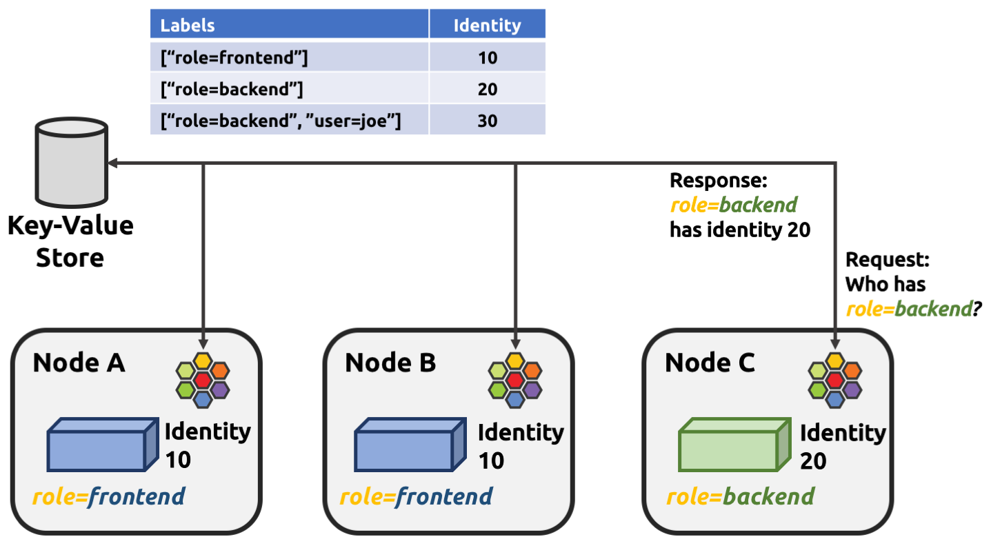

.. _arch_guide:

########
Concepts
########

The goal of this document is to describe the components of the Cilium
architecture, and the different models for deploying Cilium within your
datacenter or cloud environment.  It focuses on the higher-level understanding
required to run a full Cilium deployment.  You can then use the more detailed
:ref:`install_guide` to understand the details of setting up Cilium.

*****************
Cilium Components
*****************

.. image:: images/cilium-arch.png
    :width: 600px
    :align: center
    :height: 300px

A deployment of Cilium consists of the following components running on each
Linux container node in the container cluster:

* **Cilium Agent (Daemon):** Userspace daemon that interacts with the container runtime
  and orchestration systems such as Kubernetes via Plugins to setup networking
  and security for containers running on the local server.  Provides an API for
  configuring network security policies, extracting network visibility data,
  etc.

* **Cilium CLI Client:** Simple CLI client for communicating with the local
  Cilium Agent, for example, to configure network security or visibility
  policies.

* **Linux Kernel BPF:** Integrated capability of the Linux kernel to accept
  compiled bytecode that is run at various hook / trace points within the kernel.
  Cilium compiles BPF programs and has the kernel run them at key points in the
  network stack to have visibility and control over all network traffic in /
  out of all containers.

* **Container Platform Network Plugin:**  Each container platform (e.g.,
  Docker, Kubernetes) has its own plugin model for how external networking
  platforms integrate.  In the case of Docker, each Linux node runs a process
  (cilium-docker) that handles each Docker libnetwork call and passes data /
  requests on to the main Cilium Agent.

In addition to the components that run on each Linux container host, Cilium
leverages a key-value store to share data between Cilium Agents running on
different nodes. The currently supported key-value stores are:

* etcd
* consul

Cilium Agent
============

The Cilium agent (cilium-agent) runs on each Linux container host.  At a
high-level, the agent accepts configuration that describes service-level
network security and visibility policies.   It then listens to events in the
container runtime to learn when containers are started or stopped, and it
creates custom BPF programs which the Linux kernel uses to control all network
access in / out of those containers.  In more detail, the agent:

* Exposes APIs to allow operations / security teams to configure security
  policies (see below) that control all communication between containers in the
  cluster.  These APIs also expose monitoring capabilities to gain additional
  visibility into network forwarding and filtering behavior.

* Gathers metadata about each new container that is created.  In particular, it
  queries identity metadata like container / pod labels, which are used to
  identify endpoints in Cilium security policies.

* Interacts with the container platforms network plugin to perform IP address
  management (IPAM), which controls what IPv4 and IPv6 addresses are assigned
  to each container. The IPAM is managed by the agent in a shared pool between
  all plugins which means that the Docker and CNI network plugin can run side
  by side allocating a single address pool.

* Combines its knowledge about container identity and addresses with the
  already configured security and visibility policies to generate highly
  efficient BPF programs that are tailored to the network forwarding and
  security behavior appropriate for each container.

* Compiles the BPF programs to bytecode using `clang/LLVM
  <https://clang.llvm.org/>`_ and passes them to the Linux kernel to run for
  all packets in / out of the container's virtual ethernet device(s).

Cilium CLI Client
=================

The Cilium CLI Client (cilium) is a command-line tool that is installed along
with the Cilium Agent.  It gives a command-line interface to interact with all
aspects of the Cilium Agent API.   This includes inspecting Cilium's state
about each network endpoint (i.e., container), configuring and viewing security
policies, and configuring network monitoring behavior.

Linux Kernel BPF
================

Berkeley Packet Filter (BPF) is a Linux kernel bytecode interpreter originally
introduced to filter network packets, e.g. tcpdump and socket filters. It has
since been extended with additional data structures such as hashtable and
arrays as well as additional actions to support packet mangling, forwarding,
encapsulation, etc. An in-kernel verifier ensures that BPF programs are safe to
run and a JIT compiler converts the bytecode to CPU architecture specific
instructions for native execution efficiency. BPF programs can be run at
various hooking points in the kernel such as for incoming packets, outgoing
packets, system calls, kprobes, etc.

BPF continues to evolve and gain additional capabilities with each new Linux
release.  Cilium leverages BPF to perform core datapath filtering, mangling,
monitoring and redirection, and requires BPF capabilities that are in any Linux
kernel version 4.8.0 or newer. On the basis that 4.8.x is already declared end
of life and 4.9.x has been nominated as a stable release we recommend to run at
least kernel 4.9.17 (the latest current stable Linux kernel as of this writing
is 4.10.x).

Cilium is capable of probing the Linux kernel for available features and will
automatically make use of more recent features as they are detected.

Linux distros that focus on being a container runtime (e.g., CoreOS, Fedora
Atomic) typically already ship kernels that are newer than 4.8, but even recent
versions of general purpose operating systems such as Ubuntu 16.10 ship fairly
recent kernels. Some Linux distributions still ship older kernels but many of
them allow installing recent kernels from separate kernel package repositories.

For more detail on kernel versions, see: :ref:`admin_kernel_version`.

Key-Value Store
===============

The Key-Value (KV) Store is used for the following state:

* Policy Identities: list of labels <=> policy identity identifier

* Global Services: global service id to VIP association (optional)

* Encapsulation VTEP mapping (optional)

To simplify things in a larger deployment, the key-value store can be the same
one used by the container orchestrater (e.g., Kubernetes using etcd).

Assurances
==========

If Cilium loses connectivity with the KV-Store, it guarantees that:

* Normal networking operations will continue;

* If policy enforcement is enabled, the existing endpoints will still have
  their policy enforced but you will lose the ability to add additional
  containers that belong to security identities which are unknown on the node;

* If services are enabled, you will lose the ability to add additional services
  / loadbalancers;

* When the connectivity is restored to the KV-Store, Cilium can take up to 5
  minutes to re-sync the out-of-sync state with the KV-Store.

Cilium will keep running even if it is out-of-sync with the KV-Store.

If Cilium crashes / or the DaemonSet is accidentally deleted, the following are
guaranteed:

* When running Cilium as a DaemonSet / container, with the specification files
  provided in the documentation :ref:`admin_install_daemonset`, the endpoints /
  containers which are already running will not lose any connectivity, and they
  will keep running with the policy loaded before Cilium stopped unexpectedly.

* When running Cilium on a different way, just make sure the bpf fs is mounted
  :ref:`admin_mount_bpffs`.

.. _labels:

******
Labels
******

Labels are a generic, flexible and highly scaleable way of addressing a large
set of resources as they allow for arbitrary grouping and creation of sets.
Whenever something needs to be described, addressed or selected this is done
based on labels:

- Endpoints are assigned labels as derived from container runtime or the
  orchestration system.
- Network policies select endpoints based on labels and allow consumers based
  on labels.
- Network policies themselves are described and addressed by labels.

Basic Label: Key/Value Pair
===========================

A label is a pair of strings consisting of a ``key`` and ``value``. A label can
be formatted as a single string with the format ``key=value``. The key portion
is mandatory and must be unique. This is typically achieved by using the
reverse domain name notion, e.g. ``io.cilium.mykey=myvalue``. The value portion
is optional and can be omitted, e.g. ``io.cilium.mykey``.

Key names should typically consist of the character set ``[a-z0-9-.]``.

When using labels to select resources, both the key and the value must match,
e.g. when a policy should be applied to all endpoints with the label
``my.corp.foo`` then the label ``my.corp.foo=bar`` will not match the
selector.

Label Source
============

A label can be derived from various sources. For example, a Cilium endpoint
will derive the labels associated to the container by the local container
runtime as well as the labels associated with the pod as provided by
Kubernetes. As these two label namespaces are not aware of each other, this may
result in conflicting label keys.

To resolve this potential conflict, Cilium prefixes all label keys with
``source:`` to indicate the source of the label when importing labels, e.g.
``k8s:role=frontend``, ``container:user=joe``, ``k8s:role=backend``. This means
that when you run a Docker container using ``docker run [...] -l foo=bar``, the
label ``container:foo=bar`` will appear on the Cilium endpoint representing the
container. Similiarly, a Kubernetes pod started with the label ``foo: bar``
will be represented with a Cilium endpoint associated with the label
``k8s:foo=bar``. A unique name is allocated for each potential source. The
following label sources are currently supported:

- ``container:`` for labels derived from the local container runtime
- ``k8s:`` for labels derived from Kubernetes
- ``mesos:`` for labels derived from Mesos
- ``reserved:`` for special reserved labels, see :ref:`reserved_labels`.
- ``unspec:`` for labels with unspecified source

When using labels to identify other resources, the source can be included to
limit matching of labels to a particular type. If no source is provided, the
label source defaults to ``any:`` which will match all labels regardless of
their source. If a source is provided, the source of the selecting and matching
labels need to match.

*********
Endpoints
*********

Cilium makes application containers available on the network by assigning them
IP addresses. Multiple application containers can share the same IP address; a
typical example for this model is a Kubernetes Pod_. All application containers
which share a common address are grouped together in what Cilium refers to as
an *endpoint*.

Allocating individual IP addresses enables the use of the entire Layer 4 port
range by each *endpoint*. This essentially allows multiple application
containers running on the same cluster node to all bind to well known ports such
`80` without causing any conflicts.

The default behaviour of Cilium is to assign both an IPv6 and IPv4 address to
every *endpoint*. However, this behaviour can be configured to only allocate an
IPv6 address with the ``--disable-ipv4`` option. If both an IPv6 and IPv4
address are assigned, either address can be used to reach the endpoint. The
same behaviour will apply with regard to policy rules, load-balancing, etc. See
`address management`_ for more details.

Identification
==============

For identification purposes, Cilium assigns an *endpoint id* to all endpoints on
a cluster node. The *endpoint id* is unique within the context of an individual
cluster node.

Endpoint Metadata (Labels)
==========================

An *endpoint* automatically derives metadata from the application containers
associated with the *endpoint*. The metadata can then be used to identify the
endpoint for security/policy, load-balancing and routing purposes.

The source of the metadata will depend on the orchestration system and
container runtime in use. The following metadata retrieval mechanisms are
currently supported:

+---------------------+---------------------------------------------------+
| System              | Description                                       |
+=====================+===================================================+
| Kubernetes          | Pod labels (via k8s API)                          |
+---------------------+---------------------------------------------------+
| Mesos               | Labels (via CNI)                                  |
+---------------------+---------------------------------------------------+
| containerd (Docker) | Container labels (via Docker API)                 |
+---------------------+---------------------------------------------------+

Metadata is attached to *endpoints* in the form of Labels_.

The following example launches a container with the label ``app=benchmark``
which is then associated with the *endpoint*. The label is prefixed with
``container:`` to indicate that the label was derived from the container
runtime.

::

    $ docker run --net cilium -d -l app=benchmark tgraf/netperf
    aaff7190f47d071325e7af06577f672beff64ccc91d2b53c42262635c063cf1c
    $  cilium endpoint list
    ENDPOINT   POLICY        IDENTITY   LABELS (source:key[=value])   IPv6                   IPv4            STATUS
               ENFORCEMENT
    62006      Disabled      257        container:app=benchmark       f00d::a00:20f:0:f236   10.15.116.202   ready

An endpoint can have metadata associated from multiple sources. A typical
example is a Kubernetes cluster which uses containerd as the container runtime.
Endpoints will derive Kubernetes pod labels (prefixed with the `k8s:` source
prefix) and containerd labels (prefixed with `container:` source prefix).

************
Cluster Node
************

Cilium refers to a node as an individual member of a cluster. Each node must be
running the ``cilium-agent`` and will operate in a mostly autonomous manner.
Synchronization of state between Cilium agent's running on different nodes is
kept to a minimum for simplicity and scale. It occurs exclusively via the
Key-Value store or with packet metadata.

Node Address
============

Cilium will automatically detect the node's IPv4 and IPv6 address. The detected
node address is printed out when the ``cilium-agent`` starts:

::

    Local node-name: worker0
    Node-IPv6: f00d::ac10:14:0:1
    External-Node IPv4: 172.16.0.20
    Internal-Node IPv4: 10.200.28.238

******************
Address Management
******************

The address management is designed with simplicity and resilience in mind. This
is achieved by delegating the address allocation for *endpoints* to each
individual node in the cluster. Each cluster node is assigned a *node address
allocation prefix* out of an overarching *cluster address prefix* and will
allocate IPs for *endpoints* independently.

This simplifies address handling and allows one to make a fundamental
assumption:

* No state needs to be synchronized between cluster nodes to allocate IP
  addresses and to determine whether an IP address belongs to an *endpoint* of
  the cluster and whether that *endpoint* resides on the local cluster node.

.. note:: If you are using Kubernetes, the allocation of the node address prefix
          can be simply delegated to Kubernetes by specifying
          ``--allocate-node-cidrs`` flag to ``kube-controller-manager``. Cilium
          will automatically use the IPv4 node CIDR allocated by Kubernetes.

The following values are used by default if the cluster prefix is left
unspecified. These are meant for testing and need to be adjusted according to
the needs of your environment.

+-------+----------------+--------------------------------------------------+
| Type  | Cluster        | Node Prefix                                      |
+-------+----------------+--------------------------------------------------+
| IPv4  | ``10.0.0.0/8`` | ``10.X.0.0/16`` where ``X`` is derived using the |
|       |                | last 8 bits of the first IPv4 address in the list|
|       |                | of global scope addresses on the cluster node.   |
+-------+----------------+--------------------------------------------------+
| IPv6  | ``f00d::/48``  | ``f00d:0:0:0:<ipv4-address>::/96`` where the     |
|       |                | IPv4 address is the first address in the list of |
|       |                | global scope addresses on the cluster node.      |
|       |                |                                                  |
|       |                | Note: Only 16 bits out of the ``/96`` node       |
|       |                | prefix are currently used when allocating        |
|       |                | container addresses. This allows to use the      |
|       |                | remaining 16 bits to store arbitrary connection  |
|       |                | state when sending packets between nodes. A      |
|       |                | typical use case for the state is direct server  |
|       |                | return.                                          |
+-------+----------------+--------------------------------------------------+

The size of the IPv4 cluster prefix can be changed with the
``--ipv4-cluster-cidr-mask-size`` option. The size of the IPv6 cluster prefix
is currently fixed sized at ``/48``. The node allocation prefixes can be
specified manually with the option ``--ipv4-range`` respectively
``--ipv6-range``.

.. _arch_ip_connectivity:

*********************
Multi Host Networking
*********************

Cilium is in full control over both ends of the connection for connections
inside the cluster. It can thus transmit state and security context information
between two container hosts by embedding the information in encapsulation
headers or even unused bits of the IPv6 packet header. This allows Cilium to
transmit the security context of where the packet originates, which allows
tracing back which container labels are assigned to the origin container.

.. note::

   As the packet headers contain security sensitive information, it is higly
   recommended to either encrypt all traffic or run Cilium in a trusted network
   environment.

Cilium keeps the networking concept as simple as possible. There are two
networking models to choose from.

- :ref:`arch_overlay`
- :ref:`arch_direct_routing`

Regardless of the option chosen, the container itself has no awareness of the
underlying network it runs on; it only contains a default route which points to
the IP address of the cluster node. Given the removal of the routing cache in
the Linux kernel, this reduces the amount of state to keep in the per
connection flow cache (TCP metrics), which allows to terminate millions of
connections in each container.

.. _arch_overlay:

Overlay Network Mode
====================

When no configuration is provided, Cilium automatically runs in this mode.

In this mode, all cluster nodes form a mesh of tunnels using the UDP based
encapsulation protocols VXLAN_ or Geneve_. All container-to-container network
traffic is routed through these tunnels. This mode has several major
advantages:

- **Simplicity:** The network which connects the cluster nodes does not need to
  be made aware of the *cluster prefix*. Cluster nodes can spawn multiple
  routing or link-layer domains. The topology of the underlying network is
  irrelevant as long as cluster nodes can reach each other using IP/UDP.

- **Auto-configuration:** When running together with an orchestration system
  such as Kubernetes, the list of all nodes in the cluster including their
  associated allocation prefix node is made available to each agent
  automatically. This means that if Kubernetes is being run with the
  `--allocate-node-cidrs` option, Cilium can form an overlay network
  automatically without any configuration by the user. New nodes joining the
  cluster will automatically be incorporated into the mesh.

- **Identity transfer:** Encapsulation protocols allow for the carrying of
  arbitrary metadata along with the network packet. Cilium makes use of this
  ability to transfer metadata such as the source security identity and
  load balancing state to perform direct-server-return.

.. _arch_direct_routing:

Direct / Native Routing Mode
============================

.. note:: This is an advanced networking mode which requires the underlying
          network to be made aware of container IPs. You can enable this mode
          by running Cilium with the option ``--tunnel disabled``.

In direct routing mode, Cilium will hand all packets which are not addressed
for another local endpoint to the routing subsystem of the Linux kernel. This
means that the packet will be routed as if a local process would have emitted
the packet. As a result, the network connecting the cluster nodes must be aware
that each of the node IP prefixes are reachable by using the node's primary IP
address as an L3 next hop address. 

Cilium automatically enables IP forwarding in Linux when direct mode is
configured, but it is up to the container cluster administrator to ensure that
each routing element in the underlying network has a route that describes each
node IP as the IP next hop for the corresponding node prefix.

This is typically achieved using two methods:

- Operation of a routing protocol such as OSPF or BGP via routing daemon such
  as Zebra, bird, bgpd. The routing protocols will announce the *node allocation
  prefix* via the node's IP to all other nodes.

- Use of the cloud provider's routing functionality. Refer to the documentation
  of your cloud provider for additional details  (e.g,. `AWS VPC Route Tables`_
  or `GCE Routes`_). These APIs can be used to associate each node prefix with
  the appropriate next hop IP each time a container node is added to the
  cluster.  If you are running Kubernetes with the ``--cloud-provider`` in
  combination with the ``--allocate-node-cidrs`` option then this is configured
  automatically for IPv4 prefixes.

.. note:: Use of direct routing mode currently only offers identity based
          security policy enforcement for IPv6 where the security identity is
          stored in the flowlabel. IPv4 is currently not supported and thus
          security must be enforced using CIDR policy rules.

.. _AWS VPC Route Tables: http://docs.aws.amazon.com/AmazonVPC/latest/UserGuide/VPC_Route_Tables.html
.. _GCE Routes: https://cloud.google.com/compute/docs/reference/latest/routes

There are two possible approaches to performing network forwarding for
container-to-container traffic:

Container Communication with External Hosts
===========================================

Container communication with the outside world has two primary modes:

 * Containers exposing API services for consumption by hosts outside of the
   container cluster.

 * Containers making outgoing connections.  Examples include connecting to
   3rd-party API services like Twillio or Stripe as well as accessing private
   APIs that are hosted elsewhere in your enterprise datacenter or cloud
   deployment.

In the :ref:`arch_direct_routing` mode described before, if container IP
addresses are routable outside of the container cluster, communication with
external hosts requires little more than enabling L3 forwarding on each of the
Linux nodes.

.. _concepts_external_access:

External Network Connectivity
=============================

If the destination of a packet lies outside of the cluster, Cilium will
delegate routing to the routing subsystem of the cluster node to use the
default route which is installed on the node of the cluster.

As the IP addresses used for the **cluster prefix** are typically allocated
from RFC1918 private address blocks and are not publicly routable. Cilium will
automatically masquerade the source IP address of all traffic that is leaving
the cluster. This behaviour can be disabled by running ``cililum-agent`` with
the option ``--masquerade=false``.

Public Endpoint Exposure
========================

In direct routing mode, *endpoint* IPs can be publicly routable IPs and no
additional action needs to be taken.

In overlay mode, *endpoints* that are accepting inbound connections from
cluster external clients likely want to be exposed via some kind of
load-balancing layer. Such a load-balancer will have a public external address
that is not part of the Cilium network.  This can be achieved by having a
load-balancer container that both has a public IP on an externally reachable
network and a private IP on a Cilium network.  However, many container
orchestration frameworks, like Kubernetes, have built in abstractions to handle
this "ingress" load-balancing capability, which achieve the same effect that
Cilium handles forwarding and security only for ''internal'' traffic between
different services.

.. _concepts_security:

********
Security
********

Cilium provides security on multiple levels. Each can be used individually or
combined together.

* :ref:`arch_id_security`: Connectivity policies between endpoints (Layer 3),
  e.g. any endpoint with label `role=frontend` can connect to any endpoint with
  label `role=backend`.
* Restriction of accessible ports (Layer 4) for both incoming and outgoing
  connections, e.g. endpoint with label `role=frontend` can only make outgoing
  connections on port 443 (https) and endpoint `role=backend` can only accept
  connections on port 443 (https).
* Fine grained access control on application protocol level to secure HTTP and
  remote procedure call (RPC) protocols, e.g the endpoint with label
  `role=frontend` can only perform the REST API call `GET /userdata/[0-9]+`,
  all other API interactions with `role=backend` are restricted.

Currently on the roadmap, to be added soon:

* Authentication: Any endpoint which wants to initiate a connection to an
  endpoint with the label `role=backend` must have a particular security
  certificate to authenticate itself before being able to initiate any
  connections. See `GH issue 502
  <https://github.com/cilium/cilium/issues/502>`_ for additional details.
* Encryption: Communication between any endpoint with the label `role=frontend`
  to any endpoint with the label `role=backend` is automatically encrypted with
  a key that is automatically rotated. See `GH issue 504
  <https://github.com/cilium/cilium/issues/504>`_ to track progress on this
  feature.

.. _arch_id_security:
  
Identity based Connectivity Access Control
==========================================

Container management systems such as Kubernetes deploy a networking model which
assigns an individual IP address to each pod (group of containers). This
ensures simplicity in architecture, avoids unnecessary network address
translation (NAT) and provides each individual container with a full range of
port numbers to use. The logical consequence of this model is that depending on
the size of the cluster and total number of pods, the networking layer has to
manage a large number of IP addresses.

Traditionally security enforcement architectures have been based on IP address
filters.  Let's walk through a simple example: If all pods with the label
`role=frontend` should be allowed to initiate connections to all pods with the
label `role=backend` then each cluster node which runs at least one pod with
the label `role=backend` must have a corresponding filter installed which
allows all IP addresses of all `role=frontend` pods to initiate a connection to
the IP addresses of all local `role=backend` pods. All other connection
requests should be denied. This could look like this: If the destination
address is *10.1.1.2* then allow the connection only if the source address is
one of the following *[10.1.2.2,10.1.2.3,20.4.9.1]*.

Every time a new pod with the label `role=frontend` or `role=backend` is either
started or stopped, the rules on every cluster node which run any such pods
must be updated by either adding or removing the corresponding IP address from
the list of allowed IP addresses. In large distributed applications, this could
imply updating thousands of cluster nodes multiple times per second depending
on the churn rate of deployed pods. Worse, the starting of new `role=frontend`
pods must be delayed until all servers running `role=backend` pods have been
updated with the new security rules as otherwise connection attempts from the
new pod could be mistakenly dropped. This makes it difficult to scale
efficiently. 

In order to avoid these complications which can limit scalability and
flexibility, Cilium entirely separates security from network addressing.
Instead, security is based on the identity of a pod, which is derived through
labels.  This identity can be shared between pods. This means that when the
first `role=frontend` pod is started, Cilium assigns an identity to that pod
which is then allowed to initiate connections to the identity of the
`role=backend` pod. The subsequent start of additional `role=frontend` pods
only requires to resolve this identity via a key-value store, no action has to
be performed on any of the cluster nodes hosting `role=backend` pods. The
starting of a new pod must only be delayed until the identity of the pod has
been resolved which is a much simpler operation than updating the security
rules on all other cluster nodes.

.. image:: images/identity.png
    :align: center

What is an Endpoint Identity?
-----------------------------

The identity of an endpoint is derived based on the labels associated with the
pod or container. When a pod or container is started, Cilium will create an
endpoint based on the event received by the container runtime to represent the
pod or container on the network. As a next step, Cilium will resolve the
identity of the endpoint created. Whenever the labels of the pod or container
change, the identity is reconfirmed and automatically modified as required.

Not all labels associated with a container or pod are meaningful when deriving
the security identity. Labels may be used to store metadata such as the
timestamp when a container was launched. Cilium requires to know which labels
are meaningful and are subject to being considered when deriving the identity.
For this purpose, the user is required to specify a list of string prefixes of
meaningful labels. The standard behavior is to include all labels which start
with the prefix `id.`, e.g.  `id.service1`, `id.service2`,
`id.groupA.service44`. The list of meaningful label prefixes can be specified
when starting the cilium agent, see :ref:`admin_agent_options`.

.. _reserved_labels:

Special Identities
------------------

All endpoints which are managed by Cilium will be assigned an identity. In
order to allow communication to network endpoints which are not managed by
Cilium, special identities exist to represent those. Special reserved
identities are prefixed with the string `reserved:`.

+---------------------+---------------------------------------------------+
| Identity            | Description                                       |
+=====================+===================================================+
| reserved:host       | The host network namespace on which the pod or    |
|                     | container is running.                             |
+---------------------+---------------------------------------------------+
| reserved:world      | Any network endpoint outside of the cluster       |
+---------------------+---------------------------------------------------+

TODO: Document `cidr:` identity once implemented.

Identity Management in the Cluster
----------------------------------

Identities are valid in the entire cluster which means that if several pods or
containers are started on several cluster nodes, all of them will resolve and
share a single identity if they share the identity relevant labels. This
requires coordination between cluster nodes.

The operation to resolve an endpoint identity is performed with the help of the
distributed key-value store which allows to perform atomic operations in the
form *generate a new unique identifier if the following value has not been seen
before*. This allows each cluster node to create the identity relevant subset
of labels and then query the key-value store to derive the identity. Depending
on whether the set of labels has been queried before, either a new identity
will be created, or the identity of the initial query will be returned.

Policy Enforcement
==================

All security policies are described assuming stateful policy enforcement for
session based protocols. This means that the intent of the policy is to
describe allowed direction of connection establishment. If the policy allows `A
=> B` then reply packets from `B` to `A` are automatically allowed as well.
However, `B` is not automatically allowed to initiate connections to `A`. If
that outcome is desired, then both directions must be explicitly allowed.

Security policies are primarily enforced at *ingress* which means that each
cluster node verifies all incoming packets and determines whether the packet is
allowed to be transmitted to the intended endpoint. Policy enforcement also
occurs at *egress* if required by the specific policy, e.g. a Layer 7 policy
restricting outgoing API calls.

Layer 3 policies are currently not enforced at *egress* to avoid the complexity
of resolving the destination endpoint identity before sending out the packet.
Instead, the identity of the source endpoint is embedded into the packet.

In order to enforce identity based security in a multi host cluster, the
identity of the transmitting endpoint is embedded into every network packet
that is transmitted in between cluster nodes. The receiving cluster node can
then extract the identity and verify whether a particular identity is allowed
to communicate with any of the local endpoints.

Default Security Policy
-----------------------

If no policy is loaded, the default behaviour is to allow all communication
unless policy enforcement has been explicitly enabled. As soon as the first
policy rule is loaded, policy enforcement is enabled automatically and any
communication must then be white listed or the relevant packets will be
dropped.

Similarly, if an endpoint is not subject to an *L4* policy, communication from
and to all ports is permitted. Associating at least one *L4* policy to an
endpoint will block all connectivity to ports unless explicitly allowed.

Orchestration System Specifics
==============================

Kubernetes
----------

Cilium regards each deployed Pod as an endpoint with regards to networking and
security policy enforcement. Labels associated with pods can be used to define
the identity of the endpoint.

When two pods communicate via a service construct, then the labels of the
origin pod apply to determine the identity.

************
Integrations
************

Cilium is deeply integrated with container platforms like Docker or Kubernetes.
This enables Cilium to perform network forwarding and security using a model
that maps directly to notions of identity (e.g., labels) and service
abstractions that are native to the container platform.

In this section, we will provide more detail on how Cilium integrates with
Docker and Kubernetes.

Kubernetes
==========

When deployed with Kubernetes, Cilium provides four core Kubernetes networking
capabilities:

* Direct pod-to-pod network inter-connectivity.
* Service-based load-balancing for pod-to-pod inter-connectivity (i.e., a
  kube-proxy replacement).
* Identity-based security policies for all  (direct and service-based)
  Pod-to-Pod inter-connectivity.
* External-to-Pod service-based load-balancing (referred to as `Ingress` in
  Kubernetes)

The Kubernetes documentation contains more background on the `Kubernetes
Networking Model
<https://kubernetes.io/docs/concepts/cluster-administration/networking/>`_ and
`Kubernetes Network Plugins
<https://kubernetes.io/docs/concepts/cluster-administration/network-plugins/>`_
.

Pod-to-Pod Connectivity
-----------------------

In Kubernetes, containers are deployed within units referred to as Pod_, which
include one or more containers reachable via a single IP address.  With Cilium,
each Pod gets an IP address from the node prefix of the Linux node running the
Pod. See `address management`_ for additional details. In the absence of any
network security policies, all Pods can reach each other.

Pod IP addresses are typically local to the Kubernetes cluster. If pods need to
reach services outside the cluster as a client, the network traffic is
automatically masqueraded as it leaves the node. You can find additional
information in the section :ref:`concepts_external_access`.

Service Load-balancing
----------------------

Kubernetes has developed the Services abstraction which provides the user the
ability to load balance network traffic to different pods. This abstraction
allows the pods reaching out to other pods by a single IP address, a virtual IP
address, without knowing all the pods that are running that particular service.

Without Cilium, kube-proxy is installed on every node, watches for endpoints
and services addition and removal on the kube-master which allows it to to
apply the necessary enforcement on iptables. Thus, the received and sent
traffic from and to the pods are properly routed to the node and port serving
for that service. For more information you can check out the kubernetes user
guide for `Services  <http://kubernetes.io/docs/user-guide/services>`__.

Cilium load-balancer acts on the same principles as kube-proxy, it watches for
services addition or removal, but instead of doing the enforcement on the
iptables, it updates BPF map entries on each node. For more information, see
the `Pull Request <https://github.com/cilium/cilium/pull/109>`__.

Docker
======

Docker supports network plugins via the `libnetwork plugin interface
<https://github.com/docker/libnetwork/blob/master/docs/design.md>`_ .

When using Cilium with Docker, one creates a single logical Docker network of
type `cilium` and with an IPAM-driver of type `cilium`, which delegates
control over IP address management and network connectivity to Cilium for all
containers attached to this network for both IPv4 and IPv6 connectivity.  Each
Docker container gets an IP address from the node prefix of the node running
the container.

When deployed with Docker, each Linux node runs a `cilium-docker` agent,
which receives libnetwork calls from Docker and then communicates with the
Cilium Agent to control container networking.

Security policies controlling connectivity between the Docker containers can be
written in terms of the Docker container labels passed to Docker while creating
the container.  These policies can be created/updated via communication
directly with the Cilium agent, either via API or by using the Cilium CLI
client.

.. _Pod: https://kubernetes.io/docs/concepts/workloads/pods/pod/
.. _VXLAN: https://tools.ietf.org/html/rfc7348
.. _Geneve: https://tools.ietf.org/html/draft-ietf-nvo3-geneve-04
