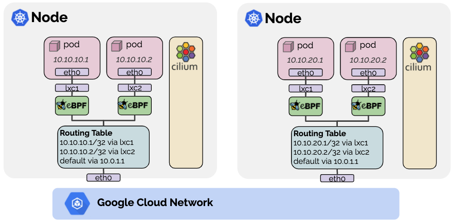

.. only:: not (epub or latex or html)

    WARNING: You are looking at unreleased Cilium documentation.
    Please use the official rendered version released here:
    https://docs.cilium.io

.. _gke_datapath:

########################
Google Kubernetes Engine
########################

Running Cilium on Google Kubernetes Engine will utilize the
`Google Cloud's networking layer <https://cloud.google.com/products/networking>`_
with Cilium running in a :ref:`native_routing` configuration. This provides
native networking performance while benefiting from many additional Cilium
features such as policy enforcement, load-balancing with DSR, efficient
NodePort/ExternalIP/HostPort implementation, extensive visibility features, and
so on.

Addressing
   Cilium will assign IPs to pods out of the PodCIDR assigned to the specific
   Kubernetes node. By using `Alias IP ranges
   <https://cloud.google.com/vpc/docs/alias-ip>`_, these IPs are natively
   routable on Google Cloud's network without additional encapsulation or route
   distribution.

Masquerading
   All traffic not staying with the ``native-routing-cidr`` (defaults to the
   Cluster CIDR) will be masqueraded to the node's IP address to become
   publicly routable.

Load-balancing
   ClusterIP load-balancing will be performed using BPF for all version of GKE.
   Starting with >= GKE v1.15 or when running a Linux kernel >= 4.19, all
   NodePort/ExternalIP/HostPort will be performed using a BPF implementation as
   well.

Policy enforcement & visibility
   All NetworkPolicy enforcement and visibility is provided using BPF.

*************
Configuration
*************

The following configuration options must be set to run the datapath on GKE:

* ``gke.enabled: true``: Enables the Google Kubernetes Engine (GKE) datapath.
  Setting this to true will enabled the following options:

  * ``ipam: kubernetes``: Enable :ref:`k8s_hostscope` IPAM
  * ``tunnel: disabled``: Enable native routing mode
  * ``enable-endpoint-routes: true``: Enable per-endpoint routing on the node
  * ``blacklist-conflicting-routes: false``: Disable blacklisting of IPs
    which collide with a local route
  * ``enable-local-node-route: false``: Disable installation of the local node route

* ``native-routing-cidr: x.x.x.x/y``: Set the CIDR in which native routing
  is supported.

See the getting started guide :ref:`k8s_install_gke` to install Cilium on
Google Kubernetes Engine (GKE).
