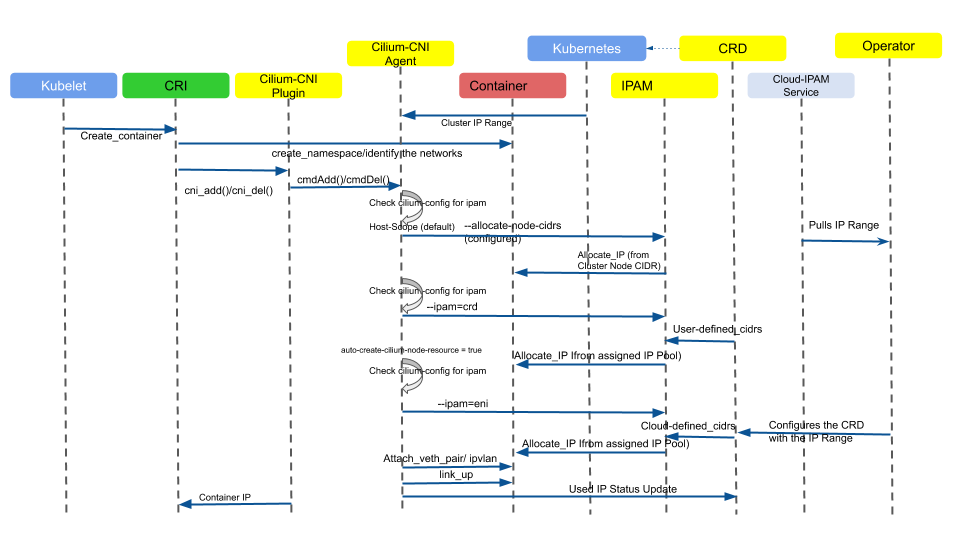

.. only:: not (epub or latex or html)

    WARNING: You are looking at unreleased Cilium documentation.
    Please use the official rendered version released here:
    https://docs.cilium.io

.. _address_management:

******************
Address Management
******************

Before we look into the details of Address Management in Cilium, let us
look at overview of the cilium container networking control flow.

Cilium Container Networking Control Flow
----------------------------------------

The control flow picture below gives an overview about how the containers
obtain its IP Address from the IPAM for different modes of Address Management
that Cilium Supports.

Cilium supports multiple different address management modes:

Address Management Modes
------------------------
.. toctree::
   :maxdepth: 1
   :glob:

   kubernetes
   hostscope
   crd
   azure
   eni
