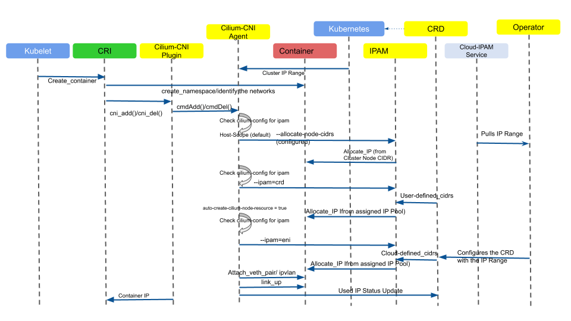

.. only:: not (epub or latex or html)

    WARNING: You are looking at unreleased Cilium documentation.
    Please use the official rendered version released here:
    http://docs.cilium.io

.. _address_management:

******************
Address Management
******************

Cilium supports multiple different address management modes:

Cilium Container Networking Control Flow
========================================

The control flow picture below gives an overview about how the containers
obtain its IP Address from the IPAM/Kubernetes Cluster Node from different
modes of Address Management that Cilium Supports.

.. toctree::
   :maxdepth: 1
   :glob:

   hostscope
   crd
   eni
