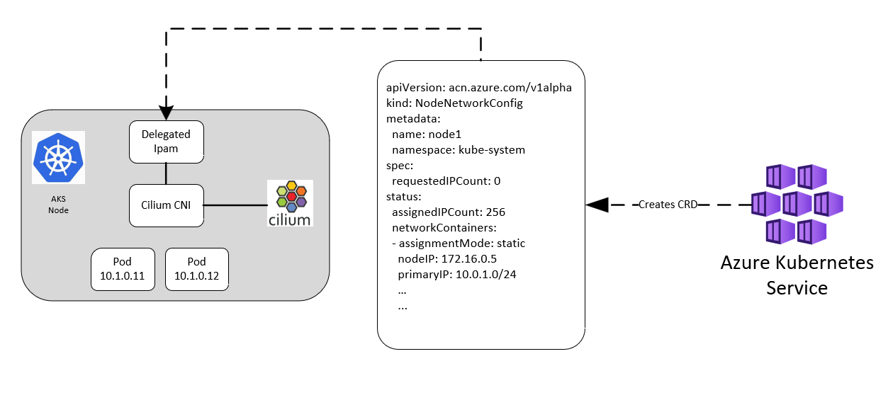

.. only:: not (epub or latex or html)

    WARNING: You are looking at unreleased Cilium documentation.
    Please use the official rendered version released here:
    https://docs.cilium.io

.. _azure_delegated_ipam:

####################
Azure Delegated IPAM
####################

The Azure CNI powered by Cilium cluster utilizes a delegated IPAM (IP Address Manager) approach to allocate 
IP addresses for pods that are created using the Cilium CNI. This delegated IPAM component manages IP allocation 
within individual nodes of the cluster. It collaborates closely with the AKS (Azure Kubernetes Service) control plane 
components to seamlessly integrate with the broader Azure Virtual Network stack. 

************
Architecture
************

Azure Delegated Ipam allocator builds on top of CRD-backed allocator. AKS control plane creates ``NodeNetworkConfig`` 
custom resource on each node matching node name. This custom resource contains unique ip prefix for node ``status.primaryIP`` 
in overlay mode or block of unique IP addresses in PodSubnet mode. Delegated Ipam Agent running on each node receives this resource and 
manages the IP Allocation for pods within node. It makes sure IPs are programmed on Azure Network stack before 
giving out IPs to Cilium CNI.

********************
Cilium Configuration
********************

The cilium agent must run with ``ipam: delegated-plugin``. Since cilium agent not managing IPs for pods, its also required 
to specify ``local-router-ipv4: 169.254.23.0`` to configure IP for ``cilium_host`` interface.

************************
Cilium CNI Configuration
************************

Cilium CNI is specifically configured with delegated IPAM details in its configuration, allowing it to interact 
with the delegated Azure IPAM. This configuration ensures that the Cilium CNI triggers the delegated IPAM during 
both pod addition and deletion operations. Upon receiving an Add request, the delegated IPAM allocates an available 
IP address from its cache. Similarly on a Delete request, the delegated IPAM marks the IP as available. 

The following JSON snippet represents Cilium CNI config with Azure Delegated IPAM configuration.

.. code-block:: json

        {
          "cniVersion": "0.3.1",
          "name": "cilium",
          "plugins": [
            {
              "type": "cilium-cni",
              "ipam": {
                "type": "azure-ipam"
               },
               "enable-debug": true,
               "log-file": "/var/log/cilium-cni.log"
            }
          ]
        }