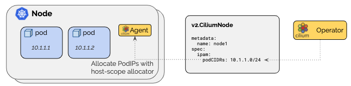

.. only:: not (epub or latex or html)

    WARNING: You are looking at unreleased Cilium documentation.
    Please use the official rendered version released here:
    http://docs.cilium.io

.. _ipam_crd_cluster_pool:

#######################
Cluster Scope (Default)
#######################

The cluster-scope IPAM mode assigns per-node PodCIDRs to each node and
allocates IPs using a host-scope allocator on each node. It is thus similar to
the :ref:`k8s_hostscope` mode. The difference is that instead of Kubernetes
assigning the per-node PodCIDRs via the Kubernetes ``v1.Node`` resource, the
Cilium operator will manage the per-node PodCIDRs via the ``v2.CiliumNode``
resource. The advantage of this mode is that it does not depend on Kubernetes
being configured to hand out per-node PodCIDRs.

************
Architecture
************

This is useful if Kubernetes cannot be configured to hand out PodCIDRs or if
more control is needed.

In this mode, the Cilium agent will wait on startup until the ``PodCIDRs`` range
are made available via the Cilium Node ``v2.CiliumNode`` object for all enabled
address families via the resource field set in the ``v2.CiliumNode``:

====================== ==============================
Field                  Description
====================== ==============================
``Spec.IPAM.PodCIDRs`` IPv4 and/or IPv6 PodCIDR range
====================== ==============================

*************
Configuration
*************

For a practical tutorial on how to enable this mode in Cilium, see
:ref:`gsg_ipam_crd_cluster_pool`.

***************
Troubleshooting
***************

Look for allocation errors
==========================

Check the ``Error`` field in the ``Status.Operator`` field:

.. code-block:: shell-session

    kubectl get ciliumnodes -o jsonpath='{range .items[*]}{.metadata.name}{"\t"}{.status.operator.error}{"\n"}{end}'
