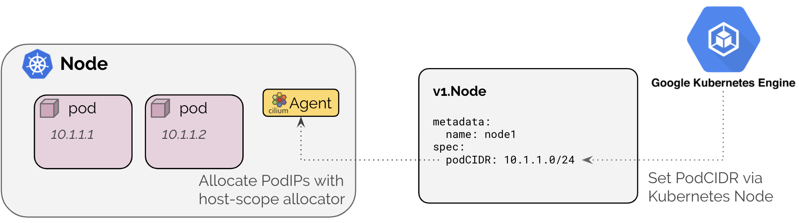

.. only:: not (epub or latex or html)

    WARNING: You are looking at unreleased Cilium documentation.
    Please use the official rendered version released here:
    https://docs.cilium.io

.. _ipam_gke:

########################
Google Kubernetes Engine
########################

When running Cilium on Google GKE, the native networking layer of Google Cloud
will be utilized for address management and IP forwarding.

************
Architecture
************

Cilium running in a GKE configuration mode utilizes the Kubernetes hostscope
IPAM mode. It will configure the Cilium agent to wait until the Kubernetes node
resource is populated with a ``spec.podCIDR`` or ``spec.podCIDRs`` as required
by the enabled address families (IPv4/IPv6). See :ref:`k8s_hostscope` for
additional details of this IPAM mode.

The corresponding datapath is described in section :ref:`gke_datapath`.

See the getting started guide :ref:`k8s_install_quick` to install Cilium Google
Kubernetes Engine (GKE).

*************
Configuration
*************

The GKE IPAM mode can be enabled by setting the Helm option
``ipam.mode=kubernetes`` or by setting the ConfigMap option ``ipam:
kubernetes``.

***************
Troubleshooting
***************

Validate the exposed PodCIDR field
==================================

Check if the Kubernetes nodes contain a value in the ``podCIDR`` field:

.. code-block:: shell-session

    $ kubectl get nodes -o jsonpath='{range .items[*]}{.metadata.name}{"\t"}{.spec.podCIDR}{"\n"}{end}'
    gke-cluster4-default-pool-b195a3f3-k431	10.4.0.0/24
    gke-cluster4-default-pool-b195a3f3-zv3p	10.4.1.0/24

Check the Cilium status
=======================

Run ``cilium status`` on the node in question and validate that the CIDR used
for IPAM matches the PodCIDR announced in the Kubernetes node:

.. code-block:: shell-session

    $ kubectl -n kube-system get pods -o wide | grep gke-cluster4-default-pool-b195a3f3-k431
    cilium-lv4xd                       1/1     Running   0          3h8m   10.164.0.112   gke-cluster4-default-pool-b195a3f3-k431   <none>           <none>

    $ kubectl -n kube-system exec -ti cilium-lv4xd -- cilium status
    KVStore:                Ok   Disabled
    Kubernetes:             Ok   1.14+ (v1.14.10-gke.27) [linux/amd64]
    Kubernetes APIs:        ["CustomResourceDefinition", "cilium/v2::CiliumClusterwideNetworkPolicy", "cilium/v2::CiliumEndpoint", "cilium/v2::CiliumNetworkPolicy", "cilium/v2::CiliumNode", "core/v1::Endpoint", "core/v1::Namespace", "core/v1::Pods", "core/v1::Service", "networking.k8s.io/v1::NetworkPolicy"]
    KubeProxyReplacement:   Probe   []
    Cilium:                 Ok      OK
    NodeMonitor:            Disabled
    Cilium health daemon:   Ok
    IPAM:                   IPv4: 7/255 allocated from 10.4.0.0/24,
    Controller Status:      36/36 healthy
    Proxy Status:           OK, ip 10.4.0.190, 0 redirects active on ports 10000-20000
    Hubble:                 Disabled
    Cluster health:         2/2 reachable   (2020-04-23T13:46:36Z)
