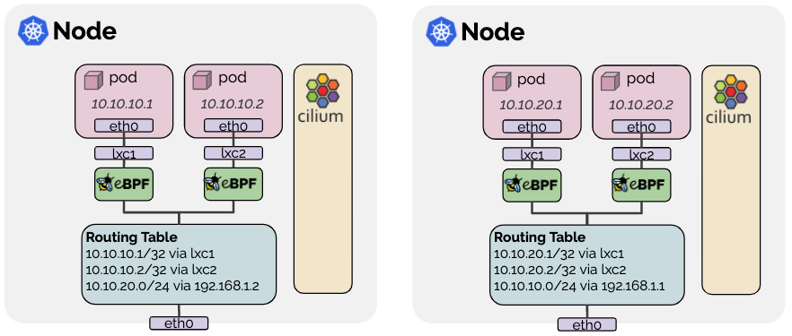

.. only:: not (epub or latex or html)

    WARNING: You are looking at unreleased Cilium documentation.
    Please use the official rendered version released here:
    https://docs.cilium.io

#######
Routing
#######

.. _arch_overlay:

Encapsulation
=============

When no configuration is provided, Cilium automatically runs in this mode as it
is the mode with the fewest requirements on the underlying networking
infrastructure.

In this mode, all cluster nodes form a mesh of tunnels using the UDP-based
encapsulation protocols `VXLAN` or `Geneve`. All traffic between Cilium nodes
is encapsulated.

Requirements on the network
---------------------------

* Encapsulation relies on normal node to node connectivity. This means that if
  Cilium nodes can already reach each other, all routing requirements are
  already met.

* The underlying network and firewalls must allow encapsulated packets:

  ================== =====================
  Encapsulation Mode Port Range / Protocol
  ================== =====================
  VXLAN (Default)    8472/UDP
  Geneve             6081/UDP
  ================== =====================

Advantages of the model
-----------------------

Simplicity
  The network which connects the cluster nodes does not need to be made aware
  of the PodCIDRs. Cluster nodes can spawn multiple routing or link-layer
  domains. The topology of the underlying network is irrelevant as long as
  cluster nodes can reach each other using IP/UDP.

Addressing space
  Due to not depending on any underlying networking limitations, the available
  addressing space is potentially much larger and allows to run any number of
  pods per node if the PodCIDR size is configured accordingly.

Auto-configuration
  When running together with an orchestration system such as Kubernetes, the
  list of all nodes in the cluster including their associated allocation prefix
  node is made available to each agent automatically. New nodes joining the
  cluster will automatically be incorporated into the mesh.

Identity context
  Encapsulation protocols allow for the carrying of metadata along with the
  network packet. Cilium makes use of this ability to transfer metadata such as
  the source security identity. The identity transfer is an optimization
  designed to avoid one identity lookup on the remote node.

Disadvantages of the model
--------------------------

MTU Overhead
  Due to adding encapsulation headers, the effective MTU available for payload
  is lower than with native-routing (50 bytes per network packet for VXLAN).
  This results in a lower maximum throughput rate for a particular network
  connection. This can be largely mitigated by enabling jumbo frames (50 bytes
  of overhead for each 1500 bytes vs 50 bytes of overhead for each 9000 bytes).

.. _arch_direct_routing:
.. _native_routing:

Native-Routing
==============

The native routing datapath is enabled with ``tunnel: disabled`` and enables
the native packet forwarding mode. The native packet forwarding mode leverages
the routing capabilities of the network Cilium runs on instead of performing
encapsulation.

In native routing mode, Cilium will delegate all packets which are not
addressed to another local endpoint to the routing subsystem of the Linux
kernel. This means that the packet will be routed as if a local process would
have emitted the packet. As a result, the network connecting the cluster nodes
must be capable of routing PodCIDRs.

Cilium automatically enables IP forwarding in the Linux kernel when native
routing is configured.

Requirements on the network
---------------------------

* In order to run the native routing mode, the network connecting the hosts on
  which Cilium is running on must be capable of forwarding IP traffic using
  addresses given to pods or other workloads.

* The Linux kernel on the node must be aware on how to forward packets of pods
  or other workloads of all nodes running Cilium. This can be achieved in two
  ways:

  1. The node itself does not know how to route all pod IPs but a router exists
     on the network that knows how to reach all other pods. In this scenario,
     the Linux node is configured to contain a default route to point to such a
     router. This model is used for cloud provider network integration. See
     :ref:`gke_datapath`, :ref:`aws_eni_datapath`, and :ref:`ipam_azure` for
     more details.

  2. Each individual node is made aware of all pod IPs of all other nodes and
     routes are inserted into the Linux kernel routing table to represent this.
     If all nodes share a single L2 network, then this can be taken care of by
     enabling the option ``auto-direct-node-routes: true``. Otherwise, an
     additional system component such as a BGP daemon must be run to distribute
     the routes.  See the guide :ref:`kube-router` on how to achieve this using
     the kube-router project.

Configuration
-------------

The following configuration options must be set to run the datapath in native
routing mode:

* ``tunnel: disabled``: Enable native routing mode.
* ``enable-endpoint-routes: true``: Enable per-endpoint routing on the node
* ``native-routing-cidr: x.x.x.x/y``: Set the CIDR in which native routing
  can be performed.

.. _aws_eni_datapath:

AWS ENI
=======

The AWS ENI datapath is enabled when Cilium is run with the option
``--ipam=eni``. It is a special purpose datapath that is useful when running
Cilium in an AWS environment.

Advantages of the model
-----------------------

* Pods are assigned ENI IPs which are directly routable in the AWS VPC. This
  simplifies communication of pod traffic within VPCs and avoids the need for
  SNAT.

* Pod IPs are assigned a security group. The security groups for pods are
  configured per node which allows to create node pools and give different
  security group assignments to different pods. See section :ref:`ipam_eni` for
  more details.

Disadvantages of this model
---------------------------

* The number of ENI IPs is limited per instance. The limit depends on the EC2
  instance type. This can become a problem when attempting to run a larger
  number of pods on very small instance types.

* Allocation of ENIs and ENI IPs requires interaction with the EC2 API which is
  subject to rate limiting. This is primarily mitigated via the operator
  design, see section :ref:`ipam_eni` for more details.

Architecture
------------

Ingress
~~~~~~~

1. Traffic is received on one of the ENIs attached to the instance which is
   represented on the node as interface ``ethN``.

2. An IP routing rule ensures that traffic to all local pod IPs is done using
   the main routing table:

   .. code-block:: bash

       20:	from all to 192.168.105.44 lookup main

3. The main routing table contains an exact match route to steer traffic into a
   veth pair which is hooked into the pod:

   .. code-block:: bash

       192.168.105.44 dev lxc5a4def8d96c5

4. All traffic passing ``lxc5a4def8d96c5`` on the way into the pod is subject
   to Cilium's eBPF program to enforce network policies, provide service reverse
   load-balancing, and visibility.

Egress
~~~~~~

1. The pod's network namespace contains a default route which points to the
   node's router IP via the veth pair which is named ``eth0`` inside of the pod
   and ``lxcXXXXXX`` in the host namespace. The router IP is allocated from the
   ENI space, allowing for sending of ICMP errors from the router IP for Path
   MTU purposes.

2. After passing through the veth pair and before reaching the Linux routing
   layer, all traffic is subject to Cilium's eBPF program to enforce network
   policies, implement load-balancing and provide networking features.

3. An IP routing rule ensures that traffic from individual endpoints are using
   a routing table specific to the ENI from which the endpoint IP was
   allocated:

   .. code-block:: bash

       30:	from 192.168.105.44 to 192.168.0.0/16 lookup 92

4. The ENI specific routing table contains a default route which redirects
   to the router of the VPC via the ENI interface:

   .. code-block:: bash

       default via 192.168.0.1 dev eth2
       192.168.0.1 dev eth2

Configuration
-------------

The AWS ENI datapath is enabled by setting the following option:

.. code-block: yaml

        ipam: eni
        enable-endpoint-routes: "true"
        auto-create-cilium-node-resource: "true"
        egress-masquerade-interfaces: eth+

* ``ipam: eni`` Enables the ENI specific IPAM backend and indicates to the
  datapath that ENI IPs will be used.

* ``enable-endpoint-routes: "true"`` enables direct routing to the ENI
  veth pairs without requiring to route via the ``cilium_host`` interface.

* ``auto-create-cilium-node-resource: "true"`` enables the automatic creation of
  the ``CiliumNode`` custom resource with all required ENI parameters. It is
  possible to disable this and provide the custom resource manually.

* ``egress-masquerade-interfaces: eth+`` is the interface selector of all
  interfaces which are subject to masquerading. Masquerading can be disabled
  entirely with ``masquerade: "false"``.

See the section :ref:`ipam_eni` for details on how to configure ENI IPAM
specific parameters.

.. _gke_datapath:

Google Cloud
============

When running Cilium on Google Cloud via either Google Kubernetes Engine (GKE)
or self-managed, it is possible to utilize the `Google Cloud's networking layer
<https://cloud.google.com/products/networking>`_ with Cilium running in a
:ref:`native_routing` configuration. This provides native networking
performance while benefiting from many additional Cilium features such as
policy enforcement, load-balancing with DSR, efficient
NodePort/ExternalIP/HostPort implementation, extensive visibility features, and
so on.

.. image:: gke_datapath.png
    :align: center

Addressing
   Cilium will assign IPs to pods out of the PodCIDR assigned to the specific
   Kubernetes node. By using `Alias IP ranges
   <https://cloud.google.com/vpc/docs/alias-ip>`_, these IPs are natively
   routable on Google Cloud's network without additional encapsulation or route
   distribution.

Masquerading
   All traffic not staying with the ``native-routing-cidr`` (defaults to the
   Cluster CIDR) will be masqueraded to the node's IP address to become
   publicly routable.

Load-balancing
   ClusterIP load-balancing will be performed using eBPF for all version of GKE.
   Starting with >= GKE v1.15 or when running a Linux kernel >= 4.19, all
   NodePort/ExternalIP/HostPort will be performed using a eBPF implementation as
   well.

Policy enforcement & visibility
   All NetworkPolicy enforcement and visibility is provided using eBPF.

Configuration
-------------

The following configuration options must be set to run the datapath on GKE:

* ``gke.enabled: true``: Enables the Google Kubernetes Engine (GKE) datapath.
  Setting this to ``true`` will enable the following options:

  * ``ipam: kubernetes``: Enable :ref:`k8s_hostscope` IPAM
  * ``tunnel: disabled``: Enable native routing mode
  * ``enable-endpoint-routes: true``: Enable per-endpoint routing on the node
  * ``enable-local-node-route: false``: Disable installation of the local node route

* ``native-routing-cidr: x.x.x.x/y``: Set the CIDR in which native routing
  is supported.

See the getting started guide :ref:`k8s_install_gke` to install Cilium on
Google Kubernetes Engine (GKE).
