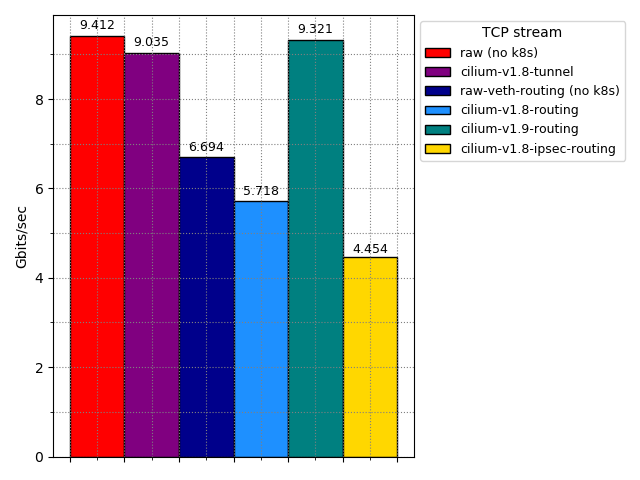
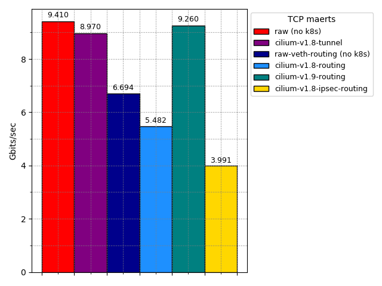
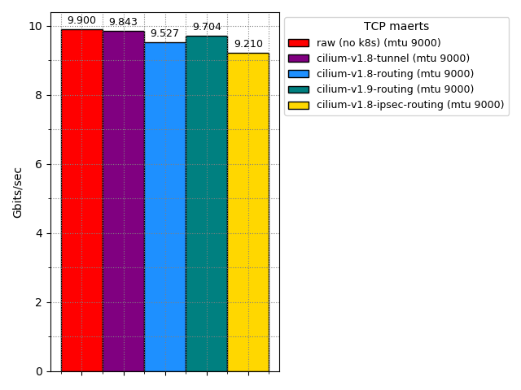
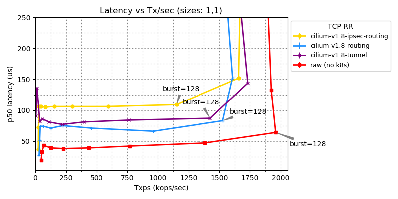
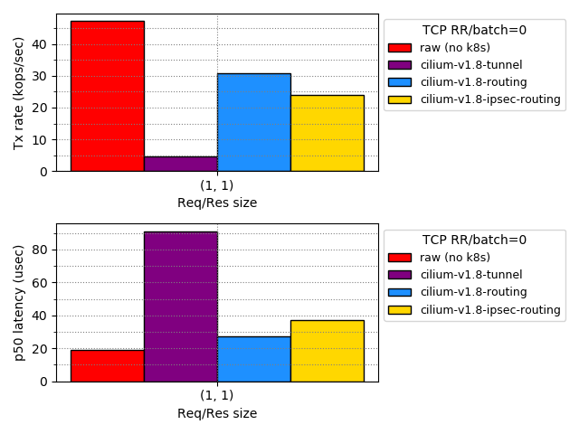
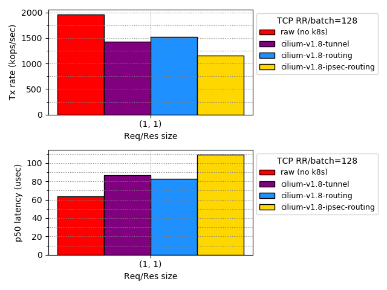

.. only:: not (epub or latex or html)

    WARNING: You are looking at unreleased Cilium documentation.
    Please use the official rendered version released here:
    https://docs.cilium.io

.. _performance_report:

**********************
Performance Evaluation
**********************

This document presents the steps to evaluate Cilium networking performance.
Our primary goal is to make the evaluation
process transparent and its results easily reproducible. In this document, we
focus on small-scale experiments. For larger deployments, refer to the :ref:`scalability_guide`.

To ease reproducibility, this report is paired with a set of scripts that can be
found in https://github.com/cilium/perfeval. All scripts in this document refer
to this repository. Specifically, we use
`Terraform <https://www.terraform.io/>`_ and `Ansible
<https://www.ansible.com/>`_ to setup the environment and execute benchmarks.
We use `Packet <https://www.packet.com/>`_ bare metal servers as our hardware
platform, but the guide is structured so that it can be easily adapted to
other environments.

The rest of this document is organized as follows:

#. `Setup`_ describes the machine setup and basic software that is required for
   our evaluation. This includes everything that is to be executed only once
   regardless of the number of Cilium configurations that are to be evaluated.

#. `Evaluation`_ discusses the methodology and tools of the evaluation.

#. `Results`_  presents our results for three different Cilium configurations:

   #. :ref:`tunneling_results` with VXLAN;
   #. :ref:`native_routing_results`;
   #. :ref:`encryption_results` with IPSec and native routing.

#. `Tuning`_ details a few basic kernel and OS configurations which can help
   to reduce noise in measurements and at the same time increase performance.

-----
Setup
-----

Download the Cilium performance evaluation scripts:

.. code-block:: shell-session

  $ git clone https://github.com/cilium/perfeval.git
  $ cd perfeval

Packet Servers
--------------

To evaluate both :ref:`arch_overlay` and :ref:`native_routing`, we configure
the Packet machines to use a `"Mixed/Hybrid"
<https://www.packet.com/developers/docs/network/advanced/layer-2/>`_ network
mode, where the secondary interfaces of the machines share a flat L2 network.
While this can be done on the Packet web UI, we include appropriate Terraform
files to automate this process.

.. code-block:: shell-session

  $ cd terraform
  $ terraform init
  $ terraform apply -var 'packet_token=API_TOKEN' -var 'packet_project_id=PROJECT_ID'
  $ terraform output ansible_inventory  | tee ../packet-hosts.ini
  $ cd ../

The above will provision two servers named ``knb-0`` and ``knb-1`` of type
``c3.small.x86`` and configure them to use a "Mixed/Hybrid" network mode under a
common VLAN named ``knb``.  The machines will be provisioned with an
``ubuntu_20_04`` OS.  We also create a ``packet-hosts.ini`` file to use as an
inventory file for Ansible.

Verify that the servers are successfully provisioned by executing an ad-hoc ``uptime``
command on the servers.

.. code-block:: shell-session

  $ cat packet-hosts.ini
  [master]
  136.144.55.223 ansible_python_interpreter=python3 ansible_user=root prv_ip=10.67.33.131 node_ip=10.33.33.10 master=knb-0
  [nodes]
  136.144.55.225 ansible_python_interpreter=python3 ansible_user=root prv_ip=10.67.33.133 node_ip=10.33.33.11
  $ ansible -i packet-hosts.ini all -m shell -a 'uptime'
  136.144.55.223 | CHANGED | rc=0 >>
  09:31:43 up 33 min,  1 user,  load average: 0.00, 0.00, 0.00
  136.144.55.225 | CHANGED | rc=0 >>
    09:31:44 up 33 min,  1 user,  load average: 0.00, 0.00, 0.00

Next, we use the ``packet-disbond.yaml`` playbook to configure the network
interfaces of the machines. This will destroy the ``bond0`` interface and
configure the first physical interface with the public and private IPs
(``prv_ip``) and the second with the node IP (``node_ip``) that will be used
for our evaluations (see `Packet documentation
<https://www.packet.com/resources/guides/layer-2-configurations/>`_ and our
scripts for more info).

.. code-block:: shell-session

  $ ansible-playbook -i packet-hosts.ini playbooks/packet-disbond.yaml

.. note::

    For hardware platforms other than Packet, users need to provide their own
    inventory file (``packet-hosts.ini``) and follow the subsequent steps.

Install Required Software
-------------------------

Install netperf (used for raw host-to-host measurements):

.. code-block:: shell-session

  $ ansible-playbook -i packet-hosts.ini playbooks/install-misc.yaml

Install ``kubeadm`` and its dependencies:

.. code-block:: shell-session

  $ ansible-playbook -i packet-hosts.ini playbooks/install-kubeadm.yaml

We use `kubenetbench <https://github.com/cilium/kubenetbench>`_ to execute the
`netperf <https://hewlettpackard.github.io/netperf/>`_ benchmark in a Kubernetes
environment. kubenetbench is a Kubernetes benchmarking project that is agnostic
to the CNI or networking plugin that the cluster is deployed with. In this report
we focus on pod-to-pod communication between different nodes. To install
kubenetbench:

.. code-block:: shell-session

  $ ansible-playbook -i packet-hosts.ini playbooks/install-kubenetbench.yaml

Cleanup
-------

When done with benchmarking, the allocated Packet resources can be released with:

.. code-block:: shell-session

  $ cd terraform && terraform destroy -var 'packet_token=API_TOKEN' -var 'packet_project_id=PROJECT_ID'

----------
Evaluation
----------

.. _tunneling_results:

Tunneling
---------

Configure Cilium in tunneling (:ref:`arch_overlay`) mode:

.. code-block:: shell-session

  $ ansible-playbook -e mode=tunneling -i packet-hosts.ini playbooks/install-k8s-cilium.yaml
  $ ansible-playbook -e conf=vxlan -i packet-hosts.ini playbooks/run-kubenetbench.yaml

The first command configures Cilium to use tunneling (``-e mode=tunneling``),
which by default uses the VXLAN overlay.  The second executes our benchmark
suite (the ``conf`` variable is used to identify this benchmark run). Once
execution is done, a results directory will be copied back in a folder named
after the ``conf`` variable (in this case, ``vxlan``). This directory includes
all the benchmark results as generated by kubenetbench, including netperf output
and system information.

.. _native_routing_results:

Native Routing
--------------

We repeat the same operation as before, but configure Cilium to use
:ref:`native_routing` (``-e mode=directrouting``).

.. code-block:: shell-session

  $ ansible-playbook -e mode=directrouting -i packet-hosts.ini playbooks/install-k8s-cilium.yaml
  $ ansible-playbook -e conf=routing -i packet-hosts.ini playbooks/run-kubenetbench.yaml

.. _encryption_results:

Encryption
----------

To use encryption with native routing:

.. code-block:: shell-session

    $ ansible-playbook -e kubeproxyfree=disabled -e mode=directrouting -e encryption=yes -i packet-hosts.ini playbooks/install-k8s-cilium.yaml
    $ ansible-playbook -e conf=encryption-routing -i packet-hosts.ini playbooks/run-kubenetbench.yaml

Raw Performance
---------------

To have a point of reference for our results, we execute the same benchmarks
between hosts without Kubernetes running. This provides an effective upper
limit to the performance achieved by Cilium.

.. code-block:: shell-session

  $ ansible-playbook -i packet-hosts.ini playbooks/reset-kubeadm.yaml
  $ ansible-playbook -i packet-hosts.ini playbooks/run-rawnetperf.yaml

The first command removes Kubernetes and reboots the machines to ensure that there
are no residues in the systems, whereas the second executes the same set of
benchmarks between hosts. An alternative would be to run the raw benchmark
before setting up Cilium, in which case one would only need the second command.

-------
Results
-------

First, we examine bandwidth. The TCP stream (and TCP maerts) benchmark measures the
maximum bandwidth that can be achieved by a client sending data to a server (and
vice-versa). ``raw`` is the performance achieved by running the server and the
client directly on the host, while ``cilium-v1.8-routing`` and
``cilium-v1.8-tunnel`` show the pod-to-pod performance under different Cilium
configurations. In all cases, the client and the server reside on different
machines.

Bandwidth
---------

While tunneling mode performs close to raw, routing does not. This was
unexpected, so we investigated the reason behind this performance degradation.

We repeated `the same experiment on a simpler setup <https://gist.github.com/kkourt/503b5316ac98b03e2801f4a92c2d35cb>`_, with traffic flowing
through a single ``veth`` pair on the source server, without Kubernetes or any
CNI running. This Cilium-free setup, reported above as ``raw-veth-routing``,
resulted in a similar performance degradation. Since the same path is used in
routing mode for Cilium, this explains a substantial part of the performance
hit. Note that these results and bottlenecks apply to a single TCP stream, that
is, multiple streams converge close to the NICs line rate.

Given the single stream bottlenecks, we have recently been `working
<https://lore.kernel.org/bpf/cover.1600967205.git.daniel@iogearbox.net/T/>`_ on
improving the performance of veth through new eBPF features for the latest Linux
kernels. Early experiments on our development branch ``cilium-v1.9-routing`` show
that we were able to overcome these issues in direct routing mode. Additionally,
optimizations are being worked on to improve performance and latency beyond the
results shown here.

Using a Larger MTU
..................

Bandwidth performance can be improved by increasing the MTU (e.g., to use jumbo
frames) when this option is available. Our scripts (see
``playbooks/set-dev-mtu.yaml``) offer examples on how to do this.
It is worth noting that while increasing the MTU improves the
performance of bandwidth benchmarks, it may have detrimental effects on other
workloads. Results for using an MTU 9K for the same experiments are shown
below.

Request/Reply Messages
----------------------

Next, we examine the performance of sending small (1 byte) request and reply
messages between a client and a server. Even though many studies focus on
bandwidth measurements, modern applications rely heavily on message passing and
this benchmark captures their behavior more accurately.

The first image shows how throughput (in transactions per second) and latency
(in microseconds) vary as we increase the number of messages in flight
(burst=0, 1, 2, 4...). As we increase the burst size, throughput increases
until the system is saturated (this happens close to a burst of 128). At this
point, throughput remains constant, while latency significantly increases. The
two subsequent images show throughput and latency results for batch sizes 0 and
128.

One thing to note is that routing mode results in significantly lower latency
for small batch sizes compared to tunneling.

------
Tuning
------

In this report we focused on performance evaluation without dedicated system tuning,
since such options are not available in all cases/platforms. The problem with this,
however, is that the performance results can be significantly affected by external
factors. Hence, for users that are interested in doing their own experiments to evaluate
the performance of the Cilium, we advise to mitigate the effect of external factors by,
for example to mention a few:

* Compiling the kernel with ``CONFIG_PREEMPT_NONE=y`` dedicated to server workloads
* Use `tuned <https://tuned-project.org/>`_ with a ``network-latency`` profile
* Pin NIC interrupts to CPUs in a 1:1 mapping and stop ``irqbalance`` process

`This script
<https://github.com/borkmann/netperf_scripts/blob/master/base_setup.sh>`_ shows
an example of the above.
