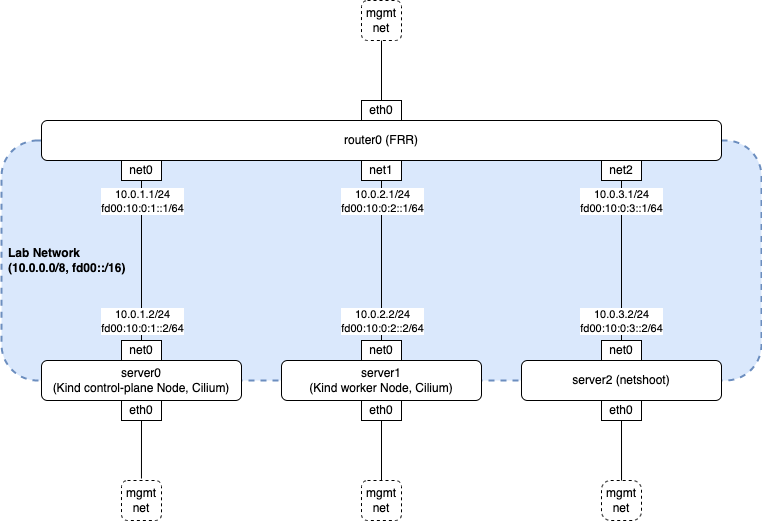

.. only:: not (epub or latex or html)

    WARNING: You are looking at unreleased Cilium documentation.
    Please use the official rendered version released here:
    https://docs.cilium.io

.. _bgp_cplane_contributing:

=================
BGP Control Plane
=================

This section is specific to :ref:`bgp_control_plane` contributions.

Development Environment
=======================

BGP Control Plane requires a BGP peer for testing. This section describes a `ContainerLab`_ and `Kind`_-based development environment. The following diagram shows the topology:

.. _ContainerLab: https://containerlab.dev/
.. _Kind: https://kind.sigs.k8s.io/

The following describes the role of each node:

* ``router0`` is an `FRRouting (FRR)`_ router. It is pre-configured with minimal peering settings with server0 and server1.
* ``server0`` and ``server1`` are ``nicolaka/netshoot`` containers that each share a network namespace with their own Kind node.
* ``server2`` is a non-Cilium ``nicolaka/netshoot`` node useful for testing traffic connectivity from outside of the k8s cluster.

.. _FRRouting (FRR): https://frrouting.org/

Prerequisites
-------------

* ContainerLab v0.45.1 or later
* Kind v0.20.0 or later
* Your container runtime networks must not use ``10.0.0.0/8`` and ``fd00::/16``

Deploy Lab
----------

.. code-block:: shell-session

   $ make kind-bgp-v4

.. note::
        The prior example sets up an IPv4 single-stack environment. You can change the ``v4`` part to ``v6`` or ``dual`` to set up an IPv6 single-stack or dual-stack environment respectively. The same goes for the following examples.

Install Cilium on the Lab
-------------------------

Install Cilium on the lab with your favorite way. The following example assumes you are modifying the source and want to build your own image. The minimal mandatory Helm values are provided in ``contrib/containerlab/bgp-cplane-dev-v4/values.yaml``. If needed, you can add Helm values to deploy BGP Control Plane with a different Cilium configuration.

.. code-block:: shell-session

   $ KIND_CLUSTER_NAME=bgp-cplane-dev-v4 make kind-image
   $ cilium install --chart-directory install/kubernetes/cilium -f contrib/containerlab/bgp-cplane-dev-v4/values.yaml --set image.override="localhost:5000/cilium/cilium-dev:local" --set image.pullPolicy=Never --set operator.image.override="localhost:5000/cilium/operator-generic:local" --set operator.image.pullPolicy=Never

Peering with Router
-------------------

Peer Cilium nodes with FRR by applying a CiliumBGPPeeringPolicy:

.. code-block:: shell-session

   $ make kind-bgp-v4-apply-policy

.. note::
        At this point, there are only minimal peering settings on the policy and no advertisement configuration present. You need to edit policies, for example, with ``kubectl edit bgpp`` to realize your desired settings. If you need to change the router side, you can edit FRRouting settings with ``docker exec -it clab-bgp-cplane-dev-v4-router0 vtysh``.

Validating Peering Status
-------------------------

You can validate the peering status with the following command. Confirm that
the session state is established and Received and Advertised counters are zero.

.. code-block:: shell-session

   $ cilium bgp peers
   Node                              Local AS   Peer AS   Peer Address   Session State   Uptime   Family         Received   Advertised
   bgp-cplane-dev-v4-control-plane   65001      65000     10.0.1.1       established     1s       ipv4/unicast   0          0
                                                                                                  ipv6/unicast   0          0
   bgp-cplane-dev-v4-worker          65002      65000     10.0.2.1       established     2s       ipv4/unicast   0          0
                                                                                                  ipv6/unicast   0          0

Validating Connectivity to Cilium Nodes from Non-Cilium Node
------------------------------------------------------------

The below example validates connectivity from server2 to server0 (10.0.1.2) and server1 (10.0.2.2). You should see the packets go through router0 (10.0.3.1).

.. code-block:: shell-session

   $ docker exec -it clab-bgp-cplane-dev-v4-server2 mtr 10.0.1.2 -r
   Start: 2023-10-04T02:24:58+0000
   HOST: server2                     Loss%   Snt   Last   Avg  Best  Wrst StDev
     1.|-- 10.0.3.1                   0.0%    10    0.0   0.1   0.0   0.1   0.0
     2.|-- 10.0.1.2                   0.0%    10    0.2   0.1   0.1   0.3   0.1

   $ docker exec -it clab-bgp-cplane-dev-v4-server2 mtr 10.0.2.2 -r
   Start: 2023-10-04T02:25:58+0000
   HOST: server2                     Loss%   Snt   Last   Avg  Best  Wrst StDev
     1.|-- 10.0.3.1                   0.0%    10    0.1   0.1   0.0   0.1   0.0
     2.|-- 10.0.2.2                   0.0%    10    0.1   0.1   0.0   0.2   0.0

Destroy Lab
-----------

.. code-block:: shell-session

   $ make kind-bgp-v4-down
