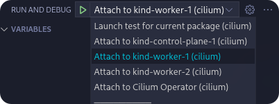

.. only:: not (epub or latex or html)

    WARNING: You are looking at unreleased Cilium documentation.
    Please use the official rendered version released here:
    https://docs.cilium.io

.. _gs_debugging:

#########
Debugging
#########

Attaching a Debugger
--------------------

Cilium comes with a set of Makefile targets for quickly deploying development
builds to a local :ref:`Kind <gs_kind>` cluster. One of these targets is
``kind-debug-agent``, which generates a container image that wraps the Cilium
agent with a `Delve (dlv) <https://github.com/go-delve/delve>`_ invocation. This
causes the agent process to listen for connections from a debugger front-end on
port 2345.

To build and push a debug image to your local Kind cluster, run:

.. code-block:: shell-session

    $ make kind-debug-agent

.. note::
      The image is automatically pushed to the Kind nodes, but running Cilium
      Pods are not restarted. To do so, run:

      .. code-block:: shell-session
        
        $ kubectl delete pods -n kube-system -l app.kubernetes.io/name=cilium-agent

If your Kind cluster was set up using ``make kind``, it will automatically
be configured using with the following port mappings:

- ``23401``: ``kind-control-plane-1``
- ``2340*``: Subsequent ``kind-control-plane-*`` nodes, if defined
- ``23411``: ``kind-worker-1``
- ``2341*``: Subsequent ``kind-worker-*`` nodes, if defined

The Delve listener supports multiple debugging protocols, so any IDEs or
debugger front-ends that understand either the `Debug Adapter Protocol
<https://microsoft.github.io/debug-adapter-protocol>`_ or Delve API v2 are
supported.

~~~~~~~~~~~~~~~~~~
Visual Studio Code
~~~~~~~~~~~~~~~~~~

The Cilium repository contains a VS Code launch configuration
(``.vscode/launch.json``) that includes debug targets for the Kind control
plane, the first two ``kind-worker`` nodes and the :ref:`Cilium Operator
<cilium_operator_internals>`.

|

The preceding screenshot is taken from the 'Run And Debug' section in VS Code.
The default shortcut to access this section is ``Shift+Ctrl+D``. Select a target
to attach to, start the debug session and set a breakpoint to halt the agent or
operator on a specific code statement. This only works for Go code, BPF C code
cannot be debugged this way.

See `the VS Code debugging guide <https://code.visualstudio.com/docs/editor/debugging>`_
for more details.

~~~~~~
Neovim
~~~~~~

The Cilium repository contains a `.nvim directory
<https://github.com/cilium/cilium/tree/main/.nvim>`_ containing a DAP
configuration as well as a README on how to configure ``nvim-dap``.

toFQDNs and DNS Debugging
-------------------------

The interactions of L3 toFQDNs and L7 DNS rules can be difficult to debug
around. Unlike many other policy rules, these are resolved at runtime with
unknown data. Pods may create large numbers of IPs in the cache or the IPs
returned may not be compatible with our datapath implementation. Sometimes
we also just have bugs.

~~~~~~~~~~~~~~~~~~~~~~~~~~~~~~~~~~~~~~
Isolating the source of toFQDNs issues
~~~~~~~~~~~~~~~~~~~~~~~~~~~~~~~~~~~~~~

While there is no common culprit when debugging, the DNS Proxy shares the least
code with other system and so is more likely the least audited in this chain.
The cascading caching scheme is also complex in its behaviour. Determining
whether an issue is caused by the DNS components, in the policy layer or in the
datapath is often the first step when debugging toFQDNs related issues.
Generally, working top-down is easiest as the information needed to verify
low-level correctness can be collected in the initial debug invocations.

REFUSED vs NXDOMAIN responses
~~~~~~~~~~~~~~~~~~~~~~~~~~~~~~

The proxy uses REFUSED DNS responses to indicate a denied request. Some libc
implementations, notably musl which is common in Alpine Linux images, terminate
the whole DNS search in these cases. This often manifests as a connect error in
applications, as the libc lookup returns no data.
To work around this, denied responses can be configured to be NXDOMAIN by
setting ``--tofqdns-dns-reject-response-code=nameError`` on the command line.

Monitor Events
~~~~~~~~~~~~~~

The DNS Proxy emits multiple L7 DNS monitor events. One for the request and one
for the response (if allowed). Often the L7 DNS rules are paired with L3
toFQDNs rules and events relating to those rules are also relevant.

.. Note::

    Be sure to run cilium-dbg monitor on the same node as the pod being debugged!

.. code-block:: shell-session

    $ kubectl exec pod/cilium-sbp8v -n kube-system -- cilium-dbg monitor --related-to 3459
    Listening for events on 4 CPUs with 64x4096 of shared memory
    Press Ctrl-C to quit
    level=info msg="Initializing dissection cache..." subsys=monitor

    -> Request dns from 3459 ([k8s:org=alliance k8s:io.kubernetes.pod.namespace=default k8s:io.cilium.k8s.policy.serviceaccount=default k8s:io.cilium.k8s.policy.cluster=default k8s:class=xwing]) to 0 ([k8s:io.cilium.k8s.policy.serviceaccount=kube-dns k8s:io.kubernetes.pod.namespace=kube-system k8s:k8s-app=kube-dns k8s:io.cilium.k8s.policy.cluster=default]), identity 323->15194, verdict Forwarded DNS Query: cilium.io. A
    -> endpoint 3459 flow 0xe6866e21 identity 15194->323 state reply ifindex lxc84b58cbdabfe orig-ip 10.60.1.115: 10.63.240.10:53 -> 10.60.0.182:42132 udp
    -> Response dns to 3459 ([k8s:org=alliance k8s:io.kubernetes.pod.namespace=default k8s:io.cilium.k8s.policy.serviceaccount=default k8s:io.cilium.k8s.policy.cluster=default k8s:class=xwing]) from 0 ([k8s:io.cilium.k8s.policy.cluster=default k8s:io.cilium.k8s.policy.serviceaccount=kube-dns k8s:io.kubernetes.pod.namespace=kube-system k8s:k8s-app=kube-dns]), identity 323->15194, verdict Forwarded DNS Query: cilium.io. A TTL: 486 Answer: '104.198.14.52'
    -> endpoint 3459 flow 0xe6866e21 identity 15194->323 state reply ifindex lxc84b58cbdabfe orig-ip 10.60.1.115: 10.63.240.10:53 -> 10.60.0.182:42132 udp
    Policy verdict log: flow 0x614e9723 local EP ID 3459, remote ID 16777217, proto 6, egress, action allow, match L3-Only, 10.60.0.182:41510 -> 104.198.14.52:80 tcp SYN

    -> stack flow 0x614e9723 identity 323->16777217 state new ifindex 0 orig-ip 0.0.0.0: 10.60.0.182:41510 -> 104.198.14.52:80 tcp SYN
    -> 0: 10.60.0.182:41510 -> 104.198.14.52:80 tcp SYN
    -> endpoint 3459 flow 0x7388921 identity 16777217->323 state reply ifindex lxc84b58cbdabfe orig-ip 104.198.14.52: 104.198.14.52:80 -> 10.60.0.182:41510 tcp SYN, ACK
    -> stack flow 0x614e9723 identity 323->16777217 state established ifindex 0 orig-ip 0.0.0.0: 10.60.0.182:41510 -> 104.198.14.52:80 tcp ACK
    -> 0: 10.60.0.182:41510 -> 104.198.14.52:80 tcp ACK
    -> stack flow 0x614e9723 identity 323->16777217 state established ifindex 0 orig-ip 0.0.0.0: 10.60.0.182:41510 -> 104.198.14.52:80 tcp ACK
    -> 0: 10.60.0.182:41510 -> 104.198.14.52:80 tcp ACK
    -> endpoint 3459 flow 0x7388921 identity 16777217->323 state reply ifindex lxc84b58cbdabfe orig-ip 104.198.14.52: 104.198.14.52:80 -> 10.60.0.182:41510 tcp ACK
    -> 0: 10.60.0.182:41510 -> 104.198.14.52:80 tcp ACK
    -> stack flow 0x614e9723 identity 323->16777217 state established ifindex 0 orig-ip 0.0.0.0: 10.60.0.182:41510 -> 104.198.14.52:80 tcp ACK, FIN
    -> 0: 10.60.0.182:41510 -> 104.198.14.52:80 tcp ACK, FIN
    -> endpoint 3459 flow 0x7388921 identity 16777217->323 state reply ifindex lxc84b58cbdabfe orig-ip 104.198.14.52: 104.198.14.52:80 -> 10.60.0.182:41510 tcp ACK, FIN
    -> stack flow 0x614e9723 identity 323->16777217 state established ifindex 0 orig-ip 0.0.0.0: 10.60.0.182:41510 -> 104.198.14.52:80 tcp ACK

The above is for a simple ``curl cilium.io`` in a pod. The L7 DNS request is
the first set of message and the subsequent L3 connection is the HTTP
component. AAAA DNS lookups commonly happen but were removed to simplify the
example.

- If no L7 DNS requests appear, the proxy redirect is not in place. This may
  mean that the policy does not select this endpoint or there is an issue with
  the proxy redirection. Whether any redirects exist can be checked with
  ``cilium-dbg status --all-redirects``.
  In the past, a bug occurred with more permissive L3 rules overriding the
  proxy redirect, causing the proxy to never see the requests.
- If the L7 DNS request is blocked, with an explicit denied message, then the
  requests are not allowed by the proxy. This may be due to a typo in the
  network policy, or the matchPattern rule not allowing this domain. It may
  also be due to a bug in policy propagation to the DNS Proxy.
- If the DNS request is allowed, with an explicit message, and it should not
  be, this may be because a more general policy is in place that allows the
  request. ``matchPattern: "*"`` visibility policies are commonly in place and
  would supersede all other, more restrictive, policies.
  If no other policies are in place, incorrect allows may indicate a bug when
  passing policy information to the proxy. There is no way to dump the rules in
  the proxy, but a debug log is printed when a rule is added. Look for 
  ``DNS Proxy updating matchNames in allowed list during UpdateRules``.
  The pkg/proxy/dns.go file contains the DNS proxy implementation.

If L7 DNS behaviour seems correct, see the sections below to further isolate
the issue. This can be verified with ``cilium-dbg fqdn cache list``. The IPs in the
response should appear in the cache for the appropriate endpoint. The lookup
time is included in the json output of the command.

.. code-block:: shell-session

    $ kubectl exec pod/cilium-sbp8v -n kube-system -- cilium-dbg fqdn cache list
    Endpoint   Source   FQDN         TTL    ExpirationTime             IPs
    3459       lookup   cilium.io.   3600   2020-04-21T15:04:27.146Z   104.198.14.52

DNS Proxy Errors
~~~~~~~~~~~~~~~~

REFUSED responses are returned when the proxy encounters an error during
processing. This can be confusing to debug as that is also the response when a
DNS request is denied.  An error log is always printed in these cases. Some are
callbacks provided by other packages via daemon in cilium-agent.

- ``Rejecting DNS query from endpoint due to error``: This is the "normal"
  policy-reject message. It is a debug log.
- ``cannot extract endpoint IP from DNS request``: The proxy cannot read the
  socket information to read the source endpoint IP. This could mean an
  issue with the datapath routing and information passing.
- ``cannot extract endpoint ID from DNS request``: The proxy cannot use the
  source endpoint IP to get the cilium-internal ID for that endpoint. This is
  different from the Security Identity. This could mean that cilium is not
  managing this endpoint and that something has gone awry. It could also mean a
  routing problem where a packet has arrived at the proxy incorrectly.
- ``cannot extract destination IP:port from DNS request``: The proxy cannot
  read the socket information of the original request to obtain the intended
  target IP:Port. This could mean an issue with the datapath routing and
  information passing.
- ``cannot find server ip in ipcache``: The proxy cannot resolve a Security
  Identity for the target IP of the DNS request. This should always succeed, as
  world catches all IPs not set by more specific entries. This can mean a
  broken ipcache BPF table.
- ``Rejecting DNS query from endpoint due to error``: While checking if the DNS
  request was allowed (based on Endpoint ID, destination IP:Port and the DNS
  query) an error occurred. These errors would come from the internal rule
  lookup in the proxy, the ``allowed`` field.
- ``Timeout waiting for response to forwarded proxied DNS lookup``: The proxy
  forwards requests 1:1 and does not cache. It applies a 10s timeout on
  responses to those requests, as the client will retry within this period
  (usually). Bursts of these errors can happen if the DNS target server
  misbehaves and many pods see DNS timeouts. This isn't an actual problem with
  cilium or the proxy although it can be caused by policy blocking the DNS
  target server if it is in-cluster.
- ``Timed out waiting for datapath updates of FQDN IP information; returning
  response``: When the proxy updates the DNS caches with response data, it
  needs to allow some time for that information to get into the datapath.
  Otherwise, pods would attempt to make the outbound connection (the thing that
  caused the DNS lookup) before the datapath is ready. Many stacks retry the
  SYN in such cases but some return an error and some apps further crash as a
  response. This delay is configurable by setting the
  ``--tofqdns-proxy-response-max-delay`` command line argument but defaults to
  100ms. It can be exceeded if the system is under load.

.. _isolating-source-toFQDNs-issues-identities-policy:

Identities and Policy
~~~~~~~~~~~~~~~~~~~~~

Once a DNS response has been passed back through the proxy and is placed in the
DNS cache ``toFQDNs`` rules can begin using the IPs in the cache. There are
multiple layers of cache:

- A per-Endpoint ``DNSCache`` stores the lookups for this endpoint. It is
  restored on cilium startup with the endpoint. Limits are applied here for
  ``--tofqdns-endpoint-max-ip-per-hostname`` and TTLs are tracked. The
  ``--tofqdns-min-ttl`` is not used here.
- A per-Endpoint ``DNSZombieMapping`` list of IPs that have expired from the
  per-Endpoint cache but are waiting for the Connection Tracking GC to mark
  them in-use or not. This can take up to 12 hours to occur. This list is
  size-limited by ``--tofqdns-max-deferred-connection-deletes``. 
- A global ``DNSCache`` where all endpoint and poller DNS data is collected. It
  does apply the ``--tofqdns-min-ttl`` value but not the
  ``--tofqdns-endpoint-max-ip-per-hostname`` value.

If an IP exists in the FQDN cache (check with ``cilium-dbg fqdn cache list``) then
``toFQDNs`` rules that select a domain name, either explicitly via
``matchName`` or via ``matchPattern``, should cause IPs for that domain to have
allocated Security Identities. These can be listed with:

.. code-block:: shell-session

    $ kubectl exec pod/cilium-sbp8v -n kube-system -- cilium-dbg identity list
    ID         LABELS
    1          reserved:host
    2          reserved:world
    3          reserved:unmanaged
    4          reserved:health
    5          reserved:init
    6          reserved:remote-node
    323        k8s:class=xwing
               k8s:io.cilium.k8s.policy.cluster=default
               k8s:io.cilium.k8s.policy.serviceaccount=default
               k8s:io.kubernetes.pod.namespace=default
               k8s:org=alliance
    ...
    16777217   cidr:104.198.14.52/32
               reserved:world

Note that CIDR identities are allocated locally on the node and have a high-bit set so they are often in the 16-million range.
Note that this is the identity in the monitor output for the HTTP connection.

In cases where there is no matching identity for an IP in the fqdn cache it may
simply be because no policy selects an associated domain. The policy system
represents each ``toFQDNs:`` rule with a ``FQDNSelector`` instance. These
receive updates from a global ``NameManager`` in the daemon.
They can be listed along with other selectors (roughly corresponding to any L3 rule):

.. code-block:: shell-session

    $ kubectl exec pod/cilium-sbp8v -n kube-system -- cilium-dbg policy selectors
    SELECTOR                                                                                                         USERS   IDENTITIES
    MatchName: , MatchPattern: *                                                                                     1       16777217
    &LabelSelector{MatchLabels:map[string]string{},MatchExpressions:[]LabelSelectorRequirement{},}                   2       1
                                                                                                                             2
                                                                                                                             3
                                                                                                                             4
                                                                                                                             5
                                                                                                                             6
                                                                                                                             323
                                                                                                                             6188
                                                                                                                             15194
                                                                                                                             18892
                                                                                                                             25379
                                                                                                                             29200
                                                                                                                             32255
                                                                                                                             33831
                                                                                                                             16777217
    &LabelSelector{MatchLabels:map[string]string{reserved.none: ,},MatchExpressions:[]LabelSelectorRequirement{},}   1

In this example 16777217 is used by two selectors, one with ``matchPattern: "*"``
and another empty one. This is because of the policy in use:

.. code-block:: yaml

    apiVersion: cilium.io/v2
    kind: CiliumNetworkPolicy
    metadata:
      name: "tofqdn-dns-visibility"
    spec:
      endpointSelector:
        matchLabels:
          any:org: alliance
      egress:
      - toPorts:
          - ports:
             - port: "53"
               protocol: ANY
            rules:
              dns:
                - matchPattern: "*"
      - toFQDNs:
          - matchPattern: "*"

The L7 DNS rule has an implicit L3 allow-all because it defines only L4 and L7
sections. This is the second selector in the list, and includes all possible L3
identities known in the system. In contrast, the first selector, which
corresponds to the ``toFQDNS: matchName: "*"`` rule would list all identities
for IPs that came from the DNS Proxy. Other CIDR identities would not be
included.

Unintended DNS Policy Drops
~~~~~~~~~~~~~~~~~~~~~~~~~~~

``toFQDNSs`` policy enforcement relies on the source pod performing a DNS query
before using an IP address returned in the DNS response. Sometimes pods may hold
on to a DNS response and start new connections to the same IP address at a later
time. This may trigger policy drops if the DNS response has expired as requested
by the DNS server in the time-to-live (TTL) value in the response. When DNS is
used for service load balancing the advertised TTL value may be short (e.g., 60
seconds).

Cilium honors the TTL values returned by the DNS server by default, but you can
override them by setting a minimum TTL using ``--tofqdns-min-ttl`` flag. This
setting overrides short TTLs and allows the pod to use the IP address in the DNS
response for a longer duration. Existing connections also keep the IP address as
allowed in the policy.

Any new connections opened by the pod using the same IP address without
performing a new DNS query after the (possibly extended) DNS TTL has expired are
dropped by Cilium policy enforcement. To allow pods to use the DNS response
after TTL expiry for new connections, a command line option
``--tofqdns-idle-connection-grace-period`` may be used to keep the IP address /
name mapping valid in the policy for an extended time after DNS TTL expiry. This
option takes effect only if the pod has opened at least one connection during
the DNS TTL period.

Datapath Plumbing
~~~~~~~~~~~~~~~~~

For a policy to be fully realized the datapath for an Endpoint must be updated.
In the case of a new DNS-source IP, the CIDR identity associated with it must
propagate from the selectors to the Endpoint specific policy. Unless a new
policy is being added, this often only involves updating the Policy Map of the
Endpoint with the new CIDR Identity of the IP. This can be verified:

.. code-block:: shell-session

    $ kubectl exec pod/cilium-sbp8v -n kube-system -- cilium-dbg bpf policy get 3459
    DIRECTION   LABELS (source:key[=value])   PORT/PROTO   PROXY PORT   BYTES   PACKETS
    Ingress     reserved:unknown              ANY          NONE         1367    7
    Ingress     reserved:host                 ANY          NONE         0       0
    Egress      reserved:unknown              53/TCP       36447        0       0
    Egress      reserved:unknown              53/UDP       36447        138     2
    Egress      cidr:104.198.14.52/32         ANY          NONE         477     6
                reserved:world 

Note that the labels for identities are resolved here. This can be skipped, or
there may be cases where this doesn't occur:

.. code-block:: shell-session

    $ kubectl exec pod/cilium-sbp8v -n kube-system -- cilium-dbg bpf policy get -n 3459
    DIRECTION   IDENTITY   PORT/PROTO   PROXY PORT   BYTES   PACKETS
    Ingress     0          ANY          NONE         1367    7
    Ingress     1          ANY          NONE         0       0
    Egress      0          53/TCP       36447        0       0
    Egress      0          53/UDP       36447        138     2
    Egress      16777217   ANY          NONE         477     6

L3 ``toFQDNs`` rules are egress only, so we would expect to see an ``Egress``
entry with Security Identity ``16777217``. The L7 rule, used to redirect to the
DNS Proxy is also present with a populated ``PROXY PORT``. It has a 0
``IDENTITY`` as it is an L3 wildcard, i.e. the policy allows any peer on the
specified port.

An identity missing here can be an error in various places:

- Policy doesn't actually allow this Endpoint to connect. A sanity check is to
  use ``cilium-dbg endpoint list`` to see if cilium thinks it should have policy
  enforcement.
- Endpoint regeneration is slow and the Policy Map has not been updated yet.
  This can occur in cases where we have leaked IPs from the DNS cache (i.e.
  they were never deleted correctly) or when there are legitimately many IPs.
  It can also simply mean an overloaded node or even a deadlock within cilium.
- A more permissive policy has removed the need to include this identity. This
  is likely a bug, however, as the IP would still have an identity allocated
  and it would be included in the Policy Map.  In the past, a similar bug
  occurred with the L7 redirect and that would stop this whole process at the
  beginning.

Mutexes / Locks and Data Races
------------------------------

.. Note::

    This section only applies to Golang code.

There are a few options available to debug Cilium data races and deadlocks.

To debug data races, Golang allows ``-race`` to be passed to the compiler to
compile Cilium with race detection. Additionally, the flag can be provided to
``go test`` to detect data races in a testing context.

.. _compile-cilium-with-race-detection:

~~~~~~~~~~~~~~
Race detection
~~~~~~~~~~~~~~

To compile a Cilium binary with race detection, you can do:

.. code-block:: shell-session

    $ make RACE=1

.. Note::

    For building the Operator with race detection, you must also provide
    ``BASE_IMAGE`` which can be the ``cilium/cilium-runtime`` image from the
    root Dockerfile found in the Cilium repository.

To run integration tests with race detection, you can do:

.. code-block:: shell-session

    $ make RACE=1 integration-tests

~~~~~~~~~~~~~~~~~~
Deadlock detection
~~~~~~~~~~~~~~~~~~

Cilium can be compiled with a build tag ``lockdebug`` which will provide a
seamless wrapper over the standard mutex types in Golang, via
`sasha-s/go-deadlock library <https://github.com/sasha-s/go-deadlock>`_. No
action is required, besides building the binary with this tag.

For example:

.. code-block:: shell-session

    $ make LOCKDEBUG=1
    $ # Deadlock detection during integration tests:
    $ make LOCKDEBUG=1 integration-tests

CPU Profiling and Memory Leaks
------------------------------

Cilium bundles ``gops``, a standard tool for Golang applications, which
provides the ability to collect CPU and memory profiles using ``pprof``.
Inspecting profiles can help identify CPU bottlenecks and memory leaks.

To capture a profile, take a :ref:`sysdump <sysdump>` of the cluster with the
Cilium CLI or more directly, use the ``cilium-bugtool`` command that is
included in the Cilium image:

.. code-block:: shell-session

    $ kubectl exec -ti -n kube-system <cilium-pod-name> -- cilium-bugtool --get-pprof --pprof-trace-seconds N
    $ kubectl cp -n kube-system <cilium-pod-name>:/tmp/cilium-bugtool-<time-generated-name>.tar ./cilium-pprof.tar
    $ tar xf ./cilium-pprof.tar

Be mindful that the profile window is the number of seconds passed to
``--pprof-trace-seconds``. Ensure that the number of seconds are enough to
capture Cilium while it is exhibiting the problematic behavior to debug.

There are 6 files that encompass the tar archive:

.. code-block:: shell-session

    Permissions Size User  Date Modified Name
    .rw-r--r--   940 chris  6 Jul 14:04  gops-memstats-$(pidof-cilium-agent).md
    .rw-r--r--  211k chris  6 Jul 14:04  gops-stack-$(pidof-cilium-agent).md
    .rw-r--r--    58 chris  6 Jul 14:04  gops-stats-$(pidof-cilium-agent).md
    .rw-r--r--   212 chris  6 Jul 14:04  pprof-cpu
    .rw-r--r--  2.3M chris  6 Jul 14:04  pprof-heap
    .rw-r--r--   25k chris  6 Jul 14:04  pprof-trace

The files prefixed with ``pprof-`` are profiles. For more information on each
one, see `Julia Evan's blog`_ on ``pprof``.

To view the CPU or memory profile, simply execute the following command:

.. code-block:: shell-session

    $ go tool pprof -http localhost:9090 pprof-cpu  # for CPU
    $ go tool pprof -http localhost:9090 pprof-heap # for memory

This opens a browser window for profile inspection.

.. _Julia Evan's blog: https://jvns.ca/blog/2017/09/24/profiling-go-with-pprof/
