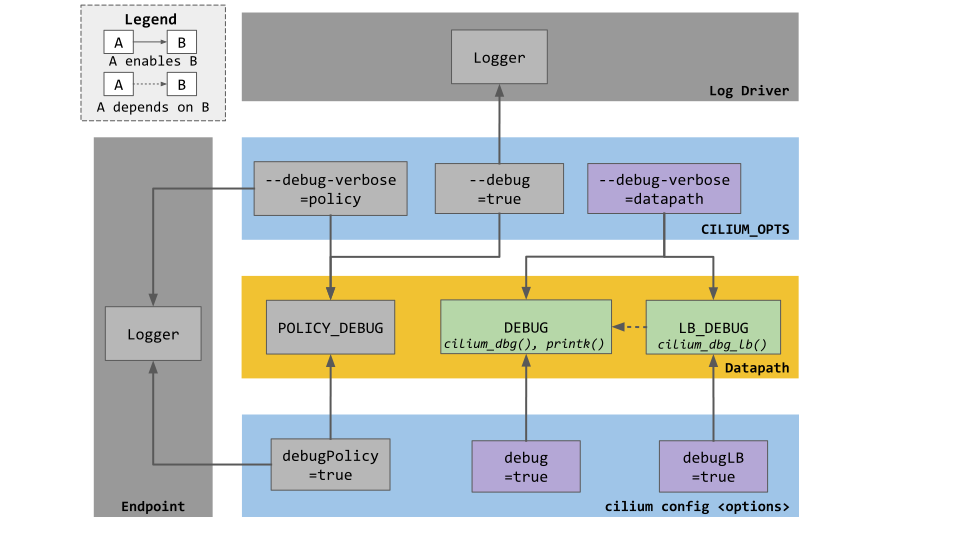

.. only:: not (epub or latex or html)

    WARNING: You are looking at unreleased Cilium documentation.
    Please use the official rendered version released here:
    https://docs.cilium.io

.. _dev_env:

Development Setup
=================

Verifying Your Development Setup
~~~~~~~~~~~~~~~~~~~~~~~~~~~~~~~~

Assuming you have Go installed, you can quickly verify many elements of your
development setup by running:

.. code-block:: shell-session

    $ make dev-doctor

Requirements
~~~~~~~~~~~~

You need to have the following tools available in order to effectively
contribute to Cilium:

+--------------------------------------------------------------+------------------------------+-----------------------------------------------------------------+
| Dependency                                                   | Version / Commit ID          | Download Command                                                |
+==============================================================+==============================+=================================================================+
|  git                                                         | latest                       | N/A (OS-specific)                                               |
+--------------------------------------------------------------+------------------------------+-----------------------------------------------------------------+
|  clang                                                       | >= 10.0 (latest recommended) | N/A (OS-specific)                                               |
+--------------------------------------------------------------+------------------------------+-----------------------------------------------------------------+
|  llvm                                                        | >= 10.0 (latest recommended) | N/A (OS-specific)                                               |
+--------------------------------------------------------------+------------------------------+-----------------------------------------------------------------+
| `go <https://golang.org/dl/>`_                               | |GO_RELEASE|                 | N/A (OS-specific)                                               |
+--------------------------------------------------------------+------------------------------+-----------------------------------------------------------------+
+ `ginkgo <https://github.com/onsi/ginkgo>`__                  | >= 1.4.0 and < 2.0.0         | ``go install github.com/onsi/ginkgo/ginkgo@latest``             |
+--------------------------------------------------------------+------------------------------+-----------------------------------------------------------------+
+ `golangci-lint <https://github.com/golangci/golangci-lint>`_ | >= v1.27                     | ``go install github.com/golangci/golangci-lint@latest``         |
+--------------------------------------------------------------+------------------------------+-----------------------------------------------------------------+
+ `cfssl <https://github.com/cloudflare/cfssl>`_               | >= v1.6.0                    | ``go install github.com/cloudflare/cfssl/cmd/cfssl@latest``     |
+--------------------------------------------------------------+------------------------------+-----------------------------------------------------------------+
+ `cfssljson <https://github.com/cloudflare/cfssl>`_           | >= v1.6.0                    | ``go install github.com/cloudflare/cfssl/cmd/cfssljson@latest`` |
+--------------------------------------------------------------+------------------------------+-----------------------------------------------------------------+
+ `Docker <https://docs.docker.com/engine/installation/>`_     | OS-Dependent                 | N/A (OS-specific)                                               |
+--------------------------------------------------------------+------------------------------+-----------------------------------------------------------------+
+ `Docker-Compose <https://docs.docker.com/compose/install/>`_ | OS-Dependent                 | N/A (OS-specific)                                               |
+--------------------------------------------------------------+------------------------------+-----------------------------------------------------------------+
+ python3-pip                                                  | latest                       | N/A (OS-specific)                                               |
+--------------------------------------------------------------+------------------------------+-----------------------------------------------------------------+

For `integration_testing`, you will need to run ``docker`` without privileges.
You can usually achieve this by adding your current user to the ``docker``
group.

Finally, in order to run Cilium locally on VMs, you need:

+------------------------------------------------------------+-----------------------+--------------------------------------------------------------------------------+
| Dependency                                                 | Version / Commit ID   | Download Command                                                               |
+============================================================+=======================+================================================================================+
| `Vagrant <https://www.vagrantup.com/downloads>`_           | >= 2.0                | `Vagrant Install Instructions <https://www.vagrantup.com/docs/installation>`_  |
+------------------------------------------------------------+-----------------------+--------------------------------------------------------------------------------+
| `VirtualBox <https://www.virtualbox.org/wiki/Downloads>`_  | >= 5.2                | N/A (OS-specific)                                                              |
+------------------------------------------------------------+-----------------------+--------------------------------------------------------------------------------+

You should start with the `gs_guide`, which walks you through the set-up, such
as installing Vagrant, getting the Cilium sources, and going through some
Cilium basics.

Vagrant Setup
~~~~~~~~~~~~~

While the `gs_guide` uses a Vagrantfile tuned for the basic walk through, the
setup for the Vagrantfile in the root of the Cilium tree depends on a number of
environment variables and network setup that are managed via
``contrib/vagrant/start.sh``.

Option 1 - Using the Provided Vagrantfiles (Recommended)
^^^^^^^^^^^^^^^^^^^^^^^^^^^^^^^^^^^^^^^^^^^^^^^^^^^^^^^^

To bring up a Vagrant VM with Cilium plus dependencies installed, run:

.. code-block:: shell-session

    $ contrib/vagrant/start.sh [vm_name]

This will create and run a vagrant VM based on the base box ``cilium/ubuntu``.
The ``vm_name`` argument is optional and allows you to add new nodes to an
existing cluster. For example, to add a net-next VM to a one-node cluster:

.. code-block:: shell-session

    $ K8S=1 NWORKERS=1 NETNEXT=1 ./contrib/vagrant/start.sh k8s2+

Cilium Vagrantfiles look for a file ``.devvmrc`` in the root of your
Cilium repository. This file is ignored for Git, so it does not exist
by default. If this file exists and is executable, it will be executed
in the beginning of the VM bootstrap. This allows you to automatically
customize the new VM, e.g., with your personal Git configuration. You
may also want to add any local entries you need in ``/etc/hosts``,
etc.

For example, you could have something like this in your ``.devvmrc``:

.. code-block:: bash

    #!/usr/bin/env bash

    git config --global user.name "Firstname Lastname"
    git config --global user.email developer@company.com

    sudo tee -a /etc/hosts <<EOF
    192.168.99.99 nas
    EOF

Remember to make the script executable (``chmod +x .devvmrc``). When
successfully running, the VM bootstrap shows a message like this right
after the shared folders have been set up:

::

    runtime: ----------------------------------------------------------------
    runtime: Executing .devvmrc

The box is currently available for the following providers:

* virtualbox

Configuration Options
---------------------

The following environment variables can be set to customize the VMs
brought up by vagrant:

* ``NWORKERS=n``: Number of child nodes you want to start with the master,
  default 0.
* ``RELOAD=1``: Issue a ``vagrant reload`` instead of ``vagrant up``, useful
  to resume halted VMs.
* ``NO_PROVISION=1``: Avoid provisioning Cilium inside the VM. Supports quick
  restart without recompiling all of Cilium.
* ``K8S=1``: Build & install kubernetes on the nodes. ``k8s1`` is the master
  node, which contains both master components: etcd, kube-controller-manager,
  kube-scheduler, kube-apiserver, and node components: kubelet,
  kube-proxy, kubectl and Cilium. When used in combination with ``NWORKERS=1`` a
  second node is created, where ``k8s2`` will be a kubernetes node, which
  contains: kubelet, kube-proxy, kubectl and cilium.
* ``NETNEXT=1``: Run with net-next kernel.
* ``SERVER_BOX`` and ``SERVER_VERSION``: Run with a specified vagrant
  box. See: ``vagrant_box_defaults.rb`` for the supported
  versions. This may be useful for BPF developers that want to test
  their changes with ``make -C bpf && sudo
  test/bpf/verifier-test.sh``.
* ``IPV4=1``: Run Cilium with IPv4 enabled.
* ``RUNTIME=x``: Sets up the container runtime to be used inside a kubernetes
  cluster. Valid options are: ``docker``, ``containerd`` and ``crio``. If not
  set, it defaults to ``docker``.
* ``VM_SET_PROXY=https://127.0.0.1:80/`` Sets up VM's ``https_proxy``.
* ``INSTALL=1``: Restarts the installation of Cilium, Kubernetes, etc. Only
  useful when the installation was interrupted.
* ``MAKECLEAN=1``: Execute ``make clean`` before building cilium in the VM.
* ``NO_BUILD=1``: Does not run the "build" provision step in the VM. Assumes
  the developer had previously executed ``make build`` before provisioning the
  VM.
* ``SHARE_PARENT``: Share the parent of your Cilium directory instead. This
  requires your Cilium directory to be named ``cilium``, but will also make
  all other files and folders in the parent directory available for the VM.
  This is useful to share all the cilium repos to the VM, for example.
* ``USER_MOUNTS``: Additional mounts for the VM in a comma-separated list of
  mount specifications. Each mount specification can be simply a directory name
  relative to the home directory, or include a '=' character separating the
  destination mount point from the host directory. For example:

  * ``USER_MOUNTS=foo``

    * Mounts host directory ``~/foo`` as ``/home/vagrant/foo``

  * ``USER_MOUNTS=foo,/tmp/bar=/tmp/bar``

    * Mounts host directory ``~/foo`` as ``/home/vagrant/foo`` in the VM, and host
      directory ``/tmp/bar`` as ``/tmp/bar`` in the VM.

* ``VM_MEMORY``: Memory in megabytes to configure for the VMs (default 4096).
* ``VM_CPUS``: Number of CPUs to configure for the VMs (default 2).

If you want to start the VM with cilium enabled with ``containerd``, with
kubernetes installed and plus a worker, run:

.. code-block:: shell-session

    $ RUNTIME=containerd K8S=1 NWORKERS=1 contrib/vagrant/start.sh

If you want to get VM status, run:

.. code-block:: shell-session

    $ RUNTIME=containerd K8S=1 NWORKERS=1 vagrant status

If you want to connect to the Kubernetes cluster running inside the developer VM via ``kubectl`` from your host machine, set ``KUBECONFIG`` environment variable to include new kubeconfig file:

.. code-block:: shell-session

    $ export KUBECONFIG=$KUBECONFIG:$GOPATH/src/github.com/cilium/cilium/vagrant.kubeconfig

and add ``127.0.0.1 k8s1`` to your hosts file.

If you have any issue with the provided vagrant box
``cilium/ubuntu`` or need a different box format, you may
build the box yourself using the `packer scripts <https://github.com/cilium/packer-ci-build>`_

Launch CI VMs
-------------

The ``test`` directory also contains a ``Vagrantfile`` that can be
used to bring up the CI VM images that will cache a Vagrant box
locally (in ``test/.vagrant/`` that prepulls all the docker images
needed for the CI tests. Unfortunately some of the options are different
from the main Vagrantfile, for example:

- ``K8S_NODES`` determines the total number of k8s nodes, including the master.
  - ``NWORKERS`` is not supported.
- ``USER_MOUNTS`` is not available.

To start a local k8s 1.18 cluster with one CI VM locally, run:

.. code-block:: shell-session

    $ cd test
    $ K8S_VERSION=1.18 K8S_NODES=1 ./vagrant-local-start.sh

This will first destroy any CI VMs you may have running on the current
``K8S_VERSION``, and then create a local Vagrant box if not already
created. This can take some time.

VM preloading can be turned off by exporting ``VM_PRELOAD=false``. You
can run ``make clean`` in ``test`` to delete the cached vagrant box.

To start the CI runtime VM locally, run:

.. code-block:: shell-session

    $ cd test
    $ ./vagrant-local-start-runtime.sh

The runtime VM is connected to the same private VirtualBox network as
the local CI k8s nodes.

The runtime VM uses the same cached box as the k8s nodes, but does not start
K8s, but runs Cilium as a systemd service.

Option 2 - Manual Installation
^^^^^^^^^^^^^^^^^^^^^^^^^^^^^^

Alternatively you can import the vagrant box ``cilium/ubuntu``
directly and manually install Cilium:

.. code-block:: shell-session

        $ vagrant init cilium/ubuntu
        $ vagrant up
        $ vagrant ssh [...]
        $ go get github.com/cilium/cilium
        $ cd go/src/github.com/cilium/cilium/
        $ make
        $ sudo make install
        $ sudo mkdir -p /etc/sysconfig/
        $ sudo cp contrib/systemd/cilium.service /etc/systemd/system/
        $ sudo cp contrib/systemd/cilium-docker.service /etc/systemd/system/
        $ sudo cp contrib/systemd/cilium-consul.service /etc/systemd/system/
        $ sudo cp contrib/systemd/cilium  /etc/sysconfig/cilium
        $ sudo usermod -a -G cilium vagrant
        $ sudo systemctl enable cilium-docker
        $ sudo systemctl restart cilium-docker
        $ sudo systemctl enable cilium-consul
        $ sudo systemctl restart cilium-consul
        $ sudo systemctl enable cilium
        $ sudo systemctl restart cilium

Notes
^^^^^

Your Cilium tree is mapped to the VM so that you do not need to keep manually
copying files between your host and the VM. Folders are by default synced
automatically using `VirtualBox Shared Folders <https://www.virtualbox.org/manual/ch04.html#sharedfolders>`_
with NFS. Note that your host firewall must have a variety of ports open. The
Vagrantfile will inform you of the configuration of these addresses and ports
to enable NFS.

.. note::

   OSX file system is by default case insensitive, which can confuse
   git.  At the writing of this Cilium repo has no file names that
   would be considered referring to the same file on a case
   insensitive file system.  Regardless, it may be useful to create a
   disk image with a case sensitive file system for holding your git
   repos.

.. note::

   VirtualBox for OSX currently (version 5.1.22) always reports
   host-only networks' prefix length as 64.  Cilium needs this prefix
   to be 16, and the startup script will check for this.  This check
   always fails when using VirtualBox on OSX, but it is safe to let
   the startup script to reset the prefix length to 16.

.. note::

   Make sure your host NFS configuration is setup to use tcp:

   .. code-block:: none

      # cat /etc/nfs.conf
      ...
      [nfsd]
      # grace-time=90
      tcp=y
      # vers2=n
      # vers3=y
      ...

If for some reason, running of the provisioning script fails, you should bring the VM down before trying again:

.. code-block:: shell-session

    $ vagrant halt

Local Development in Vagrant Box
~~~~~~~~~~~~~~~~~~~~~~~~~~~~~~~~

See :ref:`dev_env` for information on how to setup the development environment.

When the development VM is provisioned, it builds and installs Cilium.  After
the initial build and install you can do further building and testing
incrementally inside the VM. ``vagrant ssh`` takes you to the Cilium source
tree directory (``/home/vagrant/go/src/github.com/cilium/cilium``) by default,
and the following commands assume that you are working within that directory.

Build Cilium
^^^^^^^^^^^^

When you make changes, the tree is automatically kept in sync via NFS.
You can issue a build as follows:

.. code-block:: shell-session

    $ make

Install to dev environment
^^^^^^^^^^^^^^^^^^^^^^^^^^

After a successful build and test you can re-install Cilium by:

.. code-block:: shell-session

    $ sudo -E make install

Restart Cilium service
^^^^^^^^^^^^^^^^^^^^^^

To run the newly installed version of Cilium, restart the service:

.. code-block:: shell-session

    $ sudo systemctl restart cilium

You can verify the service and cilium-agent status by the following
commands, respectively:

.. code-block:: shell-session

    $ sudo systemctl status cilium
    $ cilium status

Simple smoke-test with HTTP policies
^^^^^^^^^^^^^^^^^^^^^^^^^^^^^^^^^^^^

After Cilium daemon has been restarted, you may want to verify that it
boots up properly and integration with Envoy still works. To do this,
run this bash test script:

.. code-block:: shell-session

    $ test/envoy/envoy-smoke-test.sh

This test launches three docker containers (one curl client, and two
httpd servers) and tests various simple network policies with
them. These containers should be automatically removed when the test
finishes.

.. _making_changes:

Making Changes
~~~~~~~~~~~~~~

#. Make sure the ``master`` branch of your fork is up-to-date:

   .. code-block:: shell-session

      git fetch upstream master:master

#. Create a PR branch with a descriptive name, branching from ``master``:

   .. code-block:: shell-session

      git switch -c pr/changes-to-something master

#. Make the changes you want.
#. Separate the changes into logical commits.

   #. Describe the changes in the commit messages. Focus on answering the
      question why the change is required and document anything that might be
      unexpected.
   #. If any description is required to understand your code changes, then
      those instructions should be code comments instead of statements in the
      commit description.

   .. note::

      For submitting PRs, all commits need be to signed off (``git commit -s``). See the section :ref:`dev_coo`.

#. Make sure your changes meet the following criteria:

   #. New code is covered by :ref:`integration_testing`.
   #. End to end integration / runtime tests have been extended or added. If
      not required, mention in the commit message what existing test covers the
      new code.
   #. Follow-up commits are squashed together nicely. Commits should separate
      logical chunks of code and not represent a chronological list of changes.

#. Run ``git diff --check`` to catch obvious white space violations
#. Run ``make`` to build your changes. This will also run ``make lint`` and error out
   on any golang linting errors. The rules are configured in ``.golangci.yaml``
#. Run ``make -C bpf checkpatch`` to validate against your changes
   coding style and commit messages.
#. See :ref:`integration_testing` on how to run integration tests.
#. See :ref:`testsuite` for information how to run the end to end integration
   tests
#. If you are making documentation changes, you can generate documentation files
   and serve them locally on ``http://localhost:9081`` by running ``make render-docs``.
   This make target works both inside and outside the Vagrant VM, assuming that ``docker``
   is running in the environment.

Add/update a golang dependency
~~~~~~~~~~~~~~~~~~~~~~~~~~~~~~

Let's assume we want to add ``github.com/containernetworking/cni`` version ``v0.5.2``:

.. code-block:: shell-session

    $ go get github.com/containernetworking/cni@v0.5.2
    $ go mod tidy
    $ go mod vendor
    $ git add go.mod go.sum vendor/

For a first run, it can take a while as it will download all dependencies to
your local cache but the remaining runs will be faster.

Updating k8s is a special case which requires updating k8s libraries in a single
change:

.. code-block:: shell-session

    $ # get the tag we are updating (for example ``v0.17.3`` corresponds to k8s ``v1.17.3``)
    $ # open go.mod and search and replace all ``v0.17.3`` with the version
    $ # that we are trying to upgrade with, for example: ``v0.17.4``.
    $ # Close the file and run:
    $ go mod tidy
    $ go mod vendor
    $ make generate-k8s-api
    $ git add go.mod go.sum vendor/

Add/update a new Kubernetes version
~~~~~~~~~~~~~~~~~~~~~~~~~~~~~~~~~~~

Let's assume we want to add a new Kubernetes version ``v1.19.0``:

#. Follow the above instructions to update the Kubernetes libraries.

#. Follow the next instructions depending on if it is a minor update or a patch
   update.

Minor version
^^^^^^^^^^^^^

#. Check if it is possible to remove the last supported Kubernetes version from
   :ref:`k8scompatibility`, :ref:`k8s_requirements`, :ref:`test_matrix`,
   :ref:`running_k8s_tests`, :ref:`gsg_istio` and add the new Kubernetes
   version to that list.

#. If the minimal supported version changed, leave a note in the upgrade guide
   stating the minimal supported Kubernetes version.

#. If the minimal supported version changed, search over the code, more likely
   under ``pkg/k8s``, if there is code that can be removed which specifically
   exists for the compatibility of the previous Kubernetes minimal version
   supported.

#. If the minimal supported version changed, update the field
   ``MinimalVersionConstraint`` in ``pkg/k8s/version/version.go``

#. Sync all "``slim``" types by following the instructions in
   ``pkg/k8s/slim/README.md``.  The overall goal is to update changed fields or
   deprecated fields from the upstream code. New functions / fields / structs
   added in upstream that are not used in Cilium, can be removed.

#. Open files ``jenkinsfiles/{kubernetes-upstream,ginkgo-kernel}.Jenkinsfile``,
   and bump the versions being tested. More important is to make sure the
   pipeline used on all PRs are running with the new Kubernetes version by
   default. Make sure the files ``contributing/testing/{ci,e2e}.rst`` are up to
   date with these changes.

#  Update documentation files:
   - Documentation/concepts/kubernetes/compatibility.rst
   - Documentation/concepts/kubernetes/requirements.rst
   - Documentation/contributing/testing/e2e.rst
   - Documentation/gettingstarted/istio.rst

#. Update the Kubernetes version with the newer version in ``test/Vagrantfile``,
   ``test/test_suite_test.go`` and ``test/vagrant-local-start.sh``.

#. Add the new coredns files specific for the Kubernetes version,
   for ``1.19`` is ``test/provision/manifest/1.19``. The coredns deployment
   files can be found upstream as mentioned in the previous k8s version
   coredns files. Perform a diff with the previous versions to check which
   changes are required for our CI and which changes were added upstream.

#. If necessary, update the ``coredns`` files from
   ``contrib/vagrant/deployments`` with newer the file versions from upstream.

#. Update the constraint in the function ``getK8sSupportedConstraints``, that
   exists in the ``test/helpers/utils.go``, with the new Kubernetes version that
   Cilium supports. It is possible that a new ``IsCiliumV1*`` var in that file
   is required as well.

#. Add the new version in ``test/provision/k8s_install.sh``, if it is an RC
   install it using binaries.

#. Bump the Kubernetes version in ``contrib/vagrant/scripts/helpers.bash`` and
   the etcd version to the latest version.

#. Run ``./contrib/scripts/check-k8s-code-gen.sh``

#. Run ``go mod vendor && go mod tidy``

#. Run ``./contrib/scripts/check-k8s-code-gen.sh`` (again)

#. Run ``make -C Documentation update-helm-values``

#. Compile the code locally to make sure all the library updates didn't removed
   any used code.

#. Provision a new dev VM to check if the provisioning scripts work correctly
   with the new k8s version.

#. Run ``git add vendor/ test/provision/manifest/ Documentation/ && git commit -sam "Update k8s tests and libraries to v1.23.0-rc.0"``

#. Submit all your changes into a new PR.

#. Ping the CI team to make changes in Jenkins (adding new pipeline and
   dedicated test trigger ``/test-X.XX-4.9`` where ``X.XX`` is the new
   Kubernetes version).

#. Run ``/test-upstream`` and the new ``/test-X.XX-4.9`` from the PR once
   Jenkins is up-to-date.

#. Once CI is green and PR has been merged, ping the CI team again so that they:
   #. Rotate the Jenkins pipelines and triggers due to removed/added K8s versions.

   #. Update the `Cilium CI matrix`_, ``.github/maintainers-little-helper.yaml``,
      and GitHub required PR checks accordingly.

.. _Cilium CI matrix: https://docs.google.com/spreadsheets/d/1TThkqvVZxaqLR-Ela4ZrcJ0lrTJByCqrbdCjnI32_X0

Patch version
^^^^^^^^^^^^^

#. Bump the Kubernetes version in ``contrib/vagrant/scripts/helpers.bash``.

#. Bump the Kubernetes version in ``test/provision/k8s_install.sh``.

#. Submit all your changes into a new PR.

Optional: Docker and IPv6
~~~~~~~~~~~~~~~~~~~~~~~~~~~~~~

Note that these instructions are useful to you if you care about having IPv6
addresses for your Docker containers.

If you'd like IPv6 addresses, you will need to follow these steps:

1) Edit ``/etc/docker/daemon.json`` and set the ``ipv6`` key to ``true``.

   .. code-block:: json

      {
        "ipv6": true
      }

   If that doesn't work alone, try assigning a fixed range. Many people have
   reported trouble with IPv6 and Docker. `Source here.
   <https://github.com/moby/moby/issues/29443#issuecomment-495808871>`_

   .. code-block:: json

      {
        "ipv6": true,
        "fixed-cidr-v6": "2001:db8:1::/64"
      }

   And then:

   .. code-block:: shell-session

    ip -6 route add 2001:db8:1::/64 dev docker0
    sysctl net.ipv6.conf.default.forwarding=1
    sysctl net.ipv6.conf.all.forwarding=1

2) Restart the docker daemon to pick up the new configuration.

3) The new command for creating a network managed by Cilium:

   .. code-block:: shell-session

      $ docker network create --ipv6 --driver cilium --ipam-driver cilium cilium-net

Now new containers will have an IPv6 address assigned to them.

Debugging
~~~~~~~~~

Datapath code
^^^^^^^^^^^^^
The tool ``cilium monitor`` can also be used to retrieve debugging information
from the eBPF based datapath. To enable all log messages:

- Start the ``cilium-agent`` with ``--debug-verbose=datapath``, or
- Run ``cilium config debug=true debugLB=true`` from an already running agent.

These options enable logging functions in the datapath: ``cilium_dbg()``,
``cilium_dbg_lb()`` and ``printk()``.

.. note::

   The ``printk()`` logging function is used by the developer to debug the datapath outside of the ``cilium
   monitor``.  In this case, ``bpftool prog tracelog`` can be used to retrieve
   debugging information from the eBPF based datapath. Both ``cilium_dbg()`` and
   ``printk()`` functions are available from the ``bpf/lib/dbg.h`` header file.
   
The image below shows the options that could be used as startup options by
``cilium-agent`` (see upper blue box) or could be changed at runtime by running
``cilium config <option(s)>`` for an already running agent (see lower blue box).
Along with each option, there is one or more logging function associated with it:
``cilium_dbg()`` and ``printk()``, for ``DEBUG`` and ``cilium_dbg_lb()`` for
``DEBUG_LB``. 

.. note::

   If you need to enable the ``LB_DEBUG`` for an already running agent by running
   ``cilium config debugLB=true``, you must pass the option ``debug=true`` along.

Debugging of an individual endpoint can be enabled by running
``cilium endpoint config ID debug=true``. Running ``cilium monitor -v`` will
print the normal form of monitor output along with debug messages:

.. code-block:: shell-session

   $ cilium endpoint config 731 debug=true
   Endpoint 731 configuration updated successfully
   $ cilium monitor -v
   Press Ctrl-C to quit
   level=info msg="Initializing dissection cache..." subsys=monitor
   <- endpoint 745 flow 0x6851276 identity 4->0 state new ifindex 0 orig-ip 0.0.0.0: 8e:3c:a3:67:cc:1e -> 16:f9:cd:dc:87:e5 ARP
   -> lxc_health: 16:f9:cd:dc:87:e5 -> 8e:3c:a3:67:cc:1e ARP
   CPU 00: MARK 0xbbe3d555 FROM 0 DEBUG: Inheriting identity=1 from stack
   <- host flow 0xbbe3d555 identity 1->0 state new ifindex 0 orig-ip 0.0.0.0: 10.11.251.76:57896 -> 10.11.166.21:4240 tcp ACK
   CPU 00: MARK 0xbbe3d555 FROM 0 DEBUG: Successfully mapped addr=10.11.251.76 to identity=1
   CPU 00: MARK 0xbbe3d555 FROM 0 DEBUG: Attempting local delivery for container id 745 from seclabel 1
   CPU 00: MARK 0xbbe3d555 FROM 745 DEBUG: Conntrack lookup 1/2: src=10.11.251.76:57896 dst=10.11.166.21:4240
   CPU 00: MARK 0xbbe3d555 FROM 745 DEBUG: Conntrack lookup 2/2: nexthdr=6 flags=0
   CPU 00: MARK 0xbbe3d555 FROM 745 DEBUG: CT entry found lifetime=21925, revnat=0
   CPU 00: MARK 0xbbe3d555 FROM 745 DEBUG: CT verdict: Established, revnat=0
   -> endpoint 745 flow 0xbbe3d555 identity 1->4 state established ifindex lxc_health orig-ip 10.11.251.76: 10.11.251.76:57896 -> 10.11.166.21:4240 tcp ACK

Passing ``-v -v`` supports deeper detail, for example:

.. code-block:: shell-session

    $ cilium endpoint config 3978 debug=true
    Endpoint 3978 configuration updated successfully
    $ cilium monitor -v -v --hex
    Listening for events on 2 CPUs with 64x4096 of shared memory
    Press Ctrl-C to quit
    ------------------------------------------------------------------------------
    CPU 00: MARK 0x1c56d86c FROM 3978 DEBUG: 70 bytes Incoming packet from container ifindex 85
    00000000  33 33 00 00 00 02 ae 45  75 73 11 04 86 dd 60 00  |33.....Eus....`.|
    00000010  00 00 00 10 3a ff fe 80  00 00 00 00 00 00 ac 45  |....:..........E|
    00000020  75 ff fe 73 11 04 ff 02  00 00 00 00 00 00 00 00  |u..s............|
    00000030  00 00 00 00 00 02 85 00  15 b4 00 00 00 00 01 01  |................|
    00000040  ae 45 75 73 11 04 00 00  00 00 00 00              |.Eus........|
    CPU 00: MARK 0x1c56d86c FROM 3978 DEBUG: Handling ICMPv6 type=133
    ------------------------------------------------------------------------------
    CPU 00: MARK 0x1c56d86c FROM 3978 Packet dropped 131 (Invalid destination mac) 70 bytes ifindex=0 284->0
    00000000  33 33 00 00 00 02 ae 45  75 73 11 04 86 dd 60 00  |33.....Eus....`.|
    00000010  00 00 00 10 3a ff fe 80  00 00 00 00 00 00 ac 45  |....:..........E|
    00000020  75 ff fe 73 11 04 ff 02  00 00 00 00 00 00 00 00  |u..s............|
    00000030  00 00 00 00 00 02 85 00  15 b4 00 00 00 00 01 01  |................|
    00000040  00 00 00 00                                       |....|
    ------------------------------------------------------------------------------
    CPU 00: MARK 0x7dc2b704 FROM 3978 DEBUG: 86 bytes Incoming packet from container ifindex 85
    00000000  33 33 ff 00 8a d6 ae 45  75 73 11 04 86 dd 60 00  |33.....Eus....`.|
    00000010  00 00 00 20 3a ff fe 80  00 00 00 00 00 00 ac 45  |... :..........E|
    00000020  75 ff fe 73 11 04 ff 02  00 00 00 00 00 00 00 00  |u..s............|
    00000030  00 01 ff 00 8a d6 87 00  20 40 00 00 00 00 fd 02  |........ @......|
    00000040  00 00 00 00 00 00 c0 a8  21 0b 00 00 8a d6 01 01  |........!.......|
    00000050  ae 45 75 73 11 04 00 00  00 00 00 00              |.Eus........|
    CPU 00: MARK 0x7dc2b704 FROM 3978 DEBUG: Handling ICMPv6 type=135
    CPU 00: MARK 0x7dc2b704 FROM 3978 DEBUG: ICMPv6 neighbour soliciation for address b21a8c0:d68a0000

One of the most common issues when developing datapath code is that the eBPF
code cannot be loaded into the kernel. This frequently manifests as the
endpoints appearing in the "not-ready" state and never switching out of it:

.. code-block:: shell-session

    $ cilium endpoint list
    ENDPOINT   POLICY        IDENTITY   LABELS (source:key[=value])   IPv6                     IPv4            STATUS
               ENFORCEMENT
    48896      Disabled      266        container:id.server           fd02::c0a8:210b:0:bf00   10.11.13.37     not-ready
    60670      Disabled      267        container:id.client           fd02::c0a8:210b:0:ecfe   10.11.167.158   not-ready

Running ``cilium endpoint get`` for one of the endpoints will provide a
description of known state about it, which includes eBPF verification logs.

The files under ``/var/run/cilium/state`` provide context about how the eBPF
datapath is managed and set up. The .h files describe specific configurations
used for eBPF program compilation. The numbered directories describe
endpoint-specific state, including header configuration files and eBPF binaries.

Current eBPF map state for particular programs is held under ``/sys/fs/bpf/``,
and the `bpf-map <https://github.com/cilium/bpf-map>`_ utility can be useful
for debugging what is going on inside them, for example:

.. code-block:: shell-session

    # ls /sys/fs/bpf/tc/globals/
    cilium_calls_15124  cilium_calls_48896        cilium_ct4_global       cilium_lb4_rr_seq       cilium_lb6_services  cilium_policy_25729  cilium_policy_60670       cilium_proxy6
    cilium_calls_25729  cilium_calls_60670        cilium_ct6_global       cilium_lb4_services     cilium_lxc           cilium_policy_3978   cilium_policy_reserved_1  cilium_reserved_policy
    cilium_calls_3978   cilium_calls_netdev_ns_1  cilium_events           cilium_lb6_reverse_nat  cilium_policy        cilium_policy_4314   cilium_policy_reserved_2  cilium_tunnel_map
    cilium_calls_4314   cilium_calls_overlay_2    cilium_lb4_reverse_nat  cilium_lb6_rr_seq       cilium_policy_15124  cilium_policy_48896  cilium_proxy4
    # bpf-map info /sys/fs/bpf/tc/globals/cilium_policy_15124
    Type:           Hash
    Key size:       8
    Value size:     24
    Max entries:    1024
    Flags:          0x0
    # bpf-map dump /sys/fs/bpf/tc/globals/cilium_policy_15124
    Key:
    00000000  6a 01 00 00 82 23 06 00                           |j....#..|
    Value:
    00000000  01 00 00 00 00 00 00 00  00 00 00 00 00 00 00 00  |................|
    00000010  00 00 00 00 00 00 00 00                           |........|

