.. only:: not (epub or latex or html)

    WARNING: You are looking at unreleased Cilium documentation.
    Please use the official rendered version released here:
    https://docs.cilium.io

.. _container_images:

Building Container Images
=========================

Two make targets exists to build container images automatically based on the
locally checked out branch:

Developer images
~~~~~~~~~~~~~~~~

Run ``make dev-docker-image`` to build a cilium-agent Docker image that
contains your local changes.

::

    DOCKER_DEV_ACCOUNT=quay.io/myaccount DOCKER_IMAGE_TAG=jane-developer-my-fix make dev-docker-image

Run ``make docker-operator-generic-image`` (respectively,
``docker-operator-aws-image`` or ``docker-operator-azure-image``) to build the
cilium-operator Docker image:

::

    DOCKER_DEV_ACCOUNT=quay.io/myaccount DOCKER_IMAGE_TAG=jane-developer-my-fix make docker-operator-generic-image

The commands above assumes that your username for ``quay.io`` is ``myaccount``.
You can then push the image tag to your own registry for development builds:

::

    docker push quay.io/myaccount/cilium-dev:jane-developer-my-fix-amd64

Official release images
~~~~~~~~~~~~~~~~~~~~~~~

Anyone can build official release images using the make target below.

::

    DOCKER_IMAGE_TAG=v1.4.0 make docker-images-all

Official Cilium repositories
~~~~~~~~~~~~~~~~~~~~~~~~~~~~

The following table contains the main container image repositories managed by
Cilium team. It is planned to convert the build process for all images based
on GH actions.

+-------------------------------+---------------------------------------------+-----------------------------------------------+-------------------------+-------------------+
|     **Github Repository**     |                **Dockerfile**               |      **container image repository**           |   **Architectures**     | **Build process** |
|                               |                                             |                                               +-----------+-------------+                   |
|                               |                                             |                                               | **amd64** | **aarch64** |                   |
+-------------------------------+---------------------------------------------+-----------------------------------------------+-----------+-------------+-------------------+
| github.com/cilium/cilium      | contrib/packaging/docker/Dockerfile.runtime | quay.io/cilium/cilium-runtime                 |     Y     |      N      |     Quay auto     |
|                               +---------------------------------------------+-----------------------------------------------+-----------+-------------+-------------------+
|                               | Dockerfile.builder                          | quay.io/cilium/cilium-builder                 |     Y     |      N      |     Quay auto     |
|                               +---------------------------------------------+-----------------------------------------------+-----------+-------------+-------------------+
|                               | Dockerfile                                  | [docker|quay].io/cilium/cilium                |     Y     |      N      |  Quay/Docker auto |
|                               +---------------------------------------------+-----------------------------------------------+-----------+-------------+-------------------+
|                               | cilium-docker-plugin.Dockerfile             | [docker|quay].io/cilium/docker-plugin         |     Y     |      N      |  Quay/Docker auto |
|                               +---------------------------------------------+-----------------------------------------------+-----------+-------------+-------------------+
|                               | hubble-relay.Dockerfile                     | [docker|quay].io/cilium/hubble-relay          |     Y     |      N      |  Quay/Docker auto |
|                               +---------------------------------------------+-----------------------------------------------+-----------+-------------+-------------------+
|                               | cilium-operator.Dockerfile                  | [docker|quay].io/cilium/operator              |     Y     |      N      |  Quay/Docker auto |
|                               +---------------------------------------------+-----------------------------------------------+-----------+-------------+-------------------+
|                               | cilium-operator-aws.Dockerfile              | [docker|quay].io/cilium/operator-aws          |     Y     |      N      |  Quay/Docker auto |
|                               +---------------------------------------------+-----------------------------------------------+-----------+-------------+-------------------+
|                               | cilium-operator-azure.Dockerfile            | [docker|quay].io/cilium/operator-azure        |     Y     |      N      |  Quay/Docker auto |
|                               +---------------------------------------------+-----------------------------------------------+-----------+-------------+-------------------+
|                               | cilium-operator-generic.Dockerfile          | [docker|quay].io/cilium/operator-generic      |     Y     |      N      |  Quay/Docker auto |
|                               +---------------------------------------------+-----------------------------------------------+-----------+-------------+-------------------+
|                               | clustermesh-apiserver.Dockerfile            | [docker|quay].io/cilium/clustermesh-apiserver |     Y     |      N      |  Quay/Docker auto |
+-------------------------------+---------------------------------------------+-----------------------------------------------+-----------+-------------+-------------------+
| github.com/cilium/proxy       | Dockerfile.builder                          | quay.io/cilium/cilium-envoy-builder           |     Y     |      N      |     Quay auto     |
|                               +---------------------------------------------+-----------------------------------------------+-----------+-------------+-------------------+
|                               | Dockerfile                                  | quay.io/cilium/cilium-envoy                   |     Y     |      N      |     Quay auto     |
+-------------------------------+---------------------------------------------+-----------------------------------------------+-----------+-------------+-------------------+
|                               | images/bpftool/Dockerfile                   | docker.io/cilium/cilium-bpftool               |     Y     |      Y      |     GH Action     |
|                               +---------------------------------------------+-----------------------------------------------+-----------+-------------+-------------------+
|                               | images/iproute2/Dockerfile                  | docker.io/cilium/cilium-iproute2              |     Y     |      Y      |     GH Action     |
|                               +---------------------------------------------+-----------------------------------------------+-----------+-------------+-------------------+
|                               | images/llvm/Dockerfile                      | docker.io/cilium/cilium-llvm                  |     Y     |      Y      |     GH Action     |
| github.com/cilium/image-tools +---------------------------------------------+-----------------------------------------------+-----------+-------------+-------------------+
|                               | images/compilers/Dockerfile                 | docker.io/cilium/image-compilers              |     Y     |      Y      |     GH Action     |
|                               +---------------------------------------------+-----------------------------------------------+-----------+-------------+-------------------+
|                               | images/maker/Dockerfile                     | docker.io/cilium/image-maker                  |     Y     |      Y      |     GH Action     |
|                               +---------------------------------------------+-----------------------------------------------+-----------+-------------+-------------------+
|                               | images/startup-script/Dockerfile            | docker.io/cilium/startup-script               |     Y     |      Y      |     GH Action     |
+-------------------------------+---------------------------------------------+-----------------------------------------------+-----------+-------------+-------------------+

Image dependency:

::

    [docker|quay].io/cilium/cilium
     depends on:
      quay.io/cilium/cilium-builder
       depends on:
        quay.io/cilium/cilium-runtime
         depends on:
          docker.io/cilium/cilium-iproute2
          docker.io/cilium/cilium-bpftool
          docker.io/cilium/cilium-llvm
      quay.io/cilium/cilium-envoy
       depends on:
        quay.io/cilium/cilium-envoy-builder
         depends on:
          quay.io/cilium/cilium-builder
           depends on:
            quay.io/cilium/cilium-runtime
             depends on:
              docker.io/cilium/cilium-iproute2
              docker.io/cilium/cilium-bpftool
              docker.io/cilium/cilium-llvm

Update cilium-builder and cilium-runtime images
~~~~~~~~~~~~~~~~~~~~~~~~~~~~~~~~~~~~~~~~~~~~~~~

Login to quay.io with your credentials to the repository that you want to
update:

`cilium-builder <https://quay.io/repository/cilium/cilium-builder?tab=builds>`__ - contains Cilium build-time dependencies
`cilium-runtime <https://quay.io/repository/cilium/cilium-runtime?tab=builds>`__ - contains Cilium run-time dependencies

0. After login, select the tab "builds" on the left menu.

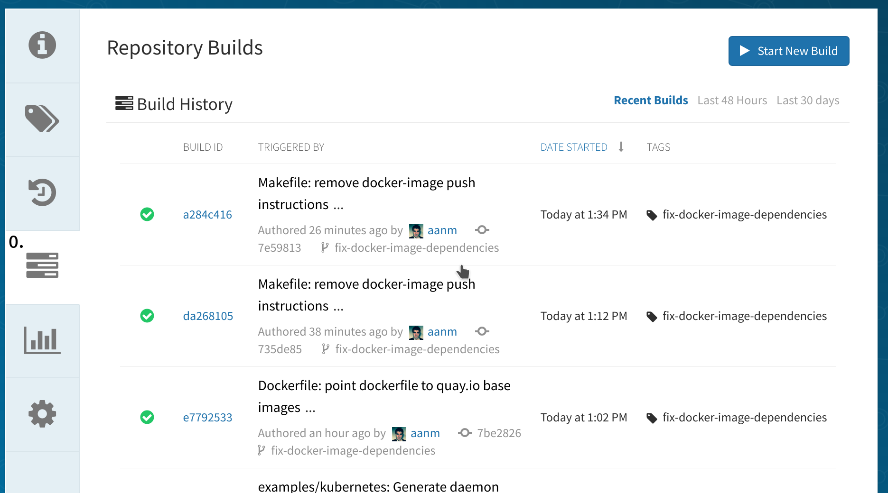

1. Click on the wheel.
2. Enable the trigger for that build trigger.

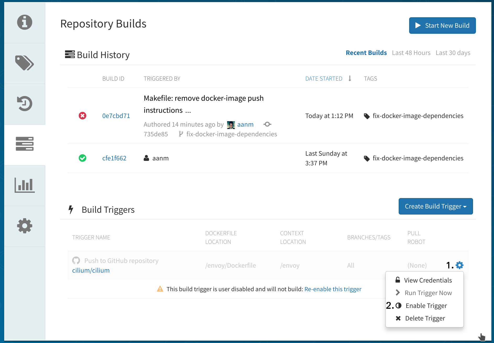

3. Confirm that you want to enable the trigger.

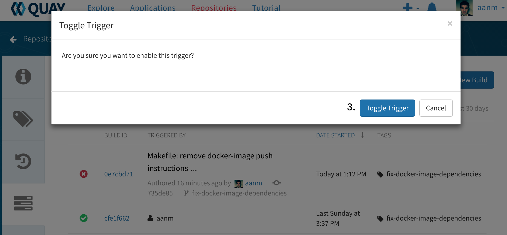

4. After enabling the trigger, click again on the wheel.
5. And click on "Run Trigger Now".

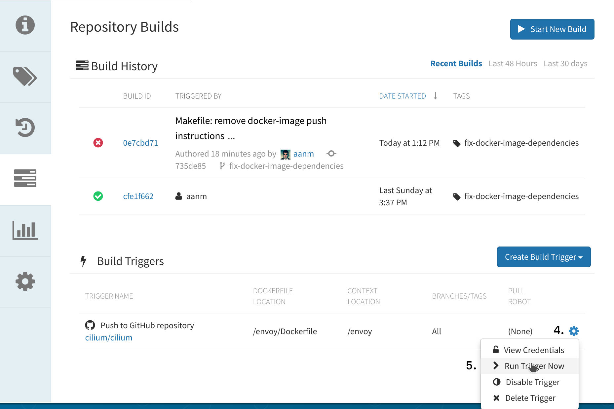

6. A new pop-up will appear to select your desired branch.
7. If you're interested in simply bumping the image to have the latest
   packages, then select the release branch (i.e. v1.7, v1.8). If you already
   have a branch that contains changes, select the branch that contains the new
   changes.

.. image:: ../../images/cilium-quayio-tag-4.png
    :align: center

8. After selecting your branch click on "Start Build".

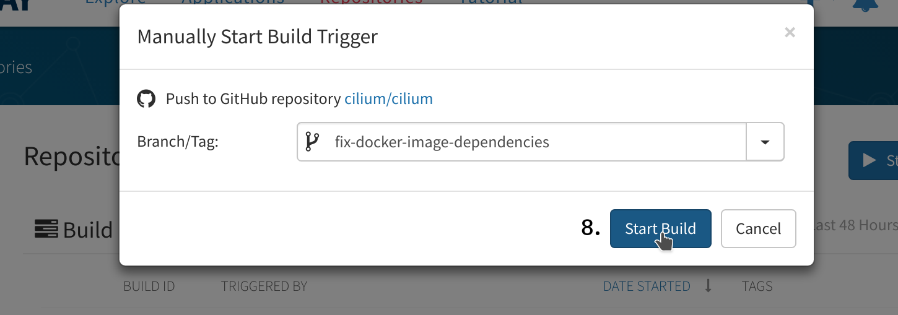

9. Once the build has started you can disable the Build trigger by clicking on
   the wheel.
10. And click on "Disable Trigger".

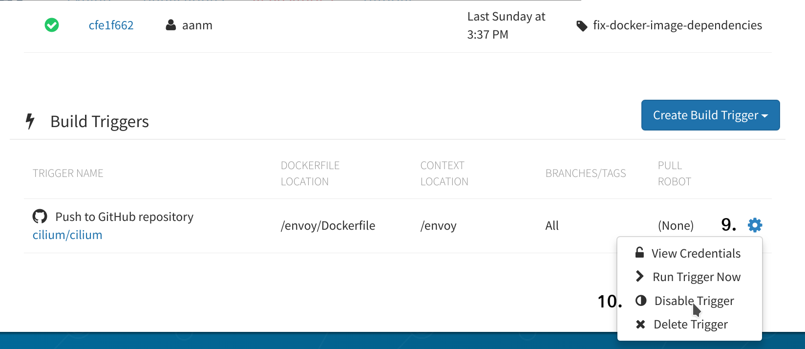

11. Confirm that you want to disable the build trigger.

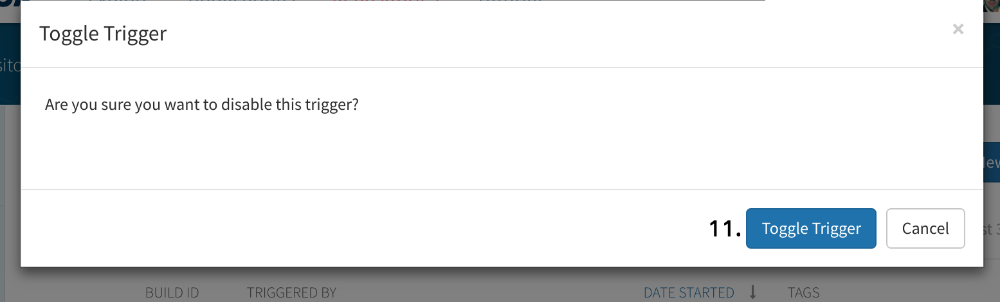

12. Once the build is finished click under Tags (on the left menu).
13. Click on the wheel and;
14. Add a new tag to the image that was built.

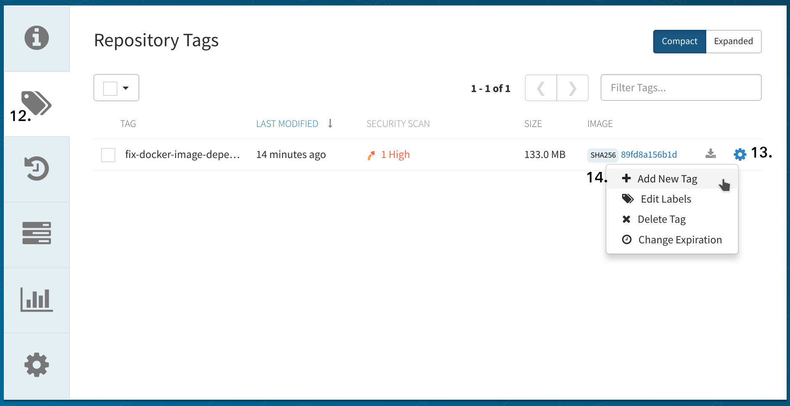

15. Write the name of the tag that you want to give for the newly built image.
16. Confirm the name is correct and click on "Create Tag".

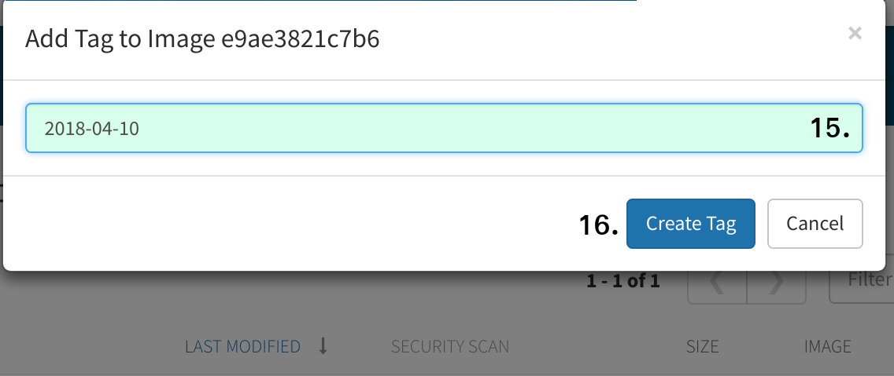

17. After the new tag was created you can delete the other tag, which is the
    name of your branch. Select the tag name.
18. Click in Actions.
19. Click in "Delete Tags".

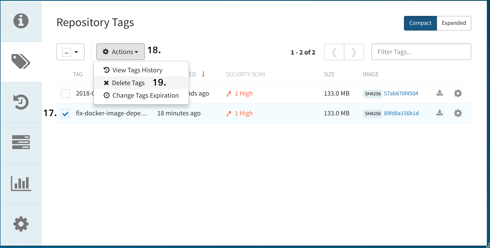

20. Confirm that you want to delete tag with your branch name.

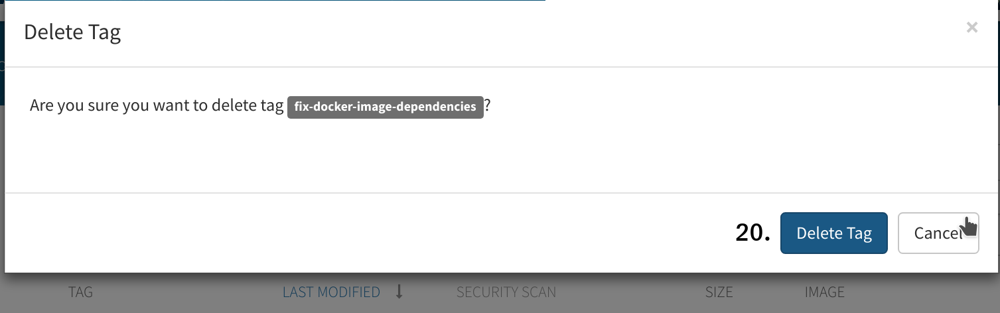

You have created a new image build with a new tag. The next steps should be to
update the repository root's Dockerfile so that it points to the new
``cilium-builder`` or ``cilium-runtime`` image recently created.

21. Update the versions of the images that are pulled into the CI VMs.

* Open a PR against the :ref:`packer_ci` with an update to said image versions. Once your PR is merged, a new version of the VM will be ready for consumption in the CI.
* Update the ``SERVER_VERSION``  field in ``test/Vagrantfile`` to contain the new version, which is the build number from the `Jenkins Job for the VMs <https://jenkins.cilium.io/job/Vagrant-Master-Boxes-Packer-Build/>`_. For example, build 119 from the pipeline would be the value to set for ``SERVER_VERSION``.
* Open a pull request with this version change in the cilium repository.

Nightly Docker image
~~~~~~~~~~~~~~~~~~~~

After each successful Nightly build, a `cilium/nightly`_ image is pushed to dockerhub.

To use latest nightly build, please use ``cilium/nightly:latest`` tag.
Nightly images are stored on dockerhub tagged with following format: ``YYYYMMDD-<job number>``.
Job number is added to tag for the unlikely event of two consecutive nightly builds being built on the same date.

.. _cilium/nightly: https://hub.docker.com/r/cilium/nightly/
