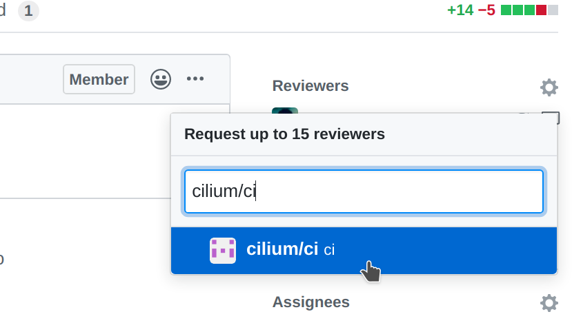

.. only:: not (epub or latex or html)

    WARNING: You are looking at unreleased Cilium documentation.
    Please use the official rendered version released here:
    https://docs.cilium.io

.. _review_process:

Pull requests review process for committers
===========================================

Review process
--------------

.. note::

   These instructions assume that reviewers are members of the Cilium GitHub
   organization. This is required to obtain the privileges to modify GitHub
   labels on the pull request. See `Cilium's Contributor Ladder`_ for details.

.. _Cilium's Contributor Ladder: https://github.com/cilium/community/blob/main/CONTRIBUTOR-LADDER.md

#. Find Pull Requests (PRs) needing a review `from you <user_review_filter_>`_,
   or `from one of your teams <team_review_filter_>`_.

#. If this PR was opened by a contributor who is not part of the Cilium
   organization, please assign yourself to that PR and keep track of the PR to
   ensure it gets reviewed and merged.

   If the contributor is a Cilium committer, then they are responsible for
   getting the PR ready to be merged by addressing review comments and
   resolving all CI checks for "Required" workflows.

   If this PR is a backport PR (typically with the label ``kind/backport``) and
   no-one else has reviewed the PR, review the changes as a sanity check. If
   any individual commits deviate from the original patch, request review from
   the original author to validate that the backport was correctly applied.

#. Review overall correctness of the PR according to the rules specified in the
   section :ref:`submit_pr`.

#. Set the labels accordingly. A bot called maintainer's little helper might
   automatically help you with this.

   +--------------------------------+---------------------------------------------------------------------------+
   | Labels                         | When to set                                                               |
   +================================+===========================================================================+
   | ``dont-merge/needs-sign-off``  | Some commits are not signed off                                           |
   +--------------------------------+---------------------------------------------------------------------------+
   | ``needs-rebase``               | PR is outdated and needs to be rebased                                    |
   +--------------------------------+---------------------------------------------------------------------------+

#. Validate that bugfixes are marked with ``kind/bug`` and validate whether the
   assessment of backport requirements as requested by the submitter conforms
   to the :ref:`backport_criteria`.

   +--------------------------+---------------------------------------------------------------------------+
   | Labels                   | When to set                                                               |
   +==========================+===========================================================================+
   | ``needs-backport/X.Y``   | PR needs to be backported to these stable releases                        |
   +--------------------------+---------------------------------------------------------------------------+

#. If the PR is subject to backport, validate that the PR does not mix bugfix
   and refactoring of code as it will heavily complicate the backport process.
   Demand for the PR to be split.

#. Validate the ``release-note/*`` label and check the release note
   suitability. Release notes are passed through the dedicated ``release-note``
   block (see :ref:`submit_pr`), or through the PR title if this block is
   missing. To check if the notes are suitable, put yourself into the
   perspective of a future release notes reader with lack of context and ensure
   the title is precise but brief.

   +-----------------------------------+--------------------------------------------------------------------------------------------------------+
   | Labels                            | When to set                                                                                            |
   +===================================+========================================================================================================+
   | ``dont-merge/needs-release-note`` | Do NOT merge PR, needs a release note                                                                  |
   +-----------------------------------+--------------------------------------------------------------------------------------------------------+
   | ``release-note/bug``              | This is a non-trivial bugfix and is a user-facing bug                                                  |
   +-----------------------------------+--------------------------------------------------------------------------------------------------------+
   | ``release-note/major``            | This is a major feature addition, e.g. Add MongoDB support                                             |
   +-----------------------------------+--------------------------------------------------------------------------------------------------------+
   | ``release-note/minor``            | This is a minor feature addition, e.g. Add support for a Kubernetes version                            |
   +-----------------------------------+--------------------------------------------------------------------------------------------------------+
   | ``release-note/misc``             | This is a not user-facing change , e.g. Refactor endpoint package, a bug fix of a non-released feature |
   +-----------------------------------+--------------------------------------------------------------------------------------------------------+
   | ``release-note/ci``               | This is a CI feature or bug fix.                                                                       |
   +-----------------------------------+--------------------------------------------------------------------------------------------------------+

#. Check for upgrade compatibility impact and if in doubt, set the label
   ``upgrade-impact`` and discuss in `Cilium Slack`_'s ``#development`` channel
   or in the weekly meeting.

   +--------------------------+---------------------------------------------------------------------------+
   | Labels                   | When to set                                                               |
   +==========================+===========================================================================+
   | ``upgrade-impact``       | The code changes have a potential upgrade impact                          |
   +--------------------------+---------------------------------------------------------------------------+

#. When submitting a review, provide explicit approval or request specific
   changes whenever possible. Clear feedback indicates whether contributors
   must take action before a PR can merge.

   If you need more information before you can approve or request changes, you
   can leave comments seeking clarity. If you do not explicitly approve or
   request changes, it's best practice to raise awareness about the discussion
   so that others can participate. Here are some ways you can raise awareness:

   - Re-request review from codeowners in the PR
   - Raise the topic for discussion in Slack or during community meetings

   When requesting changes, summarize your feedback for the PR, including
   overall issues for a contributor to consider and/or encouragement for what a
   contributor is already doing well.

#. When all review objectives for all ``CODEOWNERS`` are met, all CI tests have
   passed, and all reviewers have approved the requested changes, you can merge
   the PR by clicking on the "Rebase and merge" button.

Reviewer Teams
--------------

Every reviewer, including committers in the `committers team`_, belongs to `one
or more teams in the Cilium organization <cilium_teams_>`_. If you would like
to add or remove yourself from any team, please submit a PR against the
`community repository`_.

Once a contributor opens a PR, GitHub automatically picks which `teams
<cilium_teams_>`_ should review the PR using the ``CODEOWNERS`` file. Each
reviewer can see the PRs they need to review by filtering by reviews
requested. A good filter is provided in this `link <user_review_filter_>`_ so
make sure to bookmark it.

Reviewers are expected to focus their review on the areas of the code where
GitHub requested their review. For small PRs, it may make sense to simply
review the entire PR. However, if the PR is quite large then it can help to
narrow the area of focus to one particular aspect of the code. When leaving a
review, share which areas you focused on and which areas you think that other
reviewers should look into. This helps others to focus on aspects of review
that have not been covered as deeply.

Belonging to a team does not mean that a reviewer needs to know every single
line of code the team is maintaining. Once you have reviewed a PR, if you feel
that another pair of eyes is needed, re-request a review from the appropriate
team. In the following example, the reviewer belonging to the CI team is
re-requesting a review for other team members to review the PR. This allows
other team members belonging to the CI team to see the PR as part of the PRs
that require review in the `filter <team_review_filter_>`_.

When all review objectives for all ``CODEOWNERS`` are met, all required CI
tests have passed and a proper release label is set, a PR may be merged by any
committer with access rights to click the green merge button.
Maintainer's little helper may set the ``ready-to-merge`` label automatically
to recognize the state of the PR. Periodically, a rotating assigned committer
will review the list of PRs that are marked ``ready-to-merge``.

.. _committers team: https://github.com/orgs/cilium/teams/committers/members
.. _community repository: https://github.com/cilium/community
.. _cilium_teams: https://github.com/orgs/cilium/teams/team/teams
.. _maintainers: https://github.com/orgs/cilium/teams/cilium-maintainers/members
.. _user_review_filter: https://github.com/cilium/cilium/pulls?q=is%3Apr+is%3Aopen+draft%3Afalse+user-review-requested%3A%40me+sort%3Aupdated-asc
.. _team_review_filter: https://github.com/cilium/cilium/pulls?q=is%3Apr+is%3Aopen+draft%3Afalse+review-requested%3A%40me+sort%3Aupdated-asc

Code owners
-----------

.. include:: ../../../codeowners.rst
