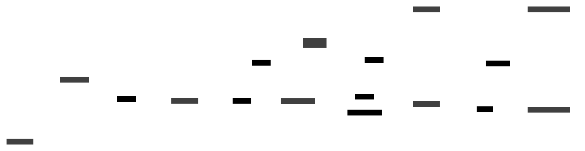

.. only:: not (epub or latex or html)

    WARNING: You are looking at unreleased Cilium documentation.
    Please use the official rendered version released here:
    https://docs.cilium.io

.. _statedb:

StateDB in Cilium
=================

.. warning::

   StateDB and the reconciler are still under active development and the APIs & metrics documented
   here are not guaranteed to be stable yet.

Introduction
~~~~~~~~~~~~

`StateDB <https://github.com/cilium/statedb>`__ is an in-memory database developed
for the Cilium project to manage control-plane state. It aims to simplify access
and indexing of state and to increase resilience, modularity and testability by separating the
control-plane state from the controllers that operates on it. 

This document focuses on how StateDB is leveraged by Cilium and how to develop new
features using it. For a detailed guide on StateDB API itself see the 
`StateDB documentation <https://github.com/cilium/statedb/blob/main/README.md>`__.

We assume familiarity with the Hive framework. If you're not familiar with it,
consider reading through :ref:`guide-to-the-hive` first.

Motivation
~~~~~~~~~~

StateDB is a project born from lessons learned from development and production struggles. It aims to be
a tool to systematically improve the resilience, testability and inspectability of the Cilium agent.

For developers it aims to offer simpler and safer ways to extend the agent by giving a unified
API (``Table[Obj]``) for accessing shared state. The immutable data structures backing StateDB allow for 
lockless readers which improves resiliency compared to the RWMutex+hashmap+callback pattern 
where a bug in a controller observing the state may cause critical functions to either stop or significantly
decrease throughput. Additionally having flexible ways to access and index the state allows for opportunities to deduplicate
the state. Many components of the agent have historically functioned through callback-based subscriptions to
and maintained their own copies of state which has a significant impact on memory usage and GC overhead.

Unifying state storage behind a database-like abstraction allows building reusable utilities for
inspecting the state (``cilium-dbg shell -- db``), reconciling state (StateDB reconciler) and observing
operations on state (StateDB metrics). At scale this leads to an architecture that is easier to 
understand (smaller API surface), operate (state can be inspected) and extend (easy to access data).

The separation of state from logic operating on it (e.g. moving away from kitchen-sink "Manager" pattern)
also opens up the ability to do wider and more meaningful integration testing on components of the agent. 
When most of the inputs and outputs of a component are tables, we can combine multiple components into an
integration test that is solely defined in terms of test inputs and expected outputs. This allows more validation
to be performed with fairly simple integration tests rather than with slower and costly end-to-end tests.

Architecture vision
~~~~~~~~~~~~~~~~~~~

The agent in this architectural style can be broadly considered to consist of:

- *User intent tables*: objects from external data sources that tell the agent what it should do. These would be for example the Kubernetes core objects like Pods or the Cilium specific CRDs such as CiliumNetworkPolicy, or data ingested from other sources such as kvstore.

- *Controllers*: control-loops that observe the user intent tables and compute the
  contents of the desired state tables.

- *Desired state tables*: the internal state that the controllers produce to succinctly describe what should be done. For example a desired state table could describe what the contents of a BPF map should be or what routes should be installed.

- *Reconcilers*: control-loops that observe the desired state
  tables and reconcile them against a target such as a BPF map or the Linux routing
  table. The reconciler is usually an instance of the StateDB reconciler which is
  defined in terms of a table of objects with a status field and the operations
  *Update*, *Delete* and *Prune*.

Dividing the agent this way we achieve a nice separation of concerns:

* Separating the user intent into its own tables keeps the parsing and validation from the computation we'll perform on the data. It also makes it nicer to reuse as it's purely about representing the outside intent internally in an efficient way without tying it too much into implementation details of a specific feature.

* By defining the controller as essentially the function from input tables to output tables it becomes easy to understand and test.

* Separating the reconciliation from the desired state computation the complex logic of dealing with low-level errors and retrying is separate from the pure "business logic" computation.

* Using the generic reconcilers allows using tried-and-tested and instrumented retry implementation.

* The control-plane of the agent is essentially everything outside the reconcilers This allows us to integration test, simulate or benchmark the control-plane code without unreasonable amount of scaffolding. The easier it is to write reliable integration tests the more resilient the codebase becomes.

What we're trying to achieve is well summarized by Fred Brooks in "The Mythical Man Month":

    | Show me your flowchart and conceal your tables, and I shall continue to be mystified.
    | Show me your tables, and I won't usually need your flowchart; it'll be obvious.

Defining tables
~~~~~~~~~~~~~~~

`StateDB documentation <https://github.com/cilium/statedb/blob/main/README.md>`__ gives a good introduction into how to create a table and its indexes, so we won't repeat that here, but instead focus on Cilium specific details.

Let's start off with some guidelines that you might want to consider:

* By default publicly provide ``Table[Obj]`` so new features can build on it and it can be used in tests. Also export the table's indexes or the query functions (``var ByName = nameIndex.Query``).

* Do not export ``RWTable[Obj]`` if outside modules do not need to directly write into the table. If other modules do write into the table, consider defining "writer functions" that validate that the writes are well-formed.

* If the table is closely associated with a specific feature, define it alongside the implementation of the feature. If the table is shared by many modules, consider defining it in ``daemon/k8s`` or ``pkg/datapath/tables`` so it is easy to discover.

* Make sure the object can be JSON marshalled so it can be inspected. If you need to store non-marshallable data (e.g. functions), make them private or mark them with ``json:"-"`` struct tag.

* If the object contains a map or set and it is often mutated, consider using the immutable ``part.Map`` or ``part.Set`` from ``cilium/statedb``. Since these are immutable they don't need to be deep-copied when modifying the object and there's no risk of accidentally mutating them in-place.

* When designing a table consider how it can be used in tests outside your module. It's a good idea to export your table constructor (New*Table) so it can be used by itself in an integration test of a module that depends on it.

* Take into account the fact that objects be immutable by designing them to be cheap to shallow-clone. For example this could mean splitting off fields that are constant from creation into their own struct that's referenced from the object.

* Write benchmarks for your table to understand the cost of the indexing and storage use. See ``benchmarks_test.go`` in ``cilium/statedb`` for examples.

* If the object is small (<100 bytes) prefer storing it by value instead of by reference, e.g. ``Table[MyObject]`` instead of ``Table[*MyObject]``. This reduces memory fragmentation and makes it safer to use since the fields can't be accidentally mutated (anything inside that's by reference of course can be mutated accidentally). Note though that each index will store a separate copy of the object. Measure if needed.

With that out of the way, let's get concrete with a code example of a simple
table and a controller that populates it:

.. literalinclude:: ../../../contrib/examples/statedb/example.go
   :language: go

To understand how the table defined by our example module can be consumed, we can
construct a small mini-application:

.. literalinclude:: ../../../contrib/examples/statedb/main.go
   :language: go

You can find and run the above examples in ``contrib/examples/statedb``:

.. code-block:: shell-session

  $ cd contrib/examples/statedb && go run .

Pitfalls
^^^^^^^^

Here are some common mistakes to be aware of:

* Object is mutated after insertion to database. Since StateDB queries do not return copies, all readers will see the modifications.

* Object (stored by reference, e.g. ``*T``) returned from a query is mutated and then inserted. StateDB will catch this and panic. Objects stored by reference must be (shallow) cloned before mutating.

* Query is made with ReadTxn and results are used in a WriteTxn. The results may have changed between the ReadTxn and WriteTxn! If you want optimistic concurrency control, then use CompareAndSwap in the write transaction.

Inspecting with cilium-dbg 
^^^^^^^^^^^^^^^^^^^^^^^^^^

StateDB comes with script commands to inspect the tables. These can be invoked via
``cilium-dbg shell``.

The ``db`` command lists all registered tables:

.. code-block:: shell-session

    root@kind-worker:/home/cilium# cilium-dbg shell -- db
    Name               Object count   Deleted objects   Indexes               Initializers   Go type                       Last WriteTxn
    health             61             0                 identifier, level     []             types.Status                  health (107.3us ago, locked for 43.7us)
    sysctl             20             0                 name, status          []             *tables.Sysctl                sysctl (9.4m ago, locked for 12.8us)
    mtu                2              0                 cidr                  []             mtu.RouteMTU                  mtu (19.4m ago, locked for 5.4us)
    ...

The ``show`` command prints out the table using the *TableRow* and *TableHeader* methods:

.. code-block:: shell-session

    root@kind-worker:/home/cilium# cilium-dbg shell -- db/show mtu
    Prefix      DeviceMTU   RouteMTU   RoutePostEncryptMTU
    ::/0        1500        1450       1450
    0.0.0.0/0   1500        1450       1450

The ``db/get``, ``db/prefix``, ``db/list`` and ``db/lowerbound`` allow querying a table, provided that the ``Index.FromString`` method has
been defined:

.. code-block:: shell-session

    root@kind-worker:/home/cilium# cilium-dbg shell -- db prefix --index=name devices cilium
    Name           Index   Selected   Type    MTU    HWAddr              Flags                    Addresses
    cilium_host    3       false      veth    1500   c2:f6:99:50:af:71   up|broadcast|multicast   10.244.1.105, fe80::c0f6:99ff:fe50:af71
    cilium_net     2       false      veth    1500   5e:70:20:4d:8a:bc   up|broadcast|multicast   fe80::5c70:20ff:fe4d:8abc
    cilium_vxlan   4       false      vxlan   1500   b2:c6:10:14:48:47   up|broadcast|multicast   fe80::b0c6:10ff:fe14:4847

The shell session can also be run interactively:

.. code-block:: shell-session

    # cilium-dbg shell
        /¯¯\
     /¯¯\__/¯¯\
     \__/¯¯\__/  Cilium 1.17.0-dev a5b41b93507e 2024-08-08T13:18:08+02:00 go version go1.23.1 linux/amd64
     /¯¯\__/¯¯\  Welcome to the Cilium Shell! Type 'help' for list of commands.
     \__/¯¯\__/
        \__/

    cilium> help db
    db
        Describe StateDB configuration

        The 'db' command describes the StateDB configuration,
        showing
        ...

    cilium> db
    Name                   Object count   Zombie objects   Indexes                 Initializers   Go type                            Last WriteTxn
    health                 65             0                identifier, level       []             types.Status                       health (993.6ms ago, locked for 25.7us)
    sysctl                 20             0                name, status            []             *tables.Sysctl                     sysctl (5.3s ago, locked for 8.6us)
    mtu                    2              0                cidr                    []             mtu.RouteMTU                       mtu (4.4s ago, locked for 3.1us)
    ...

    cilium> db/show mtu
    Prefix      DeviceMTU   RouteMTU   RoutePostEncryptMTU
    ::/0        1500        1450       1450
    0.0.0.0/0   1500        1450       1450

    cilium> db/show --out=/tmp/devices.json --format=json devices
    ...

Kubernetes reflection
^^^^^^^^^^^^^^^^^^^^^

To reflect Kubernetes objects from the API server into a table, the reflector
utility in ``pkg/k8s`` can be used to automate this. For example, we can define
a table of pods and reflect them from Kubernetes into the table:

.. literalinclude:: ../../../contrib/examples/statedb_k8s/pods.go
   :language: go
   :caption: contrib/examples/statedb_k8s/pods.go
   :tab-width: 4

As earlier, we can then construct a small application to try this out:

.. literalinclude:: ../../../contrib/examples/statedb_k8s/main.go
   :language: go
   :caption: contrib/examples/statedb_k8s/main.go
   :tab-width: 4

You can run the example in ``contrib/examples/statedb_k8s`` to watch the pods in
your current cluster:

.. code-block:: shell-session

    $ cd contrib/examples/statedb_k8s && go run . --k8s-kubeconfig-path ~/.kube/config
    level=info msg=Starting
    time="2024-09-05T11:22:15+02:00" level=info msg="Establishing connection to apiserver" host="https://127.0.0.1:44261" subsys=k8s-client
    time="2024-09-05T11:22:15+02:00" level=info msg="Connected to apiserver" subsys=k8s-client
    level=info msg=Started duration=9.675917ms
    Pod(default/nginx): Running (revision: 1, deleted: false)
    Pod(kube-system/cilium-envoy-8xwp7): Running (revision: 2, deleted: false)
    ...

Reconcilers
~~~~~~~~~~~

The StateDB reconciler can be used to reconcile changes on table against a
target system.

To set up the reconciler you will need the following.

Add ``reconciler.Status`` as a field into your object (there can be multiple):

.. code-block:: go

  type MyObject struct {
    ID uint64
    // ...
    Status reconciler.Status
  }

Implement the reconciliation operations (``reconciler.Operations``):

.. code-block:: go

  type myObjectOps struct { ... }

  var _ reconciler.Operations[*MyObject] = &myObjectOps{}

  // Update reconciles the changed [obj] with the target.
  func (ops *myObjectOps) Update(ctx context.Context, txn statedb.ReadTxn, obj *MyObject) error {
    // Synchronize the target state with [obj]. [obj] is a clone and can be updated from here.
    // [txn] can be used to access other tables, but note that Update() is only called when [obj] is
    // marked pending.
    ...
    // Return nil or an error. If not nil, the operation will be repeated with exponential backoff.
    // If object changes the retrying will reset and Update() is called with latest object.
    return err
  }

  // Delete removes the [obj] from the target.
  func (ops *myObjectOps) Delete(ctx context.Context, txn statedb.ReadTxn, obj *MyObject) error { 
    ...
    // If error is not nil the delete is retried until it succeeds or an object is recreated
    // with the same primary key.
    return err
  }

  // Prune removes any stale/unexpected state in the target. 
  func (ops *myObjectOps) Prune(ctx context.Context, txn statedb.ReadTxn, objs iter.Seq2[*MyObject, statedb.Revision]) error {
    // Compute the difference between [objs] and the target and remove anything unexpected in the target.
    ...
    // If the returned error is not nil error is logged and metrics incremented. Failed pruning is currently not retried,
    // but called periodically according to config.
    return err
  }

Register the reconciler:

.. code-block:: go

  func registerReconciler(
    params reconciler.Params,
    ops reconciler.Operations[*MyObject],
    tbl statedb.RWTable[*MyObject],
  ) error {
    // Reconciler[..] is an API the reconciler provides. Often not needed.
    // Currently only contains the Prune() method to trigger immediate pruning.
    var r reconciler.Reconciler[*MyObject]
    r, err := RegisterReconciler(
      params,
      tbl,
      (*MyObject).Clone,
      (*MyObject).SetStatus,
      (*MyObject).GetStatus,
      ops,
      nil, /* optional batch operations */
    )
    return err
  }

  var Cell = cell.Module(
    "example",
    "Example module",
    ...,
    cell.Invoke(registerReconciler),
  )

Insert objects with the ``Status`` set to pending:

.. code-block:: go

  var myObjects statedb.RWTable[*MyObject] 

  wtxn := db.WriteTxn(myObjects)
  myObjects.Insert(wtxn, &MyObject{ID: 123, Status: reconciler.StatusPending()})
  wtxn.Commit()

The reconciler watches the tables (using ``Changes()``) and calls ``Update`` for each
changed object that is ``Pending`` or ``Delete`` for each deleted object. On errors the object
will be retried (with configurable backoff) until the operation succeeds.

See the full runnable example in the 
`StateDB repository <https://github.com/cilium/statedb/tree/main/reconciler/example>`__.

The reconciler runs a background job which reports the health status of the reconciler.
The status is degraded if any objects failed to be reconciled and queued for retries.
Health can be inspected either with ``cilium-dbg status --all-health`` or ``cilium-dbg statedb health``.

BPF maps
^^^^^^^^

BPF maps can be reconciled with the operations returned by ``bpf.NewMapOps``.
The target object needs to implement the ``BinaryKey`` and ``BinaryValue`` to
construct the BPF key and value respectively. These can either construct the binary
value on the fly, or reference a struct defining the value. The example below uses
a struct as this is the prevalent style in Cilium.

.. code-block:: go

  // MyKey defines the raw BPF key
  type MyKey struct { ... }
  // MyValue defines the raw BPF key
  type MyValue struct { ... }

  type MyObject struct {
    Key MyKey
    Value MyValue
    Status reconciler.Status
  }

  func (m *MyObject) BinaryKey() encoding.BinaryMarshaler {
    return bpf.StructBinaryMarshaler{&m.Key}
  }
  func (m *MyObject) BinaryValue() encoding.BinaryMarshaler {
    return bpf.StructBinaryMarshaler{&m.Value}
  }

  func registerReconciler(params reconciler.Params, objs statedb.RWTable[*MyObject], m *bpf.Map) error {  
    ops := bpf.NewMapOps[*MyObject](m)
    _, err := reconciler.Register(
      params,
      objs,
      func(obj *MyObject) *MyObject { return obj },
      func(obj *MyObject, s reconciler.Status) *MyObject {
        obj.Status = obj
        return obj
      },
      func(obj *MyObject) reconciler.Status {
        return e.Status
      },
      ops,
      nil,
    )
    return err
  }

For a real-world example see ``pkg/maps/bwmap/cell.go``.

Script commands
~~~~~~~~~~~~~~~

StateDB comes with a rich set of script commands for inspecting and manipulating tables:

.. code-block:: shell-session
  :caption: example.txtar

  # Show the registered tables
  db

  # Insert an object
  db/insert my-table example.yaml

  # Compare the contents of 'my-table' with a file. Retries until matches.
  db/cmp my-table expected.table

  # Show the contents of the table
  db/show

  # Write the object to a file
  db/get my-table 'Foo' --format=yaml --out=foo.yaml

  # Delete the object and assert that table is empty.
  db/delete my-table example.yaml
  db/empty my-table

  -- expected.table --
  Name  Color
  Foo   Red

  -- example.yaml --
  name: Foo
  color: Red

See ``help db`` for full reference in ``cilium-dbg shell`` or in the ``break`` prompt in tests.
A good reference is also the existing tests. These can be found with ``git grep db/insert``.

Metrics
~~~~~~~

Metrics are available for both StateDB and the reconciler, but they are disabled
by default due to their fine granularity. These are defined in ``pkg/hive/statedb_metrics.go``
and ``pkg/hive/reconciler_metrics.go``. As this documentation is manually maintained it may
be out-of-date so if things are not working, check the source code.

The metrics can be enabled by adding them to the helm ``prometheus.metrics`` option with
the syntax ``+cilium_<name>``, where ``<name>`` is the name of the metric in the table below.
For example, here is how to turn on all the metrics:

.. code-block:: yaml

  prometheus:
    enabled: true
    metrics:
    - +cilium_statedb_write_txn_duration_seconds
    - +cilium_statedb_write_txn_acquisition_seconds
    - +cilium_statedb_table_contention_seconds
    - +cilium_statedb_table_objects
    - +cilium_statedb_table_revision
    - +cilium_statedb_table_delete_trackers
    - +cilium_statedb_table_graveyard_objects
    - +cilium_statedb_table_graveyard_low_watermark
    - +cilium_statedb_table_graveyard_cleaning_duration_seconds
    - +cilium_reconciler_count
    - +cilium_reconciler_duration_seconds
    - +cilium_reconciler_errors_total
    - +cilium_reconciler_errors_current
    - +cilium_reconciler_prune_count
    - +cilium_reconciler_prune_errors_total
    - +cilium_reconciler_prune_duration_seconds

These are still under development and the metric names may change.

The metrics can be inspected even when disabled with the ``metrics`` and ``metrics/plot``
script commands as Cilium keeps samples of all metrics for the past 2 hours.
These metrics are also available in sysdump in HTML form (look for ``cilium-dbg-shell----metrics-html.html``).

.. code-block:: shell-session

    # kubectl exec -it -n kube-system ds/cilium -- cilium-dbg shell
        /¯¯\
     /¯¯\__/¯¯\
     \__/¯¯\__/  Cilium 1.17.0-dev a5b41b93507e 2024-08-08T13:18:08+02:00 go version go1.23.1 linux/amd64
     /¯¯\__/¯¯\  Welcome to the Cilium Shell! Type 'help' for list of commands.
     \__/¯¯\__/
        \__/

    # Dump the sampled StateDB metrics from the last 2 hours
    cilium> metrics --sampled statedb
    Metric                                      Labels                                   5min                    30min          60min          120min
    cilium_statedb_table_contention_seconds     handle=devices-controller table=devices  0s / 0s / 0s            0s / 0s / 0s   0s / 0s / 0s   0s / 0s / 0s
    ...

    # Plot the rate of change in the "health" table
    # (indicative of number of object writes per second)
    cilium> metrics/plot --rate statedb_table_revision.*health
                      cilium_statedb_table_revision (rate per second)
                                     [ table=health ]
          ╭────────────────────────────────────────────────────────────────────╮
      2.4 ┤    ....              ...               ...               .         │
          │   .    .            .   .             .   .             . ..       │
          │  .      ............     .............     .............    .......│
      1.2 ┤  .                                                                 │
          │ .                                                                  │
          │ .                                                                  │
      0.0 ┤.                                                                   │
          ╰───┬───────────────────────────────┬──────────────────────────────┬─╯
           -120min                         -60min                           now

    # Plot the write transaction duration for the "devices" table
    # (indicative of how long the table is locked during writes)
    cilium> metrics/plot statedb_write_txn_duration.*devices
    ... omitted p50 and p90 plots ...

                      cilium_statedb_write_txn_duration_seconds (p99)
                               [ handle=devices-controller ]
          ╭────────────────────────────────────────────────────────────────────╮
   47.2ms ┤                                   .                                │
          │                                   .                                │
          │                                  . .                               │
   23.9ms ┤                                  .  .                              │
          │                                 .   .                              │
          │                 ..              .    .                   ...       │
    0.5ms ┤.................................     ..............................│
          ╰───┬───────────────────────────────┬──────────────────────────────┬─╯
           -120min                         -60min                           now

    # Plot the reconcilation errors for sysctl
    cilium> metrics/plot reconciler_errors_current.*sysctl
                             cilium_reconciler_errors_current
                            [ module_id=agent.datapath.sysctl ]
          ╭────────────────────────────────────────────────────────────────────╮
      0.0 ┤                                                                    │
          │                                                                    │
          │                                                                    │
      0.0 ┤                                                                    │
          │                                                                    │
          │                                                                    │
      0.0 ┤....................................................................│
          ╰───┬───────────────────────────────┬──────────────────────────────┬─╯
           -120min                         -60min                           now

StateDB
^^^^^^^

========================================================= ======================== =============================================
Name                                                      Labels                   Description
========================================================= ======================== =============================================
``statedb_write_txn_duration_seconds``                    ``tables``, ``handle``   Duration of the write transaction
``statedb_write_txn_acquisition_seconds``                 ``tables``, ``handle``   How long it took to lock target tables
``statedb_table_contention_seconds``                      ``table``                How long it took to lock a table for writing
``statedb_table_objects``                                 ``table``                Number of objects in a table
``statedb_table_revision``                                ``table``                The current revision
``statedb_table_delete_trackers``                         ``table``                Number of delete trackers (e.g. Changes())
``statedb_table_graveyard_objects``                       ``table``                Number of deleted objects in graveyard
``statedb_table_graveyard_low_watermark``                 ``table``                Low watermark revision for deleting objects
``statedb_table_graveyard_cleaning_duration_seconds``     ``table``                How long it took to GC the graveyard
========================================================= ======================== =============================================

The label ``handle`` is the database handle name (created with ``(*DB).NewHandle``). The default handle
is named ``DB``. The label ``table`` and ``tables`` (formatted as ``tableA+tableB``) are the StateDB tables
which the metric concerns.

Reconciler
^^^^^^^^^^

========================================================= ======================== =================================
Name                                                      Labels                   Description
``reconciler_count``                                      ``module_id``            Number of reconcilation rounds performed
``reconciler_duration_seconds``                           ``module_id``, ``op``    Histogram of operation durations
``reconciler_errors_total``                               ``module_id``            Total number of errors (update/delete)
``reconciler_errors_current``                             ``module_id``            Current errors
``reconciler_prune_count``                                ``module_id``            Number of pruning rounds
``reconciler_prune_errors_total``                         ``module_id``            Total number of errors during pruning    
``reconciler_prune_duration_seconds``                     ``module_id``            Histogram of operation durations
========================================================= ======================== =================================

The label ``module_id`` is the identifier for the Hive module under which the reconciler
was registered. ``op`` is the operation performed, either ``update`` or ``delete``.
