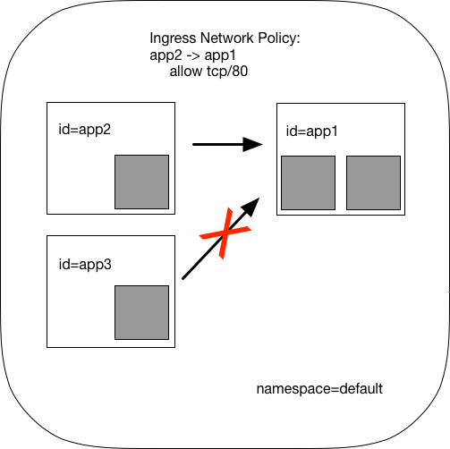

.. _gs_guide:

###############
Getting Started
###############

This document serves as the easiest introduction to using Cilium.
It is a detailed walk through of getting a single-node Cilium environment running on
your machine. It is designed to take 15-30 minutes.

If you haven't read the :ref:`intro` yet, we'd encourage you to do that first.

This document includes three different guides:
 * `Getting Started Using Kubernetes`_ (Estimated time 10-15 minutes)
 * `Getting Started Using Docker`_
 * `Getting Started Using Mesos`_

The guides follow the same basic flow.   The flow in the Kubernetes variant
is more realistic of a production deployment, but is also a bit more complex.

The best way to get help if you get stuck is to ask a question on the `Cilium
Slack channel <https://cilium.herokuapp.com>`_.  With Cilium contributors
across the globe, there is almost always someone available to help.

********************************
Getting Started Using Kubernetes
********************************

This guide uses `minikube <https://kubernetes.io/docs/getting-started-guides/minikube/>`_
to demonstrate deployment and operation of Cilium in a single-node Kubernetes cluster.
The minikube VM requires approximately 2 GB of RAM and supports hypervisors like VirtualBox
that run on Linux, macOS, and Windows.

If you instead want to understand the details of
deploying Cilium on a full fledged Kubernetes cluster, then go straight to
:ref:`admin_install_daemonset`.

Step 0: Install kubectl & minikube
==================================

Install ``kubectl`` version ``>= 1.6.3`` as described in the `Kubernetes Docs
<https://kubernetes.io/docs/tasks/tools/install-kubectl/>`_.

Install one of the `hypervisors supported by minikube <https://kubernetes.io/docs/tasks/tools/install-minikube/>`_.

Install ``minikube`` ``>= 0.22.3`` as described on `minikube's github page
<https://github.com/kubernetes/minikube/releases>`_.

Then, boot a minikube cluster with the Container Network Interface (CNI) network plugin enabled:

::

    $ minikube start --network-plugin=cni

After minikube has finished  setting up your new Kubernetes cluster, you can
check the status of the cluster by running ``kubectl get cs``:

::

    $ kubectl get cs
    NAME                 STATUS    MESSAGE              ERROR
    controller-manager   Healthy   ok
    scheduler            Healthy   ok
    etcd-0               Healthy   {"health": "true"}

If you see output similar to this, you are ready to proceed to installing Cilium.

Step 1: Installing Cilium
=========================

The next step is to install Cilium into your Kubernetes cluster.  Cilium installation
leverages the `Kubernetes Daemon Set <https://kubernetes.io/docs/concepts/workloads/controllers/daemonset/>`_
abstraction, which will deploy one Cilium pod per
cluster node.  This Cilium pod will run in the ``kube-system`` namespace along with
all other system relevant daemons and services.  The Cilium pod will run both the Cilium
agent and the Cilium CNI plugin.

To deploy Cilium, run:

.. parsed-literal::

    $ kubectl create -f \ |SCM_WEB|\/examples/kubernetes/cilium.yaml
    clusterrole "cilium" created
    serviceaccount "cilium" created
    clusterrolebinding "cilium" created
    configmap "cilium-config" created
    secret "cilium-etcd-secrets" created
    daemonset "cilium" created

Kubernetes is now deploying Cilium with its RBAC, ConfigMap and Daemon Set as a
pod on all cluster nodes. This operation is performed in the background.

Run the following command to check the progress of the deployment:

::

    $ kubectl get pods --namespace kube-system
    NAME                          READY     STATUS    RESTARTS   AGE
    cilium-wjb9t                  0/1       Running   0          1m
    kube-addon-manager-minikube   1/1       Running   0          1m
    kube-dns-910330662-hmw9k      3/3       Running   0          1m
    kubernetes-dashboard-nfg7m    1/1       Running   0          1m

Wait until the Cilium pod shows the ``STATUS`` as ``Running``, like above. In this tutorial, it's okay to 
move forward with the ``READY`` status as 0.

Step 2: Deploy the Demo Application
===================================

Now that we have Cilium deployed and ``kube-dns`` operating correctly we can
deploy our demo application.

In our simple example, there are three microservices applications: *app1*, *app2*, and *app3*.
*App1* runs an HTTP webservice on port 80, which is exposed as a Kubernetes Service that
load-balances requests to *app1* to be across two pod replicas.

*App2* and *app3* exist so that we can test different security policies for allowing applications
to access *app1*.

**Application Topology for Cilium and Kubernetes**

The file ``demo.yaml`` contains a Kubernetes Deployment for each of the three applications,
with each deployment identified using the Kubernetes labels id=app1, id=app2,
and id=app3.
It also include a app1-service, which load-balances traffic to all pods with label id=app1.

.. parsed-literal::

    $ kubectl create -f \ |SCM_WEB|\/examples/minikube/demo.yaml
    service "app1-service" created
    deployment "app1" created
    deployment "app2" created
    deployment "app3" created

Kubernetes will deploy the pods and service  in the background.  Running
``kubectl get svc,pods`` will inform you about the progress of the operation.
Each pod will go through several states until it reaches ``Running`` at which
point the pod is ready.

::

    $ kubectl get pods,svc
    NAME                       READY     STATUS              RESTARTS   AGE
    po/app1-3720119688-5lc9g   0/1       ContainerCreating   0          9s
    po/app1-3720119688-n3gfh   0/1       ContainerCreating   0          9s
    po/app2-1798985037-6q534   0/1       ContainerCreating   0          9s
    po/app3-2097142386-pq1ff   1/1       Running             0          9s

    NAME               CLUSTER-IP   EXTERNAL-IP   PORT(S)   AGE
    svc/app1-service   10.0.0.150   <none>        80/TCP    9s
    svc/kubernetes     10.0.0.1     <none>        443/TCP   13m

All of these pods will be represented in Cilium as `endpoints`. We can invoke the
``cilium`` tool inside the Cilium pod to list them:

::

    $ kubectl -n kube-system get pods -l k8s-app=cilium
    NAME           READY     STATUS    RESTARTS   AGE
    cilium-wjb9t   1/1       Running   0          17m

    $ kubectl -n kube-system exec cilium-wjb9t cilium endpoint list
    ENDPOINT   POLICY        IDENTITY   LABELS (source:key[=value])               IPv6                   IPv4            STATUS
               ENFORCEMENT
    3365       Disabled      256        k8s:id=app1                               f00d::a00:20f:0:d25    10.15.191.0     ready
                                        k8s:io.kubernetes.pod.namespace=default
    25917      Disabled      258        k8s:id=app3                               f00d::a00:20f:0:653d   10.15.100.129   ready
                                        k8s:io.kubernetes.pod.namespace=default
    42910      Disabled      256        k8s:id=app1                               f00d::a00:20f:0:a79e   10.15.236.254   ready
                                        k8s:io.kubernetes.pod.namespace=default
    50133      Disabled      257        k8s:id=app2                               f00d::a00:20f:0:c3d5   10.15.59.20     ready
                                        k8s:io.kubernetes.pod.namespace=default

Policy enforcement is still disabled on all of these pods because no network
policy has been imported yet which select any of the pods.

Step 3: Apply an L3/L4 Policy
=============================

When using Cilium, endpoint IP addresses are irrelevant when defining security
policies.  Instead, you can use the labels assigned to the VM to define
security policies, which are automatically applied to any container with that
label, no matter where or when it is run within a container cluster.

We'll start with a simple example where we allow *app2* to reach *app1* on port 80, but
disallow the same connectivity from *app3* to *app1*.
This is a simple policy that filters only on IP protocol (network layer
3) and TCP protocol (network layer 4), so it is often referred to as an L3/L4
network security policy.

Note: Cilium performs stateful *connection tracking*, meaning that if policy allows
the frontend to reach backend, it will automatically allow all required reply
packets that are part of backend replying to frontend within the context of the
same TCP/UDP connection.

**L4 Policy with Cilium and Kubernetes**

We can achieve that with the following Kubernetes NetworkPolicy:

::

    kind: NetworkPolicy
    apiVersion: networking.k8s.io/v1
    #for k8s <1.7 use:
    #apiVersion: extensions/v1beta1
    metadata:
      name: access-backend
    spec:
      podSelector:
        matchLabels:
          id: app1
      ingress:
      - from:
        - podSelector:
            matchLabels:
              id: app2
        ports:
        - port: 80
          protocol: TCP

Kubernetes NetworkPolicies match on pod labels using "podSelector" to
identify the sources and destinations to which the policy applies.
The above policy whitelists traffic sent from *app2* pods to *app1* pods
on TCP port 80.

To apply this L3/L4 policy, run:

.. parsed-literal::

    $ kubectl create -f \ |SCM_WEB|\/examples/minikube/l3_l4_policy.yaml

If we run ``cilium endpoint list`` again we will see that the pods with the
label ``id=app1`` now have policy enforcement enabled.

::

    $ kubectl -n kube-system exec cilium-wjb9t cilium endpoint list
    ENDPOINT   POLICY        IDENTITY   LABELS (source:key[=value])               IPv6                   IPv4            STATUS
               ENFORCEMENT
    3365       Enabled       256        k8s:id=app1                               f00d::a00:20f:0:d25    10.15.191.0     ready
                                        k8s:io.kubernetes.pod.namespace=default
    25917      Disabled      258        k8s:id=app3                               f00d::a00:20f:0:653d   10.15.100.129   ready
                                        k8s:io.kubernetes.pod.namespace=default
    42910      Enabled       256        k8s:id=app1                               f00d::a00:20f:0:a79e   10.15.236.254   ready
                                        k8s:io.kubernetes.pod.namespace=default
    50133      Disabled      257        k8s:id=app2                               f00d::a00:20f:0:c3d5   10.15.59.20     ready

Step 4: Test L3/L4 Policy
=========================

We can now verify the network policy that was imported.
You can now launch additional containers that represent other services attempting to
access backend. Any new container with label `id=app2` will be
allowed to access the *app1* on port 80, otherwise the network request will be
dropped.

To test this out, we'll make an HTTP request to app1 from both *app2* and *app3* pods:

::

    $ APP2_POD=$(kubectl get pods -l id=app2 -o jsonpath='{.items[0].metadata.name}')
    $ SVC_IP=$(kubectl get svc app1-service -o jsonpath='{.spec.clusterIP}')
    $ kubectl exec $APP2_POD -- curl -s $SVC_IP
    <html><body><h1>It works!</h1></body></html>

This works, as expected.   Now the same request run from an *app3* pod will fail:

::

    $ APP3_POD=$(kubectl get pods -l id=app3 -o jsonpath='{.items[0].metadata.name}')
    $ kubectl exec $APP3_POD -- curl -s $SVC_IP

This request will hang, so press Control-C to kill the curl request, or wait for it
to time out.

You can observe the policy via ``kubectl``

::

    $ kubectl get networkpolicies
    NAME             POD-SELECTOR   AGE
    access-backend   id=app1        2m

    $ kubectl describe networkpolicies access-backend
    Name:           access-backend
    Namespace:      default
    Labels:         <none>
    Annotations:    <none>

Step 5:  Apply and Test HTTP-aware L7 Policy
============================================

In the simple scenario above, it was sufficient to either give *app2* /
*app3* full access to *app1's* API or no access at all.   But to
provide the strongest security (i.e., enforce least-privilege isolation)
between microservices, each service that calls *app1's* API should be
limited to making only the set of HTTP requests it requires for legitimate
operation.

For example, consider an extremely simple scenario where *app1* has only two API calls:
 * GET /public
 * GET /private

Continuing with the example from above, if *app2* requires access only to
the GET /public API call, the L3/L4 policy along has no visibility into the
HTTP requests, and therefore would allow any HTTP request from *app2*
(since all HTTP is over port 80).

To see this, run:

::

    $ kubectl exec $APP2_POD -- curl -s http://${SVC_IP}/public
    { 'val': 'this is public' }

and

::

    $ kubectl exec $APP2_POD -- curl -s http://${SVC_IP}/private
    { 'val': 'this is private' }

**L7 Policy with Cilium and Kubernetes**

Cilium is capable of enforcing HTTP-layer (i.e., L7) policies to limit what
URLs *app2* is allowed to reach.  Here is an example policy file that
extends our original policy by limiting *app2* to making only a GET /public
API call, but disallowing all other calls (including GET /private).

::

    apiVersion: "cilium.io/v2"
    #for k8s <1.7 use:
    #apiVersion: "cilium.io/v1"
    kind: CiliumNetworkPolicy
    description: "L7 policy for getting started using Kubernetes guide"
    metadata:
      name: "rule1"
    spec:
      endpointSelector:
        matchLabels:
          id: app1
      ingress:
      - fromEndpoints:
        - matchLabels:
            id: app2
        toPorts:
        - ports:
          - port: "80"
            protocol: TCP
          rules:
            http:
            - method: "GET"
              path: "/public"

Create an L7-aware policy to protect *app1* using:

.. parsed-literal::

  $ kubectl create -f \ |SCM_WEB|\/examples/minikube/l3_l4_l7_policy.yaml

.. note:: If this step is failing with an error complaining about version
          ``cilium.io/v1`` not found then you are using a ``kubectl`` client
          which is too old. Please upgrade to version >= ``1.6.3``.

We can now re-run the same test as above, but we will see a different outcome:

::

    $ kubectl exec $APP2_POD -- curl -s http://${SVC_IP}/public
    { 'val': 'this is public' }

and

::

    $ kubectl exec $APP2_POD -- curl -s http://${SVC_IP}/private
    Access denied

As you can see, with Cilium L7 security policies, we are able to permit
*app2* to access only the required API resources on *app1*, thereby
implementing a "least privilege" security approach for communication between
microservices.

You can observe the L7 policy via ``kubectl``:

::

    $ kubectl get ciliumnetworkpolicies
    NAME      KIND
    rule1     CiliumNetworkPolicy.v2.cilium.io

    $ kubectl describe networkpolicies access-backend
    Name:           access-backend
    Namespace:      default
    Labels:         <none>
    Annotations:    <none>

    $ kubectl describe ciliumnetworkpolicies rule1
    Name:           rule1
    Namespace:      default
    Labels:         <none>
    Annotations:    <none>
    API Version:    cilium.io/v2
    Kind:           CiliumNetworkPolicy
    Metadata:
      Cluster Name:
      Creation Timestamp:   2017-10-05T22:03:07Z
      Generation:           0
      Resource Version:     1261
      Self Link:            /apis/cilium.io/v2/namespaces/default/ciliumnetworkpolicies/rule1
      UID:                  f81add19-aa18-11e7-a03b-080027d30ebc
    Spec:
      Endpoint Selector:
        Match Labels:
          Any : Id: app1
      Ingress:
        From Endpoints:
          Match Labels:
            Any : Id:       app2
        To Ports:
          Ports:
            Port:           80
            Protocol:       TCP
          Rules:
            Http:
              Method:       GET
              Path:         /public
    Status:
      Nodes:
        Minikube:
          Last Updated:     2017-10-05T22:07:56.240195037Z
          Ok:               true
    Events:                 <none>

and ``cilium`` CLI:

::

    $ kubectl exec cilium-wjb9t -n kube-system cilium policy get
    [
      {
        "endpointSelector": {
          "matchLabels": {
            "any:id": "app1",
            "k8s:io.kubernetes.pod.namespace": "default"
          }
        },
        "ingress": [
          {
            "fromEndpoints": [
              {
                "matchLabels": {
                  "any:id": "app2",
                  "k8s:io.kubernetes.pod.namespace": "default"
                }
              }
            ],
            "toPorts": [
              {
                "ports": [
                  {
                    "port": "80",
                    "protocol": "TCP"
                  }
                ],
                "rules": {
                  "http": [
                    {
                      "path": "/public",
                      "method": "GET"
                    }
                  ]
                }
              }
            ]
          }
        ],
        "labels": [
          {
            "key": "io.cilium.k8s-policy-name",
            "value": "rule1",
            "source": "unspec"
          }
        ]
      },
      {
        "endpointSelector": {
          "matchLabels": {
            "k8s:id": "app1",
            "k8s:io.kubernetes.pod.namespace": "default"
          }
        },
        "ingress": [
          {
            "fromEndpoints": [
              {
                "matchLabels": {
                  "k8s:id": "app2",
                  "k8s:io.kubernetes.pod.namespace": "default"
                }
              }
            ],
            "toPorts": [
              {
                "ports": [
                  {
                    "port": "80",
                    "protocol": "TCP"
                  }
                ]
              }
            ]
          }
        ],
        "labels": [
          {
            "key": "io.cilium.k8s-policy-name",
            "value": "access-backend",
            "source": "unspec"
          }
        ]
      }
    ]
    Revision: 4

We hope you enjoyed the tutorial.  Feel free to play more with the setup, read
the rest of the documentation, and reach out to us on the `Cilium
Slack channel <https://cilium.herokuapp.com>`_ with any questions!

Step 6:  Clean-Up
=================

You have now installed Cilium, deployed a demo app, and tested both
L3/L4 and L7 network security policies.

::

   $ minikube delete

After this, you can re-run the `Getting Started Using Kubernetes`_ from Step 1.

****************************
Getting Started Using Docker
****************************

This tutorial leverages Vagrant and VirtualBox, thus should run on any
operating system supported by Vagrant, including Linux, macOS, and Windows.

Step 0: Install Vagrant
=======================

If you don't already have Vagrant installed, refer to the :ref:`dev_guide` for links to installation instructions for Vagrant.  

Step 1: Download the Cilium Source Code
=======================================

Download the latest Cilium `source code <https://github.com/cilium/cilium/archive/master.zip>`_
and unzip the files.

Alternatively, if you are a developer, feel free to clone the repository:

::

    $ git clone https://github.com/cilium/cilium

Step 2: Starting the Docker + Cilium VM
=======================================

Open a terminal and navigate into the top of the `cilium` source directory.

Then navigate into `examples/getting-started` and run `vagrant up`:

::

    $ cd examples/getting-started
    $ vagrant up

The script usually takes a few minutes depending on the speed of your internet
connection. Vagrant will set up a VM, install the Docker container runtime and
run Cilium with the help of Docker compose. When the script completes successfully,
it will print:

::

    ==> cilium-1: Creating cilium-kvstore
    ==> cilium-1: Creating cilium
    ==> cilium-1: Creating cilium-docker-plugin
    $

If the script exits with an error message, do not attempt to proceed with the
tutorial, as later steps will not work properly.   Instead, contact us on the
`Cilium Slack channel <https://cilium.herokuapp.com>`_.

Step 3: Accessing the VM
========================

After the script has successfully completed, you can log into the VM using
``vagrant ssh``:

::

    $ vagrant ssh

All commands for the rest of the tutorial below should be run from inside this
Vagrant VM.  If you end up disconnecting from this VM, you can always reconnect
in a new terminal window just by running ``vagrant ssh`` again from the Cilium
directory.

Step 4: Confirm that Cilium is Running
======================================

The Cilium agent is now running as a system service and you can interact with
it using the ``cilium`` CLI client. Check the status of the agent by running
``cilium status``:

::

    $ cilium status
    KVStore:            Ok         Consul: 172.18.0.2:8300
    ContainerRuntime:   Ok
    Kubernetes:         Disabled
    Cilium:             Ok         OK
    NodeMonitor:        Listening for events on 1 CPUs with 64x4096 of shared memory

The status indicates that all components are operational with the Kubernetes
integration currently being disabled.

Step 5: Create a Docker Network of Type Cilium
==============================================

Cilium integrates with local container runtimes, which in the case of this demo
means Docker. With Docker, native networking is handled via a component called
libnetwork. In order to steer Docker to request networking of a container from
Cilium, a container must be started with a network of driver type "cilium".

With Cilium, all containers are connected to a single logical network, with
isolation added not based on IP addresses but based on container labels (as we
will do in the steps below). So with Docker, we simply create a single network
named 'cilium-net' for all containers:

::

    $ docker network create --ipv6 --subnet ::1/112 --driver cilium --ipam-driver cilium cilium-net

Step 6: Start an Example Service with Docker
============================================

In this tutorial, we'll use a container running a simple HTTP server to
represent a microservice application which we will refer to as *app1*.  As a result, we
will start this container with the label "id=app1", so we can create Cilium
security policies for that service.

Use the following command to start the *app1* container connected to the
Docker network managed by Cilium:

::

    $ docker run -d --name app1 --net cilium-net -l "id=app1" cilium/demo-httpd
    e5723edaa2a1307e7aa7e71b4087882de0250973331bc74a37f6f80667bc5856

This has launched a container running an HTTP server which Cilium is now
managing as an `endpoint`. A Cilium endpoint is one or more application
containers which can be addressed by an individual IP address.

Step 7: Apply an L3/L4 Policy With Cilium
=========================================

When using Cilium, endpoint IP addresses are irrelevant when defining security
policies.  Instead, you can use the labels assigned to the VM to define
security policies, which are automatically applied to any container with that
label, no matter where or when it is run within a container cluster.

We'll start with an overly simple example where we create two additional
apps, *app2* and *app3*, and we want *app2* containers to be able
to reach *app1* containers, but *app3* containers should not be allowed
to reach *app1* containers.  Additionally, we only want to allow *app1*
to be reachable on port 80, but no other ports.  This is a simple policy that
filters only on IP address (network layer 3) and TCP port (network layer 4), so
it is often referred to as an L3/L4 network security policy.

Cilium performs stateful ''connection tracking'', meaning that if policy allows
the *app2* to contact *app3*, it will automatically allow return
packets that are part of *app1* replying to *app2* within the context
of the same TCP/UDP connection.

**L4 Policy with Cilium and Docker**

.. image:: images/cilium_dkr_demo_l3-l4-policy-170817.png

We can achieve that with the following Cilium policy:

.. literalinclude:: ../examples/policies/getting-started/cilium_dkr_demo_l3-l4-policy-170817.json

Save this JSON to a file named l3_l4_policy.json in your VM, and apply the
policy by running:

::

  $ cilium policy import l3_l4_policy.json
  Revision: 1

Step 8: Test L3/L4 Policy
=========================

You can now launch additional containers that represent other services attempting to
access *app1*. Any new container with label "id=app2" will be allowed
to access *app1* on port 80, otherwise the network request will be dropped.

To test this out, we'll make an HTTP request to *app1* from a container
with the label "id=app2" :

::

    $ docker run --rm -ti --net cilium-net -l "id=app2" cilium/demo-client curl -m 20 http://app1
    <html><body><h1>It works!</h1></body></html>

We can see that this request was successful, as we get a valid HTTP response.

Now let's run the same HTTP request to *app1* from a container that has
label "id=app3":

::

    $ docker run --rm -ti --net cilium-net -l "id=app3" cilium/demo-client curl -m 10 http://app1

You will see no reply as all packets are dropped by the Cilium security policy.
The request will time-out after 10 seconds.

So with this we see Cilium's ability to segment containers based purely on a
container-level identity label.  This means that the end user can apply
security policies without knowing anything about the IP address of the
container or requiring some complex mechanism to ensure that containers of a
particular service are assigned an IP address in a particular range.

Step 9:  Apply and Test an L7 Policy with Cilium
================================================

In the simple scenario above, it was sufficient to either give *app2* /
*app3* full access to *app1's* API or no access at all.   But to
provide the strongest security (i.e., enforce least-privilege isolation)
between microservices, each service that calls *app1's* API should be
limited to making only the set of HTTP requests it requires for legitimate
operation.

For example, consider a scenario where *app1* has two API calls:
 * GET /public
 * GET /private

Continuing with the example from above, if *app2* requires access only to
the GET /public API call, the L3/L4 policy along has no visibility into the
HTTP requests, and therefore would allow any HTTP request from *app2*
(since all HTTP is over port 80).

To see this, run:

::

    $ docker run --rm -ti --net cilium-net -l "id=app2" cilium/demo-client curl 'http://app1/public'
    { 'val': 'this is public' }

and

::

    $ docker run --rm -ti --net cilium-net -l "id=app2" cilium/demo-client curl 'http://app1/private'
    { 'val': 'this is private' }

Cilium is capable of enforcing HTTP-layer (i.e., L7) policies to limit what
URLs *app2* is allowed to reach.  Here is an example policy file that
extends our original policy by limiting *app2* to making only a GET /public
API call, but disallowing all other calls (including GET /private).

**L7 Policy with Cilium and Docker**

The following Cilium policy file achieves this goal:

.. literalinclude:: ../examples/policies/getting-started/cilium_dkr_demo_l7-policy-230817.json

Create a file with this contents and name it l7_aware_policy.json. Then
import this policy to Cilium by running:

::

  $ cilium policy delete --all
  Revision: 2
  $ cilium policy import l7_aware_policy.json
  Revision: 3

::

    $ docker run --rm -ti --net cilium-net -l "id=app2" cilium/demo-client curl -si 'http://app1/public'
    HTTP/1.1 200 OK
    Accept-Ranges: bytes
    Content-Length: 28
    Date: Tue, 31 Oct 2017 14:30:56 GMT
    Etag: "1c-54bb868cec400"
    Last-Modified: Mon, 27 Mar 2017 15:58:08 GMT
    Server: Apache/2.4.25 (Unix)
    Content-Type: text/plain; charset=utf-8

    { 'val': 'this is public' }

and

::

    $ docker run --rm -ti --net cilium-net -l "id=app2" cilium/demo-client curl -si 'http://app1/private'
    HTTP/1.1 403 Forbidden
    Content-Type: text/plain; charset=utf-8
    X-Content-Type-Options: nosniff
    Date: Tue, 31 Oct 2017 14:31:09 GMT
    Content-Length: 14
    
    Access denied

As you can see, with Cilium L7 security policies, we are able to permit
*app2* to access only the required API resources on *app1*, thereby
implementing a "least privilege" security approach for communication between
microservices.

We hope you enjoyed the tutorial.  Feel free to play more with the setup, read
the rest of the documentation, and reach out to us on the `Cilium
Slack channel <https://cilium.herokuapp.com>`_ with any questions!

Step 10: Clean-Up
=================

Exit the vagrant VM by typing ``exit``.

When you are done with the setup and want to tear-down the Cilium + Docker VM,
and destroy all local state (e.g., the VM disk image), open a terminal in the
cilium/examples/getting-started directory and type:

::

    $ vagrant destroy cilium-1

You can always re-create the VM using the steps described above.

If instead you just want to shut down the VM but may use it later,
``vagrant halt cilium-1`` will work, and you can start it again later.

***************************
Getting Started Using Mesos
***************************

This tutorial leverages Vagrant and VirtualBox to deploy Apache Mesos, Marathon and Cilium. You will run Cilium to apply a simple policy between a simulated web-service and clients. This tutorial can be run on any operating system supported by Vagrant including Linux, macOS, and Windows.

For more information on Apache Mesos and Marathon orchestration, check out the `Mesos <https://github.com/apache/mesos>`_ and `Marathon <https://mesosphere.github.io/marathon/>`_ GitHub pages, respectively.
 
Step 0: Install Vagrant
=======================

You need to run at least Vagrant version 1.8.3 or you will run into issues booting the Ubuntu 16.10 base image. You can verify by running ``vagrant --version``.

If you don't already have Vagrant installed, follow the
`Vagrant Install Instructions <https://www.vagrantup.com/docs/installation/>`_
or see `Download Vagrant <https://www.vagrantup.com/downloads.html>`_ for newer versions.

Step 1: Download the Cilium Source Code
=======================================

Download the latest Cilium `source code <https://github.com/cilium/cilium/archive/master.zip>`_
and unzip the files.

Alternatively, if you are a developer, feel free to clone the repository:

::

    $ git clone https://github.com/cilium/cilium

Step 2: Starting a VM with Cilium
=================================

Open a terminal and navigate into the top of the ``cilium`` source directory.

Then navigate into ``examples/mesos`` and run ``vagrant up``:

::

    $ cd examples/mesos
    $ vagrant up

The script usually takes a few minutes depending on the speed of your internet
connection. Vagrant will set up a VM, install Mesos & Marathon, run Cilium with the help of Docker compose, and start up the Mesos master and slave services. When the script completes successfully, it will print:

::

    ==> default: Creating cilium-kvstore
    Creating cilium-kvstore ... done
    ==> default: Creating cilium ... 
    ==> default: Creating cilium
    Creating cilium ... done
    ==> default: Installing loopback driver...
    ==> default: Installing cilium-cni to /host/opt/cni/bin/ ...
    ==> default: Installing new /host/etc/cni/net.d/10-cilium.conf ...
    ==> default: Deploying Vagrant VM + Cilium + Mesos...done 
    $

If the script exits with an error message, do not attempt to proceed with the
tutorial, as later steps will not work properly.   Instead, contact us on the
`Cilium Slack channel <https://cilium.herokuapp.com>`_.

Step 3: Accessing the VM
========================

After the script has successfully completed, you can log into the VM using
``vagrant ssh``:

::

    $ vagrant ssh

All commands for the rest of the tutorial below should be run from inside this
Vagrant VM.  If you end up disconnecting from this VM, you can always reconnect
by going to the ``examples/mesos`` directory and then running the command ``vagrant ssh``.

Step 4: Confirm that Cilium is Running
======================================

The Cilium agent is now running and you can interact with it using the ``cilium`` CLI client. Check the status of the agent by running ``cilium status``:

::

    $ cilium status
    Allocated IPv4 addresses:
     10.15.28.238
     10.15.247.232
    Allocated IPv6 addresses:
     f00d::a00:20f:0:1
     f00d::a00:20f:0:8ad6
    KVStore:            Ok         Consul: 172.18.0.2:8300
    ContainerRuntime:   Ok
    ...
    Cilium:             Ok

The status indicates that all necessary components are operational.

Step 5: Run Script to Start Marathon
====================================

Start Marathon inside the Vagrant VM:

::

    $ ./start_marathon.sh
    Starting marathon...
    ...
    ...
    ...
    ...
    Done

Step 6: Simulate a Web-Server and Clients
=========================================

Use ``curl`` to submit a task to Marathon for scheduling, with data to run the simulated web-server provided by the ``web-server.json``. The web-server simply responds to requests on a particular port. 

::

    $ curl -i -H 'Content-Type: application/json' -d @web-server.json 127.0.0.1:8080/v2/apps

You should see output similar to the following:

::

    HTTP/1.1 201 Created
    ...
    Marathon-Deployment-Id: [UUID]
    ...

Confirm that Cilium sees the new workload. The output should return the endpoint with label ``mesos:id=web-server`` and the assigned IP:

::

    $ cilium endpoint list
    ENDPOINT   POLICY        IDENTITY   LABELS (source:key[=value])   IPv6                   IPv4           STATUS   
               ENFORCEMENT                                                                                           
    29898      Disabled      256        mesos:id=web-server           f00d::a00:20f:0:74ca   10.15.242.54   ready

Test the web-server provides OK output:

::    

    $ export WEB_IP=`cilium endpoint list | grep web-server | awk '{print $6}'`
    $ curl $WEB_IP:8181/api
    OK

Run a script to create two client tasks ("good client" and "bad client") that will attempt to access the web-server. The output of these tasks will be used to validate the Cilium network policy enforcement later in the exercise. The script will generate ``goodclient.json`` and ``badclient.json`` files for the client tasks, respectively:

::

    $ ./generate_client_file.sh goodclient
    $ ./generate_client_file.sh badclient

Then submit the client tasks to Marathon, which will generate ``GET /public`` and ``GET /private`` requests:

::

    $ curl -i -H 'Content-Type: application/json' -d @goodclient.json 127.0.0.1:8080/v2/apps
    $ curl -i -H 'Content-Type: application/json' -d @badclient.json 127.0.0.1:8080/v2/apps

You can observe the newly created endpoints in Cilium, similar to the following output:

::

    $ cilium endpoint list
    ENDPOINT   POLICY        IDENTITY   LABELS (source:key[=value])   IPv6                   IPv4           STATUS   
               ENFORCEMENT                                                                                           
    29898      Disabled      256        mesos:id=web-server           f00d::a00:20f:0:74ca   10.15.242.54   ready    
    33115      Disabled      257        mesos:id=goodclient           f00d::a00:20f:0:815b   10.15.220.6    ready
    64189      Disabled      258        mesos:id=badclient            f00d::a00:20f:0:fabd   10.15.152.27   ready    

Marathon runs the tasks as batch jobs with ``stdout`` logged to task-specific files located in ``/var/lib/mesos``. To simplify the retrieval of the ``stdout`` log, use the ``tail_client.sh`` script to output each of the client logs. In a new terminal, go to ``examples/mesos``, start a new ssh session to the Vagrant VM with ``vagrant ssh`` and tail the *goodclient* logs:

::

    $ ./tail_client.sh goodclient

and in a separate terminal, do the same thing with ``vagrant ssh`` and observe the *badclient* logs:

::

    $ ./tail_client.sh badclient

Make sure both tail logs continuously prints the result of the clients accessing the */public* and */private* API of the web-server:

::

     ...
     ---------- Test #X  ----------
        Request:   GET /public
        Reply:     OK
      
        Request:   GET /private
        Reply:     OK
     -------------------------------
     ...

Note that both clients are able to access the web-server and retrieve both URLs because no Cilium policy has been applied yet.

Step 7: Apply L3/L4 Policy with Cilium
======================================

Apply an L3/L4 policy only allowing the *goodclient* to access the *web-server*. The L3/L4 json policy looks like:

.. literalinclude:: ../examples/policies/getting-started/l3-l4-policy.json

In your original terminal session, use ``cilium`` CLI to apply the L3/L4 policy above, saved in the ``l3-l4-policy.json`` file on the VM:
 
::

    $ cilium policy import l3-l4-policy.json
    Revision: 1

**L3/L4 Policy with Cilium and Mesos**

You can observe that the policy is applied via ``cilium`` CLI as the *POLICY ENFORCEMENT* column changed from *Disabled* to *Enabled*:

::

    $ cilium endpoint list
    ENDPOINT   POLICY        IDENTITY   LABELS (source:key[=value])   IPv6                   IPv4           STATUS   
               ENFORCEMENT                                                                                           
    29898      Enabled       256        mesos:id=web-server           f00d::a00:20f:0:74ca   10.15.242.54   ready    
    33115      Enabled       257        mesos:id=goodclient           f00d::a00:20f:0:815b   10.15.220.6    ready    
    64189      Enabled       258        mesos:id=badclient            f00d::a00:20f:0:fabd   10.15.152.27   ready 

You should also observe that the *goodclient* logs continue to output the *web-server* responses, whereas the *badclient* request does not reach the *web-server* because of policy enforcement, and logging output similar to below. 

::

    ...
    ---------- Test #X  ----------
       Request:   GET /public
       Reply:     Timeout!
     
       Request:   GET /private
       Reply:     Timeout!
    -------------------------------
    ...

Remove the L3/L4 policy in order to give *badclient* access to the *web-server* again.

::

    $ cilium policy delete --all
    Revision: 2

The *badclient* logs should resume outputting the *web-server*'s response and Cilium is configured to no longer enforce policy:

::

    $ cilium endpoint list
    ENDPOINT   POLICY        IDENTITY   LABELS (source:key[=value])   IPv6                   IPv4           STATUS   
               ENFORCEMENT                                                                                           
    29898      Disabled      256        mesos:id=web-server           f00d::a00:20f:0:74ca   10.15.242.54   ready    
    33115      Disabled      257        mesos:id=goodclient           f00d::a00:20f:0:815b   10.15.220.6    ready    
    64189      Disabled      258        mesos:id=badclient            f00d::a00:20f:0:fabd   10.15.152.27   ready

Step 8: Apply L7 Policy with Cilium
===================================

Now, apply an L7 Policy that only allows access for the *goodclient* to the */public* API, included in the ``l7-policy.json`` file:

.. literalinclude:: ../examples/policies/getting-started/l7-policy.json

Apply using ``cilium`` CLI:

::

    $ cilium policy import l7-policy.json
    Revision: 3

**L7 Policy with Cilium and Mesos**

In the terminal sessions tailing the *goodclient* and *badclient* logs, check the *goodclient*'s log to see that */private* is no longer accessible, and the *badclient*'s requests are the same results as the enforced policy in the previous step.

::

    ...
    ---------- Test #X  ----------
       Request:   GET /public
       Reply:     OK
 
       Request:   GET /private
       Reply:     Access Denied
    -------------------------------
    ...

(optional) Remove the policy and notice that the access to */private* is unrestricted again:

::

    $ cilium policy delete --all
    Revision: 4

Step 9: Clean-Up 
================

Exit the vagrant VM by typing ``exit`` in original terminal session. When you want to tear-down the Cilium + Mesos VM and destroy all local state (e.g., the VM disk image), ensure you are in the ``cilium/examples/mesos`` directory and type:

::

    $ vagrant destroy 

You can always re-create the VM using the steps described above.

If instead you just want to shut down the VM but may use it later,
``vagrant halt default`` will work, and you can start it again later.

Troubleshooting
===============

For assistance on any of the Getting Started Guides, please reach out and ask a question on the `Cilium
Slack channel <https://cilium.herokuapp.com>`_.
