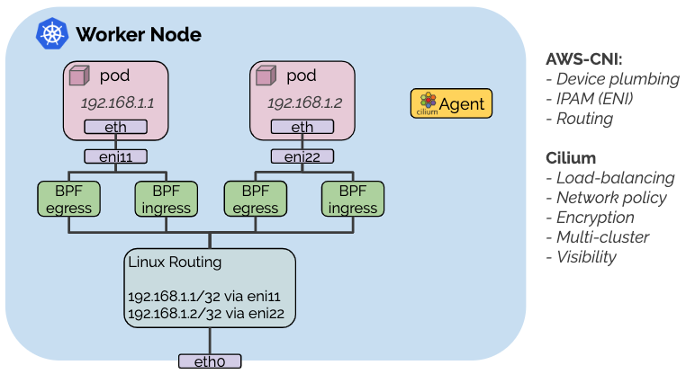

.. only:: not (epub or latex or html)

    WARNING: You are looking at unreleased Cilium documentation.
    Please use the official rendered version released here:
    https://docs.cilium.io

*******
AWS-CNI
*******

This guide explains how to set up Cilium in combination with aws-cni. In this
hybrid mode, the aws-cni plugin is responsible for setting up the virtual
network devices as well as address allocation (IPAM) via ENI. After the initial
networking is setup, the Cilium CNI plugin is called to attach BPF programs to
the network devices set up by aws-cni to enforce network policies, perform
load-balancing, and encryption.

Setup Cluster on AWS
====================

Follow the instructions in the :ref:`k8s_install_eks` guide to set up an EKS
cluster or use any other method of your preference to set up a Kubernetes
cluster.

Ensure that the `aws-vpc-cni-k8s <https://github.com/aws/amazon-vpc-cni-k8s>`__
plugin is installed. If you have set up an EKS cluster, this is automatically
done.

.. include:: k8s-install-download-release.rst

Deploy Cilium release via Helm:

.. parsed-literal::

   helm install cilium |CHART_RELEASE| \\
     --namespace kube-system \\
     --set global.cni.chainingMode=aws-cni \\
     --set global.masquerade=false \\
     --set global.tunnel=disabled \\
     --set global.nodeinit.enabled=true

This will enable chaining with the aws-cni plugin. It will also disable
tunneling. Tunneling is not required as ENI IP addresses can be directly routed
in your VPC. You can also disable masquerading for the same reason.

Restart existing pods
=====================

The new CNI chaining configuration will *not* apply to any pod that is already
running in the cluster. Existing pods will be reachable and Cilium will
load-balance to them but policy enforcement will not apply to them and
load-balancing is not performed for traffic originating from existing pods.
You must restart these pods in order to invoke the chaining configuration on
them.

If you are unsure if a pod is managed by Cilium or not, run ``kubectl get cep``
in the respective namespace and see if the pod is listed.

.. include:: k8s-install-validate.rst
.. include:: hubble-enable.rst

