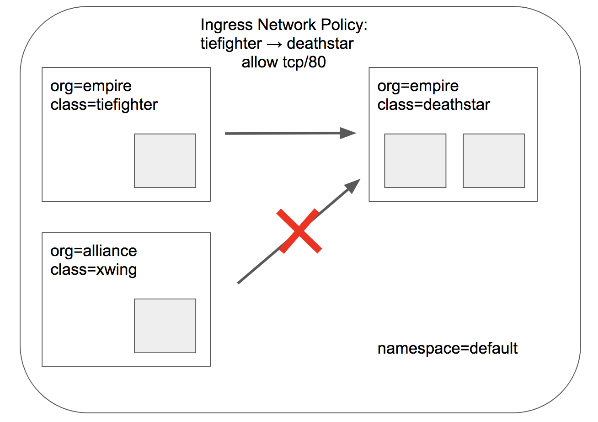
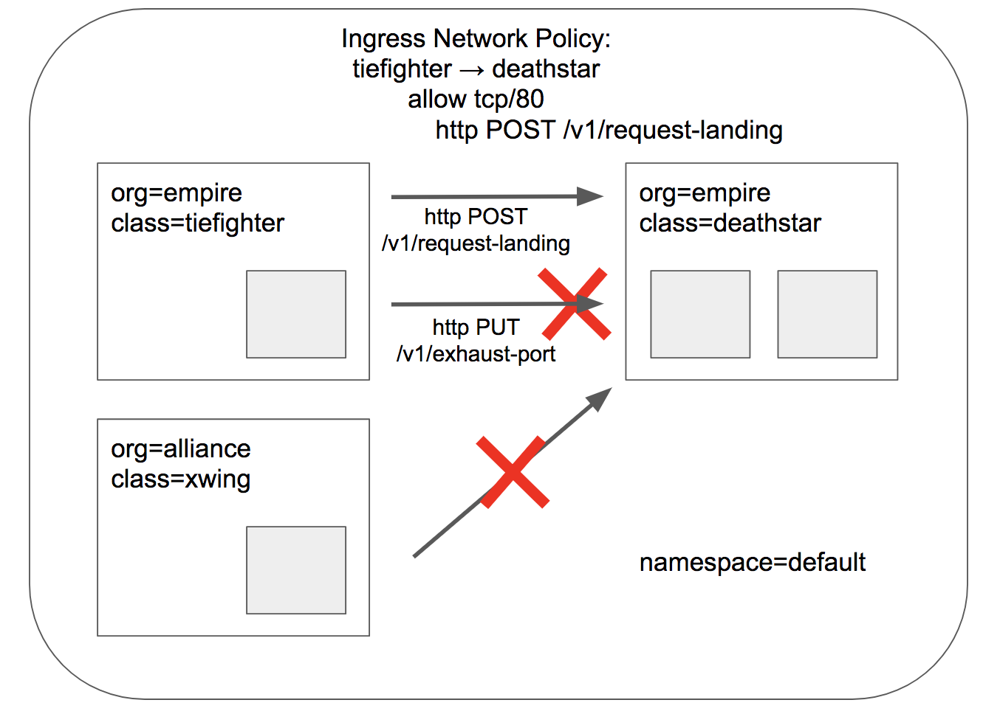

.. only:: not (epub or latex or html)

    WARNING: You are looking at unreleased Cilium documentation.
    Please use the official rendered version released here:
    https://docs.cilium.io

.. _starwars_demo:

#######################################
Getting Started with the Star Wars Demo
#######################################

.. include:: /security/gsg_sw_demo.rst

Check Current Access
====================
From the perspective of the *deathstar* service, only the ships with label ``org=empire`` are allowed to connect and request landing. Since we have no rules enforced, both *xwing* and *tiefighter* will be able to request landing. To test this, use the commands below.

.. code-block:: shell-session

    $ kubectl exec xwing -- curl -s -XPOST deathstar.default.svc.cluster.local/v1/request-landing
    Ship landed
    $ kubectl exec tiefighter -- curl -s -XPOST deathstar.default.svc.cluster.local/v1/request-landing
    Ship landed

Apply an L3/L4 Policy
=====================

When using Cilium, endpoint IP addresses are irrelevant when defining security
policies. Instead, you can use the labels assigned to the pods to define
security policies. The policies will be applied to the right pods based on the labels irrespective of where or when it is running within the cluster.

We'll start with the basic policy restricting deathstar landing requests to only the ships that have label (``org=empire``). This will not allow any ships that don't have the ``org=empire`` label to even connect with the *deathstar* service.
This is a simple policy that filters only on IP protocol (network layer 3) and TCP protocol (network layer 4), so it is often referred to as an L3/L4 network security policy.

Note: Cilium performs stateful *connection tracking*, meaning that if policy allows
the frontend to reach backend, it will automatically allow all required reply
packets that are part of backend replying to frontend within the context of the
same TCP/UDP connection.

**L4 Policy with Cilium and Kubernetes**

We can achieve that with the following CiliumNetworkPolicy:

.. literalinclude:: ../../examples/minikube/sw_l3_l4_policy.yaml

CiliumNetworkPolicies match on pod labels using an "endpointSelector" to identify the sources and destinations to which the policy applies.
The above policy whitelists traffic sent from any pods with label (``org=empire``) to *deathstar* pods with label (``org=empire, class=deathstar``) on TCP port 80.

To apply this L3/L4 policy, run:

.. parsed-literal::

    $ kubectl create -f \ |SCM_WEB|\/examples/minikube/sw_l3_l4_policy.yaml
    ciliumnetworkpolicy.cilium.io/rule1 created

Now if we run the landing requests again, only the *tiefighter* pods with the label ``org=empire`` will succeed. The *xwing* pods will be blocked!

.. code-block:: shell-session

    $ kubectl exec tiefighter -- curl -s -XPOST deathstar.default.svc.cluster.local/v1/request-landing
    Ship landed

This works as expected. Now the same request run from an *xwing* pod will fail:

.. code-block:: shell-session

    $ kubectl exec xwing -- curl -s -XPOST deathstar.default.svc.cluster.local/v1/request-landing

This request will hang, so press Control-C to kill the curl request, or wait for it to time out.

Inspecting the Policy
=====================

If we run ``cilium endpoint list`` again we will see that the pods with the label ``org=empire`` and ``class=deathstar`` now have ingress policy enforcement enabled as per the policy above.

.. code-block:: shell-session

    $ kubectl -n kube-system exec cilium-1c2cz -- cilium endpoint list
    ENDPOINT   POLICY (ingress)   POLICY (egress)   IDENTITY   LABELS (source:key[=value])                       IPv6   IPv4         STATUS
               ENFORCEMENT        ENFORCEMENT
    232        Enabled            Disabled          16530      k8s:class=deathstar                                      10.0.0.147   ready
                                                               k8s:io.cilium.k8s.policy.cluster=default
                                                               k8s:io.cilium.k8s.policy.serviceaccount=default
                                                               k8s:io.kubernetes.pod.namespace=default
                                                               k8s:org=empire
    726        Disabled           Disabled          1          reserved:host                                                         ready
    883        Disabled           Disabled          4          reserved:health                                          10.0.0.244   ready
    1634       Disabled           Disabled          51373      k8s:io.cilium.k8s.policy.cluster=default                 10.0.0.118   ready
                                                               k8s:io.cilium.k8s.policy.serviceaccount=coredns
                                                               k8s:io.kubernetes.pod.namespace=kube-system
                                                               k8s:k8s-app=kube-dns
    1673       Disabled           Disabled          31028      k8s:class=tiefighter                                     10.0.0.112   ready
                                                               k8s:io.cilium.k8s.policy.cluster=default
                                                               k8s:io.cilium.k8s.policy.serviceaccount=default
                                                               k8s:io.kubernetes.pod.namespace=default
                                                               k8s:org=empire
    2811       Disabled           Disabled          51373      k8s:io.cilium.k8s.policy.cluster=default                 10.0.0.47    ready
                                                               k8s:io.cilium.k8s.policy.serviceaccount=coredns
                                                               k8s:io.kubernetes.pod.namespace=kube-system
                                                               k8s:k8s-app=kube-dns
    2843       Enabled            Disabled          16530      k8s:class=deathstar                                      10.0.0.89    ready
                                                               k8s:io.cilium.k8s.policy.cluster=default
                                                               k8s:io.cilium.k8s.policy.serviceaccount=default
                                                               k8s:io.kubernetes.pod.namespace=default
                                                               k8s:org=empire
    3184       Disabled           Disabled          22654      k8s:class=xwing                                          10.0.0.30    ready
                                                               k8s:io.cilium.k8s.policy.cluster=default
                                                               k8s:io.cilium.k8s.policy.serviceaccount=default
                                                               k8s:io.kubernetes.pod.namespace=default
                                                               k8s:org=alliance

You can also inspect the policy details via ``kubectl``

.. code-block:: shell-session

    $ kubectl get cnp
    NAME    AGE
    rule1   2m

    $ kubectl describe cnp rule1
    Name:         rule1
    Namespace:    default
    Labels:       <none>
    Annotations:  <none>
    API Version:  cilium.io/v2
    Description:  L3-L4 policy to restrict deathstar access to empire ships only
    Kind:         CiliumNetworkPolicy
    Metadata:
      Creation Timestamp:  2020-06-15T14:06:48Z
      Generation:          1
      Managed Fields:
        API Version:  cilium.io/v2
        Fields Type:  FieldsV1
        fieldsV1:
          f:description:
          f:spec:
            .:
            f:endpointSelector:
              .:
              f:matchLabels:
                .:
                f:class:
                f:org:
            f:ingress:
        Manager:         kubectl
        Operation:       Update
        Time:            2020-06-15T14:06:48Z
      Resource Version:  2914
      Self Link:         /apis/cilium.io/v2/namespaces/default/ciliumnetworkpolicies/rule1
      UID:               eb3a688b-b3aa-495c-b20a-d4f79e7c088d
    Spec:
      Endpoint Selector:
        Match Labels:
          Class:  deathstar
          Org:    empire
      Ingress:
        From Endpoints:
          Match Labels:
            Org:  empire
        To Ports:
          Ports:
            Port:      80
            Protocol:  TCP
    Events:            <none>

Apply and Test HTTP-aware L7 Policy
===================================

In the simple scenario above, it was sufficient to either give *tiefighter* /
*xwing* full access to *deathstar's* API or no access at all. But to
provide the strongest security (i.e., enforce least-privilege isolation)
between microservices, each service that calls *deathstar's* API should be
limited to making only the set of HTTP requests it requires for legitimate
operation.

For example, consider that the *deathstar* service exposes some maintenance APIs which should not be called by random empire ships. To see this run:

.. code-block:: shell-session

    $ kubectl exec tiefighter -- curl -s -XPUT deathstar.default.svc.cluster.local/v1/exhaust-port
    Panic: deathstar exploded

    goroutine 1 [running]:
    main.HandleGarbage(0x2080c3f50, 0x2, 0x4, 0x425c0, 0x5, 0xa)
            /code/src/github.com/empire/deathstar/
            temp/main.go:9 +0x64
    main.main()
            /code/src/github.com/empire/deathstar/
            temp/main.go:5 +0x85

While this is an illustrative example, unauthorized access such as above can have adverse security repercussions.

**L7 Policy with Cilium and Kubernetes**

Cilium is capable of enforcing HTTP-layer (i.e., L7) policies to limit what
URLs the *tiefighter* is allowed to reach.  Here is an example policy file that
extends our original policy by limiting *tiefighter* to making only a POST /v1/request-landing
API call, but disallowing all other calls (including PUT /v1/exhaust-port).

.. literalinclude:: ../../examples/minikube/sw_l3_l4_l7_policy.yaml

Update the existing rule to apply L7-aware policy to protect *deathstar* using:

.. parsed-literal::

    $ kubectl apply -f \ |SCM_WEB|\/examples/minikube/sw_l3_l4_l7_policy.yaml
    ciliumnetworkpolicy.cilium.io/rule1 configured

We can now re-run the same test as above, but we will see a different outcome:

.. code-block:: shell-session

    $ kubectl exec tiefighter -- curl -s -XPOST deathstar.default.svc.cluster.local/v1/request-landing
    Ship landed

and

.. code-block:: shell-session

    $ kubectl exec tiefighter -- curl -s -XPUT deathstar.default.svc.cluster.local/v1/exhaust-port
    Access denied

As this rule builds on the identity-aware rule, traffic from pods without the label
``org=empire`` will continue to be dropped causing the connection to time out:

.. code-block:: shell-session

    $ kubectl exec xwing -- curl -s -XPOST deathstar.default.svc.cluster.local/v1/request-landing

As you can see, with Cilium L7 security policies, we are able to permit
*tiefighter* to access only the required API resources on *deathstar*, thereby
implementing a "least privilege" security approach for communication between
microservices. Note that ``path`` matches the exact url, if for example you want
to allow anything under /v1/, you need to use a regular expression:

.. code-block:: yaml

    path: "/v1/.*"

You can observe the L7 policy via ``kubectl``:

.. code-block:: shell-session

    $ kubectl describe ciliumnetworkpolicies
    Name:         rule1
    Namespace:    default
    Labels:       <none>
    Annotations:  API Version:  cilium.io/v2
    Description:  L7 policy to restrict access to specific HTTP call
    Kind:         CiliumNetworkPolicy
    Metadata:
      Creation Timestamp:  2020-06-15T14:06:48Z
      Generation:          2
      Managed Fields:
        API Version:  cilium.io/v2
        Fields Type:  FieldsV1
        fieldsV1:
          f:description:
          f:metadata:
            f:annotations:
              .:
              f:kubectl.kubernetes.io/last-applied-configuration:
          f:spec:
            .:
            f:endpointSelector:
              .:
              f:matchLabels:
                .:
                f:class:
                f:org:
            f:ingress:
        Manager:         kubectl
        Operation:       Update
        Time:            2020-06-15T14:10:46Z
      Resource Version:  3445
      Self Link:         /apis/cilium.io/v2/namespaces/default/ciliumnetworkpolicies/rule1
      UID:               eb3a688b-b3aa-495c-b20a-d4f79e7c088d
    Spec:
      Endpoint Selector:
        Match Labels:
          Class:  deathstar
          Org:    empire
      Ingress:
        From Endpoints:
          Match Labels:
            Org:  empire
        To Ports:
          Ports:
            Port:      80
            Protocol:  TCP
          Rules:
            Http:
              Method:  POST
              Path:    /v1/request-landing
    Events:            <none>

and ``cilium`` CLI:

.. code-block:: shell-session

    $ kubectl -n kube-system exec cilium-qh5l2 -- cilium policy get
    [
      {
        "endpointSelector": {
          "matchLabels": {
            "any:class": "deathstar",
            "any:org": "empire",
            "k8s:io.kubernetes.pod.namespace": "default"
          }
        },
        "ingress": [
          {
            "fromEndpoints": [
              {
                "matchLabels": {
                  "any:org": "empire",
                  "k8s:io.kubernetes.pod.namespace": "default"
                }
              }
            ],
            "toPorts": [
              {
                "ports": [
                  {
                    "port": "80",
                    "protocol": "TCP"
                  }
                ],
                "rules": {
                  "http": [
                    {
                      "path": "/v1/request-landing",
                      "method": "POST"
                    }
                  ]
                }
              }
            ]
          }
        ],
        "labels": [
          {
            "key": "io.cilium.k8s.policy.derived-from",
            "value": "CiliumNetworkPolicy",
            "source": "k8s"
          },
          {
            "key": "io.cilium.k8s.policy.name",
            "value": "rule1",
            "source": "k8s"
          },
          {
            "key": "io.cilium.k8s.policy.namespace",
            "value": "default",
            "source": "k8s"
          },
          {
            "key": "io.cilium.k8s.policy.uid",
            "value": "eb3a688b-b3aa-495c-b20a-d4f79e7c088d",
            "source": "k8s"
          }
        ]
      }
    ]
    Revision: 11

It is also possible to monitor the HTTP requests live by using ``cilium monitor``:

.. code-block:: shell-session

    $ kubectl exec -it -n kube-system cilium-kzgdx -- cilium monitor -v --type l7
    <- Response http to 0 ([k8s:class=tiefighter k8s:io.cilium.k8s.policy.cluster=default k8s:io.cilium.k8s.policy.serviceaccount=default k8s:io.kubernetes.pod.namespace=default k8s:org=empire]) from 2756 ([k8s:io.cilium.k8s.policy.cluster=default k8s:class=deathstar k8s:org=empire k8s:io.kubernetes.pod.namespace=default k8s:io.cilium.k8s.policy.serviceaccount=default]), identity 8876->43854, verdict Forwarded POST http://deathstar.default.svc.cluster.local/v1/request-landing => 200
    <- Request http from 0 ([k8s:class=tiefighter k8s:io.cilium.k8s.policy.cluster=default k8s:io.cilium.k8s.policy.serviceaccount=default k8s:io.kubernetes.pod.namespace=default k8s:org=empire]) to 2756 ([k8s:io.cilium.k8s.policy.cluster=default k8s:class=deathstar k8s:org=empire k8s:io.kubernetes.pod.namespace=default k8s:io.cilium.k8s.policy.serviceaccount=default]), identity 8876->43854, verdict Denied PUT http://deathstar.default.svc.cluster.local/v1/request-landing => 403

The above output demonstrates a successful response to a POST request followed by a PUT request that is denied by the L7 policy.

We hope you enjoyed the tutorial.  Feel free to play more with the setup, read
the rest of the documentation, and reach out to us on the `Cilium
Slack channel <https://cilium.herokuapp.com>`_ with any questions!

Clean-up
========

.. parsed-literal::

   $ kubectl delete -f \ |SCM_WEB|\/examples/minikube/http-sw-app.yaml
   $ kubectl delete cnp rule1
