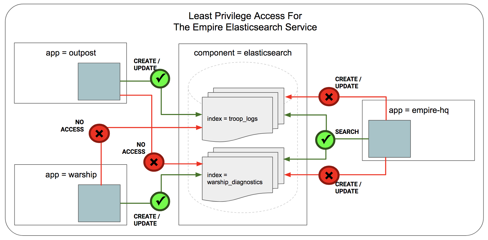

**************************************
Getting Started Securing Elasticsearch
**************************************

This document serves as an introduction for using Cilium to enforce Elasticsearch-aware
security policies.  It is a detailed walk-through of getting a single-node
Cilium environment running on your machine. It is designed to take 15-30
minutes.

.. include:: gsg_intro.rst
.. include:: minikube_intro.rst
.. include:: cilium_install.rst

Step 2: Deploy the Demo Application
===================================

Now that we have Cilium running, we can deploy our demo Elasticsearch application. The demo application aligns with our tradition of using Star Wars-themed examples. We go back to the time when Vader had recently been converted to the Dark side. Darth Sidious wanted to share some of the books that he had authored. The books were stored in an Elasticsearch database and exposed via a service of the same name. Both Sidious and Vader accessed these books using python-based clients running in Kubernetes pods.

The file ``es-sw-app.yaml`` will deploy the Elasticsearch service which stores Sidious' books and it will create one Vader and one Sidious client pod each.

.. parsed-literal::

    $ kubectl create -f \ |SCM_WEB|\/examples/kubernetes-es/es-sw-app.yaml
    serviceaccount "elasticsearch" created
    service "elasticsearch" created
    replicationcontroller "es" created
    role "elasticsearch" created
    rolebinding "elasticsearch" created
    pod "sidious" created
    pod "vader" created

::

    $ kubectl get svc,pods
    NAME                TYPE        CLUSTER-IP    EXTERNAL-IP   PORT(S)                           AGE
    svc/elasticsearch   NodePort    10.98.18.52   <none>        9200:30068/TCP,9300:32396/TCP     1m
    svc/etcd-cilium     NodePort    10.98.67.60   <none>        32379:31079/TCP,32380:31080/TCP   7m
    svc/kubernetes      ClusterIP   10.96.0.1     <none>        443/TCP                           8m

    NAME               READY     STATUS    RESTARTS   AGE
    po/es-bwvnp        1/1       Running   0          1m
    po/etcd-cilium-0   1/1       Running   0          7m
    po/sidious         1/1       Running   0          1m
    po/vader           1/1       Running   0          1m

Step 3: Security Risks for Elasticsearch Access
===============================================

A fundamental security concern for Elasticsearch service is **which client services should be allowed to access what content and perform what actions**. This is an access control problem at the API-layer (i.e L7-layer). In this example, the security challenge for Darth Sidious is that he does not trust Vader, a newly converted apprentice. So he is very worried that Vader can manipulate and ``PUT`` new versions of his books! Sidious wants Vader to have only ``GET`` access including the ability to *search* the database. But he does not want Vader to have ``PUT`` access. Run the following commands to see that both Sidious and Vader have ``GET`` and ``PUT`` access to the Elasticsearch service.

::

    $ kubectl exec sidious -- python create.py
    Creating/Updating Books
    created :  {'_index': 'sidious', '_type': 'tome', '_id': '1', '_version': 1, 'result': 'created', '_shards': {'total': 2, 'successful': 1, 'failed': 0}, 'created': True}
    created :  {'_index': 'sidious', '_type': 'tome', '_id': '2', '_version': 1, 'result': 'created', '_shards': {'total': 2, 'successful': 1, 'failed': 0}, 'created': True}    

    $ kubectl exec sidious -- python get_search.py
    Searching for Books by Darth Sidious
    Got 2 Hits:
    {'_index': 'sidious', '_type': 'tome', '_id': '2', '_score': 1.0, '_source': {'author': 'sidious', 'title': 'Welcome to the Dark Side'}}
    {'_index': 'sidious', '_type': 'tome', '_id': '1', '_score': 1.0, '_source': {'author': 'sidious', 'title': 'Convert Jedi to Dark Side: 101'}}
    Get Book 1 by Darth Sidious
    {'author': 'sidious', 'title': 'Convert Jedi to Dark Side: 101'}

Sidious has access to perform ``GET`` and ``PUT`` as expected. But see what happens when Vader has both ``GET`` and ``PUT`` access. Vader can and did completely modify the books! (Note the change in book titles from 'Convert Jedi to Dark Side: 101' to "Why Convert a Jedi!").

::

    $ kubectl exec vader -- python update.py
    Creating/Updating Books
    updated :  {'_index': 'sidious', '_type': 'tome', '_id': '1', '_version': 3, 'result': 'updated', '_shards': {'total': 2, 'successful': 1, 'failed': 0}, 'created': False}
    updated :  {'_index': 'sidious', '_type': 'tome', '_id': '2', '_version': 3, 'result': 'updated', '_shards': {'total': 2, 'successful': 1, 'failed': 0}, 'created': False}

    $ kubectl exec vader -- python get_search.py
    Searching for Books by Darth Sidious
    Got 2 Hits:
    {'_index': 'sidious', '_type': 'tome', '_id': '2', '_score': 1.0, '_source': {'author': 'sidious', 'title': 'Force is Same for Dark Side and Jedi'}}
    {'_index': 'sidious', '_type': 'tome', '_id': '1', '_score': 1.0, '_source': {'author': 'sidious', 'title': 'Why Convert a Jedi!'}}
    Get Book 1 by Darth Sidious
    {'author': 'sidious', 'title': 'Why Convert a Jedi!'}

Step 4: Securing Elasticsearch Using Cilium
===========================================

Fortunately for Darth Sidious, the Empire DevOps team is using Cilium for their Kubernetes cluster. Cilium provides L7 visibility and security policies to control Elasticsearch API access. In this case, Sidious orders to get the following policy pushed which gives him both ``GET`` and ``PUT`` access to his pods but restricts Vader's pods to only ``GET`` access.

.. literalinclude:: ../../examples/kubernetes-es/es-sw-policy.yaml

Cilium follows the white-list, least privilege model for security. A *CiliumNetworkPolicy* contains a list of rules that define allowed requests, meaning that requests that do not match any rules are denied.

In this example, the policy rules are defined for inbound traffic (i.e., "ingress") connections to the *elasticsearch* service. Note that endpoints selected as backend pods for the service are defined by the *selector* labels. *Selector* labels use the same concept as Kubernetes to define a service. In this example, label ``'k8s:component': elasticsearch`` defines the pods that are part of the *elasticsearch* service in Kubernetes.

Since this is an ingress rule, ``fromEndpoints`` uses labels for endpoints which are calling into the *elasticsearch* service. One set of ``fromEndpoints`` are identified by labels ``name: sidious, role: lord`` (i.e. all Sith Lords named Sidious). These endpoints have both ``GET`` and ``PUT`` access as seen in the http rules section. The other ``fromEndpoints`` identified by labels ``name: vader, role: apprentice`` (i.e. all apprentices named Vader) only have ``GET`` access to specific paths including *search*.

Apply this Elasticsearch-aware network security policy using ``kubectl``:

.. parsed-literal::

    $ kubectl create -f \ |SCM_WEB|\/examples/kubernetes-es/es-sw-policy.yaml
    ciliumnetworkpolicy "secure-empire-es" created

Testing the security policy, Sidious still has both the ``GET`` and ``PUT`` access. But Vader now only has ``GET`` access and any attempts to ``PUT`` results in access denied.

::

    $ kubectl exec sidious -- python create.py
    Creating/Updating Books
    updated :  {'_index': 'sidious', '_type': 'tome', '_id': '1', '_version': 5, 'result': 'updated', '_shards': {'total': 2, 'successful': 1, 'failed': 0}, 'created': False}
    updated :  {'_index': 'sidious', '_type': 'tome', '_id': '2', '_version': 6, 'result': 'updated', '_shards': {'total': 2, 'successful': 1, 'failed': 0}, 'created': False}

    $ kubectl exec sidious -- python get_search.py
    Searching for Books by Darth Sidious
    Got 2 Hits:
    {'_index': 'sidious', '_type': 'tome', '_id': '2', '_score': 1.0, '_source': {'author': 'sidious', 'title': 'Welcome to the Dark Side'}}
    {'_index': 'sidious', '_type': 'tome', '_id': '1', '_score': 1.0, '_source': {'author': 'sidious', 'title': 'Convert Jedi to Dark Side: 101'}}
    Get Book 1 by Darth Sidious
    {'author': 'sidious', 'title': 'Convert Jedi to Dark Side: 101'}

    $ kubectl exec vader -- python get_search.py
    Searching for Books by Darth Sidious
    Got 2 Hits:
    {'_index': 'sidious', '_type': 'tome', '_id': '2', '_score': 1.0, '_source': {'author': 'sidious', 'title': 'Welcome to the Dark Side'}}
    {'_index': 'sidious', '_type': 'tome', '_id': '1', '_score': 1.0, '_source': {'author': 'sidious', 'title': 'Convert Jedi to Dark Side: 101'}}
    Get Book 1 by Darth Sidious
    {'author': 'sidious', 'title': 'Convert Jedi to Dark Side: 101'}

    $ kubectl exec vader -- python update.py
    PUT http://elasticsearch.default.svc.cluster.local:9200/sidious/tome/1 [status:403 request:0.007s]
    Undecodable raw error response from server: Expecting value: line 1 column 1 (char 0)
    Creating/Updating Books
    Traceback (most recent call last):
      File "update.py", line 10, in <module>
        res = es.index(index="sidious", doc_type="tome", id=1, body=book1)
    ...
    ...
    elasticsearch.exceptions.AuthorizationException: TransportError(403, 'Access denied\r\n')
    command terminated with exit code 1

Step 5: Bonus
=============

Another common problem that the DevOps team encountered was accidental/deliberate deletion of the books. So with the above Cilium security policy, they are able to restrict ``DELETE`` calls as well! Run below commands to confirm that neither Sidious nor Vader can delete the books.

::

    $ kubectl exec vader -- python delete.py
    DELETE http://elasticsearch.default.svc.cluster.local:9200/sidious/tome/1 [status:403 request:0.006s]
    Deleting Book 1
    Undecodable raw error response from server: Expecting value: line 1 column 1 (char 0)
    Traceback (most recent call last):
      File "delete.py", line 6, in <module>
        res = es.delete(index="sidious", doc_type="tome", id=1)
      ...
      ...
    elasticsearch.exceptions.AuthorizationException: TransportError(403, 'Access denied\r\n')
    command terminated with exit code 1

    $ kubectl exec sidious -- python delete.py
    DELETE http://elasticsearch.default.svc.cluster.local:9200/sidious/tome/1 [status:403 request:0.005s]
    Undecodable raw error response from server: Expecting value: line 1 column 1 (char 0)
    Deleting Book 1
    Traceback (most recent call last):
      File "delete.py", line 6, in <module>
        res = es.delete(index="sidious", doc_type="tome", id=1)
      ...
      ...
    elasticsearch.exceptions.AuthorizationException: TransportError(403, 'Access denied\r\n')
    command terminated with exit code 1

Step 6: Clean Up
================

You have now installed Cilium, deployed a demo app, and finally deployed & tested Elasticsearch-aware network security policies. To clean up, run:

::

    $ minikube delete
