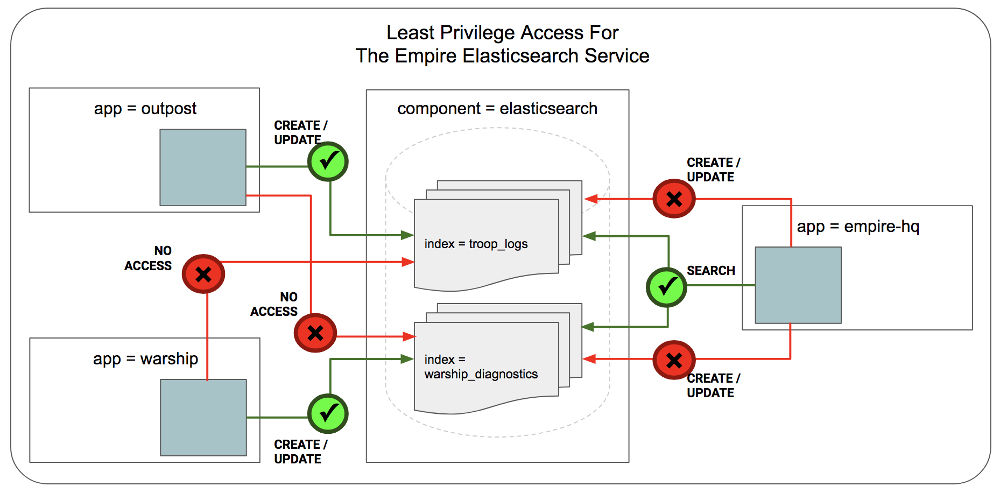

**************************************
Getting Started Securing Elasticsearch
**************************************

This document serves as an introduction for using Cilium to enforce Elasticsearch-aware
security policies.  It is a detailed walk-through of getting a single-node
Cilium environment running on your machine. It is designed to take 15-30
minutes.

.. include:: gsg_intro.rst
.. include:: minikube_intro.rst
.. include:: cilium_install.rst

Step 2: Deploy the Demo Application
===================================

Following the Cilium tradition, we will use a Star Wars-inspired example. The Empire has a large scale Elasticsearch cluster which is used for storing variety of data including 

* ``index: troop_logs``: Stormtroopers Military Drill Logs collected from every outpost and used to identify and eliminate weak performers!
* ``index: warship_diagnostics``: Warships Diagnostics Data collected from every warship and used for R&D and improvement of the spaceships.

Every outpost has an Elasticsearch client service to upload the Stormtroopers logs. And every warship has a service to upload diagnostics. Similarly, the Empire headquarters has a service to search and analyze the troop logs and warship diagnostics data. Before we look into the security concerns, lets first create this application scenario in minikube.

Deploy the app using command below, which will create

* An ``elasticsearch`` service with the selector label ``component:elasticsearch`` and a pod running Elasticsearch.
* Three Elasticsearch clients one each for ``empire-hq``, ``outpost`` and ``warship``. 

.. parsed-literal::

    $ kubectl create -f \ |SCM_WEB|\/examples/kubernetes-es/es-sw-app.yaml
    serviceaccount "elasticsearch" created
    service "elasticsearch" created
    replicationcontroller "es" created
    role "elasticsearch" created
    rolebinding "elasticsearch" created
    pod "outpost" created
    pod "empire-hq" created
    pod "warship" created

::

    $ kubectl get svc,pods
    NAME                TYPE        CLUSTER-IP       EXTERNAL-IP   PORT(S)                           AGE
    svc/elasticsearch   NodePort    10.111.238.254   <none>        9200:30130/TCP,9300:31721/TCP     2d
    svc/etcd-cilium     NodePort    10.98.67.60      <none>        32379:31079/TCP,32380:31080/TCP   9d
    svc/kubernetes      ClusterIP   10.96.0.1        <none>        443/TCP                           9d

    NAME               READY     STATUS    RESTARTS   AGE
    po/empire-hq       1/1       Running   0          2d
    po/es-g9qk2        1/1       Running   0          2d
    po/etcd-cilium-0   1/1       Running   0          9d
    po/outpost         1/1       Running   0          2d
    po/warship         1/1       Running   0          2d

Step 3: Security Risks for Elasticsearch Access
===============================================

For Elasticsearch clusters the **least privilege security** challenge is to give clients access only to particular indices, and to limit the operations each client is allowed to perform on each index. In this example, the ``outpost`` Elasticsearch clients only need access to upload troop logs; and the ``empire-hq`` client only needs search access to both the indices.  From the security perspective, the outposts are weak spots and susceptible to be captured by the rebels. Once compromised, the clients can be used to search and manipulate the critical data in Elasticsearch. We can simulate this attach using the commands below but first lets run the commands for legitimate behavior for all the client services. 

``outpost`` client uploading troop logs 

::

    $ kubectl exec outpost -- python upload_logs.py 
    Uploading Stormtroopers Military Drill Log
    created :  {'_index': 'troop_logs', '_type': 'log', '_id': '1', '_version': 1, 'result': 'created', '_shards': {'total': 2, 'successful': 1, 'failed': 0}, 'created': True}

``warship`` uploading diagnostics

::

    $ kubectl exec warship -- python upload_diagnostics.py 
    Uploading Warship Diagnostics
    created :  {'_index': 'warship_diagnostics', '_type': 'stats', '_id': '1', '_version': 1, 'result': 'created', '_shards': {'total': 2, 'successful': 1, 'failed': 0}, 'created': True}

``empire-hq`` running search queries for logs and diagnostics

::

    $ kubectl exec empire-hq -- python search.py 
    Searching for Warship Diagnostics
    Got 1 Hits:
    {'_index': 'warship_diagnostics', '_type': 'stats', '_id': '1', '_score': 1.0, \
     '_source': {'warshipid': '3459B78XNZTF', 'type': 'tiefighter', 'title': 'Gyroscope Diagnostics', \
                 'stats': '[CRITICAL] [ENGINE BURN @SPEED 5000 km/s] [CHANCE 80%]'}}

    Searching for Stormtroopers Military Drill Logs
    Got 1 Hits:
    {'_index': 'troop_logs', '_type': 'log', '_id': '1', '_score': 1.0, \
     '_source': {'outpost': 'Endor', 'datetime': '33 ABY 4AM DST', 'title': 'Endor Corps 1: Morning Drill', \
                 'notes': '5100 PRESENT; 15 ABSENT; 130 CODE-RED BELOW PAR PERFORMANCE'}}

Now imagine an outpost captured by the rebels. In below commands the rebels first search all the indices and then manipulate the diagnostics data from a compromised outpost. 

::

    $ kubectl exec outpost -- python search.py 
    Searching for Warship Diagnostics
    Got 1 Hits:
    {'_index': 'warship_diagnostics', '_type': 'stats', '_id': '1', '_score': 1.0, \
     '_source': {'warshipid': '3459B78XNZTF', 'type': 'tiefighter', 'title': 'Gyroscope Diagnostics', \
                 'stats': '[CRITICAL] [ENGINE BURN @SPEED 5000 km/s] [CHANCE 80%]'}}

    Searching for Stormtroopers Military Drill Logs
    Got 1 Hits:
    {'_index': 'troop_logs', '_type': 'log', '_id': '1', '_score': 1.0, \
     '_source': {'outpost': 'Endor', 'datetime': '33 ABY 4AM DST', 'title': 'Endor Corps 1: Morning Drill', \
                 'notes': '5100 PRESENT; 15 ABSENT; 130 CODE-RED BELOW PAR PERFORMANCE'}}

Rebels manipulate warship diagnostics data so that the warship defects are not known to the empire-hq! (Hint: Rebels have changed the ``stats`` for the tiefighter warship, a change hard to detect but with adverse impact!)

:: 

    $ kubectl exec outpost -- python update.py 
    Uploading Warship Diagnostics
    {'_index': 'warship_diagnostics', '_type': 'stats', '_id': '1', '_score': 1.0, \
     '_source': {'warshipid': '3459B78XNZTF', 'type': 'tiefighter', 'title': 'Gyroscope Diagnostics', \
                 'stats': '[OK] [ENGINE OK @SPEED 5000 km/s]'}}

Step 4: Securing Elasticsearch Using Cilium
===========================================

Following the least privilege security principle, we want to the allow the following legitimate actions and nothing more:

* ``outpost`` service only has upload access to ``index: troop_logs``
* ``warship`` service only has upload access to ``index: warship_diagnostics``
* ``empire-hq`` service only has search access for both the indices 

Fortunately, the Empire DevOps team is using Cilium for their Kubernetes cluster. Cilium provides L7 visibility and security policies to control Elasticsearch API access. Cilium follows the **white-list, least privilege model** for security. That is to say, a *CiliumNetworkPolicy* contains a list of rules that define **allowed requests** and any request that does math the rules is denied. 

In this example, the policy rules are defined for inbound traffic (i.e., "ingress") connections to the *elasticsearch* service. Note that endpoints selected as backend pods for the service are defined by the *selector* labels. *Selector* labels use the same concept as Kubernetes to define a service. In this example, label ``component: elasticsearch`` defines the pods that are part of the *elasticsearch* service in Kubernetes.

In the policy file below, you will see the following rules for controlling the indices access and actions performed:

* ``fromEndpoints`` with labels ``app:warship`` only ``HTTP`` ``PUT`` is allowed on paths matching regex ``^/warship_diagnostics/stats/.*$``
* ``fromEndpoints`` with labels ``app:outpost`` only ``HTTP`` ``PUT`` is allowed on paths matching regex ``^/troop_logs/log/.*$``
* ``fromEndpoints`` with labels ``app:empire`` only ``HTTP`` ``GET`` is allowed on paths matching regex ``^/warship_diagnostics/_search/??.*$`` and ``^/troop_logs/search/??.*$``

.. literalinclude:: ../../examples/kubernetes-es/es-sw-policy.yaml

Apply this Elasticsearch-aware network security policy using ``kubectl``:

.. parsed-literal::

    $ kubectl create -f \ |SCM_WEB|\/examples/kubernetes-es/es-sw-policy.yaml
    ciliumnetworkpolicy "secure-empire-elasticsearch" created

Testing the security policies, firstly, the search access is blocked for both outpost and warship. So from a compromised outpost, rebels will not be able to search and obtain knowledge about troops and warship diagnostics. Secondly, the outpost clients don't have access to create or update the ``index: warship_diagnostics``. 

::

    $ kubectl exec outpost -- python search.py 
    GET http://elasticsearch.default.svc.cluster.local:9200/warship_diagnostics/_search [status:403 request:0.008s]
    ...
    ...
    elasticsearch.exceptions.AuthorizationException: TransportError(403, 'Access denied\r\n')
    command terminated with exit code 1

:: 

    $ kubectl exec outpost -- python update.py 
    PUT http://elasticsearch.default.svc.cluster.local:9200/warship_diagnostics/stats/1 [status:403 request:0.006s]
    ...
    ...
    elasticsearch.exceptions.AuthorizationException: TransportError(403, 'Access denied\r\n')
    command terminated with exit code 1

We can re-run any of the below commands to show that the security policy still allows all legitimate requests (i.e., no 403 errors are returned).

::

    $ kubectl exec outpost -- python upload_logs.py 
    ...
    $ kubectl exec warship -- python upload_diagnostics.py 
    ...
    $ kubectl exec empire-hq -- python search.py 
    ...

Step 6: Clean Up
================

You have now installed Cilium, deployed a demo app, and finally deployed & tested Elasticsearch-aware network security policies. To clean up, run:

::

    $ minikube delete
