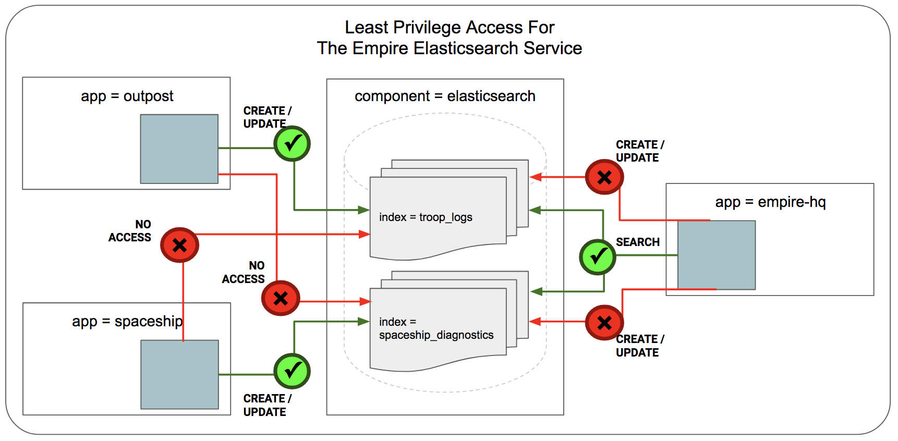

**************************************
Getting Started Securing Elasticsearch 
**************************************

This document serves as an introduction for using Cilium to enforce Elasticsearch-aware
security policies.  It is a detailed walk-through of getting a single-node
Cilium environment running on your machine. It is designed to take 15-30
minutes.

.. include:: gsg_intro.rst
.. include:: minikube_intro.rst
.. include:: cilium_install.rst

Step 2: Deploy the Demo Application
===================================

Now that we have Cilium deployed and ``kube-dns`` operating correctly we can deploy our demo Elasticsearch application. The demo application aligns with our tradition of using Star Wars-themed examples. We go back to time when Vader had recently been converted to Dark side. Darth Sidious wanted to share some of the books that he had authored. The books were stored in a Elasticsearch database and exposed via service of the same name. Both Sidious and Vader accessed these books using *curl* from their Kubernetes pods.  

The file ``es-sw-app.yaml`` will deploy the Elasticsearch service which stores Sidious' books and it will create one Vader and Sidious client pods each.

.. parsed-literal::

    $ kubectl create -f \ |SCM_WEB|\/examples/kubernetes-es/es-sw-app.yaml
      serviceaccount "elasticsearch" created
      service "elasticsearch" created
      replicationcontroller "es" created
      role "elasticsearch" created
      rolebinding "elasticsearch" created
      deployment "sidious" created
      deployment "vader" created

    $ kubectl get svc,pods
      NAME                TYPE           CLUSTER-IP       EXTERNAL-IP   PORT(S)                         AGE
      svc/elasticsearch   ClusterIP      10.100.148.190   <pending>     9200:32048/TCP,9300:31071/TCP   3m
      svc/kubernetes      ClusterIP      10.96.0.1        <none>        443/TCP                         18m

      NAME                         READY     STATUS    RESTARTS   AGE
      po/es-mpzh2                  1/1       Running   0          3m
      po/sidious-9f76c45c7-r2nkw   1/1       Running   0          3m
      po/vader-65bbb8cc6f-b94rm    1/1       Running   0          3m

Step 3: Security Risks for Elasticsearch Access
===============================================

A fundamental security concern for Elasticsearch service is *who is allowed to access what content and perform what actions*. This is an access control problem at the API-layer (i.e L7-layer). In this example, the security challenge for Darth Sidious is that he does not trust Vader. So he is very worried that Vader can manipulate and "POST" new versions of his books! Sidious wants Vader to have only GET access including ability to *search* the database. But he does not want Vader to have "POST" access. Run the following commands to see that both Sidious and Vader have "GET" and "POST" access to the Elasticsearch service.

.. parsed-literal::

    $ kubectl exec sidious-9f76c45c7-r2nkw  -- curl -s  -X POST  -d '{ "subject":"Jedi Conversion", "author":"darth sidious", "description":"Beginners Guide to Convert Jedi to Dark Side" }' elasticsearch.default.svc.cluster.local:9200/sithorder/secretdocs/101
    {"_index":"sithorder","_type":"secretdocs","_id":"101","_version":1,"result":"created","_shards":{"total":2,"successful":1,"failed":0},"created":true}

    $ kubectl exec sidious-9f76c45c7-r2nkw  -- curl -s -X GET elasticsearch.default.svc.cluster.local:9200/sithorder/secretdocs/101
      {"_index":"sithorder","_type":"secretdocs","_id":"101","_version":1,"found":true,"_source":{ "subject":"Jedi Conversion", "author":"darth sidious", "description":"Beginners Guide to Convert Jedi to Dark Side" }}

    $ kubectl exec sidious-9f76c45c7-r2nkw -- curl -s -X GET elasticsearch.default.svc.cluster.local:9200/_search?q=sidious
      {"took":61,"timed_out":false,"_shards":{"total":5,"successful":5,"skipped":0,"failed":0},"hits":{"total":1,"max_score":0.25316024,"hits":[{"_index":"sithorder","_type":"secretdocs","_id":"101","_score":0.25316024,"_source":{ "subject":"Jedi Conversion", "author":"darth sidious", "description":"Beginners Guide to Convert Jedi to Dark Side" }}]}}

    $ kubectl exec vader-65bbb8cc6f-b94rm -- curl -s  -X POST  -d '{ "subject":"Jedi Conversion", "author":"darth sidious", "description":"Beginners Guide to Convert Jedi to Dark Side" }' elasticsearch.default.svc.cluster.local:9200/sithorder/secretdocs/101
    {"_index":"sithorder","_type":"secretdocs","_id":"101","_version":1,"result":"created","_shards":{"total":2,"successful":1,"failed":0},"created":true}

    $ kubectl exec vader-65bbb8cc6f-b94rm -- curl -s -X GET elasticsearch.default.svc.cluster.local:9200/sithorder/secretdocs/101
      {"_index":"sithorder","_type":"secretdocs","_id":"101","_version":1,"found":true,"_source":{ "subject":"Jedi Conversion", "author":"darth sidious", "description":"Beginners Guide to Convert Jedi to Dark Side" }}

    $ kubectl exec vader-65bbb8cc6f-b94rm -- curl -s -X GET elasticsearch.default.svc.cluster.local:9200/_search?q=sidious
      {"took":61,"timed_out":false,"_shards":{"total":5,"successful":5,"skipped":0,"failed":0},"hits":{"total":1,"max_score":0.25316024,"hits":[{"_index":"sithorder","_type":"secretdocs","_id":"101","_score":0.25316024,"_source":{ "subject":"Jedi Conversion", "author":"darth sidious", "description":"Beginners Guide to Convert Jedi to Dark Side" }}]}}

Step 4: Securing Elasticsearch Using Cilium
===========================================

Fortunately, the empire DevOps team is using Cilium for their Kubernetes cluster. Cilium provides L7 visibility and security policies to control Elasticsearch API access. In this case, Sidious orders to get the following policy pushed which gives his pods both "GET" and "POST" access but restricts Vader's pods to only "GET" access.

.. literalinclude:: ../../examples/kubernetes-es/es-policy.yaml

Cilium follows the white-list, zero privilege model for security. A *CiliumNetworkPolicy* contains a list of rules that define allowed requests, meaning that requests that do not match any rules are denied as invalid. 

In this example, the policy rules are defined for inbound traffic (i.e., "ingress") connections to *elasticsearch* service. Note that the endpoints selected as backend for the service are defined by the *selector* labels. *Selector* labels are the same concept Kubernetes uses to define the service. In this example, label "component: es" defines the pods that are part of the elasticsearch service. 
Since this is an ingress rule, we also see the labels used to identify the *fromEndpoints* which are calling into the elasticsearch service. One set of *fromEndpoints* are identified by labels "(name: sidious, role: lord)" (i.e. all Sith Lords named Sidious). These endpoints have both GET and POST access as seen in the http rules section. Whereas the other *fromEndpoints* identified by labels "(name: vader, role: apprentice)" (i.e. all Apprentice named Vader) only have GET access to specific paths including *search*. 

Apply this Elasticsearch-aware network security policy using ``kubectl``:

.. parsed-literal::

    $ kubectl create -f \ |SCM_WEB|\/examples/kubernetes-es/es-sw-policy.yaml
      ciliumnetworkpolicy "secure-empire-es" created

Testing the security policy, Sidious still has both the GET and POST access. But Vader now only has GET access and any attempts to POST results in access denied. 

.. parsed-literal::

    $ kubectl exec sidious-9f76c45c7-vhszk -- curl -s -X GET elasticsearch.default.svc.cluster.local:9200/sithorder/secretdocs/101
      {"_index":"sithorder","_type":"secretdocs","_id":"101","_version":2,"found":true,"_source":{ "subject":"Jedi Conversion", "author":"darth sidious", "description":"Beginners Guide to Convert Jedi to Dark Side" }}

    $ kubectl exec sidious-9f76c45c7-vhszk -- curl -s -X GET elasticsearch.default.svc.cluster.local:9200/_search?q=sidious
      {"took":3,"timed_out":false,"_shards":{"total":5,"successful":5,"skipped":0,"failed":0},"hits":{"total":1,"max_score":0.25316024,"hits":[{"_index":"sithorder","_type":"secretdocs","_id":"101","_score":0.25316024,"_source":{ "subject":"Jedi Conversion", "author":"darth sidious", "description":"Beginners Guide to Convert Jedi to Dark Side" }}]}}

    $ kubectl exec sidious-9f76c45c7-vhszk -- curl -s  -X POST  -d '{ "subject":"Jedi Conversion", "author":"darth sidious", "description":"Beginners Guide to Convert Jedi to Dark Side" }' elasticsearch.default.svc.cluster.local:9200/sithorder/secretdocs/101
      {"_index":"sithorder","_type":"secretdocs","_id":"101","_version":2,"result":"updated","_shards":{"total":2,"successful":1,"failed":0},"created":false}

    $ kubectl exec vader-65bbb8cc6f-gvhdw -- curl -s -X GET elasticsearch.default.svc.cluster.local:9200/_search?q=sidious
      {"took":2,"timed_out":false,"_shards":{"total":5,"successful":5,"skipped":0,"failed":0},"hits":{"total":1,"max_score":0.25316024,"hits":[{"_index":"sithorder","_type":"secretdocs","_id":"101","_score":0.25316024,"_source":{ "subject":"Jedi Conversion", "author":"darth sidious", "description":"Beginners Guide to Convert Jedi to Dark Side" }}]}}

    $ kubectl exec vader-65bbb8cc6f-gvhdw -- curl -s -X GET elasticsearch.default.svc.cluster.local:9200/sithorder/secretdocs/101
      {"_index":"sithorder","_type":"secretdocs","_id":"101","_version":1,"found":true,"_source":{ "subject":"Jedi Conversion", "author":"darth sidious", "description":"Beginners Guide to Convert Jedi to Dark Side" }}

    $ kubectl exec vader-65bbb8cc6f-gvhdw -- curl -s  -X POST  -d '{ "subject":"Jedi Conversion", "author":"darth sidious", "description":"Beginners Guide to Convert Jedi to Dark Side" }' elasticsearch.default.svc.cluster.local:9200/sithorder/secretdocs/101
      Access denied
          
Step 5: Clean Up
================

You have now installed Cilium, deployed a demo app, and tested Elasticsearch-aware network security policies. To clean up, run:

::

    $ minikube delete
