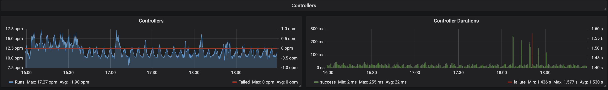

.. only:: not (epub or latex or html)

    WARNING: You are looking at unreleased Cilium documentation.
    Please use the official rendered version released here:
    http://docs.cilium.io

.. _install_metrics:

****************************
Running Prometheus & Grafana
****************************

Installation
============

This is an example deployment that includes Prometheus and Grafana in a single
deployment.

The default installation contains:

- **Grafana**: A visualization dashboard with Cilium Dashboard pre-loaded.
- **Prometheus**: a time series database and monitoring system.

 .. parsed-literal::

        $ kubectl apply -f \ |SCM_WEB|\/examples/kubernetes/addons/prometheus/monitoring-example.yaml
	configmap/cilium-metrics-config created
	namespace/monitoring created
	configmap/prometheus created
	deployment.extensions/prometheus created
	service/prometheus created
	service/prometheus-open created
	clusterrolebinding.rbac.authorization.k8s.io/prometheus created
	clusterrole.rbac.authorization.k8s.io/prometheus created
	serviceaccount/prometheus-k8s created
	configmap/grafana-config created
	deployment.extensions/grafana created
	service/grafana created
	configmap/grafana-dashboards created
	job.batch/grafana-dashboards-import created

How to access Grafana
=====================

Expose the port on your local machine

.. code:: bash

    kubectl -n cilium-monitoring port-forward service/grafana 3000:3000

Access it via your browser: `https://localhost:3000`

How to access Prometheus
========================

Expose the port on your local machine

.. code:: bash

    kubectl -n cilium-monitoring port-forward service/prometheus 9090:9090

Access it via your browser: `https://localhost:9090`

Examples
========

Generic
-------

.. image:: images/grafana_generic.png

Network
-------

.. image:: images/grafana_network.png

Policy
-------

.. image:: images/grafana_policy.png
.. image:: images/grafana_policy2.png

Endpoints
---------

.. image:: images/grafana_endpoints.png

Controllers
-----------

Kubernetes
----------

