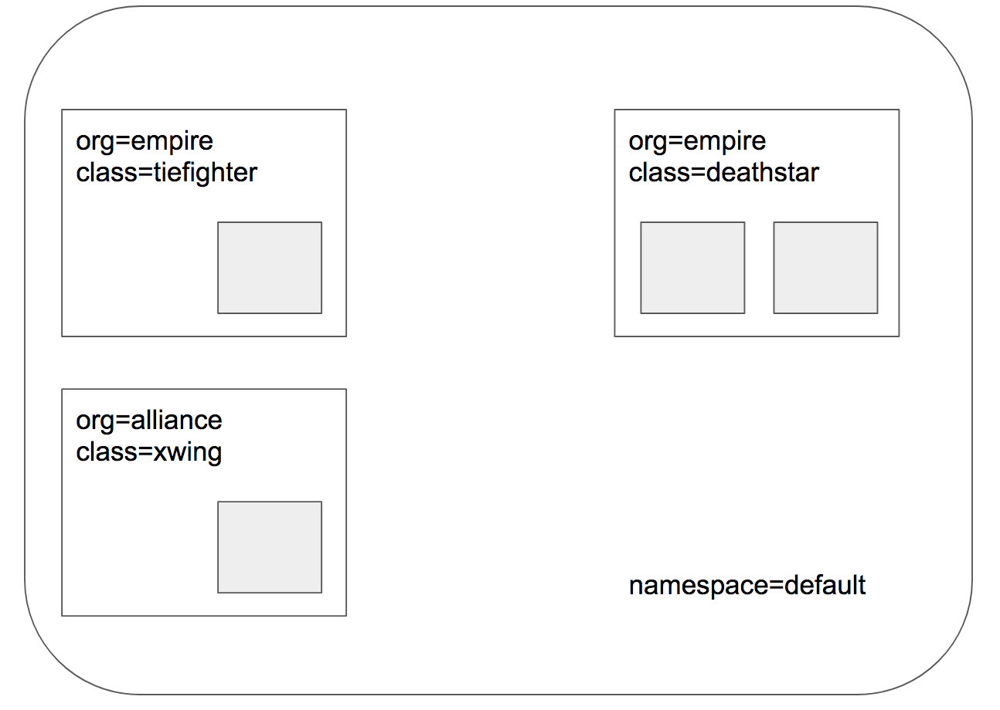

.. only:: not (epub or latex or html)

    WARNING: You are looking at unreleased Cilium documentation.
    Please use the official rendered version released here:
    http://docs.cilium.io

.. _gs_http:

********************************
HTTP/REST API call authorization
********************************

.. include:: gsg_requirements.rst

Deploy the Demo Application
===========================

Now that we have Cilium deployed and ``kube-dns`` operating correctly we can deploy our demo application.

In our Star Wars-inspired example, there are three microservices applications: *deathstar*, *tiefighter*, and *xwing*. The *deathstar* runs an HTTP webservice on port 80, which is exposed as a `Kubernetes Service <https://kubernetes.io/docs/concepts/services-networking/service/>`_ to load-balance requests to *deathstar* across two pod replicas. The *deathstar* service provides landing services to the empire's spaceships so that they can request a landing port. The *tiefighter* pod represents a landing-request client service on a typical empire ship and *xwing* represents a similar service on an alliance ship. They exist so that we can test different security policies for access control to *deathstar* landing services.

**Application Topology for Cilium and Kubernetes**

The file ``http-sw-app.yaml`` contains a `Kubernetes Deployment <https://kubernetes.io/docs/concepts/workloads/controllers/deployment/>`_ for each of the three services.
Each deployment is identified using the Kubernetes labels (``org=empire, class=deathstar``), (``org=empire, class=tiefighter``),
and (``org=alliance, class=xwing``).
It also includes a deathstar-service, which load-balances traffic to all pods with label (``org=empire, class=deathstar``).

.. parsed-literal::

    $ kubectl create -f \ |SCM_WEB|\/examples/minikube/http-sw-app.yaml
    service/deathstar created
    deployment.extensions/deathstar created
    pod/tiefighter created
    pod/xwing created

Kubernetes will deploy the pods and service in the background.  Running
``kubectl get pods,svc`` will inform you about the progress of the operation.
Each pod will go through several states until it reaches ``Running`` at which
point the pod is ready.

::

    $ kubectl get pods,svc
    NAME                             READY   STATUS    RESTARTS   AGE
    pod/deathstar-6fb5694d48-5hmds   1/1     Running   0          107s
    pod/deathstar-6fb5694d48-fhf65   1/1     Running   0          107s
    pod/tiefighter                   1/1     Running   0          107s
    pod/xwing                        1/1     Running   0          107s

    NAME                 TYPE        CLUSTER-IP    EXTERNAL-IP   PORT(S)   AGE
    service/deathstar    ClusterIP   10.96.110.8   <none>        80/TCP    107s
    service/kubernetes   ClusterIP   10.96.0.1     <none>        443/TCP   3m53s

Each pod will be represented in Cilium as an :ref:`endpoint`. We can invoke the
``cilium`` tool inside the Cilium pod to list them:

::

    $ kubectl -n kube-system get pods -l k8s-app=cilium
    NAME           READY   STATUS    RESTARTS   AGE
    cilium-5ngzd   1/1     Running   0          3m19s

    $ kubectl -n kube-system exec cilium-1c2cz -- cilium endpoint list
    ENDPOINT   POLICY (ingress)   POLICY (egress)   IDENTITY   LABELS (source:key[=value])                       IPv6   IPv4            STATUS
               ENFORCEMENT        ENFORCEMENT
    108        Disabled           Disabled          104        k8s:io.cilium.k8s.policy.cluster=default                 10.15.233.139   ready
                                                               k8s:io.cilium.k8s.policy.serviceaccount=coredns
                                                               k8s:io.kubernetes.pod.namespace=kube-system
                                                               k8s:k8s-app=kube-dns
    1011       Disabled           Disabled          104        k8s:io.cilium.k8s.policy.cluster=default                 10.15.96.117    ready
                                                               k8s:io.cilium.k8s.policy.serviceaccount=coredns
                                                               k8s:io.kubernetes.pod.namespace=kube-system
                                                               k8s:k8s-app=kube-dns
    2407       Disabled           Disabled          22839      k8s:class=deathstar                                      10.15.129.95    ready
                                                               k8s:io.cilium.k8s.policy.cluster=default
                                                               k8s:io.cilium.k8s.policy.serviceaccount=default
                                                               k8s:io.kubernetes.pod.namespace=default
                                                               k8s:org=empire
    2607       Disabled           Disabled          4          reserved:health                                          10.15.28.196    ready
    3339       Disabled           Disabled          22839      k8s:class=deathstar                                      10.15.72.39     ready
                                                               k8s:io.cilium.k8s.policy.cluster=default
                                                               k8s:io.cilium.k8s.policy.serviceaccount=default
                                                               k8s:io.kubernetes.pod.namespace=default
                                                               k8s:org=empire
    3738       Disabled           Disabled          47764      k8s:class=xwing                                          10.15.116.85    ready
                                                               k8s:io.cilium.k8s.policy.cluster=default
                                                               k8s:io.cilium.k8s.policy.serviceaccount=default
                                                               k8s:io.kubernetes.pod.namespace=default
                                                               k8s:org=alliance
    3837       Disabled           Disabled          9164       k8s:class=tiefighter                                     10.15.22.126    ready
                                                               k8s:io.cilium.k8s.policy.cluster=default
                                                               k8s:io.cilium.k8s.policy.serviceaccount=default
                                                               k8s:io.kubernetes.pod.namespace=default
                                                               k8s:org=empire

Both ingress and egress policy enforcement is still disabled on all of these pods because no network
policy has been imported yet which select any of the pods.

Check Current Access
====================
From the perspective of the *deathstar* service, only the ships with label ``org=empire`` are allowed to connect and request landing. Since we have no rules enforced, both *xwing* and *tiefighter* will be able to request landing. To test this, use the commands below.

.. parsed-literal::

    $ kubectl exec xwing -- curl -s -XPOST deathstar.default.svc.cluster.local/v1/request-landing
    Ship landed
    $ kubectl exec tiefighter -- curl -s -XPOST deathstar.default.svc.cluster.local/v1/request-landing
    Ship landed

Apply an L3/L4 Policy
=====================

When using Cilium, endpoint IP addresses are irrelevant when defining security
policies. Instead, you can use the labels assigned to the pods to define
security policies. The policies will be applied to the right pods based on the labels irrespective of where or when it is running within the cluster.

We'll start with the basic policy restricting deathstar landing requests to only the ships that have label (``org=empire``). This will not allow any ships that don't have the ``org=empire`` label to even connect with the *deathstar* service.
This is a simple policy that filters only on IP protocol (network layer 3) and TCP protocol (network layer 4), so it is often referred to as an L3/L4 network security policy.

Note: Cilium performs stateful *connection tracking*, meaning that if policy allows
the frontend to reach backend, it will automatically allow all required reply
packets that are part of backend replying to frontend within the context of the
same TCP/UDP connection.

**L4 Policy with Cilium and Kubernetes**

.. image:: images/cilium_http_l3_l4_gsg.png
   :scale: 30 %

We can achieve that with the following CiliumNetworkPolicy:

.. literalinclude:: ../../examples/minikube/sw_l3_l4_policy.yaml

CiliumNetworkPolicies match on pod labels using an "endpointSelector" to identify the sources and destinations to which the policy applies.
The above policy whitelists traffic sent from any pods with label (``org=empire``) to *deathstar* pods with label (``org=empire, class=deathstar``) on TCP port 80.

To apply this L3/L4 policy, run:

.. parsed-literal::

    $ kubectl create -f \ |SCM_WEB|\/examples/minikube/sw_l3_l4_policy.yaml
    ciliumnetworkpolicy.cilium.io/rule1 created

Now if we run the landing requests again, only the *tiefighter* pods with the label ``org=empire`` will succeed. The *xwing* pods will be blocked!

.. parsed-literal::
    $ kubectl exec tiefighter -- curl -s -XPOST deathstar.default.svc.cluster.local/v1/request-landing
    Ship landed

This works as expected. Now the same request run from an *xwing* pod will fail:

.. parsed-literal::
    $ kubectl exec xwing -- curl -s -XPOST deathstar.default.svc.cluster.local/v1/request-landing

This request will hang, so press Control-C to kill the curl request, or wait for it to time out.

Inspecting the Policy
=====================

If we run ``cilium endpoint list`` again we will see that the pods with the label ``org=empire`` and ``class=deathstar`` now have ingress policy enforcement enabled as per the policy above.

::

    $ kubectl -n kube-system exec cilium-1c2cz -- cilium endpoint list
    ENDPOINT   POLICY (ingress)   POLICY (egress)   IDENTITY   LABELS (source:key[=value])                       IPv6   IPv4            STATUS
               ENFORCEMENT        ENFORCEMENT
    108        Disabled           Disabled          104        k8s:io.cilium.k8s.policy.cluster=default                 10.15.233.139   ready
                                                               k8s:io.cilium.k8s.policy.serviceaccount=coredns
                                                               k8s:io.kubernetes.pod.namespace=kube-system
                                                               k8s:k8s-app=kube-dns
    1011       Disabled           Disabled          104        k8s:io.cilium.k8s.policy.cluster=default                 10.15.96.117    ready
                                                               k8s:io.cilium.k8s.policy.serviceaccount=coredns
                                                               k8s:io.kubernetes.pod.namespace=kube-system
                                                               k8s:k8s-app=kube-dns
    1518       Disabled           Disabled          4          reserved:health                                          10.15.28.196    ready
    2407       Enabled            Disabled          22839      k8s:class=deathstar                                      10.15.129.95    ready
                                                               k8s:io.cilium.k8s.policy.cluster=default
                                                               k8s:io.cilium.k8s.policy.serviceaccount=default
                                                               k8s:io.kubernetes.pod.namespace=default
                                                               k8s:org=empire
    3339       Enabled            Disabled          22839      k8s:class=deathstar                                      10.15.72.39     ready
                                                               k8s:io.cilium.k8s.policy.cluster=default
                                                               k8s:io.cilium.k8s.policy.serviceaccount=default
                                                               k8s:io.kubernetes.pod.namespace=default
                                                               k8s:org=empire
    3738       Disabled           Disabled          47764      k8s:class=xwing                                          10.15.116.85    ready
                                                               k8s:io.cilium.k8s.policy.cluster=default
                                                               k8s:io.cilium.k8s.policy.serviceaccount=default
                                                               k8s:io.kubernetes.pod.namespace=default
                                                               k8s:org=alliance
    3837       Disabled           Disabled          9164       k8s:class=tiefighter                                     10.15.22.126    ready
                                                               k8s:io.cilium.k8s.policy.cluster=default
                                                               k8s:io.cilium.k8s.policy.serviceaccount=default
                                                               k8s:io.kubernetes.pod.namespace=default
                                                               k8s:org=empire

You can also inspect the policy details via ``kubectl``

::

    $ kubectl get cnp
    NAME    AGE
    rule1   2m

    $ kubectl describe cnp rule1
    Name:         rule1
    Namespace:    default
    Labels:       <none>
    Annotations:  <none>
    API Version:  cilium.io/v2
    Description:  L3-L4 policy to restrict deathstar access to empire ships only
    Kind:         CiliumNetworkPolicy
    Metadata:
      Creation Timestamp:  2019-01-23T12:36:32Z
      Generation:          1
      Resource Version:    1115
      Self Link:           /apis/cilium.io/v2/namespaces/default/ciliumnetworkpolicies/rule1
      UID:                 837a2f1b-1f0b-11e9-9609-080027702f09
    Spec:
      Endpoint Selector:
        Match Labels:
          Class:  deathstar
          Org:    empire
      Ingress:
        From Endpoints:
          Match Labels:
            Org:  empire
        To Ports:
          Ports:
            Port:      80
            Protocol:  TCP
    Status:
      Nodes:
        Minikube:
          Enforcing:              true
          Last Updated:           2019-01-23T12:36:32.277839184Z
          Local Policy Revision:  5
          Ok:                     true
    Events:                       <none>

Apply and Test HTTP-aware L7 Policy
===================================

In the simple scenario above, it was sufficient to either give *tiefighter* /
*xwing* full access to *deathstar's* API or no access at all. But to
provide the strongest security (i.e., enforce least-privilege isolation)
between microservices, each service that calls *deathstar's* API should be
limited to making only the set of HTTP requests it requires for legitimate
operation.

For example, consider that the *deathstar* service exposes some maintenance APIs which should not be called by random empire ships. To see this run:

::

    $ kubectl exec tiefighter -- curl -s -XPUT deathstar.default.svc.cluster.local/v1/exhaust-port
    Panic: deathstar exploded

    goroutine 1 [running]:
    main.HandleGarbage(0x2080c3f50, 0x2, 0x4, 0x425c0, 0x5, 0xa)
            /code/src/github.com/empire/deathstar/
            temp/main.go:9 +0x64
    main.main()
            /code/src/github.com/empire/deathstar/
            temp/main.go:5 +0x85

While this is an illustrative example, unauthorized access such as above can have adverse security repercussions.

**L7 Policy with Cilium and Kubernetes**

.. image:: images/cilium_http_l3_l4_l7_gsg.png
   :scale: 30 %

Cilium is capable of enforcing HTTP-layer (i.e., L7) policies to limit what
URLs the *tiefighter* is allowed to reach.  Here is an example policy file that
extends our original policy by limiting *tiefighter* to making only a POST /v1/request-landing
API call, but disallowing all other calls (including PUT /v1/exhaust-port).

.. literalinclude:: ../../examples/minikube/sw_l3_l4_l7_policy.yaml

Update the existing rule to apply L7-aware policy to protect *app1* using:

.. parsed-literal::

    $ kubectl apply -f \ |SCM_WEB|\/examples/minikube/sw_l3_l4_l7_policy.yaml
    ciliumnetworkpolicy.cilium.io/rule1 configured

We can now re-run the same test as above, but we will see a different outcome:

::

    $ kubectl exec tiefighter -- curl -s -XPOST deathstar.default.svc.cluster.local/v1/request-landing
    Ship landed

and

::

    $ kubectl exec tiefighter -- curl -s -XPUT deathstar.default.svc.cluster.local/v1/exhaust-port
    Access denied

As you can see, with Cilium L7 security policies, we are able to permit
*tiefighter* to access only the required API resources on *deathstar*, thereby
implementing a "least privilege" security approach for communication between
microservices.

You can observe the L7 policy via ``kubectl``:

::

    $ kubectl describe ciliumnetworkpolicies
    Name:         rule1
    Namespace:    default
    Labels:       <none>
    Annotations:  kubectl.kubernetes.io/last-applied-configuration:
                    {"apiVersion":"cilium.io/v2","description":"L7 policy to restrict access to specific HTTP call","kind":"CiliumNetworkPolicy","metadata":{"...
    API Version:  cilium.io/v2
    Description:  L7 policy to restrict access to specific HTTP call
    Kind:         CiliumNetworkPolicy
    Metadata:
      Creation Timestamp:  2019-01-23T12:36:32Z
      Generation:          2
      Resource Version:    1484
      Self Link:           /apis/cilium.io/v2/namespaces/default/ciliumnetworkpolicies/rule1
      UID:                 837a2f1b-1f0b-11e9-9609-080027702f09
    Spec:
      Endpoint Selector:
        Match Labels:
          Class:  deathstar
          Org:    empire
      Ingress:
        From Endpoints:
          Match Labels:
            Org:  empire
        To Ports:
          Ports:
            Port:      80
            Protocol:  TCP
          Rules:
            Http:
              Method:  POST
              Path:    /v1/request-landing
    Status:
      Nodes:
        Minikube:
          Annotations:
            Kubectl . Kubernetes . Io / Last - Applied - Configuration:  {"apiVersion":"cilium.io/v2","description":"L7 policy to restrict access to specific HTTP call","kind":"CiliumNetworkPolicy","metadata":{"annotations":{},"name":"rule1","namespace":"default"},"spec":{"endpointSelector":{"matchLabels":{"class":"deathstar","org":"empire"}},"ingress":[{"fromEndpoints":[{"matchLabels":{"org":"empire"}}],"toPorts":[{"ports":[{"port":"80","protocol":"TCP"}],"rules":{"http":[{"method":"POST","path":"/v1/request-landing"}]}}]}]}}

          Enforcing:              true
          Last Updated:           2019-01-23T12:39:30.823729308Z
          Local Policy Revision:  7
          Ok:                     true
    Events:                       <none>

and ``cilium`` CLI:

::

    $ kubectl -n kube-system exec cilium-qh5l2 cilium policy get
    [
      {
        "endpointSelector": {
          "matchLabels": {
            "any:class": "deathstar",
            "any:org": "empire",
            "k8s:io.kubernetes.pod.namespace": "default"
          }
        },
        "ingress": [
          {
            "fromEndpoints": [
              {
                "matchLabels": {
                  "any:org": "empire",
                  "k8s:io.kubernetes.pod.namespace": "default"
                }
              }
            ],
            "toPorts": [
              {
                "ports": [
                  {
                    "port": "80",
                    "protocol": "TCP"
                  }
                ],
                "rules": {
                  "http": [
                    {
                      "path": "/v1/request-landing",
                      "method": "POST"
                    }
                  ]
                }
              }
            ]
          }
        ],
        "labels": [
          {
            "key": "io.cilium.k8s.policy.name",
            "value": "rule1",
            "source": "k8s"
          },
          {
            "key": "io.cilium.k8s.policy.uid",
            "value": "837a2f1b-1f0b-11e9-9609-080027702f09",
            "source": "k8s"
          },
          {
            "key": "io.cilium.k8s.policy.namespace",
            "value": "default",
            "source": "k8s"
          },
          {
            "key": "io.cilium.k8s.policy.derived-from",
            "value": "CiliumNetworkPolicy",
            "source": "k8s"
          }
        ]
      }
    ]
    Revision: 7

We hope you enjoyed the tutorial.  Feel free to play more with the setup, read
the rest of the documentation, and reach out to us on the `Cilium
Slack channel <https://cilium.herokuapp.com>`_ with any questions!
