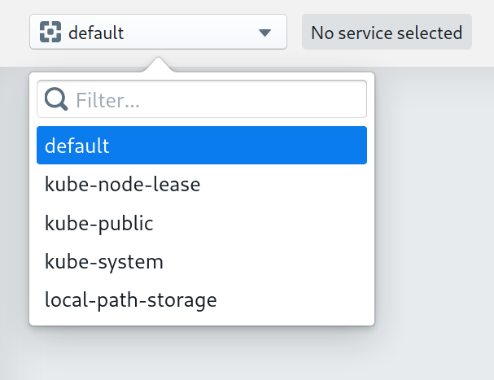
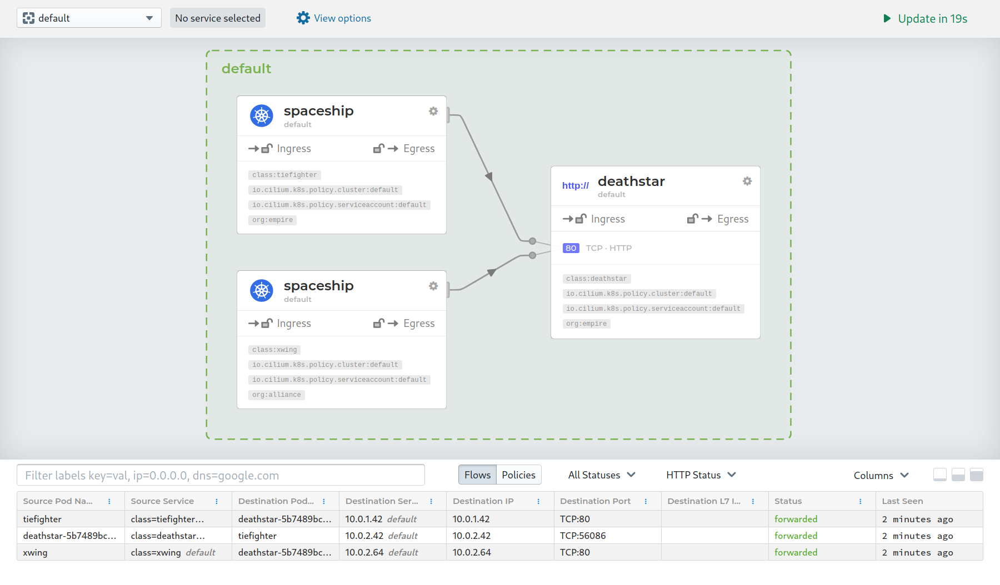

.. only:: not (epub or latex or html)

    WARNING: You are looking at unreleased Cilium documentation.
    Please use the official rendered version released here:
    https://docs.cilium.io

.. _hubble_gsg:

*************************************************
Networking and security observability with Hubble
*************************************************

This guide provides a walkthrough of setting up a local Kubernetes cluster with
Hubble and Cilium installed, in order to demonstrate some of Hubble's
capabilities.

If you haven't read the :ref:`intro` yet, we'd encourage you to do that first.

The best way to get help if you get stuck is to ask a question on the `Cilium
Slack channel <https://cilium.herokuapp.com>`_.  With Cilium contributors
across the globe, there is almost always someone available to help.

Set up a Kubernetes cluster
===========================

To run a Kubernetes cluster on your local machine, you have the choice to
either set up a single-node cluster with
`minikube <https://kubernetes.io/docs/setup/learning-environment/minikube/>`_,
or a local multi-node cluster on Docker using
`kind <https://kind.sigs.k8s.io/>`_:

- ``minikube`` runs a single-node Kubernetes cluster inside a Virtual Machine
  (VM) and is the easiest way to run a Kubernetes cluster locally.
- ``kind`` runs a multi-node Kubernetes using Docker container to emulate
  cluster nodes. It allows you to experiment with the cluster-wide observability
  features of Hubble Relay.

When unsure about the option to pick, follow the instructions for ``minikube``
as it is less likely to cause friction.

.. tabs::

    .. group-tab:: Single-node cluster with ``minikube``

        **Install kubectl & minikube**

        .. include:: minikube-install.rst
        .. include directive in tab requires three newlines to terminate correctly

    .. group-tab:: Multi-node cluster with ``kind``

        **Install dependencies**

        .. include:: kind-install-deps.rst

        **Configure kind**

        .. include:: kind-configure.rst

        **Create a cluster**

        .. include:: kind-create-cluster.rst

        **Preload images**

        .. include:: kind-preload.rst
        .. include directive in tab requires three newlines to terminate correctly

Deploy Cilium and Hubble
========================

This section shows how to install Cilium, enable Hubble and deploy Hubble
Relay and Hubble's graphical UI.

.. tabs::

    .. group-tab:: Single-node cluster with ``minikube``

       Deploy Hubble and Cilium with the provided pre-rendered YAML manifest:

       .. parsed-literal::

            kubectl apply -f |SCM_WEB|/install/kubernetes/experimental-install.yaml

    .. group-tab:: Multi-node cluster with ``kind``

        .. include:: k8s-install-download-release.rst

        Deploy Hubble and Cilium with the following Helm command:

            .. parsed-literal::

               helm install cilium |CHART_RELEASE| \\
                  --namespace kube-system \\
                  --set global.nodeinit.enabled=true \\
                  --set global.kubeProxyReplacement=partial \\
                  --set global.hostServices.enabled=false \\
                  --set global.externalIPs.enabled=true \\
                  --set global.nodePort.enabled=true \\
                  --set global.hostPort.enabled=true \\
                  --set global.pullPolicy=IfNotPresent \\
                  --set config.ipam=kubernetes \\
                  --set global.hubble.enabled=true \\
                  --set global.hubble.listenAddress=":4244" \\
                  --set global.hubble.relay.enabled=true \\
                  --set global.hubble.ui.enabled=true

.. note::

    Please note that Hubble Relay and Hubble UI are currently in beta status
    and are not yet recommended for production use.

Validate the Installation
=========================

You can monitor as Cilium and all required components are being installed:

.. parsed-literal::

    kubectl -n kube-system get pods --watch
    NAME                                         READY   STATUS              RESTARTS   AGE
    cilium-2rlwx                                 0/1     Init:0/2            0          2s
    cilium-ncqtb                                 0/1     Init:0/2            0          2s
    cilium-node-init-9h9dd                       0/1     ContainerCreating   0          2s
    cilium-node-init-cmks4                       0/1     ContainerCreating   0          2s
    cilium-node-init-vnx5n                       0/1     ContainerCreating   0          2s
    cilium-node-init-zhs66                       0/1     ContainerCreating   0          2s
    cilium-nrzsp                                 0/1     Init:0/2            0          2s
    cilium-operator-599dbcf854-7w4rr             0/1     Pending             0          2s
    cilium-pghbg                                 0/1     Init:0/2            0          2s
    coredns-66bff467f8-gnzk7                     0/1     Pending             0          6m6s
    coredns-66bff467f8-wzh49                     0/1     Pending             0          6m6s
    etcd-kind-control-plane                      1/1     Running             0          6m15s
    hubble-relay-5684848cc8-6ldhj                0/1     ContainerCreating   0          2s
    hubble-ui-54c6bc4cdc-h5drq                   0/1     Pending             0          2s
    kube-apiserver-kind-control-plane            1/1     Running             0          6m15s
    kube-controller-manager-kind-control-plane   1/1     Running             0          6m15s
    kube-proxy-dchqv                             1/1     Running             0          5m51s
    kube-proxy-jkvhr                             1/1     Running             0          5m53s
    kube-proxy-nb9b2                             1/1     Running             0          6m5s
    kube-proxy-ttf7z                             1/1     Running             0          5m50s
    kube-scheduler-kind-control-plane            1/1     Running             0          6m15s
    cilium-node-init-zhs66                       1/1     Running             0          4s

It may take a couple of minutes for all components to come up:

.. parsed-literal::

    kubectl -n kube-system get pods
    NAME                                         READY   STATUS    RESTARTS   AGE
    cilium-2rlwx                                 1/1     Running   0          16m
    cilium-ncqtb                                 1/1     Running   0          16m
    cilium-node-init-9h9dd                       1/1     Running   1          16m
    cilium-node-init-cmks4                       1/1     Running   1          16m
    cilium-node-init-vnx5n                       1/1     Running   1          16m
    cilium-node-init-zhs66                       1/1     Running   1          16m
    cilium-nrzsp                                 1/1     Running   0          16m
    cilium-operator-599dbcf854-7w4rr             1/1     Running   0          16m
    cilium-pghbg                                 1/1     Running   0          16m
    coredns-66bff467f8-gnzk7                     1/1     Running   0          22m
    coredns-66bff467f8-wzh49                     1/1     Running   0          22m
    etcd-kind-control-plane                      1/1     Running   0          22m
    hubble-relay-5684848cc8-2z6qk                1/1     Running   0          21s
    hubble-ui-54c6bc4cdc-g5mgd                   1/1     Running   0          17s
    kube-apiserver-kind-control-plane            1/1     Running   0          22m
    kube-controller-manager-kind-control-plane   1/1     Running   0          22m
    kube-proxy-dchqv                             1/1     Running   0          21m
    kube-proxy-jkvhr                             1/1     Running   0          21m
    kube-proxy-nb9b2                             1/1     Running   0          22m
    kube-proxy-ttf7z                             1/1     Running   0          21m
    kube-scheduler-kind-control-plane            1/1     Running   0          22m

Accessing the Graphical User Interface
======================================

Hubble provides a graphical user interface which displays a service map of
your service dependencies. To access **Hubble UI**, you can use the following
command to forward the port of the web frontend to your local machine:

.. parsed-literal::
   kubectl port-forward -n kube-system svc/hubble-ui 12000:80

Open http://localhost:12000 in your browser. You should
see a screen with an invitation to select a namespace, use the namespace
selector dropdown on the left top corner to select a namespace:

In this example, we are deploying the Star Wars demo from the :ref:`gs_http`
guide. However you can apply the same techniques to observe application
connectivity dependencies in your own namespace, and clusters for
application of any type.

Once the the deployment is ready, issue a request from both spaceships to
emulate some traffic.

.. parsed-literal::

    $ kubectl exec xwing -- curl -s -XPOST deathstar.default.svc.cluster.local/v1/request-landing
    Ship landed
    $ kubectl exec tiefighter -- curl -s -XPOST deathstar.default.svc.cluster.local/v1/request-landing
    Ship landed

These requests will then be displayed in the UI as service dependencies between
the different pods:

In the bottom of the interface, you may also inspect each recent Hubble flow
event in your current namespace individually.

.. note::
    If you enable :ref:`proxy_visibility` on your pods, the Hubble UI service
    map will display the HTTP endpoints which are being accessed by the requests.

Inspecting the cluster's network traffic with Hubble Relay
==========================================================

Now let's install the Hubble CLI on your PC/laptop. This will allow you to
inspect the traffic using Hubble Relay.

.. include:: hubble-install.rst

In order to access Hubble Relay with the ``hubble`` CLI, let's make sure to
port-forward the Hubble Relay service locally:

.. parsed-literal::

   $ kubectl port-forward -n kube-system svc/hubble-relay 4245:80

.. note::
   This terminal window needs to be remain open to keep port-forwarding in
   place. Open a separate terminal window to use the ``hubble`` CLI.

Confirm that the Hubble Relay service is healthy via ``hubble status``:

.. parsed-literal::
   $ hubble status --server localhost:4245
   Healthcheck (via localhost:4245): Ok
   Max Flows: 16384

In order to avoid passing ``--server localhost:4245`` to every command, you may
export the following environment variable:

.. parsed-literal::
   $ export HUBBLE_DEFAULT_SOCKET_PATH=localhost:4245

Let's now issue some requests to emulate some traffic again. This first request
is allowed by the policy.

.. parsed-literal::
    $ kubectl exec tiefighter -- curl -s -XPOST deathstar.default.svc.cluster.local/v1/request-landing
    Ship landed

This next request is accessing an HTTP endpoint which is denied by policy.

.. parsed-literal::
    $ kubectl exec tiefighter -- curl -s -XPUT deathstar.default.svc.cluster.local/v1/exhaust-port
    Access denied

Finally, this last request will hang because the ``xwing`` pod does not have
the ``org=empire`` label required by policy. Press Control-C to kill the curl
request, or wait for it to time out.

.. parsed-literal::
    $ kubectl exec xwing -- curl -s -XPOST deathstar.default.svc.cluster.local/v1/request-landing
    command terminated with exit code 28

Let's now inspect this traffic using the CLI. The command below filters all
traffic on the application layer (L7, HTTP) to the ``deathstar`` pod:

.. parsed-literal::
    $ hubble observe --pod deathstar --protocol http 
    TIMESTAMP             SOURCE                                  DESTINATION                             TYPE            VERDICT     SUMMARY
    Jun 18 13:52:23.843   default/tiefighter:52568                default/deathstar-5b7489bc84-8wvng:80   http-request    FORWARDED   HTTP/1.1 POST http://deathstar.default.svc.cluster.local/v1/request-landing
    Jun 18 13:52:23.844   default/deathstar-5b7489bc84-8wvng:80   default/tiefighter:52568                http-response   FORWARDED   HTTP/1.1 200 0ms (POST http://deathstar.default.svc.cluster.local/v1/request-landing)
    Jun 18 13:52:31.019   default/tiefighter:52628                default/deathstar-5b7489bc84-8wvng:80   http-request    DROPPED     HTTP/1.1 PUT http://deathstar.default.svc.cluster.local/v1/exhaust-port

The following command shows all traffic to the ``deathstar`` pod that has been
dropped:

.. parsed-literal::
    $ hubble observe --pod deathstar --verdict DROPPED
    TIMESTAMP             SOURCE                     DESTINATION                             TYPE            VERDICT   SUMMARY
    Jun 18 13:52:31.019   default/tiefighter:52628   default/deathstar-5b7489bc84-8wvng:80   http-request    DROPPED   HTTP/1.1 PUT http://deathstar.default.svc.cluster.local/v1/exhaust-port
    Jun 18 13:52:38.321   default/xwing:34138        default/deathstar-5b7489bc84-v4s7d:80   Policy denied   DROPPED   TCP Flags: SYN
    Jun 18 13:52:38.321   default/xwing:34138        default/deathstar-5b7489bc84-v4s7d:80   Policy denied   DROPPED   TCP Flags: SYN
    Jun 18 13:52:39.327   default/xwing:34138        default/deathstar-5b7489bc84-v4s7d:80   Policy denied   DROPPED   TCP Flags: SYN

Feel free to further inspect the traffic. To get help for the ``observe``
command, use ``hubble help observe``.

Cleanup
=======

Once you are done experimenting with Hubble, you can remove all traces of the
cluster by running the following command:

.. tabs::

    .. group-tab:: Single-node cluster with ``minikube``

        .. parsed-literal::
           minikube delete

    .. group-tab:: Multi-node cluster with ``kind``

        .. parsed-literal::
           kind delete cluster
