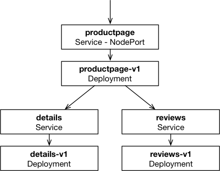
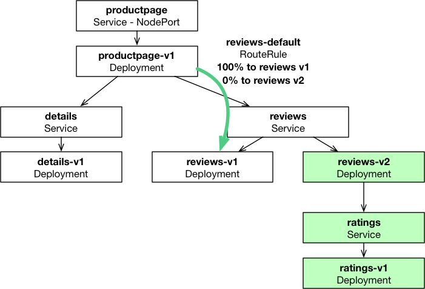
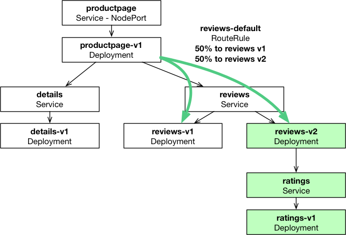
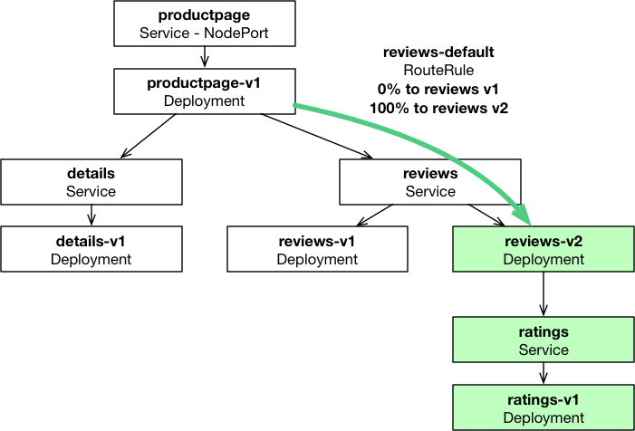
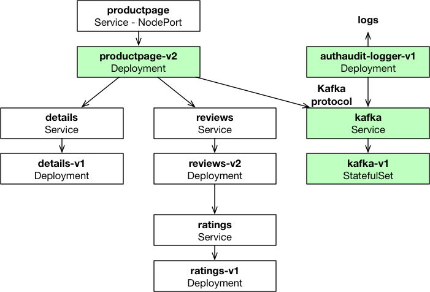

.. only:: not (epub or latex or html)

    WARNING: You are looking at unreleased Cilium documentation.
    Please use the official rendered version released here:
    http://docs.cilium.io

***************************
Getting Started Using Istio
***************************

This document serves as an introduction to using Cilium to enforce
security policies in Kubernetes micro-services managed with Istio.  It
is a detailed walk-through of getting a single-node Cilium + Istio
environment running on your machine.

.. include:: gsg_requirements.rst

.. note::

   If running on minikube, you may need to up the memory and CPUs
   available to the minikube VM from the defaults and/or the
   instructions provided here for the other GSGs. 5 GB and 4 CPUs
   should be enough for this GSG (``--memory=5120 --cpus=4``).

Step 2: Install Istio
=====================

.. note::

   Make sure that Cilium is running in your cluster before proceeding.

Install the `Helm client <https://docs.helm.sh/using_helm/#installing-helm>`_.

Download `Istio version 1.1.3
<https://github.com/istio/istio/releases/tag/1.1.2>`_:

::

   $ export ISTIO_VERSION=1.1.3
   $ curl -L https://git.io/getLatestIstio | sh -
   $ export ISTIO_HOME=`pwd`/istio-${ISTIO_VERSION}
   $ export PATH="$PATH:${ISTIO_HOME}/bin"

Create a copy of Istio's Helm charts in order to customize them:

::

    $ cp -r ${ISTIO_HOME}/install/kubernetes/helm/istio istio-cilium-helm

Configure the Cilium-specific variant of Pilot to inject the
Cilium network policy filters into each Istio sidecar proxy:

.. parsed-literal::

    $ curl -s \ |SCM_WEB|\/examples/kubernetes-istio/cilium-pilot.awk > cilium-pilot.awk

::

    $ awk -f cilium-pilot.awk \
          < ${ISTIO_HOME}/install/kubernetes/helm/istio/charts/pilot/templates/deployment.yaml \
          > istio-cilium-helm/charts/pilot/templates/deployment.yaml

Configure the Istio's sidecar injection to setup the transparent proxy mode
(TPROXY) as required by Cilium's proxy filters:

::

    $ sed -e 's,#interceptionMode: .*,interceptionMode: TPROXY,' \
          < ${ISTIO_HOME}/install/kubernetes/helm/istio/templates/configmap.yaml \
          > istio-cilium-helm/templates/configmap.yaml

Modify the Istio sidecar injection template to add an init container
that waits until DNS works and to mount Cilium's API Unix domain
sockets into each sidecar to allow Cilium's Envoy filters to query the
Cilium agent for policy configuration:

.. parsed-literal::

    $ curl -s \ |SCM_WEB|\/examples/kubernetes-istio/cilium-kube-inject.awk > cilium-kube-inject.awk

::

    $ awk -f cilium-kube-inject.awk \
          < ${ISTIO_HOME}/install/kubernetes/helm/istio/templates/sidecar-injector-configmap.yaml \
          > istio-cilium-helm/templates/sidecar-injector-configmap.yaml

Create an Istio deployment spec, which configures the Cilium-specific variant
of Pilot, and disables unused services:

::

    $ helm template istio-cilium-helm --name istio --namespace istio-system \
          --set pilot.image=docker.io/cilium/istio_pilot:${ISTIO_VERSION} \
          --set sidecarInjectorWebhook.enabled=false \
          --set global.controlPlaneSecurityEnabled=true \
          --set global.mtls.enabled=true \
          --set global.proxy.image=docker.io/cilium/istio_proxy:${ISTIO_VERSION} \
          --set ingress.enabled=false \
          --set egressgateway.enabled=false \
          > istio-cilium.yaml

.. TODO: Set global.controlPlaneSecurityEnabled=true and
   global.mtls.enabled=true when we stop seeing TLS connections getting
   forcefully closed by sidecar proxies sporadically.

Deploy Istio onto Kubernetes:

::

    $ kubectl create namespace istio-system
    $ helm template ${ISTIO_HOME}/install/kubernetes/helm/istio-init --name istio-init --namespace istio-system | kubectl apply -f -

Verify that 53 Istio CRDs have been created:

::

    $ watch "kubectl get crds | grep 'istio.io\|certmanager.k8s.io' | wc -l"

When the above returns '53', you can stop it with ``CTRL-c`` and deploy Istio:

::

    $ kubectl create -f istio-cilium.yaml

Check the progress of the deployment (every service should have an
``AVAILABLE`` count of ``1``):

::

    $ watch "kubectl get deployments -n istio-system"
    NAME                       DESIRED   CURRENT   UP-TO-DATE   AVAILABLE   AGE
    istio-citadel              1         1         1            1           1m
    istio-galley               1         1         1            1           1m
    istio-ingressgateway       1         1         1            1           1m
    istio-pilot                1         1         1            1           1m
    istio-policy               1         1         1            1           1m
    istio-telemetry            1         1         1            1           1m
    prometheus                 1         1         1            1           1m

Once all Istio pods are ready, we are ready to install the demo
application.

Step 3: Deploy the Bookinfo Application V1
==========================================

Now that we have Cilium and Istio deployed, we can deploy version
``v1`` of the services of the `Istio Bookinfo sample application
<https://istio.io/docs/examples/bookinfo.html>`_.

While the upstream `Istio Bookinfo Application example for Kubernetes
<https://istio.io/docs/examples/bookinfo/#if-you-are-running-on-kubernetes>`_
deploys multiple versions of the Bookinfo application at the same time,
here we first deploy only the version 1.

The BookInfo application is broken into four separate microservices:

- *productpage*. The productpage microservice calls the details and
  reviews microservices to populate the page.
- *details*. The details microservice contains book information.
- *reviews*. The reviews microservice contains book reviews. It also
  calls the ratings microservice.
- *ratings*. The ratings microservice contains book ranking
  information that accompanies a book review.

In this demo, each specific version of each microservice is deployed
into Kubernetes using separate YAML files which define:

- A Kubernetes Service.
- A Kubernetes Deployment specifying the microservice's pods, specific
  to each service version.
- A Cilium Network Policy limiting the traffic to the microservice,
  specific to each service version.

To deploy the application with manual sidecar injection, run:

.. parsed-literal::

    $ for service in productpage-service productpage-v1 details-v1 reviews-v1; do \\
          curl -s \ |SCM_WEB|\/examples/kubernetes-istio/bookinfo-${service}.yaml | \\
          istioctl kube-inject -f - | \\
          kubectl create --validate=false -f - ; done
    service "productpage" created
    ciliumnetworkpolicy "productpage-v1" created
    deployment "productpage-v1" created
    service "details" created
    ciliumnetworkpolicy "details-v1" created
    deployment "details-v1" created
    service "reviews" created
    ciliumnetworkpolicy "reviews-v1" created
    deployment "reviews-v1" created

Check the progress of the deployment (every service should have an
``AVAILABLE`` count of ``1``):

::

    $ watch "kubectl get deployments"
    NAME             DESIRED   CURRENT   UP-TO-DATE   AVAILABLE   AGE
    details-v1       1         1         1            1           2m
    productpage-v1   1         1         1            1           2m
    reviews-v1       1         1         1            1           2m

Once all the pods are available, verify that the application works by
making a query from reviews pod to the productpage:

::

    $ kubectl exec -it $(kubectl get pod -l app=reviews -o jsonpath='{.items[0].metadata.name}') -c istio-proxy -- curl productpage:9080/productpage | grep "<title>.*</title>"
        <title>Simple Bookstore App</title>

Create an Istio ingress gateway for the productpage service:

::

    $ kubectl apply -f ${ISTIO_HOME}/samples/bookinfo/networking/bookinfo-gateway.yaml
    gateway "bookinfo-gateway" created
    virtualservice "bookinfo" created

To obtain the URL to the frontend productpage service, run:

::

    $ export GATEWAY_URL=http://$(minikube ip):$(kubectl -n istio-system get service istio-ingressgateway -o jsonpath='{.spec.ports[?(@.name=="http2")].nodePort}')
    $ export PRODUCTPAGE_URL=${GATEWAY_URL}/productpage
    $ echo "Open URL: ${PRODUCTPAGE_URL}"

Open that URL in your web browser and check that the application has
been successfully deployed.  It may take several seconds before all
services become accessible in the Istio service mesh, so you may have
have to reload the page.

Step 4: Canary and Deploy the Reviews Service V2
================================================

We will now deploy version ``v2`` of the ``reviews`` service.  In
addition to providing reviews from readers, ``reviews v2`` queries a
new ``ratings`` service for book ratings, and displays each rating as
1 to 5 black stars.

As a precaution, we will use Istio's service routing feature to canary
the ``v2`` deployment to prevent breaking the end-to-end application
completely if it is faulty.

Before deploying ``v2``, to prevent any traffic from being routed to
it for now, we will create this Istio route rules to route 100% of the
``reviews`` traffic to ``v1``:

.. literalinclude:: ../../examples/kubernetes-istio/route-rule-reviews-v1.yaml

Apply this route rule:

.. parsed-literal::

    $ curl -s \ |SCM_WEB|\/examples/kubernetes-istio/route-rule-reviews-v1.yaml | \\
          kubectl apply -f -
    virtualservice "reviews" created
    destinationrule "reviews" created

Deploy the ``ratings v1`` and ``reviews v2`` services:

.. parsed-literal::

    $ for service in ratings-v1 reviews-v2; do \\
          curl -s \ |SCM_WEB|\/examples/kubernetes-istio/bookinfo-${service}.yaml | \\
          istioctl kube-inject -f - | \\
          kubectl create --validate=false -f - ; done
    service "ratings" created
    ciliumnetworkpolicy "ratings-v1" created
    deployment "ratings-v1" created
    ciliumnetworkpolicy "reviews-v2" created   
    deployment "reviews-v2" created

Check the progress of the deployment (every service should have an
``AVAILABLE`` count of ``1``):

::

    $ watch "kubectl get deployments"
    NAME             DESIRED   CURRENT   UP-TO-DATE   AVAILABLE   AGE
    details-v1       1         1         1            1           6m
    productpage-v1   1         1         1            1           6m
    ratings-v1       1         1         1            1           57s
    reviews-v1       1         1         1            1           6m
    reviews-v2       1         1         1            1           57s

Check in your web browser that no stars are appearing in the Book
Reviews, even after refreshing the page several times.  This indicates
that all reviews are retrieved from ``reviews v1`` and none from
``reviews v2``.

The ``ratings-v1`` CiliumNetworkPolicy explicitly whitelists access
to the ``ratings`` API only from ``productpage`` and ``reviews v2``:

.. literalinclude:: ../../examples/kubernetes-istio/bookinfo-ratings-v1-policy.yaml

Check that ``reviews v1`` may not be able to access the ``ratings``
service, even if it were compromised or suffered from a bug, by
running ``curl`` from within the pod:

.. note::

   It may take a minute for the error to appear.

::

    $ export POD_REVIEWS_V1=`kubectl get pods -l app=reviews,version=v1 -o jsonpath='{.items[0].metadata.name}'`
    $ kubectl exec ${POD_REVIEWS_V1} -c istio-proxy -ti -- curl --connect-timeout 5 --fail http://ratings:9080/ratings/0
    curl: (22) The requested URL returned error: 503 Service Unavailable
    command terminated with exit code 22

Update the Istio route rule to send 50% of ``reviews`` traffic to
``v1`` and 50% to ``v2``:

.. literalinclude:: ../../examples/kubernetes-istio/route-rule-reviews-v1-v2.yaml

Apply this route rule:
		    
.. parsed-literal::

    $ curl -s \ |SCM_WEB|\/examples/kubernetes-istio/route-rule-reviews-v1-v2.yaml | \\
          kubectl apply -f -
    virtualservice "reviews" configured

Check in your web browser that stars are appearing in the Book Reviews
roughly 50% of the time.  This may require refreshing the page for a
few seconds to observe.  Queries to ``reviews v2`` result in reviews
containing ratings displayed as black stars:

Finally, update the route rule to send 100% of ``reviews`` traffic to
``v2``:

.. literalinclude:: ../../examples/kubernetes-istio/route-rule-reviews-v2.yaml

Apply this route rule:

.. parsed-literal::

    $ curl -s \ |SCM_WEB|\/examples/kubernetes-istio/route-rule-reviews-v2.yaml | \\
          kubectl apply -f -
    virtualservice "reviews" configured

Refresh the product page in your web browser several times to verify
that stars are now appearing in the Book Reviews on every page
refresh.  All the reviews are now retrieved from ``reviews v2`` and
none from ``reviews v1``.

Step 5: Deploy the Product Page Service V2
==========================================

We will now deploy version ``v2`` of the ``productpage`` service,
which brings two changes:

- It is deployed with a more restrictive CiliumNetworkPolicy, which
  restricts access to a subset of the HTTP URLs, at Layer-7.
- It implements a new authentication audit log into Kafka.

The policy for ``v1`` currently allows read access to the full HTTP
REST API, under the ``/api/v1`` HTTP URI path:

- ``/api/v1/products``: Returns the list of books and their details.
- ``/api/v1/products/<id>``: Returns details about a specific book.
- ``/api/v1/products/<id>/reviews``: Returns reviews for a specific
  book.
- ``/api/v1/products/<id>/ratings``: Returns ratings for a specific
  book.

Check that the full REST API is currently accessible in ``v1`` and
returns valid JSON data:

::

    $ for APIPATH in /api/v1/products /api/v1/products/0 /api/v1/products/0/reviews /api/v1/products/0/ratings; do echo ; curl -s -S "${GATEWAY_URL}${APIPATH}" ; echo ; done

    [{"descriptionHtml": "<a href=\"https://en.wikipedia.org/wiki/The_Comedy_of_Errors\">Wikipedia Summary</a>: The Comedy of Errors is one of <b>William Shakespeare's</b> early plays. It is his shortest and one of his most farcical comedies, with a major part of the humour coming from slapstick and mistaken identity, in addition to puns and word play.", "id": 0, "title": "The Comedy of Errors"}]

    {"publisher": "PublisherA", "language": "English", "author": "William Shakespeare", "id": 0, "ISBN-10": "1234567890", "ISBN-13": "123-1234567890", "year": 1595, "type": "paperback", "pages": 200}

    {"reviews": [{"reviewer": "Reviewer1", "rating": {"color": "black", "stars": 5}, "text": "An extremely entertaining play by Shakespeare. The slapstick humour is refreshing!"}, {"reviewer": "Reviewer2", "rating": {"color": "black", "stars": 4}, "text": "Absolutely fun and entertaining. The play lacks thematic depth when compared to other plays by Shakespeare."}], "id": "0"}

    {"ratings": {"Reviewer2": 4, "Reviewer1": 5}, "id": 0}

We realized that the REST API to get the book reviews and ratings was
meant only for consumption by other internal services, and will be
blocked from external clients using the updated Layer-7
CiliumNetworkPolicy in ``productpage v2``, i.e. only the
``/api/v1/products`` and ``/api/v1/products/<id>`` HTTP URLs will be
whitelisted:

.. literalinclude:: ../../examples/kubernetes-istio/bookinfo-productpage-v2-policy.yaml

Because ``productpage v2`` sends messages into Kafka, we must first
deploy a Kafka broker:

.. parsed-literal::

    $ curl -s \ |SCM_WEB|\/examples/kubernetes-istio/kafka-v1-destrule.yaml | \\
          kubectl create -f -
    destinationrule "kafka-disable-mtls" created

.. TODO: Re-enable sidecar injection after we support Kafka with mTLS.
    $ curl -s \ |SCM_WEB|\/examples/kubernetes-istio/kafka-v1.yaml | \\
          istioctl kube-inject -f - | \\
          kubectl create --validate=false -f -

.. parsed-literal::

    $ kubectl create -f \ |SCM_WEB|\/examples/kubernetes-istio/kafka-v1.yaml
    service "kafka" created
    ciliumnetworkpolicy "kafka-authaudit" created
    statefulset "kafka-v1" created

Wait until the ``kafka-v1-0`` pod is ready, i.e. until it has a
``READY`` count of ``1/1``:

::

    $ watch "kubectl get pods -l app=kafka"
    NAME         READY     STATUS    RESTARTS   AGE
    kafka-v1-0   1/1       Running   0          21m

Create the ``authaudit`` Kafka topic, which will be used by
``productpage v2``:

::

    $ kubectl exec kafka-v1-0 -c kafka -- bash -c '/opt/kafka_2.11-0.10.1.0/bin/kafka-topics.sh --zookeeper localhost:2181/kafka --create --topic authaudit --partitions 1 --replication-factor 1'
    Created topic "authaudit".

We are now ready to deploy ``productpage v2``.

Create the ``productpage v2`` service and its updated
CiliumNetworkPolicy and delete ``productpage v1``:

.. parsed-literal::

    $ curl -s \ |SCM_WEB|\/examples/kubernetes-istio/bookinfo-productpage-v2.yaml | \\
          istioctl kube-inject -f - | \\
          kubectl create --validate=false -f -
    ciliumnetworkpolicy "productpage-v2" created
    deployment "productpage-v2" created

.. parsed-literal::

    $ kubectl delete -f \ |SCM_WEB|\/examples/kubernetes-istio/bookinfo-productpage-v1.yaml
    ciliumnetworkpolicy "productpage-v1" deleted
    deployment "productpage-v1" deleted

``productpage v2`` implements an authorization audit logging.  On
every user login or logout, it produces into Kafka topic ``authaudit``
a JSON-formatted message which contains the following information:

- event: ``login`` or ``logout``
- username
- client IP address
- timestamp

To observe the Kafka messages sent by ``productpage``, we will run an
additional ``authaudit-logger`` service.  This service fetches and
prints out all messages from the ``authaudit`` Kafka topic.  Start
this service:

.. parsed-literal::

    $ curl -s \ |SCM_WEB|\/examples/kubernetes-istio/authaudit-logger-v1.yaml | \\
          istioctl kube-inject -f - | \\
          kubectl apply --validate=false -f -
    deployment "authaudit-logger-v1" created

Check the progress of the deployment (every service should have an
``AVAILABLE`` count of ``1``):

::

    $ watch "kubectl get deployments"
    NAME                  DESIRED   CURRENT   UP-TO-DATE   AVAILABLE   AGE
    authaudit-logger-v1   1         1         1            1           20s
    details-v1            1         1         1            1           22m
    productpage-v2        1         1         1            1           4m
    ratings-v1            1         1         1            1           19m
    reviews-v1            1         1         1            1           22m
    reviews-v2            1         1         1            1           19m

Check that the product REST API is still accessible, and that Cilium
now denies at Layer-7 any access to the reviews and ratings REST API:

::

    $ for APIPATH in /api/v1/products /api/v1/products/0 /api/v1/products/0/reviews /api/v1/products/0/ratings; do echo ; curl -s -S "${GATEWAY_URL}${APIPATH}" ; echo ; done

    [{"descriptionHtml": "<a href=\"https://en.wikipedia.org/wiki/The_Comedy_of_Errors\">Wikipedia Summary</a>: The Comedy of Errors is one of <b>William Shakespeare's</b> early plays. It is his shortest and one of his most farcical comedies, with a major part of the humour coming from slapstick and mistaken identity, in addition to puns and word play.", "id": 0, "title": "The Comedy of Errors"}]

    {"publisher": "PublisherA", "language": "English", "author": "William Shakespeare", "id": 0, "ISBN-10": "1234567890", "ISBN-13": "123-1234567890", "year": 1595, "type": "paperback", "pages": 200}

    Access denied

    Access denied

This demonstrated that requests to the
``/api/v1/products/<id>/reviews`` and
``/api/v1/products/<id>/ratings`` URIs now result in Cilium returning
``HTTP 403 Forbidden`` HTTP responses.

Every login and logout on the product page will result in a line in
this service's log. Note that you need to log in/out using the ``sign
in``/``sign out`` element on the bookinfo web page. When you do, you
can observe these kind of audit logs:

::

    $ export POD_LOGGER_V1=`kubectl get pods -l app=authaudit-logger,version=v1 -o jsonpath='{.items[0].metadata.name}'`

::

    $ kubectl logs ${POD_LOGGER_V1} -c authaudit-logger
    ...
    {"timestamp": "2017-12-04T09:34:24.341668", "remote_addr": "10.15.28.238", "event": "login", "user": "richard"}
    {"timestamp": "2017-12-04T09:34:40.943772", "remote_addr": "10.15.28.238", "event": "logout", "user": "richard"}
    {"timestamp": "2017-12-04T09:35:03.096497", "remote_addr": "10.15.28.238", "event": "login", "user": "gilfoyle"}
    {"timestamp": "2017-12-04T09:35:08.777389", "remote_addr": "10.15.28.238", "event": "logout", "user": "gilfoyle"}

As you can see, the user-identifiable information sent by
``productpage`` in every Kafka message is sensitive, so access to this
Kafka topic must be protected using Cilium.  The CiliumNetworkPolicy
configured on the Kafka broker enforces that:

- only ``productpage v2`` is allowed to produce messages into the
  ``authaudit`` topic;
- only ``authaudit-logger`` can fetch messages from this topic;
- no service can access any other topic.

.. literalinclude:: ../../examples/kubernetes-istio/kafka-v1-policy.yaml

Check that Cilium prevents the ``authaudit-logger`` service from
writing into the ``authaudit`` topic (enter a message followed by
ENTER, e.g. ``test message``)

.. note::

   Note that the error message may take a short time to appear.

.. note::

   You can terminate the command with a single ``<CTRL>-d``.

::

    $ kubectl exec ${POD_LOGGER_V1} -c authaudit-logger -ti -- /opt/kafka_2.11-0.10.1.0/bin/kafka-console-producer.sh --broker-list=kafka:9092 --topic=authaudit
    test message
    [2017-12-07 02:13:47,020] ERROR Error when sending message to topic authaudit with key: null, value: 12 bytes with error: (org.apache.kafka.clients.producer.internals.ErrorLoggingCallback)
    org.apache.kafka.common.errors.TopicAuthorizationException: Not authorized to access topics: [authaudit]

This demonstrated that Cilium sent a response with an authorization
error for any ``Produce`` request from this service.

Create another topic named ``credit-card-payments``, meant to transmit
highly-sensitive credit card payment requests:

::

    $ kubectl exec kafka-v1-0 -c kafka -- bash -c '/opt/kafka_2.11-0.10.1.0/bin/kafka-topics.sh --zookeeper localhost:2181/kafka --create --topic credit-card-payments --partitions 1 --replication-factor 1'
    Created topic "credit-card-payments".

Check that Cilium prevents the ``authaudit-logger`` service from
fetching messages from this topic:

::

    $ kubectl exec ${POD_LOGGER_V1} -c authaudit-logger -ti -- /opt/kafka_2.11-0.10.1.0/bin/kafka-console-consumer.sh --bootstrap-server=kafka:9092 --topic=credit-card-payments
    [2017-12-07 03:08:54,513] WARN Not authorized to read from topic credit-card-payments. (org.apache.kafka.clients.consumer.internals.Fetcher)
    [2017-12-07 03:08:54,517] ERROR Error processing message, terminating consumer process:  (kafka.tools.ConsoleConsumer$)
    org.apache.kafka.common.errors.TopicAuthorizationException: Not authorized to access topics: [credit-card-payments]
    Processed a total of 0 messages

This demonstrated that Cilium sent a response with an authorization
error for any ``Fetch`` request from this service for any topic other
than ``authaudit``.

.. note::

   At present, the above command may also result in an error message.

Step 6: Clean Up
================

You have now installed Cilium and Istio, deployed a demo app, and
tested both Cilium's L3-L7 network security policies and Istio's
service route rules.  To clean up, run:

::

    $ minikube delete

After this, you can re-run the tutorial from Step 0.
