.. only:: not (epub or latex or html)

    WARNING: You are looking at unreleased Cilium documentation.
    Please use the official rendered version released here:
    https://docs.cilium.io

**************************
Installation using Rancher
**************************

Pre-Requisites
==============

`Rancher Version 2.x <https://rancher.com/docs/rancher/v2.x/en/>`_

Create a New Cluster
====================

In Rancher UI, navigate to the Clusters page. In the top right, click on the
``Add Cluster`` box to create a new cluster.

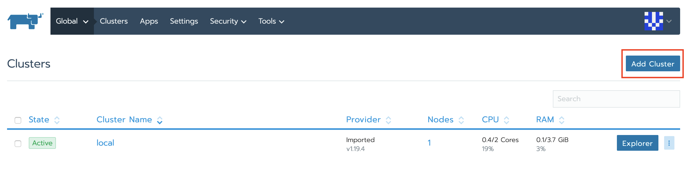

On the Add Cluster page select to create a new cluster from ``Existing Nodes``:

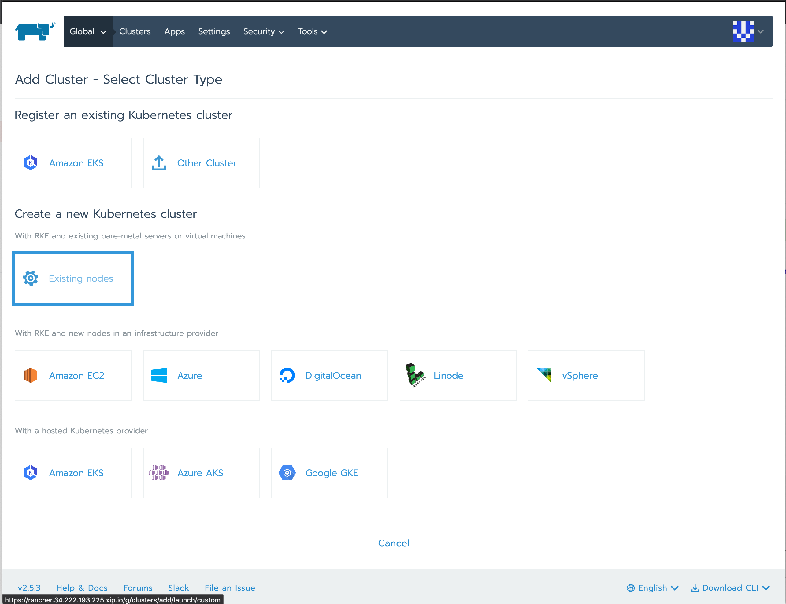

On the ``Add Cluster`` page that opens, provide a name for the cluster. Next to
the ``Cluster Options`` section click the box to ``Edit as YAML``. The configuration
for the cluster will open up in an editor in the window.

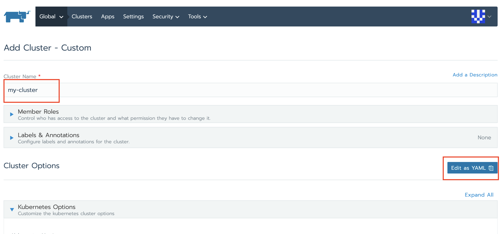

Remove all configuration pertaining to the default network plugin:

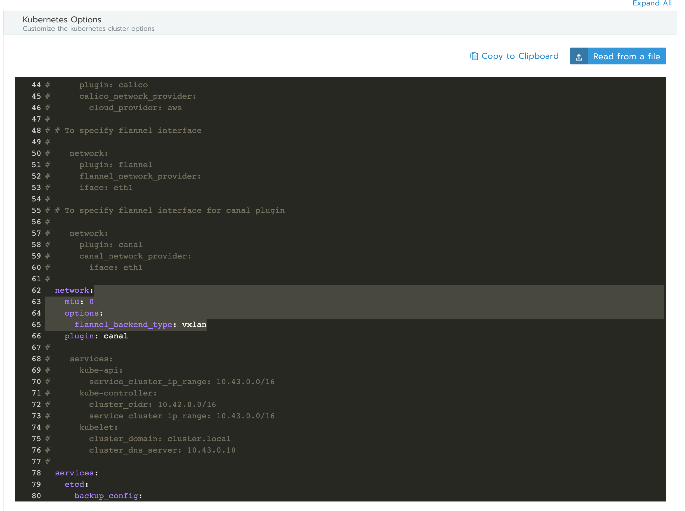

Ensure that network plugin type ``none`` is specified:

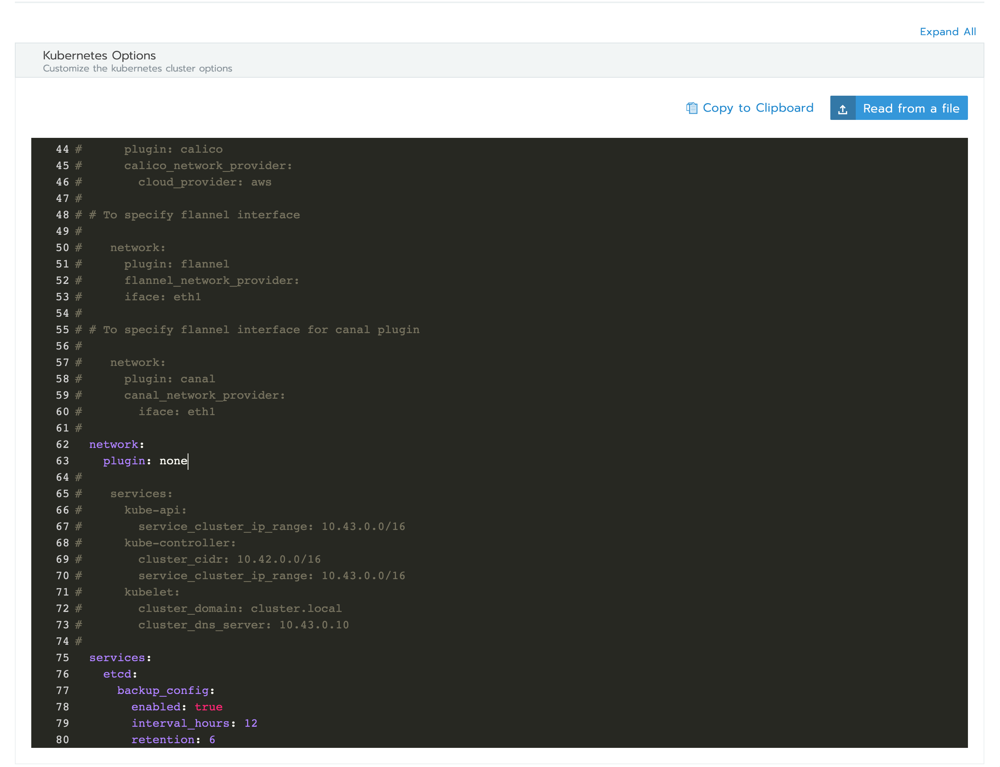

Make any additional changes to the configuration that are appropriate for your
environment. When you are ready, click ``Create`` and Rancher will create the
cluster in the ``Provisioning`` state.

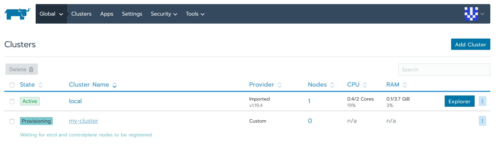

Rancher will also present you with instructions on how to add nodes to the
cluster:

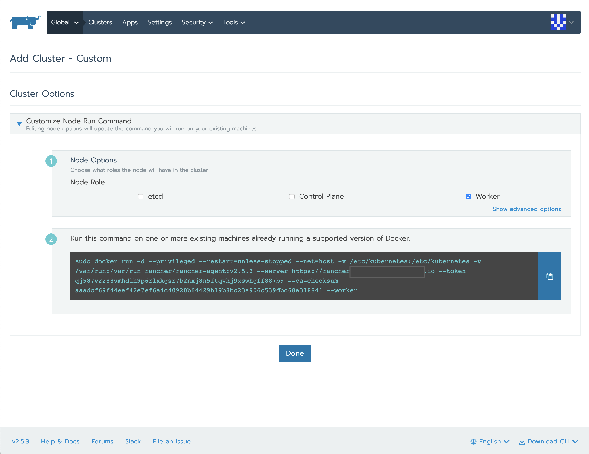

Next, add nodes to the cluster using the Rancher-provided Docker commands. Be
sure to add the appropriate number of nodes required for your cluster. After
a few minutes, you will see that the Nodes overview will show an error message
in the Rancher UI:

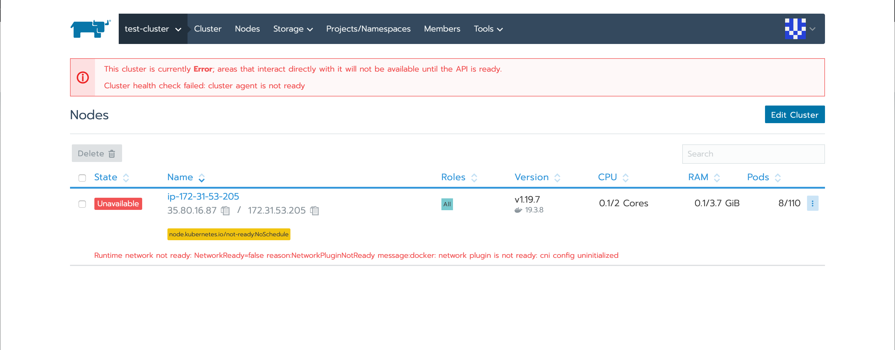

This error is expected. The Kubernetes components are not able to fully
communicate with each other because a CNI plugin has not been installed yet.

In the Rancher UI, navigate to ``Tools`` -> ``Catalogs`` and click the ``Add
Catalog`` button:

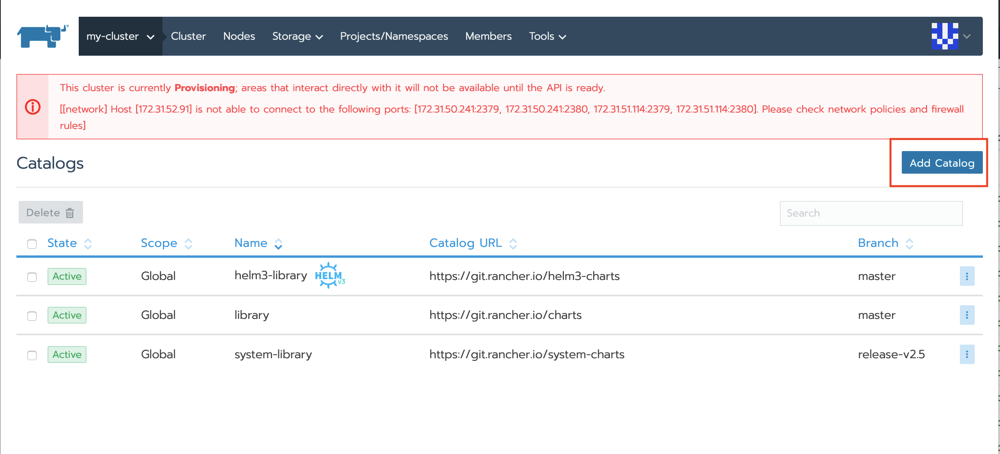

In the window that opens, add the official Cilium Helm v3 chart repository to
the Rancher catalog:

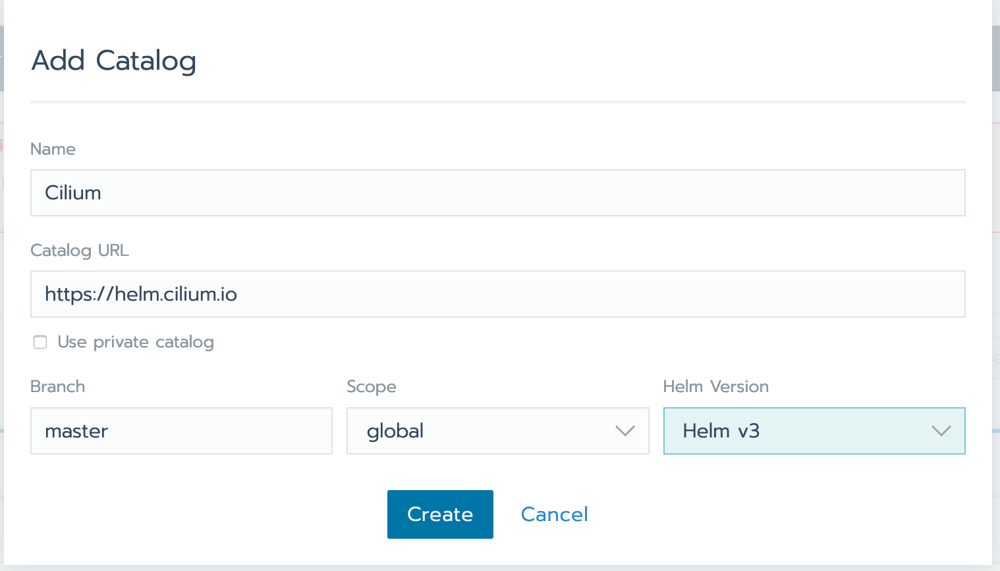

Once added, you should see the Cilium repository in the catalog list:

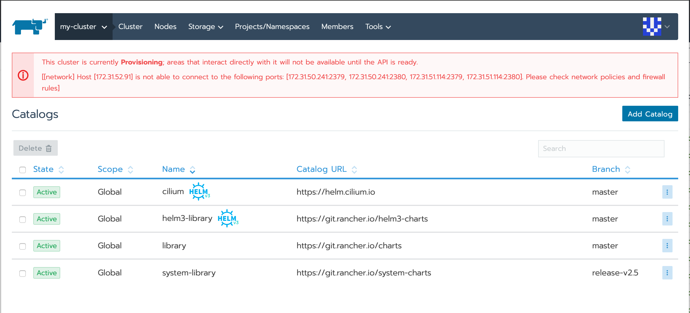

Navigate to the Global Apps list and click the button to ``Launch`` an application:

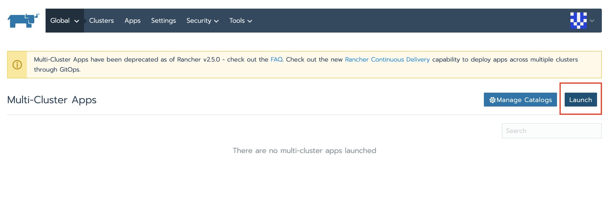

Provide a name for the application and select the System project in your cluster
as the application target:

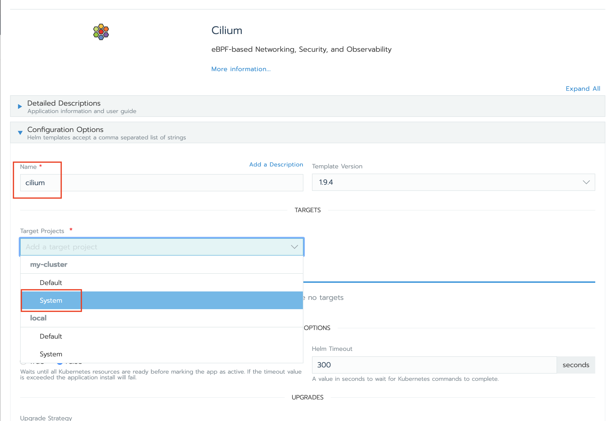

Be sure to configure the application to have cluster-wide scope:

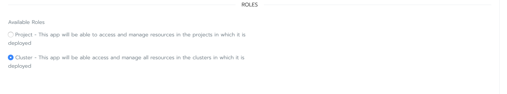

Configure any additional values for the Cilium chart and click ``Next``. The
application should deploy within the target cluster and project.

After a few minutes, you should see all nodes as active, and proper deployments
of all Cilium objects.

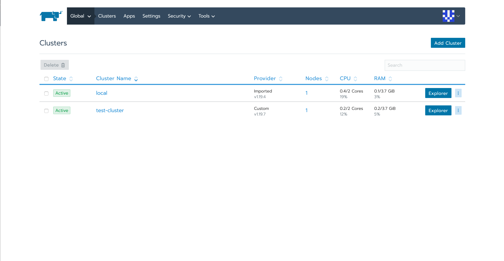
