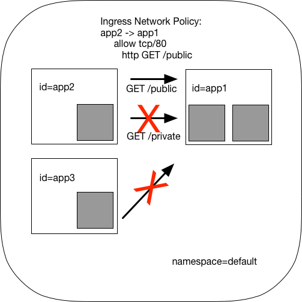

.. _gs_minikube:

********************************
Getting Started Using Minikube
********************************

This guide uses `minikube <https://kubernetes.io/docs/getting-started-guides/minikube/>`_
to demonstrate deployment and operation of Cilium in a single-node Kubernetes cluster.
The minikube VM requires approximately 2 GB of RAM and supports hypervisors like VirtualBox
that run on Linux, macOS, and Windows.

If you instead want to understand the details of
deploying Cilium on a full fledged Kubernetes cluster, then go straight to
:ref:`admin_install_daemonset`.

.. include:: gsg_intro.rst
.. include:: minikube_intro.rst

Step 1: Installing Cilium
=========================

The next step is to install Cilium into your Kubernetes cluster.  Cilium installation
leverages the `Kubernetes Daemon Set <https://kubernetes.io/docs/concepts/workloads/controllers/daemonset/>`_
abstraction, which will deploy one Cilium pod per
cluster node.  This Cilium pod will run in the ``kube-system`` namespace along with
all other system relevant daemons and services.  The Cilium pod will run both the Cilium
agent and the Cilium CNI plugin.

To deploy Cilium, run:

.. tabs::
  .. group-tab:: K8s 1.7

    .. parsed-literal::

      $ kubectl create -f \ |SCM_WEB|\/examples/kubernetes/1.7/cilium.yaml
      clusterrole "cilium" created
      serviceaccount "cilium" created
      clusterrolebinding "cilium" created
      configmap "cilium-config" created
      secret "cilium-etcd-secrets" created
      daemonset "cilium" created

  .. group-tab:: K8s 1.8

    .. parsed-literal::

      $ kubectl create -f \ |SCM_WEB|\/examples/kubernetes/1.8/cilium.yaml
      clusterrole "cilium" created
      serviceaccount "cilium" created
      clusterrolebinding "cilium" created
      configmap "cilium-config" created
      secret "cilium-etcd-secrets" created
      daemonset "cilium" created

  .. group-tab:: K8s 1.9

    .. parsed-literal::

      $ kubectl create -f \ |SCM_WEB|\/examples/kubernetes/1.9/cilium.yaml
      clusterrole "cilium" created
      serviceaccount "cilium" created
      clusterrolebinding "cilium" created
      configmap "cilium-config" created
      secret "cilium-etcd-secrets" created
      daemonset "cilium" created

  .. group-tab:: K8s 1.10

    .. parsed-literal::

      $ kubectl create -f \ |SCM_WEB|\/examples/kubernetes/1.10/cilium.yaml
      clusterrole "cilium" created
      serviceaccount "cilium" created
      clusterrolebinding "cilium" created
      configmap "cilium-config" created
      secret "cilium-etcd-secrets" created
      daemonset "cilium" created

  .. group-tab:: K8s 1.11

    .. parsed-literal::

      $ kubectl create -f \ |SCM_WEB|\/examples/kubernetes/1.11/cilium.yaml
      clusterrole "cilium" created
      serviceaccount "cilium" created
      clusterrolebinding "cilium" created
      configmap "cilium-config" created
      secret "cilium-etcd-secrets" created
      daemonset "cilium" created

Kubernetes is now deploying Cilium with its RBAC, ConfigMap and Daemon Set as a
pod on all cluster nodes. This operation is performed in the background.

Run the following command to check the progress of the deployment:

::

    $ kubectl get pods --namespace kube-system
    NAME                          READY     STATUS    RESTARTS   AGE
    cilium-1c2cz                  1/1       Running   0          21m
    kube-addon-manager-minikube   1/1       Running   0          23m
    kube-dns-910330662-jqdjk      3/3       Running   0          23m
    kubernetes-dashboard-g8nzs    1/1       Running   0          23m

Wait until the Cilium pod shows the ``STATUS`` as ``Running``, like above. In this tutorial, it's okay to 
move forward with the ``READY`` status as 0.

Step 2: Deploy the Demo Application
===================================

Now that we have Cilium deployed and ``kube-dns`` operating correctly we can
deploy our demo application.

In our simple example, there are three microservices applications: *app1*, *app2*, and *app3*.
*App1* runs an HTTP webservice on port 80, which is exposed as a Kubernetes Service that
load-balances requests to *app1* to be across two pod replicas.

*App2* and *app3* exist so that we can test different security policies for allowing applications
to access *app1*.

**Application Topology for Cilium and Kubernetes**

The file ``demo.yaml`` contains a Kubernetes Deployment for each of the three applications,
with each deployment identified using the Kubernetes labels id=app1, id=app2,
and id=app3.
It also include a app1-service, which load-balances traffic to all pods with label id=app1.

.. parsed-literal::

    $ kubectl create -f \ |SCM_WEB|\/examples/minikube/demo.yaml
    service "app1-service" created
    deployment "app1" created
    pod "app2" created
    pod "app3" created

Kubernetes will deploy the pods and service  in the background.  Running
``kubectl get svc,pods`` will inform you about the progress of the operation.
Each pod will go through several states until it reaches ``Running`` at which
point the pod is ready.

::

    $ kubectl get pods,svc
    NAME                       READY     STATUS    RESTARTS   AGE
    po/app1-3720119688-1h7c5   1/1       Running   0          37s
    po/app1-3720119688-jzqx2   1/1       Running   0          37s
    po/app2                    1/1       Running   0          37s
    po/app3                    1/1       Running   0          37s

    NAME               CLUSTER-IP   EXTERNAL-IP   PORT(S)   AGE
    svc/app1-service   10.0.0.199   <none>        80/TCP    37s
    svc/kubernetes     10.0.0.1     <none>        443/TCP   27m

Each pod will be represented in Cilium as an :ref:`endpoint`. We can invoke the
``cilium`` tool inside the Cilium pod to list them:

::

    $ kubectl -n kube-system get pods -l k8s-app=cilium
    NAME           READY     STATUS    RESTARTS   AGE
    cilium-1c2cz   1/1       Running   0          26m

    $ kubectl -n kube-system exec cilium-1c2cz cilium endpoint list
    ENDPOINT   POLICY (ingress)   POLICY (egress)   IDENTITY   LABELS (source:key[=value])               IPv6                 IPv4            STATUS   
               ENFORCEMENT        ENFORCEMENT                                                                                                 
    250        Disabled           Disabled          262        k8s:id=app2                               f00d::a0f:0:0:fa     10.15.132.130   ready   
                                                               k8s:io.kubernetes.pod.namespace=default                                                
    4698       Disabled           Disabled          264        k8s:id=app3                               f00d::a0f:0:0:125a   10.15.86.236    ready   
                                                               k8s:io.kubernetes.pod.namespace=default                                                
    28950      Disabled           Disabled          263        k8s:id=app1                               f00d::a0f:0:0:7116   10.15.51.177    ready   
                                                               k8s:io.kubernetes.pod.namespace=default                                                
    32138      Disabled           Disabled          263        k8s:id=app1                               f00d::a0f:0:0:7d8a   10.15.150.193   ready   
                                                               k8s:io.kubernetes.pod.namespace=default 

Policy enforcement is still disabled on all of these pods because no network
policy has been imported yet which select any of the pods.

Step 3: Apply an L3/L4 Policy
=============================

When using Cilium, endpoint IP addresses are irrelevant when defining security
policies.  Instead, you can use the labels assigned to the VM to define
security policies, which are automatically applied to any container with that
label, no matter where or when it is run within a container cluster.

We'll start with a simple example where we allow *app2* to reach *app1* on port 80, but
disallow the same connectivity from *app3* to *app1*.
This is a simple policy that filters only on IP protocol (network layer
3) and TCP protocol (network layer 4), so it is often referred to as an L3/L4
network security policy.

Note: Cilium performs stateful *connection tracking*, meaning that if policy allows
the frontend to reach backend, it will automatically allow all required reply
packets that are part of backend replying to frontend within the context of the
same TCP/UDP connection.

**L4 Policy with Cilium and Kubernetes**

.. image:: images/cilium_k8s_demo_l3-l4-policy-170817.png

We can achieve that with the following Kubernetes NetworkPolicy:

.. literalinclude:: ../../examples/minikube/l3_l4_policy.yaml

Kubernetes NetworkPolicies match on pod labels using "podSelector" to
identify the sources and destinations to which the policy applies.
The above policy whitelists traffic sent from *app2* pods to *app1* pods
on TCP port 80.

To apply this L3/L4 policy, run:

.. parsed-literal::

    $ kubectl create -f \ |SCM_WEB|\/examples/minikube/l3_l4_policy.yaml

If we run ``cilium endpoint list`` again we will see that the pods with the
label ``id=app1`` now have policy enforcement enabled.

::

    $ kubectl -n kube-system exec cilium-1c2cz cilium endpoint list
    ENDPOINT   POLICY (ingress)   POLICY (egress)   IDENTITY   LABELS (source:key[=value])               IPv6                 IPv4            STATUS
               ENFORCEMENT        ENFORCEMENT
    250        Disabled           Disabled          262        k8s:id=app2                               f00d::a0f:0:0:fa     10.15.132.130   ready
                                                               k8s:io.kubernetes.pod.namespace=default
    4698       Disabled           Disabled          264        k8s:id=app3                               f00d::a0f:0:0:125a   10.15.86.236    ready
                                                               k8s:io.kubernetes.pod.namespace=default
    28950      Enabled            Disabled          263        k8s:id=app1                               f00d::a0f:0:0:7116   10.15.51.177    ready
                                                               k8s:io.kubernetes.pod.namespace=default
    32138      Enabled            Disabled          263        k8s:id=app1                               f00d::a0f:0:0:7d8a   10.15.150.193   ready
                                                               k8s:io.kubernetes.pod.namespace=default

Step 4: Test L3/L4 Policy
=========================

We can now verify the network policy that was imported.
You can now launch additional containers that represent other services attempting to
access backend. Any new container with label ``id=app2`` will be
allowed to access the *app1* on port 80, otherwise the network request will be
dropped.

To test this out, we'll make an HTTP request to app1 from both *app2* and *app3* pods:

::

    $ kubectl exec app2 -- curl -s app1-service.default.svc.cluster.local
    <html><body><h1>It works!</h1></body></html>

This works, as expected.   Now the same request run from an *app3* pod will fail:

::

    $ kubectl exec app3 -- curl -s app1-service.default.svc.cluster.local

This request will hang, so press Control-C to kill the curl request, or wait for it
to time out.

You can observe the policy via ``kubectl``

::

    $ kubectl get networkpolicies
    NAME             POD-SELECTOR   AGE
    access-backend   id=app1        2m

    $ kubectl describe networkpolicies access-backend
    Name:           access-backend
    Namespace:      default
    Labels:         <none>
    Annotations:    <none>

Step 5:  Apply and Test HTTP-aware L7 Policy
============================================

In the simple scenario above, it was sufficient to either give *app2* /
*app3* full access to *app1's* API or no access at all.   But to
provide the strongest security (i.e., enforce least-privilege isolation)
between microservices, each service that calls *app1's* API should be
limited to making only the set of HTTP requests it requires for legitimate
operation.

For example, consider an extremely simple scenario where *app1* has only two API calls:
 * GET /public
 * GET /private

Continuing with the example from above, if *app2* requires access only to
the GET /public API call, the L3/L4 policy along has no visibility into the
HTTP requests, and therefore would allow any HTTP request from *app2*
(since all HTTP is over port 80).

To see this, run:

::

    $ kubectl exec app2 -- curl -s app1-service.default.svc.cluster.local/public
    { 'val': 'this is public' }

and

::

    $ kubectl exec app2 -- curl -s app1-service.default.svc.cluster.local/private
    { 'val': 'this is private' }

**L7 Policy with Cilium and Kubernetes**

Cilium is capable of enforcing HTTP-layer (i.e., L7) policies to limit what
URLs *app2* is allowed to reach.  Here is an example policy file that
extends our original policy by limiting *app2* to making only a GET /public
API call, but disallowing all other calls (including GET /private).

.. literalinclude:: ../../examples/minikube/l3_l4_l7_policy.yaml

Create an L7-aware policy to protect *app1* using:

.. parsed-literal::

  $ kubectl create -f \ |SCM_WEB|\/examples/minikube/l3_l4_l7_policy.yaml

We can now re-run the same test as above, but we will see a different outcome:

::

    $ kubectl exec app2 -- curl -s app1-service.default.svc.cluster.local/public
    { 'val': 'this is public' }

and

::

    $ kubectl exec app2 -- curl -s app1-service.default.svc.cluster.local/private
    Access denied

As you can see, with Cilium L7 security policies, we are able to permit
*app2* to access only the required API resources on *app1*, thereby
implementing a "least privilege" security approach for communication between
microservices.

You can observe the L7 policy via ``kubectl``:

::

    $ kubectl get ciliumnetworkpolicies
    NAME      KIND
    rule1     CiliumNetworkPolicy.v2.cilium.io

    $ kubectl describe networkpolicies access-backend
    Name:           access-backend
    Namespace:      default
    Labels:         <none>
    Annotations:    <none>

    $ kubectl describe ciliumnetworkpolicies rule1
    Name:	    rule1
    Namespace:	    default
    Labels:	    <none>
    Annotations:    <none>
    API Version:    cilium.io/v2
    Kind:	    CiliumNetworkPolicy
    Metadata:
      Cluster Name:		
      Creation Timestamp:   2017-12-05T01:57:10Z
      Generation:	    0
      Resource Version:	    3788
      Self Link:	    /apis/cilium.io/v2/namespaces/default/ciliumnetworkpolicies/rule1
      UID:		    9b05edfb-d95f-11e7-a72e-080027ea1305
    Spec:
      Endpoint Selector:
        Match Labels:
          Any : Id:	app1
      Ingress:
        From Endpoints:
          Match Labels:
            Any : Id:	app2
        To Ports:
          Ports:
            Port:	80
            Protocol:	TCP
          Rules:
            Http:
              Method:	GET
              Path:	/public
    Status:
      Nodes:
        Minikube:
          Last Updated:	2017-12-05T01:57:10.409172216Z
          Ok:		true
    Events:		<none>

and ``cilium`` CLI:

::

    $ kubectl exec cilium-1c2cz -n kube-system cilium policy get
    [
      {
        "endpointSelector": {
          "matchLabels": {
            "any:id": "app1",
            "k8s:io.kubernetes.pod.namespace": "default"
          }
        },
        "ingress": [
          {
            "fromEndpoints": [
              {
                "matchLabels": {
                  "any:id": "app2",
                  "k8s:io.kubernetes.pod.namespace": "default"
                }
              }
            ],
            "toPorts": [
              {
                "ports": [
                  {
                    "port": "80",
                    "protocol": "TCP"
                  }
                ],
                "rules": {
                  "http": [
                    {
                      "path": "/public",
                      "method": "GET"
                    }
                  ]
                }
              }
            ]
          }
        ],
        "labels": [
          {
            "key": "io.cilium.k8s.policy.name",
            "value": "rule1",
            "source": "unspec"
          }
        ]
      },
      {
        "endpointSelector": {
          "matchLabels": {
            "k8s:id": "app1",
            "k8s:io.kubernetes.pod.namespace": "default"
          }
        },
        "ingress": [
          {
            "fromEndpoints": [
              {
                "matchLabels": {
                  "k8s:id": "app2",
                  "k8s:io.kubernetes.pod.namespace": "default"
                }
              }
            ],
            "toPorts": [
              {
                "ports": [
                  {
                    "port": "80",
                    "protocol": "TCP"
                  }
                ]
              }
            ]
          }
        ],
        "labels": [
          {
            "key": "io.cilium.k8s.policy.name",
            "value": "access-backend",
            "source": "unspec"
          }
        ]
      }
    ]
    Revision: 4

We hope you enjoyed the tutorial.  Feel free to play more with the setup, read
the rest of the documentation, and reach out to us on the `Cilium
Slack channel <https://cilium.herokuapp.com>`_ with any questions!

Step 6:  Clean-Up
=================

You have now installed Cilium, deployed a demo app, and tested both
L3/L4 and L7 network security policies.

::

   $ minikube delete

After this, you can re-run this guide from Step 1.

Extra:  Metrics
===============

To try out the metrics exported by cilium, simply install the example prometheus spec file:

.. tabs::
  .. group-tab:: K8s 1.7

    .. parsed-literal::

      $ kubectl create -f \ |SCM_WEB|\/examples/kubernetes/plugins/prometheus/prometheus.yaml
      $ kubectl replace --force -f \ |SCM_WEB|\/examples/kubernetes/1.7/cilium.yaml

  .. group-tab:: K8s 1.8

    .. parsed-literal::

      $ kubectl create -f \ |SCM_WEB|\/examples/kubernetes/plugins/prometheus/prometheus.yaml
      $ kubectl replace --force -f \ |SCM_WEB|\/examples/kubernetes/1.8/cilium.yaml

  .. group-tab:: K8s 1.9

    .. parsed-literal::

      $ kubectl create -f \ |SCM_WEB|\/examples/kubernetes/plugins/prometheus/prometheus.yaml
      $ kubectl replace --force -f \ |SCM_WEB|\/examples/kubernetes/1.9/cilium.yaml

  .. group-tab:: K8s 1.10

    .. parsed-literal::

      $ kubectl create -f \ |SCM_WEB|\/examples/kubernetes/plugins/prometheus/prometheus.yaml
      $ kubectl replace --force -f \ |SCM_WEB|\/examples/kubernetes/1.10/cilium.yaml

  .. group-tab:: K8s 1.11

    .. parsed-literal::

      $ kubectl create -f \ |SCM_WEB|\/examples/kubernetes/plugins/prometheus/prometheus.yaml
      $ kubectl replace --force -f \ |SCM_WEB|\/examples/kubernetes/1.11/cilium.yaml

This will create a barebones prometheus installation that you can use to
inspect metrics from the agent, then restart cilium so it can consume the new
prometheus configuration. Navigate to the web ui with:

::

   $ minikube service prometheus -n prometheus

