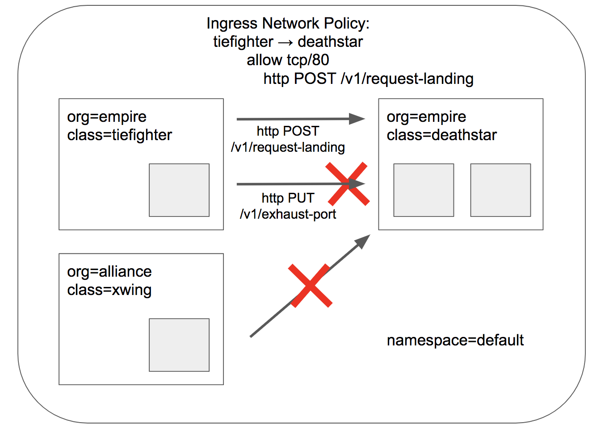

.. _gs_minikube:

********************************
Getting Started Using Minikube
********************************

This guide uses `minikube <https://kubernetes.io/docs/getting-started-guides/minikube/>`_
to demonstrate deployment and operation of Cilium in a single-node Kubernetes cluster.
The minikube VM requires approximately 2 GB of RAM and supports hypervisors like VirtualBox
that run on Linux, macOS, and Windows.

If you instead want to understand the details of
deploying Cilium on a full fledged Kubernetes cluster, then go straight to
:ref:`admin_install_daemonset`.

.. include:: gsg_intro.rst
.. include:: minikube_intro.rst

Step 1: Installing Cilium
=========================

The next step is to install Cilium into your Kubernetes cluster.  Cilium installation
leverages the `Kubernetes Daemon Set <https://kubernetes.io/docs/concepts/workloads/controllers/daemonset/>`_
abstraction, which will deploy one Cilium pod per
cluster node.  This Cilium pod will run in the ``kube-system`` namespace along with
all other system relevant daemons and services.  The Cilium pod will run both the Cilium
agent and the Cilium CNI plugin.

To deploy Cilium, run:

.. tabs::
  .. group-tab:: K8s 1.7

    .. parsed-literal::

      $ kubectl create -f \ |SCM_WEB|\/examples/kubernetes/1.7/cilium.yaml
      clusterrole "cilium" created
      serviceaccount "cilium" created
      clusterrolebinding "cilium" created
      configmap "cilium-config" created
      secret "cilium-etcd-secrets" created
      daemonset "cilium" created

  .. group-tab:: K8s 1.8

    .. parsed-literal::

      $ kubectl create -f \ |SCM_WEB|\/examples/kubernetes/1.8/cilium.yaml
      clusterrole "cilium" created
      serviceaccount "cilium" created
      clusterrolebinding "cilium" created
      configmap "cilium-config" created
      secret "cilium-etcd-secrets" created
      daemonset "cilium" created

  .. group-tab:: K8s 1.9

    .. parsed-literal::

      $ kubectl create -f \ |SCM_WEB|\/examples/kubernetes/1.9/cilium.yaml
      clusterrole "cilium" created
      serviceaccount "cilium" created
      clusterrolebinding "cilium" created
      configmap "cilium-config" created
      secret "cilium-etcd-secrets" created
      daemonset "cilium" created

  .. group-tab:: K8s 1.10

    .. parsed-literal::

      $ kubectl create -f \ |SCM_WEB|\/examples/kubernetes/1.10/cilium.yaml
      clusterrole "cilium" created
      serviceaccount "cilium" created
      clusterrolebinding "cilium" created
      configmap "cilium-config" created
      secret "cilium-etcd-secrets" created
      daemonset "cilium" created

  .. group-tab:: K8s 1.11

    .. parsed-literal::

      $ kubectl create -f \ |SCM_WEB|\/examples/kubernetes/1.11/cilium.yaml
      clusterrole "cilium" created
      serviceaccount "cilium" created
      clusterrolebinding "cilium" created
      configmap "cilium-config" created
      secret "cilium-etcd-secrets" created
      daemonset "cilium" created

Kubernetes is now deploying Cilium with its RBAC, ConfigMap and Daemon Set as a
pod on all cluster nodes. This operation is performed in the background.

Run the following command to check the progress of the deployment:

::

    $ kubectl get pods --namespace kube-system
    NAME                          READY     STATUS    RESTARTS   AGE
    cilium-1c2cz                  1/1       Running   0          21m
    kube-addon-manager-minikube   1/1       Running   0          23m
    kube-dns-910330662-jqdjk      3/3       Running   0          23m
    kubernetes-dashboard-g8nzs    1/1       Running   0          23m

Wait until the Cilium pod shows the ``STATUS`` as ``Running``, like above. In this tutorial, it's okay to 
move forward with the ``READY`` status as 0.

Step 2: Deploy the Demo Application
===================================

Now that we have Cilium deployed and ``kube-dns`` operating correctly we can deploy our demo application.

In our Star Wars inspired, simple example, there are three microservices applications: *deathstar*, *tiefighter*, and *xwing*. *deathstar* runs an HTTP webservice on port 80, which is exposed as a `Kubernetes Service <https://kubernetes.io/docs/concepts/services-networking/service/>`_ that load-balances requests to *deathstar* across two pod replicas. The *deathstar* service provides landing services to the empire's spaceships so that they can request a landing port. *tiefighter* represents a landing-request client service on a typical empire ship and *xwing* represents a similar service on an alliance ship. They exist so that we can test different security policies for access control to *deathstar* landing services.

**Application Topology for Cilium and Kubernetes**

.. image:: images/cilium_http_gsg.png
   :height: 250px
   :width: 750px
   :scale: 50 %

The file ``http-sw-app.yaml`` contains a `Kubernetes Deployment <https://kubernetes.io/docs/concepts/workloads/controllers/deployment/>`_ for each of the three services.
Each deployment is identified using the Kubernetes labels (org=empire, class=deathstar), (org=empire, class=tiefighter),
and (org=alliance, class=xwing).
It also includes a deathstar-service, which load-balances traffic to all pods with label (org=empire, class=deathstar).

.. parsed-literal::

    $ kubectl create -f \ |SCM_WEB|\/examples/minikube/http-sw-app.yaml
    service "deathstar" created
    deployment "deathstar" created
    deployment "tiefighter" created
    deployment "xwing" created

Kubernetes will deploy the pods and service in the background.  Running
``kubectl get svc,pods`` will inform you about the progress of the operation.
Each pod will go through several states until it reaches ``Running`` at which
point the pod is ready.

::

    $ kubectl get pods,svc
    NAME                             READY     STATUS    RESTARTS   AGE
    po/deathstar-76995f4687-2mxb2    1/1       Running   0          1m
    po/deathstar-76995f4687-xbgnl    1/1       Running   0          1m
    po/tiefighter-68c6cb4b4b-rxcb2   1/1       Running   0          1m
    po/xwing-cc65988f5-7cvn8         1/1       Running   0          1m

    NAME             TYPE        CLUSTER-IP       EXTERNAL-IP   PORT(S)   AGE
    svc/deathstar    ClusterIP   10.109.254.198   <none>        80/TCP    3h
    svc/kubernetes   ClusterIP   10.96.0.1        <none>        443/TCP   3h

Each pod will be represented in Cilium as an :ref:`endpoint`. We can invoke the
``cilium`` tool inside the Cilium pod to list them:

::

    $ kubectl -n kube-system get pods -l k8s-app=cilium
    NAME           READY     STATUS    RESTARTS   AGE
    cilium-1c2cz   1/1       Running   0          26m

    $ kubectl -n kube-system exec cilium-1c2cz cilium endpoint list
    ENDPOINT   POLICY (ingress)   POLICY (egress)   IDENTITY   LABELS (source:key[=value])                   IPv6                 IPv4            STATUS   
               ENFORCEMENT        ENFORCEMENT                                                                                                     
    7624       Disabled            Disabled          9919       k8s:class=deathstar                           f00d::a0f:0:0:1dc8   10.15.185.9     ready   
                                                               k8s:io.kubernetes.pod.namespace=default                                                    
                                                               k8s:org=empire                                                                             
    10900      Disabled           Disabled          32353      k8s:class=xwing                               f00d::a0f:0:0:2a94   10.15.92.254    ready   
                                                               k8s:io.kubernetes.pod.namespace=default                                                    
                                                               k8s:org=alliance                                                                           
    11010      Disabled            Disabled          9919       k8s:class=deathstar                           f00d::a0f:0:0:2b02   10.15.197.34    ready   
                                                               k8s:io.kubernetes.pod.namespace=default                                                    
                                                               k8s:org=empire                                                                                                                            
    50240      Disabled           Disabled          12904      k8s:class=tiefighter                          f00d::a0f:0:0:c440   10.15.28.62     ready   
                                                               k8s:io.kubernetes.pod.namespace=default                                                    
                                                               k8s:org=empire 
                                                           
Both ingress and egress policy enforcement is still disabled on all of these pods because no network
policy has been imported yet which select any of the pods.

Step 3: Checking Current Access 
===============================
From the perspective of *deathstar* service providers only the ships with label *org=empire* are allowed to connect and request landing. Since we have no rules enforced, both *xwing* and *tiefighter* will be able to request landing. To test this use below commands by **replacing the xwing and tiefighter podnames** with the ones in your deployment.

.. parsed-literal::

    $ kubectl exec xwing-cc65988f5-7cvn8 -- curl -s -XPOST deathstar.default.svc.cluster.local/v1/request-landing
    Ship landed
    $ kubectl exec  tiefighter-68c6cb4b4b-rxcb2  -- curl -s -XPOST deathstar.default.svc.cluster.local/v1/request-landing
    Ship landed

Step 4: Apply an L3/L4 Policy
=============================

When using Cilium, endpoint IP addresses are irrelevant when defining security
policies. Instead, you can use the labels assigned to the pods to define
security policies. The policies will be applied to the right pods based on the labels irrespective of where or when it is running within the cluster. 

We'll start with the basic policy restricting deathstar landing requests to only the ships that have label (org=empire). This will not allow any ships that don't have the org=empire label to even connect with the deathstar service. 
This is a simple policy that filters only on IP protocol (network layer 3) and TCP protocol (network layer 4), so it is often referred to as an L3/L4 network security policy.

Note: Cilium performs stateful *connection tracking*, meaning that if policy allows
the frontend to reach backend, it will automatically allow all required reply
packets that are part of backend replying to frontend within the context of the
same TCP/UDP connection.

**L4 Policy with Cilium and Kubernetes**

.. image:: images/cilium_http_l3_l4_gsg.png
   :height: 250px
   :width: 750px
   :scale: 50 %

We can achieve that with the following CiliumNetworkPolicy:

.. literalinclude:: ../../examples/minikube/sw_l3_l4_policy.yaml

CiliumNetworkPolicies match on pod labels using "endpointSelector" to
identify the sources and destinations to which the policy applies.
The above policy whitelists traffic sent from any pods with label (org=empire) to *deathstar* pods with label (org=empire, class=deathstar) on TCP port 80.

To apply this L3/L4 policy, run:

.. parsed-literal::

    $ kubectl create -f \ |SCM_WEB|\/examples/minikube/sw_l3_l4_policy.yaml

Now if we run the landing requests again, only the *tiefighter* pods with the label *org=empire* will succeed. The *xwing* pods will be blocked!

.. parsed-literal::
    $ kubectl exec  tiefighter-68c6cb4b4b-rxcb2  -- curl -s -XPOST deathstar.default.svc.cluster.local/v1/request-landing
    Ship landed

This works as expected. Now the same request run from an *xwing* pod will fail:

.. parsed-literal::
    $ kubectl exec xwing-cc65988f5-7cvn8 -- curl -s -XPOST deathstar.default.svc.cluster.local/v1/request-landing
    
This request will hang, so press Control-C to kill the curl request, or wait for it
to time out.

Step 5: Inspecting the Policy 
=============================

If we run ``cilium endpoint list`` again we will see that the pods with the label ``org=empire and class=deathstar`` now have ingress policy enforcement enabled inline with the policy above.

::

    $ kubectl -n kube-system exec cilium-1c2cz cilium endpoint list
    ENDPOINT   POLICY (ingress)   POLICY (egress)   IDENTITY   LABELS (source:key[=value])                   IPv6                 IPv4            STATUS   
               ENFORCEMENT        ENFORCEMENT                                                                                                     
    7624       Enabled            Disabled          9919       k8s:class=deathstar                           f00d::a0f:0:0:1dc8   10.15.185.9     ready   
                                                               k8s:io.kubernetes.pod.namespace=default                                                    
                                                               k8s:org=empire                                                                             
    10900      Disabled           Disabled          32353      k8s:class=xwing                               f00d::a0f:0:0:2a94   10.15.92.254    ready   
                                                               k8s:io.kubernetes.pod.namespace=default                                                    
                                                               k8s:org=alliance                                                                                                                         
    11010      Enabled            Disabled          9919       k8s:class=deathstar                           f00d::a0f:0:0:2b02   10.15.197.34    ready   
                                                               k8s:io.kubernetes.pod.namespace=default                                                    
                                                               k8s:org=empire                                                                                                                            
    50240      Disabled           Disabled          12904      k8s:class=tiefighter                          f00d::a0f:0:0:c440   10.15.28.62     ready   
                                                               k8s:io.kubernetes.pod.namespace=default                                                    
                                                               k8s:org=empire 

You can also inspect the policy details via ``kubectl``

::

    $ kubectl get cnp
    NAME      AGE
    rule1     42s

    $ kubectl describe cnp rule1
    Name:         rule1
    Namespace:    default
    Labels:       <none>
    Annotations:  kubectl.kubernetes.io/last-applied-configuration={"apiVersion":"cilium.io/v2","description":"L3-L4 policy to restrict deathstar access to empire ships only","kind":"CiliumNetworkPolicy","metadata":{"a...
    API Version:  cilium.io/v2
    Kind:         CiliumNetworkPolicy
    Metadata:
      Cluster Name:        
      Creation Timestamp:  2018-04-14T07:38:51Z
      Generation:          0
      Resource Version:    24334
      Self Link:           /apis/cilium.io/v2/namespaces/default/ciliumnetworkpolicies/rule1
      UID:                 e025de8b-3fb6-11e8-ab5f-08002737c671
    Spec:
      Endpoint Selector:
        Match Labels:
          Any : Class:  deathstar
          Any : Org:    empire
      Ingress:
        From Endpoints:
          Match Labels:
            Any : Org:  empire
        To Ports:
          Ports:
            Port:      80
            Protocol:  TCP
    Status:
      Nodes:
        Minikube:
          Enforcing:              true
          Last Updated:           2018-04-14T07:38:55.174693943Z
          Local Policy Revision:  87
          Ok:                     true
    Events:                       <none>

Step 6:  Apply and Test HTTP-aware L7 Policy
============================================

In the simple scenario above, it was sufficient to either give *tiefighter* /
*xwing* full access to *deathstar's* API or no access at all. But to
provide the strongest security (i.e., enforce least-privilege isolation)
between microservices, each service that calls *deathstar's* API should be
limited to making only the set of HTTP requests it requires for legitimate
operation.

For example, consider that the *deathstar* service exposes some maintenance APIs which should not be called by random empire ships. To see this run:
::

    $ kubectl exec tiefighter-68c6cb4b4b-rxcb2 -- curl -s -XPUT deathstar.default.svc.cluster.local/v1/exhaust-port
    Panic: deathstar exploded

    goroutine 1 [running]:
    main.HandleGarbage(0x2080c3f50, 0x2, 0x4, 0x425c0, 0x5, 0xa)
            /code/src/github.com/empire/deathstar/
            temp/main.go:9 +0x64
    main.main()
            /code/src/github.com/empire/deathstar/
            temp/main.go:5 +0x85

While this is an illustrative example, unauthorized access such as above can have adverse security repercussions. 

**L7 Policy with Cilium and Kubernetes**

Cilium is capable of enforcing HTTP-layer (i.e., L7) policies to limit what
URLs *tiefighter* is allowed to reach.  Here is an example policy file that
extends our original policy by limiting *tiefighter* to making only a POST /v1/request-landing
API call, but disallowing all other calls (including PUT /v1/exhaust-port).

.. literalinclude:: ../../examples/minikube/sw_l3_l4_l7_policy.yaml

Update the existing rule to apply L7-aware policy to protect *app1* using:

.. parsed-literal::

  $ kubectl apply -f \ |SCM_WEB|\/examples/minikube/sw_l3_l4_l7_policy.yaml

We can now re-run the same test as above, but we will see a different outcome:

::

    $ kubectl exec tiefighter-68c6cb4b4b-rxcb2 -- curl -s -XPOST deathstar.default.svc.cluster.local/v1/request-landing
    Ship landed

and

::

    $ kubectl exec tiefighter-68c6cb4b4b-rxcb2 -- curl -s -XPUT deathstar.default.svc.cluster.local/v1/exhaust-port
    Access denied

As you can see, with Cilium L7 security policies, we are able to permit
*tiefighter* to access only the required API resources on *deathstar*, thereby
implementing a "least privilege" security approach for communication between
microservices.

You can observe the L7 policy via ``kubectl``:

::

    $ kubectl get ciliumnetworkpolicies
    Name:         rule1
    Namespace:    default
    Labels:       <none>
    Annotations:  kubectl.kubernetes.io/last-applied-configuration={"apiVersion":"cilium.io/v2","description":"L3-L4 policy to restrict deathstar access to empire ships only","kind":"CiliumNetworkPolicy","metadata":{"a...
    API Version:  cilium.io/v2
    Kind:         CiliumNetworkPolicy
    Metadata:
      Cluster Name:        
      Creation Timestamp:  2018-04-14T07:38:51Z
      Generation:          0
      Resource Version:    26083
      Self Link:           /apis/cilium.io/v2/namespaces/default/ciliumnetworkpolicies/rule1
      UID:                 e025de8b-3fb6-11e8-ab5f-08002737c671
    Spec:
      Endpoint Selector:
        Match Labels:
          Any : Class:  deathstar
          Any : Org:    empire
      Ingress:
        From Endpoints:
          Match Labels:
            Any : Org:  empire
        To Ports:
          Ports:
            Port:      80
            Protocol:  TCP
          Rules:
            Http:
              Method:  POST
              Path:    /v1/request-landing
    Status:
      Nodes:
        Minikube:
          Enforcing:              true
          Last Updated:           2018-04-14T08:13:12.094961363Z
          Local Policy Revision:  93
          Ok:                     true
    Events:                       <none>
     

and ``cilium`` CLI:

::

    $ kubectl -n kube-system exec cilium-qh5l2 cilium policy get
    [
      {
        "endpointSelector": {
          "matchLabels": {
            "any:class": "deathstar",
            "any:org": "empire",
            "k8s:io.kubernetes.pod.namespace": "default"
          }
        },
        "ingress": [
          {
            "fromEndpoints": [
              {
                "matchLabels": {
                  "any:org": "empire",
                  "k8s:io.kubernetes.pod.namespace": "default"
                }
              }
            ],
            "toPorts": [
              {
                "ports": [
                  {
                    "port": "80",
                    "protocol": "TCP"
                  }
                ],
                "rules": {
                  "http": [
                    {
                      "path": "/v1/request-landing",
                      "method": "POST"
                    }
                  ]
                }
              }
            ]
          }
        ],
        "labels": [
          {
            "key": "io.cilium.k8s.policy.name",
            "value": "rule1",
            "source": "unspec"
          },
          {
            "key": "io.cilium.k8s.policy.namespace",
            "value": "default",
            "source": "unspec"
          }
        ]
      }
    ]
    Revision: 10

We hope you enjoyed the tutorial.  Feel free to play more with the setup, read
the rest of the documentation, and reach out to us on the `Cilium
Slack channel <https://cilium.herokuapp.com>`_ with any questions!

Step 7:  Clean-Up
=================

You have now installed Cilium, deployed a demo app, and tested both
L3/L4 and L7 network security policies.

::

   $ minikube delete

After this, you can re-run this guide from Step 1.

Extra:  Metrics
===============

To try out the metrics exported by cilium, simply install the example prometheus spec file:

.. tabs::
  .. group-tab:: K8s 1.7

    .. parsed-literal::

      $ kubectl create -f \ |SCM_WEB|\/examples/kubernetes/addons/prometheus/prometheus.yaml
      $ kubectl replace --force -f \ |SCM_WEB|\/examples/kubernetes/1.7/cilium.yaml

  .. group-tab:: K8s 1.8

    .. parsed-literal::

      $ kubectl create -f \ |SCM_WEB|\/examples/kubernetes/addons/prometheus/prometheus.yaml
      $ kubectl replace --force -f \ |SCM_WEB|\/examples/kubernetes/1.8/cilium.yaml

  .. group-tab:: K8s 1.9

    .. parsed-literal::

      $ kubectl create -f \ |SCM_WEB|\/examples/kubernetes/addons/prometheus/prometheus.yaml
      $ kubectl replace --force -f \ |SCM_WEB|\/examples/kubernetes/1.9/cilium.yaml

  .. group-tab:: K8s 1.10

    .. parsed-literal::

      $ kubectl create -f \ |SCM_WEB|\/examples/kubernetes/addons/prometheus/prometheus.yaml
      $ kubectl replace --force -f \ |SCM_WEB|\/examples/kubernetes/1.10/cilium.yaml

  .. group-tab:: K8s 1.11

    .. parsed-literal::

      $ kubectl create -f \ |SCM_WEB|\/examples/kubernetes/addons/prometheus/prometheus.yaml
      $ kubectl replace --force -f \ |SCM_WEB|\/examples/kubernetes/1.11/cilium.yaml

This will create a barebones prometheus installation that you can use to
inspect metrics from the agent, then restart cilium so it can consume the new
prometheus configuration. Navigate to the web ui with:

::

   $ minikube service prometheus -n prometheus

