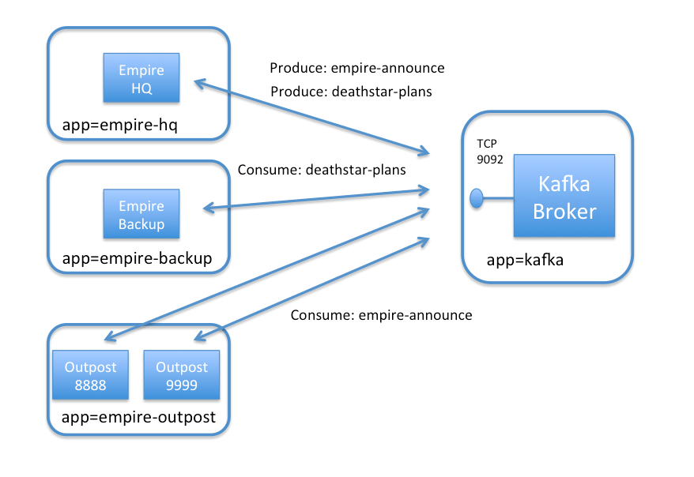
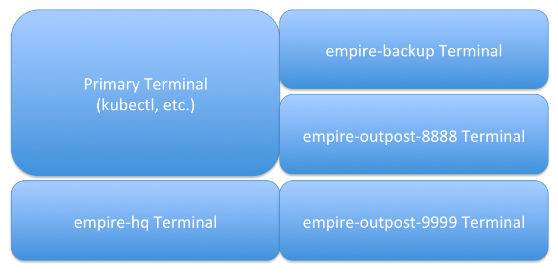
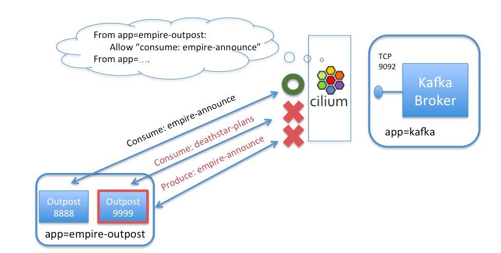

*******************************************
Getting Started Using Kubernetes with Kafka
*******************************************

This document serves as an introduction to using Cilium to enforce Kafka-aware
security policies.  It is a detailed walk-through of getting a single-node Cilium environment running on
your machine. It is designed to take 15-30 minutes.

If you haven't read the :ref:`intro` yet, we'd encourage you to do that first.

The best way to get help if you get stuck is to ask a question on the `Cilium
Slack channel <https://cilium.herokuapp.com>`_.  With Cilium contributors
across the globe, there is almost always someone available to help.

Step 0: Install kubectl & minikube
==================================

This guide uses `minikube <https://kubernetes.io/docs/getting-started-guides/minikube/>`_
to demonstrate deployment and operation of Cilium + Kafka in a single-node Kubernetes cluster.
The minikube VM requires approximately 2 GB of RAM and supports hypervisors like VirtualBox
that run on Linux, macOS, and Windows.

If you instead want to understand the details of
deploying Cilium on a full-fledged Kubernetes cluster, then go straight to
:ref:`admin_install_daemonset`.

Install ``kubectl`` version ``>= 1.6.3`` as described in the `Kubernetes Docs
<https://kubernetes.io/docs/tasks/tools/install-kubectl/>`_.

Install one of the `hypervisors supported by minikube <https://kubernetes.io/docs/tasks/tools/install-minikube/>`_.

Install ``minikube`` ``>= 0.22.3`` as described on `minikube's github page
<https://github.com/kubernetes/minikube/releases>`_.

Then, boot a minikube cluster with the Container Network Interface (CNI) network plugin enabled:

::

    $ minikube start --network-plugin=cni

After minikube has finished  setting up your new Kubernetes cluster, you can
check the status of the cluster by running ``kubectl get cs``:

::

    $ kubectl get cs
    NAME                 STATUS    MESSAGE              ERROR
    controller-manager   Healthy   ok
    scheduler            Healthy   ok
    etcd-0               Healthy   {"health": "true"}

If you see output similar to this, you are ready to proceed to installing Cilium.

Step 1: Installing Cilium
=========================

The next step is to install Cilium into your Kubernetes cluster.  Cilium installation
leverages the `Kubernetes Daemon Set <https://kubernetes.io/docs/concepts/workloads/controllers/daemonset/>`_
abstraction, which will deploy one Cilium pod per
cluster node.   This Cilium pod will run in the ``kube-system`` namespace along with
all other system relevant daemons and services.  The Cilium pod will run both the Cilium
agent and the Cilium CNI plugin.

To deploy Cilium, run:

.. parsed-literal::

    $ kubectl create -f \ |SCM_WEB|\/examples/kubernetes/cilium.yaml
    clusterrole "cilium" created
    serviceaccount "cilium" created
    clusterrolebinding "cilium" created
    configmap "cilium-config" created
    secret "cilium-etcd-secrets" created
    daemonset "cilium" created

Kubernetes is now deploying Cilium with its RBAC, ConfigMap and Daemon Set as a
pod on minkube. This operation is performed in the background.

Run the following command to check the progress of the deployment:

::

    $ kubectl get ds --namespace kube-system
    NAME            DESIRED   CURRENT   READY     NODE-SELECTOR   AGE
    cilium          1         1         0         <none>          2m

Wait until the cilium Deployment shows a ``CURRENT`` count of ``1`` like above (a ``READY`` value of ``0`` is OK
for this tutorial).

Step 2: Deploy the Demo Application
===================================

Now that we have Cilium deployed and ``kube-dns`` operating correctly we can
deploy our demo Kafka application.  Since our first demo of Cilium + HTTP-aware security
policies was Star Wars-themed we decided to do the same for Kafka.  While the
`HTTP-aware Cilium  Star Wars demo <https://www.cilium.io/blog/2017/5/4/demo-may-the-force-be-with-you>`_
showed how the Galactic Empire used HTTP-aware security policies to protect the Death Star from the
Rebel Alliance, this Kafka demo shows how the lack of Kafka-aware security policies allowed the
Rebels to steal the Death Star plans in the first place.

Kafka is a powerful platform for passing datastreams between different components of an application.
A cluster of "Kafka brokers" connect nodes that "produce" data into a data stream, or "consume" data
from a datastream.   Kafka refers to each datastream as a "topic".
Because scalable and highly-available Kafka clusters are non-trivial to run, the same cluster of
Kafka brokers often handles many different topics at once (read this `Introduction to Kafka
<https://kafka.apache.org/intro>`_ for more background).

In our simple example, the Empire uses a Kafka cluster to handle two different topics:

- *empire-announce* : Used to broadcast announcements to sites spread across the galaxy
- *deathstar-plans* : Used by a small group of sites coordinating on building the ultimate battlestation.

To keep the setup small, we will just launch a small number of pods to represent this setup:

- *kafka-broker* : A single pod running Kafka and Zookeeper representing the Kafka cluster
  (label app=kafka).
- *empire-hq* : A pod representing the Empire's Headquarters, which is the only pod that should
  produce messages to *empire-announce* or *deathstar-plans* (label app=empire-hq).
- *empire-backup* : A secure backup facility located in `Scarif <http://starwars.wikia.com/wiki/Scarif_vault>`_ ,
  which is allowed to "consume" from the secret *deathstar-plans* topic (label app=empire-backup).
- *empire-outpost-8888* : A random outpost in the empire.  It needs to "consume" messages from
  the *empire-announce* topic (label app=empire-outpost).
- *empire-outpost-9999* : Another random outpost in the empire that "consumes" messages from
  the *empire-announce* topic (label app=empire-outpost).

All pods other than *kafka-broker* are Kafka clients, which need access to the *kafka-broker*
container on TCP port 9092 in order to send Kafka protocol messages.

The file ``kafka-sw-app.yaml`` contains a Kubernetes Deployment for each of the pods described
above, as well as a Kubernetes Service for both Kafka and Zookeeper.

.. parsed-literal::

    $ kubectl create -f \ |SCM_WEB|\/examples/kubernetes-kafka/kafka-sw-app.yaml
    deployment "kafka-broker" created
    service "zook" created
    service "kafka-service" created
    deployment "empire-hq" created
    deployment "empire-outpost-8888" created
    deployment "empire-outpost-9999" created
    deployment "empire-backup" created

Kubernetes will deploy the pods and service  in the background.  Running
``kubectl get svc,pods`` will inform you about the progress of the operation.
Each pod will go through several states until it reaches ``Running`` at which
point the setup is ready.

::

    $ kubectl get pods,svc
    NAME                                     READY     STATUS    RESTARTS   AGE
    po/empire-backup-955026812-cnv9j         1/1       Running   0          1m
    po/empire-hq-1887702787-48sd1            1/1       Running   0          1m
    po/empire-outpost-8888-422023320-0568m   1/1       Running   0          1m
    po/empire-outpost-9999-422023320-wlllp   1/1       Running   0          1m
    po/kafka-broker-3436435889-tsg2s         2/2       Running   0          1m

    NAME                CLUSTER-IP   EXTERNAL-IP   PORT(S)    AGE
    svc/kafka-service   10.0.0.20    <none>        9092/TCP   1m
    svc/kubernetes      10.0.0.1     <none>        443/TCP    6m
    svc/zook            10.0.0.200   <none>        2181/TCP   1m

Step 3: Setup Client Terminals
==============================

First we will open a set of windows to represent the different Kafka clients discussed above.
For consistency, we recommend opening them in the pattern shown in the image below, but this is optional.

In each window, use copy-paste to have each terminal provide a shell inside each pod.

empire-hq terminal:
::

   $ HQ_POD=$(kubectl get pods -l app=empire-hq -o jsonpath='{.items[0].metadata.name}') && kubectl exec -it $HQ_POD -- sh -c "PS1=\"empire-hq $\" /bin/bash"

empire-backup terminal:
::

   $ BACKUP_POD=$(kubectl get pods -l app=empire-backup -o jsonpath='{.items[0].metadata.name}') && kubectl exec -it $BACKUP_POD -- sh -c "PS1=\"empire-backup $\" /bin/bash"

outpost-8888 terminal:
::

   $ OUTPOST_8888_POD=$(kubectl get pods -l outpostid=8888 -o jsonpath='{.items[0].metadata.name}') && kubectl exec -it $OUTPOST_8888_POD -- sh -c "PS1=\"outpost-8888 $\" /bin/bash"

outpost-9999 terminal:
::

   $ OUTPOST_9999_POD=$(kubectl get pods -l outpostid=9999 -o jsonpath='{.items[0].metadata.name}') && kubectl exec -it $OUTPOST_9999_POD -- sh -c "PS1=\"outpost-9999 $\" /bin/bash"

Step 4: Test Basic Kafka Produce & Consume
==========================================

First, let's start the consumer clients listening to their respective Kafka topics.  All of the consumer
commands below will hang intentionally, waiting to print data they consume from the Kafka topic:

In the *empire-backup* window, start listening on the top-secret *deathstar-plans* topic:

::

    $ ./kafka-consume.sh --topic deathstar-plans

In the *outpost-8888* window, start listening to *empire-announcement*:

::

    $ ./kafka-consume.sh --topic empire-announce

Do the same in the *outpost-9999* window:

::

    $ ./kafka-consume.sh --topic empire-announce

Now from the *empire-hq*, first produce a message to the *empire-announce* topic:

::

   $ echo "Happy 40th Birthday to General Tagge" | ./kafka-produce.sh --topic empire-announce

This message will be posted to the *empire-announce* topic, and shows up in both the *outpost-8888* and
*outpost-9999* windows who consume that topic.   It will not show up in *empire-backup*.

*empire-hq* can also post a version of the top-secret deathstar plans to the *deathstar-plans* topic:

::

   $ echo "deathstar reactor design v3" | ./kafka-produce.sh --topic deathstar-plans

This message shows up in the *empire-backup* window, but not for the outposts.

Congratulations, Kafka is working as expected :)

Step 5:  The Danger of a Compromised Kafka Client
=================================================

But what if a rebel spy gains access to any of the remote outposts that act as Kafka clients?
Since every client has access to the Kafka broker on port 9092, it can do some bad stuff.
For starters, the outpost container can actually switch roles from a consumer to a producer,
sending "malicious" data to all other consumers on the topic.

To prove this, kill the existing ``kafka-consume.sh`` command in the outpost-9999 window
by typing control-C and instead run:

::

  $ echo "Vader Booed at Empire Karaoke Party" | ./kafka-produce.sh --topic empire-announce

Uh oh!  Outpost-8888 and all of the other outposts in the empire have now received this fake announcement.

But even more nasty from a security perspective is that the outpost container can access any topic
on the kafka-broker.

In the outpost-9999 container, run:

::

  $ ./kafka-consume.sh --topic deathstar-plans
  "deathstar reactor design v3"

We see that any outpost can actually access the secret deathstar plans.  Now we know how the rebels got
access to them!

Step 6: Securing Access to Kafka with Cilium
============================================

Obviously, it would be much more secure to limit each pod's access to the Kafka broker to be
least privilege (i.e., only what is needed for the app to operate correctly and nothing more).

We can do that with the following Cilium security policy.   As with Cilium HTTP policies, we can write
policies that identify pods by labels, and then limit the traffic in/out of this pod.  In
this case, we'll create a policy that identifies the exact traffic that should be allowed to reach the
Kafka broker, and deny the rest.

As an example, a policy could limit containers with label *app=empire-outpost* to only be able to consume
topic *empire-announce*, but would block any attempt by a compromised container (e.g., empire-outpost-9999)
from producing to *empire-announce* or consuming from *deathstar-plans*.

Here is the *CiliumNetworkPolicy* rule that limits access of pods with label *app=empire-outpost* to
only consume on topic *empire-announce*:

.. literalinclude:: ../examples/policies/getting-started/kafka.yaml

A *CiliumNetworkPolicy* contains a list of rules that define allowed requests, meaning that requests
that do not match any rules are denied as invalid.

The above rule applies to inbound (i.e., "ingress") connections to kafka-broker pods (as
indicated by "app: kafka"
in the "endpointSelector" section).  The rule will apply to connections from pods with label
"app: empire-outpost" as indicated by the "fromEndpoints" section.   The rule explicitly matches
Kafka connections destined to TCP 9092, and white-lists a list of protocol requests according to various
fields found in Kafka protocol messages.  Specifically, each request contains an "apiKey" field that
indicates the type of request, and the policy white-lists several apiKey's here, the most important being the
apiKey "fetch",
which allows the client to consume from a particular topic.   Notice that requests with "apiKey: fetch"
are further limited by a "topic" field, in this case *empire-announce*.

The full policy adds two additional rules that permit the legitimate produce request
(topic *empire-announce* and topic *deathstar-plans*) from *empire-hq* and the
legitimate fetch requests (topic = "deathstar-plans") from *empire-backup*.  The full policy
can be reviewed by opening the URL in the command below in a browser.

Apply this Kafka-aware network security policy using ``kubectl`` in the main window:

.. parsed-literal::

    $ kubectl create -f \ |SCM_WEB|\/examples/kubernetes-kafka/kafka-sw-security-policy.yaml

If we then again try to produce a message from outpost-9999 to *empire-annnounce*, it is denied.
Type control-c and then run:

::

  $ echo "Vader Trips on His Own Cape" | ./kafka-produce.sh --topic empire-announce
  [2017-10-31 07:08:34,088] ERROR Error when sending message to topic empire-announce with key: null, value: 33  bytes with error: (org.apache.kafka.clients.producer.internals.ErrorLoggingCallback)
  org.apache.kafka.common.errors.TopicAuthorizationException: Not authorized to access topics: [empire-announce]

This is because the policy does not allow messages with apiKey = "produce" for topic "empire-announce" from
containers with label app = empire-outpost.  Its worth noting that we don't simply drop the message (which
could easily be confused with a network error), but rather we respond with the Kafka access denied error
(similar to how HTTP would return an error code of 403 unauthorized).

Likewise, if the outpost container ever tries to consume from topic *deathstar-plans*, it is denied, as
apiKey = fetch is only allowed for topic *empire-announce*.

To test, from the outpost-9999 terminal, run:

::

  $ ./kafka-consume.sh --topic deathstar-plans
  [2017-10-31 07:09:36,679] WARN Not authorized to read from topic deathstar-plans. (org.apache.kafka.clients.consumer.internals.Fetcher)
  [2017-10-31 07:09:36,683] ERROR Error processing message, terminating consumer process:  (kafka.tools.ConsoleConsumer$)
  org.apache.kafka.common.errors.TopicAuthorizationException: Not authorized to access topics: [deathstar-plans]
  Processed a total of 0 messages

This is blocked as well, thanks to the Cilium network policy.  Imagine how different things would have been if the empire had been using
Cilium from the beginning!

Step 6:  Clean-Up
=================

You have now installed Cilium, deployed a demo app, and tested both
L7 Kafka-aware network security policies.   To clean-up, run:

::

   $ minikube delete

After this, you can re-run the tutorial from Step 1.

