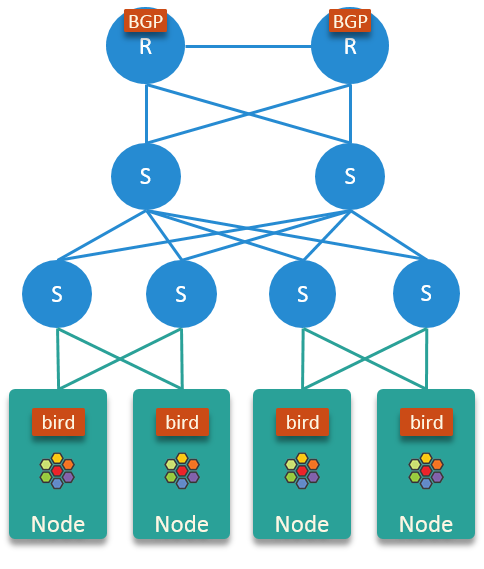
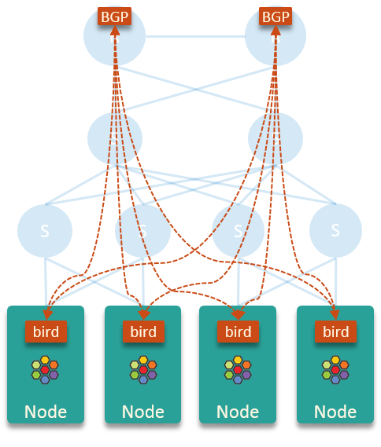
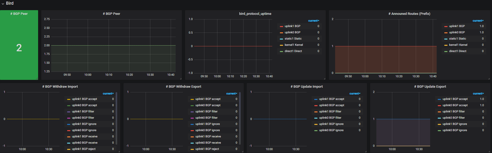

.. only:: not (epub or latex or html)

    WARNING: You are looking at unreleased Cilium documentation.
    Please use the official rendered version released here:
    https://docs.cilium.io

****************************
Using BIRD to run BGP
****************************

`BIRD is an open-source implementation for routing Internet Protocol
packets on Unix-like operating systems <https://en.wikipedia.org/wiki/Bird_Internet_routing_daemon>`_.
If you are not familiar with it, you had best have a glance at the `User's Guide`_ first.

.. _`User's Guide`: https://bird.network.cz/?get_doc&f=bird.html&v=20

BIRD provides a way to advertise routes using traditional networking protocols
to allow Cilium-managed endpoints to be accessible outside the cluster. This
guide assumes that Cilium is already deployed in the cluster, and that the
remaining piece is how to ensure that the pod CIDR ranges are externally
routable.

`BIRD <https://bird.network.cz>`_ maintains two release families at present:
``1.x`` and ``2.x``, and the configuration format varies a lot between them.
Unless you have already deployed the ``1.x``, we suggest using ``2.x``
directly, as the ``2.x`` will live longer. The following examples will denote
``bird`` as the ``bird2`` software and use configuration in the format that
``bird2`` understands.

This guide shows how to install and configure bird on CentOS 7.x to make it
collaborate with Cilium. Installation and configuration on other platforms
should be very similar.

Install bird
##################

.. code-block:: shell-session

    $ yum install -y bird2

    $ systemctl enable bird
    $ systemctl restart bird

Test the installation:

.. code-block:: shell-session

    $ birdc show route
    BIRD 2.0.6 ready.

    $ birdc              # interactive shell
    BIRD 2.0.6 ready.
    bird> show bfd sessions
    There is no BFD protocol running
    bird>
    bird> show protocols all
    Name       Proto      Table      State  Since         Info
    device1    Device     ---        up     10:53:40.147

    direct1    Direct     ---        down   10:53:40.147
      Channel ipv4
        State:          DOWN
        Input filter:   ACCEPT
        Output filter:  REJECT
    ...

Basic configuration
#####################

It's hard to discuss bird configurations without considering specific BGP
schemes. However, BGP scheme design is beyond the scope of this guide.
If you are interested in this topic, refer to `BGP in the Data Center
<https://www.oreilly.com/library/view/bgp-in-the/9781491983416/>`_ (O'Reilly,
2017) for a quick start.

In the following, we will restrict our BGP scenario as follows:

* physical network: simple 3-tier hierarchical architecture
* nodes connect to physical network via layer 2 switches
* announcing each node's PodCIDR to physical network via ``bird``
* for each node, do not import route announcements from physical network

In this design, the BGP connections look like this:

This scheme is simple in that:

* core routers learn PodCIDRs from ``bird``, which makes the Pod IP addresses
  routable within the entire network.
* ``bird`` doesn't learn routes from core routers and other nodes, which keeps the
  kernel routing table of each node clean and small, and suffering no
  performance issues.

In this scheme, each node just sends pod egress traffic to node's default
gateway (the core routers), and lets the latter do the routing.

Below is the a reference configuration for fulfilling the above purposes:

::

    $ cat /etc/bird.conf
    log syslog all;

    router id {{ NODE_IP }};

    protocol device {
            scan time 10;           # Scan interfaces every 10 seconds
    }

    # Disable automatically generating direct routes to all network interfaces.
    protocol direct {
            disabled;               # Disable by default
    }

    # Forbid synchronizing BIRD routing tables with the OS kernel.
    protocol kernel {
            ipv4 {                    # Connect protocol to IPv4 table by channel
                    import none;      # Import to table, default is import all
                    export none;      # Export to protocol. default is export none
            };
    }

    # Static IPv4 routes.
    protocol static {
          ipv4;
          route {{ POD_CIDR }} via "cilium_host";
    }

    # BGP peers
    protocol bgp uplink0 {
          description "BGP uplink 0";
          local {{ NODE_IP }} as {{ NODE_ASN }};
          neighbor {{ NEIGHBOR_0_IP }} as {{ NEIGHBOR_0_ASN }};
          password {{ NEIGHBOR_PWD }};

          ipv4 {
                  import filter {reject;};
                  export filter {accept;};
          };
    }

    protocol bgp uplink1 {
          description "BGP uplink 1";
          local {{ NODE_IP }} as {{ NODE_ASN }};
          neighbor {{ NEIGHBOR_1_IP }} as {{ NEIGHBOR_1_ASN }};
          password {{ NEIGHBOR_PWD }};

          ipv4 {
                  import filter {reject;};
                  export filter {accept;};
          };
    }

Save the above file as ``/etc/bird.conf``, and replace the placeholders with
your own:

.. code-block:: shell-session

    sed -i 's/{{ NODE_IP }}/<your node ip>/g'                /etc/bird.conf
    sed -i 's/{{ POD_CIDR }}/<your pod cidr>/g'              /etc/bird.conf
    sed -i 's/{{ NODE_ASN }}/<your node asn>/g'              /etc/bird.conf
    sed -i 's/{{ NEIGHBOR_0_IP }}/<your neighbor 0 ip>/g'    /etc/bird.conf
    sed -i 's/{{ NEIGHBOR_1_IP }}/<your neighbor 1 ip>/g'    /etc/bird.conf
    sed -i 's/{{ NEIGHBOR_0_ASN }}/<your neighbor 0 asn>/g'  /etc/bird.conf
    sed -i 's/{{ NEIGHBOR_1_ASN }}/<your neighbor 1 asn>/g'  /etc/bird.conf
    sed -i 's/{{ NEIGHBOR_PWD }}/<your neighbor password>/g' /etc/bird.conf

Restart ``bird`` and check the logs:

.. code-block:: shell-session

    $ systemctl restart bird

    # check logs
    $ journalctl -u bird
    -- Logs begin at Sat 2020-02-22 16:11:44 CST, end at Mon 2020-02-24 18:58:35 CST. --
    Feb 24 18:58:24 node systemd[1]: Started BIRD Internet Routing Daemon.
    Feb 24 18:58:24 node systemd[1]: Starting BIRD Internet Routing Daemon...
    Feb 24 18:58:24 node bird[137410]: Started

Verify the changes, you should get something like this:

.. code-block:: shell-session

    $ birdc show route
    BIRD 2.0.6 ready.
    Table master4:
    10.5.48.0/24         unicast [static1 20:14:51.478] * (200)
            dev cilium_host

This indicates that the PodCIDR ``10.5.48.0/24`` on this node has been
successfully imported into BIRD.

.. code-block:: shell-session

   $ birdc show protocols all uplink0 | grep -A 3 -e "Description" -e "stats"
     Description:    BGP uplink 0
     BGP state:          Established
       Neighbor address: 10.4.1.7
       Neighbor AS:      65418
   --
       Route change stats:     received   rejected   filtered    ignored   accepted
         Import updates:              0          0          0          0          0
         Import withdraws:           10          0        ---         10          0
         Export updates:              1          0          0        ---          1

Here we see that the uplink0 BGP session is established and our PodCIDR from
above has been exported and accepted by the BGP peer.

Monitoring
##############

`bird_exporter <https://github.com/czerwonk/bird_exporter>`_ could collect bird
daemon states, and export Prometheus-style metrics.

It also provides a simple Grafana dashboard, but you could also create your
own, e.g. `Trip.com's <https://ctripcloud.github.io/cilium/network/2020/01/19/trip-first-step-towards-cloud-native-networking.html>`_ looks like this:

Advanced Configurations
#######################

You may need some advanced configurations to make your BGP scheme production-ready.
This section lists some of these parameters, but we will not dive into details,
that's BIRD `User's Guide`_'s responsibility.

BFD
----

`Bidirectional Forwarding Detection (BFD)
<https://www.cisco.com/c/en/us/td/docs/ios-xml/ios/iproute_bgp/configuration/xe-16/irg-xe-16-book/bgp-support-for-bfd.html>`_
is a detection protocol designed to accelerate path failure detection.

**This feature also relies on peer side's configuration.**

::

    protocol bfd {
          interface "{{ grains['node_mgnt_device'] }}" {
                  min rx interval 100 ms;
                  min tx interval 100 ms;
                  idle tx interval 300 ms;
                  multiplier 10;
                  password {{ NEIGHBOR_PWD }};
          };

          neighbor {{ NEIGHBOR_0_IP] }};
          neighbor {{ NEIGHBOR_1_IP] }};
    }

    protocol bgp uplink0 {
    		...

            bfd on;
    }

Verify, you should see something like this:

.. code-block:: shell-session

    $ birdc show bfd sessions
    BIRD 2.0.6 ready.
    bfd1:
    IP address                Interface  State      Since         Interval  Timeout
    10.5.40.2                 bond0      Up         20:14:51.479    0.300    0.000
    10.5.40.3                 bond0      Up         20:14:51.479    0.300    0.000

ECMP
------

For some special purposes (e.g. L4LB), you may configure a same CIDR on multiple
nodes. In this case, you need to configure `Equal-Cost Multi-Path (ECMP) routing
<https://en.wikipedia.org/wiki/Equal-cost_multi-path_routing>`_.

**This feature also relies on peer side's configuration.**

::

    protocol kernel {
            ipv4 {                    # Connect protocol to IPv4 table by channel
                    import none;      # Import to table, default is import all
                    export none;      # Export to protocol. default is export none
            };

            # Configure ECMP
            merge paths yes limit {{ N }} ;
    }

See the user manual for more detailed information.

You need to check the ECMP correctness on physical network (Core router in the
above scenario):

.. code-block:: shell-session

    CORE01# show ip route 10.5.2.0
    IP Route Table for VRF "default"
    '*' denotes best ucast next-hop
    '**' denotes best mcast next-hop
    '[x/y]' denotes [preference/metric]
    '%<string>' in via output denotes VRF <string>

    10.5.2.0/24, ubest/mbest: 2/0
        *via 10.4.1.7, [200/0], 13w6d, bgp-65418, internal, tag 65418
        *via 10.4.1.8, [200/0], 12w4d, bgp-65418, internal, tag 65418

Graceful restart
----------------

**This feature also relies on peer side's configuration.**

Add ``graceful restart`` to each ``bgp`` section:

::

    protocol bgp uplink0 {
    		...

            graceful restart;
    }
