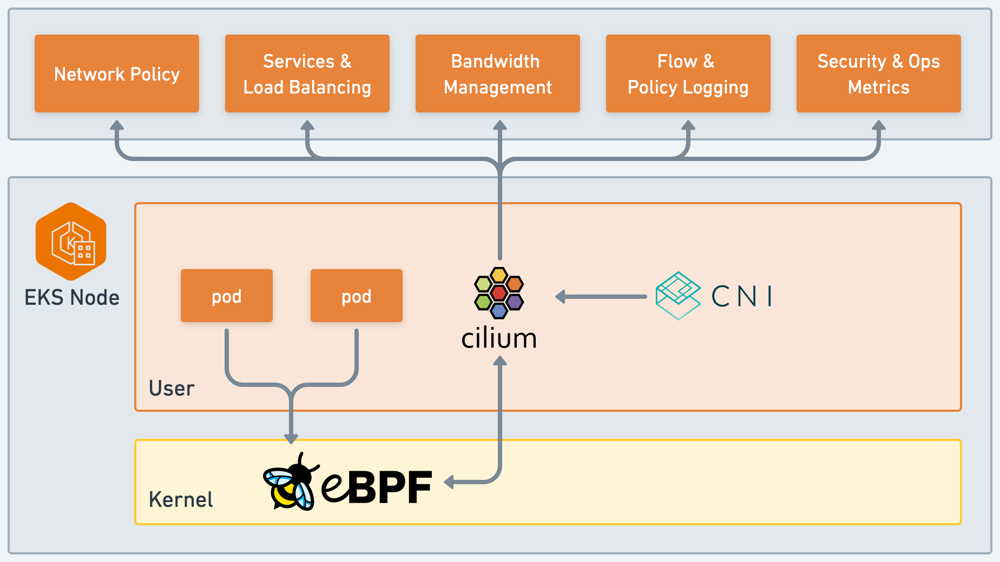
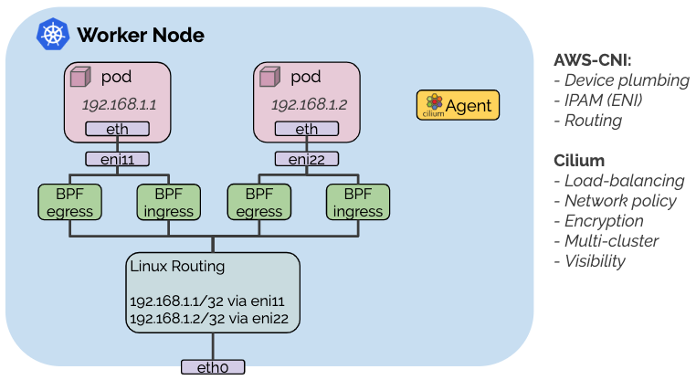

.. only:: not (epub or latex or html)

    WARNING: You are looking at unreleased Cilium documentation.
    Please use the official rendered version released here:
    https://docs.cilium.io

.. _chaining_aws_cni:

******************
AWS VPC CNI plugin
******************

This guide explains how to set up Cilium in combination with the AWS VPC CNI
plugin. In this hybrid mode, the AWS VPC CNI plugin is responsible for setting
up the virtual network devices as well as for IP address management (IPAM) via
ENIs. After the initial networking is setup for a given pod, the Cilium CNI
plugin is called to attach eBPF programs to the network devices set up by the
AWS VPC CNI plugin in order to enforce network policies, perform load-balancing
and provide encryption.

.. include:: cni-chaining-limitations.rst

.. admonition:: Video
  :class: attention

  If you require advanced features of Cilium, consider migrating fully to Cilium.
  To help you with the process, you can watch two Principal Engineers at Meltwater talk about `how they migrated
  Meltwater's production Kubernetes clusters - from the AWS VPC CNI plugin to Cilium <https://www.youtube.com/watch?v=w6S6baRHHu8&list=PLDg_GiBbAx-kDXqDYimwytMLh2kAHyMPd&t=182s>`__.

.. important::

   Please ensure that you are running version `1.11.2 <https://github.com/aws/amazon-vpc-cni-k8s/releases/tag/v1.11.2>`_
   or newer of the AWS VPC CNI plugin to guarantee compatibility with Cilium.

   .. code-block:: shell-session

      $ kubectl -n kube-system get ds/aws-node -o json | jq -r '.spec.template.spec.containers[0].image'
      602401143452.dkr.ecr.us-west-2.amazonaws.com/amazon-k8s-cni:v1.11.2

   If you are running an older version, as in the above example, you can upgrade it with:

   .. code-block:: shell-session

      $ kubectl apply -f https://raw.githubusercontent.com/aws/amazon-vpc-cni-k8s/release-1.11/config/master/aws-k8s-cni.yaml

Setting up a cluster on AWS
===========================

Follow the instructions in the :ref:`k8s_install_quick` guide to set up an EKS
cluster, or use any other method of your preference to set up a Kubernetes
cluster on AWS.

Ensure that the `aws-vpc-cni-k8s <https://github.com/aws/amazon-vpc-cni-k8s>`_
plugin is installed — which will already be the case if you have created an EKS
cluster. Also, ensure the version of the plugin is up-to-date as per the above.

.. include:: k8s-install-download-release.rst

Deploy Cilium via Helm:

.. parsed-literal::

   helm install cilium |CHART_RELEASE| \\
     --namespace kube-system \\
     --set cni.chainingMode=aws-cni \\
     --set cni.exclusive=false \\
     --set enableIPv4Masquerade=false \\
     --set routingMode=native \\
     --set endpointRoutes.enabled=true

This will enable chaining with the AWS VPC CNI plugin. It will also disable
tunneling, as it's not required since ENI IP addresses can be directly routed
in the VPC. For the same reason, masquerading can be disabled as well.

Restart existing pods
=====================

The new CNI chaining configuration *will not* apply to any pod that is already
running in the cluster. Existing pods will be reachable, and Cilium will
load-balance *to* them, but not *from* them. Policy enforcement will also not
be applied. For these reasons, you must restart these pods so that the chaining
configuration can be applied to them.

The following command can be used to check which pods need to be restarted:

.. code-block:: bash

   for ns in $(kubectl get ns -o jsonpath='{.items[*].metadata.name}'); do
        ceps=$(kubectl -n "${ns}" get cep \
            -o jsonpath='{.items[*].metadata.name}')
        pods=$(kubectl -n "${ns}" get pod \
            -o custom-columns=NAME:.metadata.name,NETWORK:.spec.hostNetwork \
            | grep -E '\s(<none>|false)' | awk '{print $1}' | tr '\n' ' ')
        ncep=$(echo "${pods} ${ceps}" | tr ' ' '\n' | sort | uniq -u | paste -s -d ' ' -)
        for pod in $(echo $ncep); do
          echo "${ns}/${pod}";
        done
   done

.. include:: k8s-install-validate.rst

Advanced
========

Enabling security groups for pods (EKS)
---------------------------------------

Cilium can be used alongside the `security groups for pods <https://docs.aws.amazon.com/eks/latest/userguide/security-groups-for-pods.html>`_
feature of EKS in supported clusters when running in chaining mode. Follow the
instructions below to enable this feature:

.. important::

   The following guide requires `jq <https://stedolan.github.io/jq/>`_ and the
   `AWS CLI <https://aws.amazon.com/cli/>`_ to be installed and configured.

Make sure that the ``AmazonEKSVPCResourceController`` managed policy is attached
to the IAM role associated with the EKS cluster:

.. code-block:: shell-session

   export EKS_CLUSTER_NAME="my-eks-cluster" # Change accordingly
   export EKS_CLUSTER_ROLE_NAME=$(aws eks describe-cluster \
        --name "${EKS_CLUSTER_NAME}" \
        | jq -r '.cluster.roleArn' | awk -F/ '{print $NF}')
   aws iam attach-role-policy \
        --policy-arn arn:aws:iam::aws:policy/AmazonEKSVPCResourceController \
        --role-name "${EKS_CLUSTER_ROLE_NAME}"

Then, as mentioned above, make sure that the version of the AWS VPC CNI
plugin running in the cluster is up-to-date:

.. code-block:: shell-session

   kubectl -n kube-system get ds/aws-node \
     -o jsonpath='{.spec.template.spec.containers[0].image}'
   602401143452.dkr.ecr.us-west-2.amazonaws.com/amazon-k8s-cni:v1.7.10

Next, patch the ``kube-system/aws-node`` DaemonSet in order to enable security
groups for pods:

.. code-block:: shell-session

   kubectl -n kube-system patch ds aws-node \
     -p '{"spec":{"template":{"spec":{"initContainers":[{"env":[{"name":"DISABLE_TCP_EARLY_DEMUX","value":"true"}],"name":"aws-vpc-cni-init"}],"containers":[{"env":[{"name":"ENABLE_POD_ENI","value":"true"}],"name":"aws-node"}]}}}}'
   kubectl -n kube-system rollout status ds aws-node

After the rollout is complete, all nodes in the cluster should have the ``vps.amazonaws.com/has-trunk-attached`` label set to ``true``:

.. code-block:: shell-session

   kubectl get nodes -L vpc.amazonaws.com/has-trunk-attached
   NAME                                            STATUS   ROLES    AGE   VERSION              HAS-TRUNK-ATTACHED
   ip-192-168-111-169.eu-west-2.compute.internal   Ready    <none>   22m   v1.19.6-eks-49a6c0   true
   ip-192-168-129-175.eu-west-2.compute.internal   Ready    <none>   22m   v1.19.6-eks-49a6c0   true

From this moment everything should be in place. For details on how to actually
associate security groups to pods, please refer to the `official documentation <https://docs.aws.amazon.com/eks/latest/userguide/security-groups-for-pods.html>`_.

.. include:: next-steps.rst
