.. only:: not (epub or latex or html)

    WARNING: You are looking at unreleased Cilium documentation.
    Please use the official rendered version released here:
    https://docs.cilium.io

.. _rancher_managed_rke_clusters:

**************************
Installation using Rancher
**************************

Introduction
============

If you're not using the Rancher Management Console/UI to install your clusters, head
over to the :ref:`installation guides for standalone RKE clusters <rke_install>`.

Rancher comes with `official support for Cilium <https://ranchermanager.docs.rancher.com/faq/container-network-interface-providers>`__.
For most Rancher users, that's the recommended way to use Cilium on Rancher-managed
clusters.

However, as Rancher is using a custom
``rke2-cilium`` `Helm chart <https://github.com/rancher/rke2-charts/tree/main-source/packages/rke2-cilium>`__
with independent release cycles, Cilium power-users might want to use an
out-of-band Cilium installation instead, based on the official
`Cilium Helm chart <https://github.com/cilium/charts>`__,
on top of their Rancher-managed RKE1/RKE2 downstream clusters.
This guide explains how to achieve this.

.. note::

    This guide only shows a step-by-step guide for Rancher-managed (**non-standalone**)
    **RKE2** clusters.

    However, for a legacy RKE1 cluster, it's even easier. You also need to edit
    the cluster YAML and change ``network.cni`` to ``none`` as described in the
    :ref:`RKE 1 standalone guide<rke1_cni_none>`, but there's no need to copy over
    a Control Plane node local KubeConfig manually. Luckily, Rancher allows access
    to RKE1 clusters in ``Updating`` state, which are not ready yet. Hence, there's
    no chicken-egg issue to resolve.

Prerequisites
=============

* Fully functioning `Rancher Version 2.x <https://ranchermanager.docs.rancher.com/>`__ instance
* At least one empty Linux VM, to be used as initial downstream "Custom Cluster" (Control Plane) node
* DNS record pointing to the Kubernetes API of the downstream "Custom Cluster" Control Plane node(s) or L4 load-balancer

Create a New Cluster
====================

In Rancher UI, navigate to the Cluster Management page. In the top right, click on the
``Create`` button to create a new cluster.

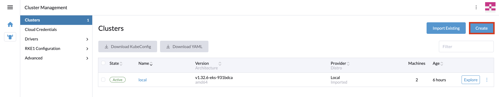

On the Cluster creation page select to create a new ``Custom`` cluster:

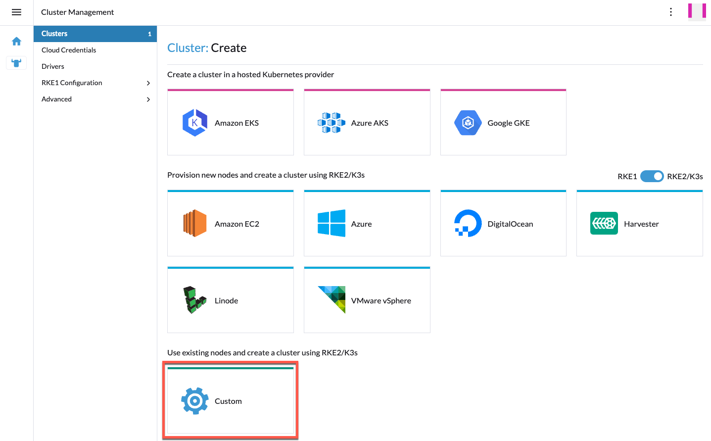

When the ``Create Custom`` page opens, provide at least a name for the cluster.
Go through the other configuration options and configure the ones that are
relevant for your setup.

Next to the ``Cluster Options`` section click the box to ``Edit as YAML``.
The configuration for the cluster will open up in an editor in the window.

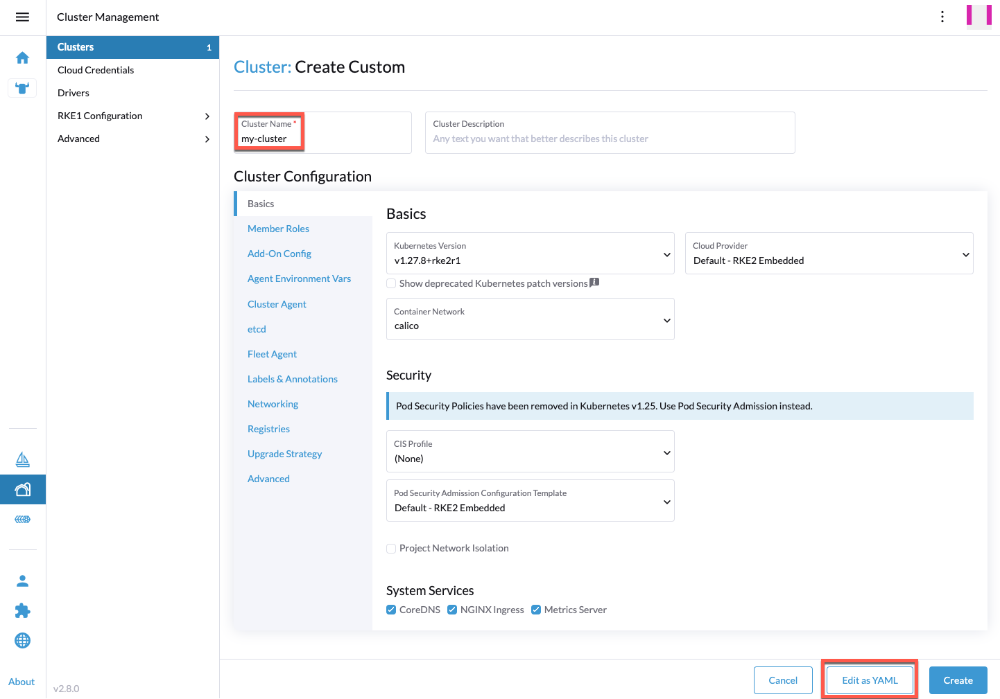

Within the ``Cluster`` CustomResource (``provisioning.cattle.io/v1``), the relevant
parts to change are ``spec.rkeConfig.machineGlobalConfig.cni``,
``spec.rkeConfig.machineGlobalConfig.tls-san``, and optionally
``spec.rkeConfig.chartValues.rke2-calico`` and
``spec.rkeConfig.machineGlobalConfig.disable-kube-proxy``:

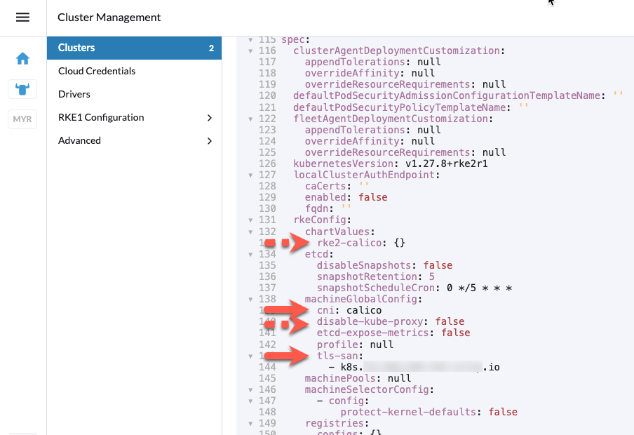

It's required to add a DNS record, pointing to the Control Plane node IP(s)
or an L4 load-balancer in front of them, under
``spec.rkeConfig.machineGlobalConfig.tls-san``, as that's required to resolve
a chicken-egg issue further down the line.

Ensure that ``spec.rkeConfig.machineGlobalConfig.cni`` is set to ``none`` and
``spec.rkeConfig.machineGlobalConfig.tls-san`` lists the mentioned DNS record:

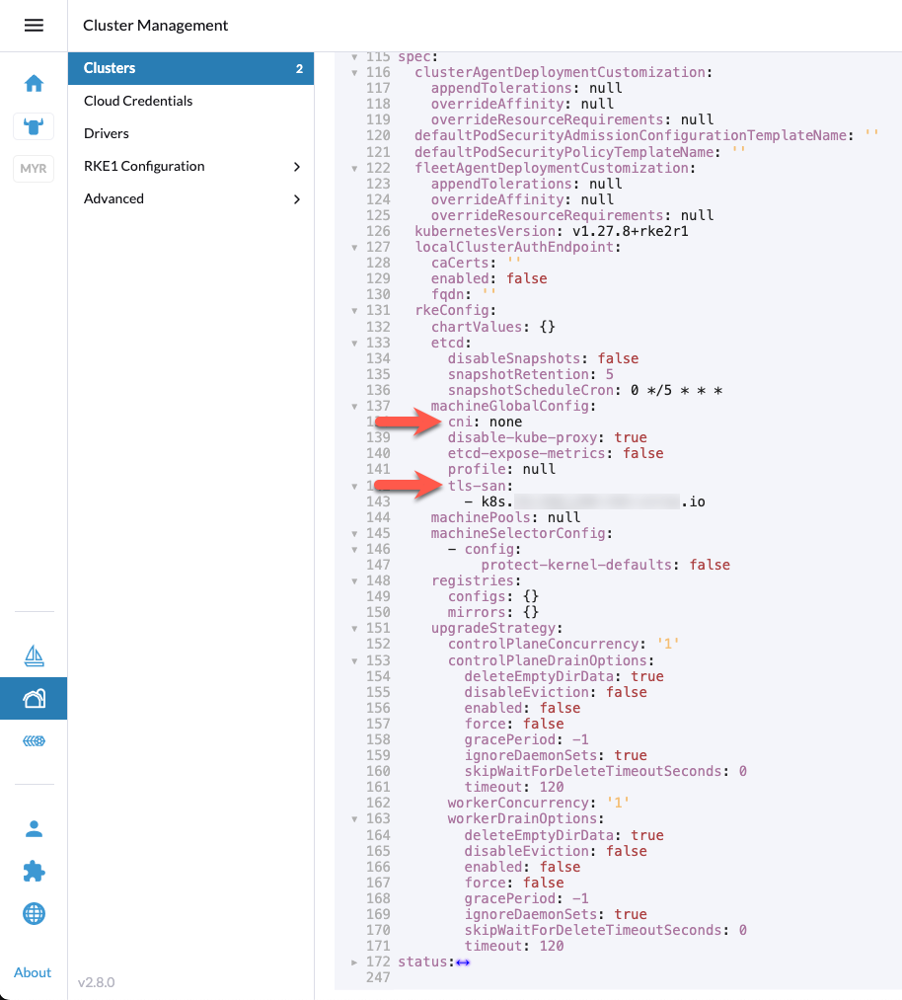

Optionally, if ``spec.rkeConfig.chartValues.rke2-calico`` is not empty, remove the
full object as you won't deploy Rancher's default CNI. At the same time, change
``spec.rkeConfig.machineGlobalConfig.disable-kube-proxy`` to ``true`` in case you
want to run :ref:`Cilium without Kube-Proxy<kubeproxy-free>`.

Make any additional changes to the configuration that are appropriate for your
environment. When you are ready, click ``Create`` and Rancher will create the
cluster.

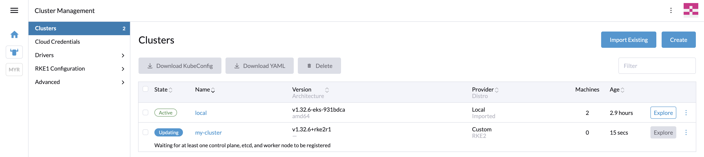

The cluster will stay in ``Updating`` state until you add nodes. Click on the cluster.
In the ``Registration`` tab you should see the generated ``Registation command`` you
need to run on the downstream cluster nodes.

Do not forget to select the correct node roles. Rancher comes with the default to
deploy all three roles (``etcd``, ``Control Plane``, and ``Worker``), which is often
not what you want for multi-node clusters.

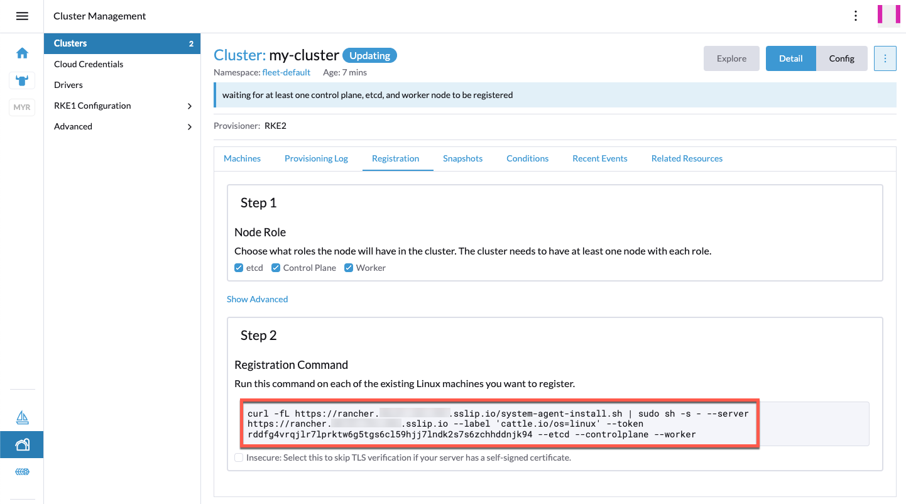

A few seconds after you added at least a single node, you should see the new node(s)
in the ``Machines`` tab. The machine will be stuck in ``Reconciling`` state and
won't become ``Active``:

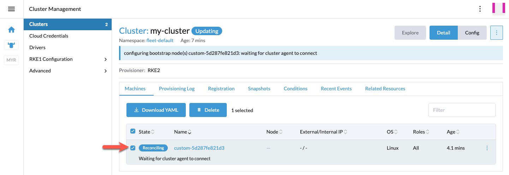

That's expected as there's no CNI running on this cluster yet. Unfortunately, this also
means critical pods like ``rke2-coredns-rke2-coredns-*`` and ``cattle-cluster-agent-*`` 
are stuck in ``PENDING`` state. Hence, the downstream cluster is not yet able
to register itself on Rancher.

As a next step, you need to resolve this chicken-egg issue by directly accessing
the downstream cluster's Kubernetes API, without going via Rancher. Rancher will not allow
access to this downstream cluster, as it's still in ``Updating`` state. That's why you
can't use the downstream cluster's KubeConfig provided by the Rancher management console/UI.

Copy ``/etc/rancher/rke2/rke2.yaml`` from the first downstream cluster Control Plane
node to your jump/bastion host where you have ``helm`` installed and can access the
Cilium Helm charts.

.. code-block:: shell-session

    scp root@<cp-node-1-ip>:/etc/rancher/rke2/rke2.yaml .

Search and replace ``127.0.0.1`` (``clusters[0].cluster.server``) with the
already mentioned DNS record pointing to the Control Plane / L4 load-balancer IP(s).

.. code-block:: yaml

    apiVersion: v1
    clusters:
    - cluster:
        certificate-authority-data: LS0...S0K
        server: https://127.0.0.1:6443
    name: default
    contexts: {}

Check if you can access the Kubernetes API:

.. code-block:: shell-session

    export KUBECONFIG=$(pwd)/my-cluster-kubeconfig.yaml
    kubectl get nodes
    NAME                    STATUS     ROLES                       AGE   VERSION
    rancher-demo-node       NotReady   control-plane,etcd,master   44m   v1.27.8+rke2r1

If successful, you can now install Cilium via Helm CLI:

.. parsed-literal::

    helm install cilium |CHART_RELEASE| \\
      --namespace kube-system \\
      -f my-cluster-cilium-values.yaml

After a few minutes, you should see that the node changed to the ``Ready`` status:

.. code-block:: shell-session

    kubectl get nodes
    NAME                    STATUS   ROLES                       AGE   VERSION
    rancher-demo-node       Ready    control-plane,etcd,master   48m   v1.27.8+rke2r1

Back in the Rancher UI, you should see that the cluster changed to the healthy
``Active`` status:

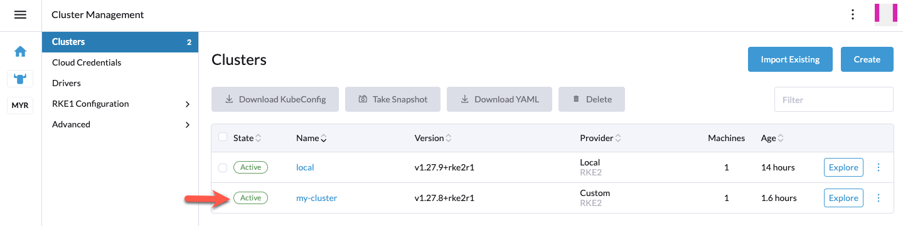

That's it. You can now normally work with this cluster as if you
installed the CNI the default Rancher way. Additional nodes can now be added
straightaway and the "local Control Plane RKE2 KubeConfig" workaround
is not required anymore.

Optional: Add Cilium to Rancher Registries
==========================================

One small, optional convenience item would be to add the Cilium Helm repository
to Rancher so that, in the future, Cilium can easily be upgraded via Rancher UI.

You have two options available:

**Option 1**: Navigate to ``Cluster Management`` -> ``Advanced`` -> ``Repositories`` and
click the ``Create`` button:

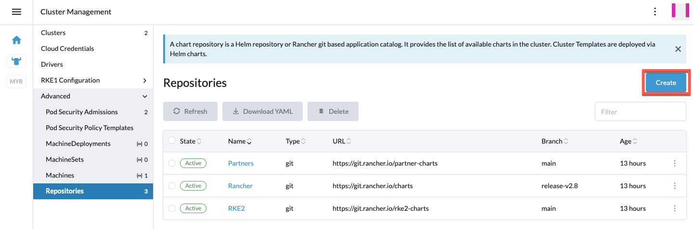

**Option 2**: Alternatively, you can also just add the Cilium Helm repository
on a single cluster by navigating to ``<your-cluster>`` -> ``Apps`` -> ``Repositories``:

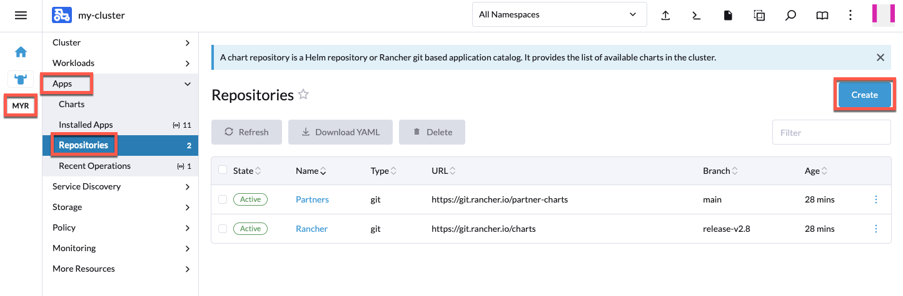

For either option, in the window that opens, add the official Cilium Helm chart
repository (``https://helm.cilium.io``) to the Rancher repository list:

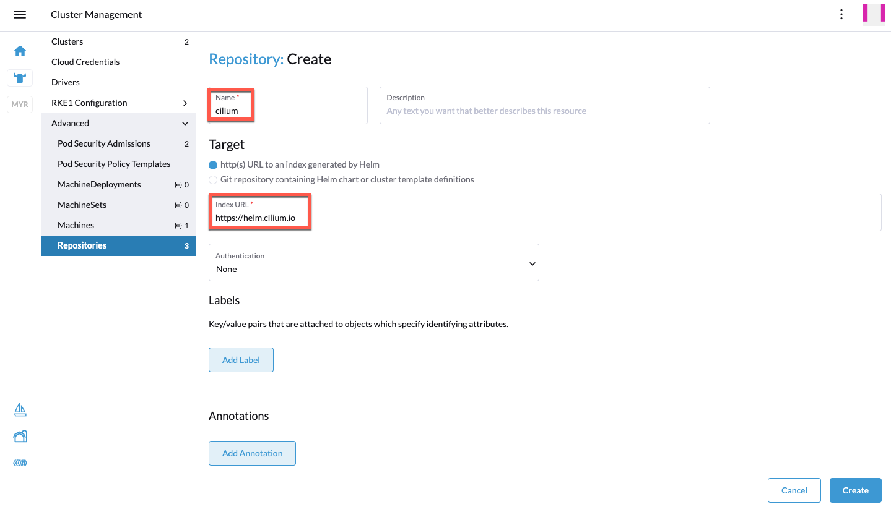

Once added, you should see the Cilium repository in the repositories list:

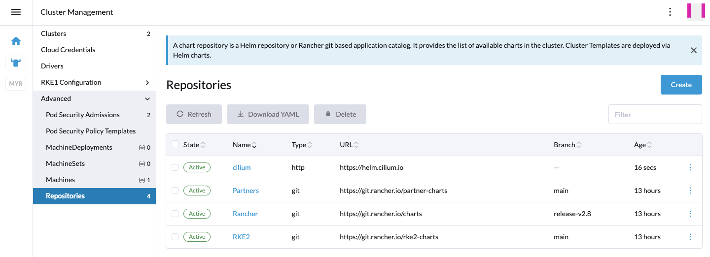

If you now head to ``<your-cluster>`` -> ``Apps`` -> ``Installed Apps``, you
should see the ``cilium`` app. Ensure ``All Namespaces`` or
``Project: System -> kube-system`` is selected at the top of the page.

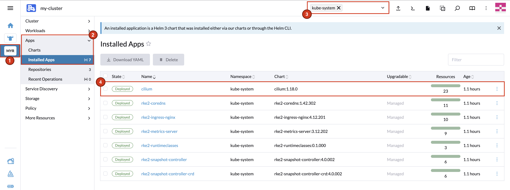

Since you added the Cilium repository, you will now see a small hint on this app entry
when there's a new Cilium version released. You can then upgrade directly via Rancher UI.

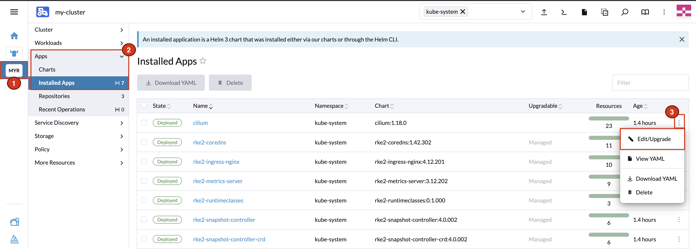

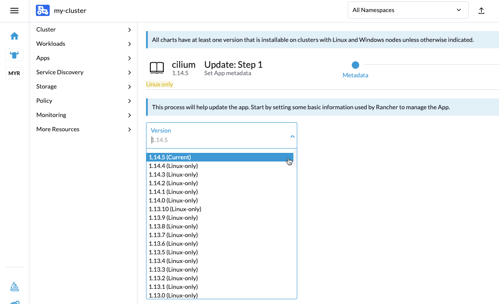