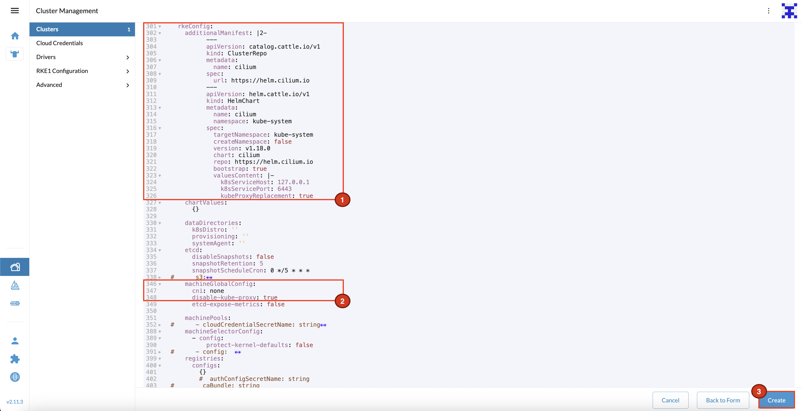
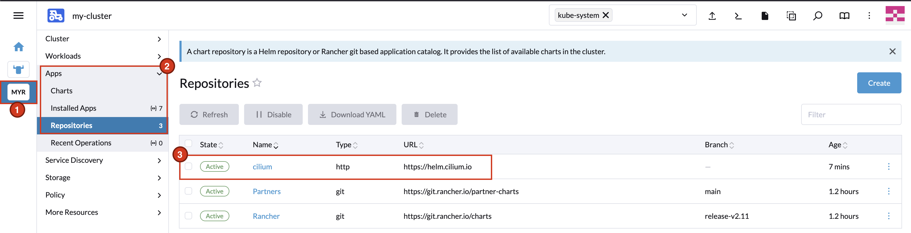

.. only:: not (epub or latex or html)

    WARNING: You are looking at unreleased Cilium documentation.
    Please use the official rendered version released here:
    https://docs.cilium.io

.. _rancher_managed_rke_clusters:

**************************
Installation using Rancher
**************************

Introduction
============

If you're not using the Rancher Management Console/UI to install your clusters, head
over to the :ref:`installation guides for standalone RKE clusters <rke_install>`.

Rancher comes with `official support for Cilium <https://ranchermanager.docs.rancher.com/faq/container-network-interface-providers>`__.
For most Rancher users, that's the recommended way to use Cilium on Rancher-managed
clusters.

However, as Rancher is using a custom
``rke2-cilium`` `Helm chart <https://github.com/rancher/rke2-charts/tree/main-source/packages/rke2-cilium>`__
with independent release cycles, Cilium power-users might want to use an
out-of-band Cilium installation instead, based on the official
`Cilium Helm chart <https://github.com/cilium/charts>`__,
on top of their Rancher-managed RKE2 downstream clusters.
This guide explains how to achieve this.

.. note::

    This guide only shows a step-by-step guide for Rancher-managed (**non-standalone**)
    **RKE2** clusters.

.. note::

    This guide shows how to install Cilium on Rancher-managed Custom Clusters.
    However, this method also applies to clusters created with providers such as VMware vSphere.

Prerequisites
=============

* Fully functioning `Rancher Version 2.x <https://ranchermanager.docs.rancher.com/>`__ instance
* At least one empty Linux VM, to be used as initial downstream "Custom Cluster" (Control Plane) node
* DNS record pointing to the Kubernetes API of the downstream "Custom Cluster" Control Plane node(s) or L4 load-balancer

Create a New Cluster
====================

In Rancher UI, navigate to the Cluster Management page. In the top right, click on the
``Create`` button to create a new cluster.

.. image:: images/rancher_add_cluster.png

On the Cluster creation page select to create a new ``Custom`` cluster:

.. image:: images/rancher_existing_nodes.png

When the ``Create Custom`` page opens, provide a name for the cluster. 
In the same ``Basics`` section, expand ``Container Network`` drop down list and select ``none``.

.. image:: images/rancher_select_cni.png

Go through the other configuration options and configure the ones that are
relevant for your setup.

Add ``HelmChart`` manifests to install Cilium using the RKE2 built-in Helm Operator. 
Go to the ``Additional Manifests`` section and paste the following YAML. Add relevant values for your Cilium installation.

.. code-block:: yaml

   apiVersion: catalog.cattle.io/v1
   kind: ClusterRepo
   metadata:
     name: cilium
   spec:
     url: https://helm.cilium.io

.. code-block:: yaml

   apiVersion: helm.cattle.io/v1
   kind: HelmChart
   metadata:
     name: cilium
     namespace: kube-system
   spec:
     targetNamespace: kube-system
     createNamespace: false
     version: v1.18.0
     chart: cilium
     repo: https://helm.cilium.io
     bootstrap: true
     valuesContent: |-
       # paste your Cilium values here:
       k8sServiceHost: 127.0.0.1
       k8sServicePort: 6443
       kubeProxyReplacement: true

.. note::

    ``k8sServiceHost`` should be set to ``127.0.0.1`` and ``k8sServicePort`` to ``6443``. Cilium Agent running on control plane nodes will use local address for communication with Kubernetes API process.
    On Control Plane nodes you can verify this by running:

    .. code-block:: shell-session

      $ sudo ss -tulpn | grep 6443
      tcp   LISTEN 0      4096                 *:6443             *:*    users:(("kube-apiserver",pid=124481,fd=3))

    While On worker nodes, Cilium Agent will use the local address to communicate with ``rke2`` process, which is listening on port ``6443``. The process ``rke2`` proxies requests to the Kubernetes API server running on the Control Plane node(s):

    .. code-block:: shell-session
      
      $ sudo ss -tulpn | grep 6443
      tcp   LISTEN 0      4096         127.0.0.1:6443       0.0.0.0:*    users:(("rke2",pid=113574,fd=8)) 

Click the ``Edit as YAML`` box at the bottom of the page.
The cluster configuration will open in an editor within the window.

Within the ``Cluster`` Custom Resource (``provisioning.cattle.io/v1``), 
verify the ``rkeConfig`` section. It should consist of the manifests that you added to the ``Additional Manifests`` section.

If you like to disable the default kube-proxy and your Cilium configuration enables :ref:`Kube-Proxy Replacement <kubeproxy-free>`, check the ``spec.rkeConfig.machineGlobalConfig`` section and set
``spec.rkeConfig.machineGlobalConfig.disable-kube-proxy`` to ``true``.

When you are ready, click ``Create`` and Rancher will create the cluster.

The cluster will stay in ``Updating`` state until you add nodes. Click on the cluster.
In the ``Registration`` tab you should see the generated ``Registration command`` you
need to run on the downstream cluster nodes.

Do not forget to select the correct node roles. Rancher comes with the default to
deploy all three roles (``etcd``, ``Control Plane``, and ``Worker``), which is often
not what you want for multi-node clusters.

A few seconds after you added at least a single node, you should see the new node(s)
in the ``Machines`` tab. Cilium CNI will be installed during the cluster bootstrap process 
by Helm Operator, which creates a Kubernetes Job that will install Cilium on the cluster.

After a few minutes, you should see that the node changed to the ``Ready`` status:

.. code-block:: shell-session

    kubectl get nodes -A
    NAME            STATUS   ROLES                              AGE   VERSION
    ip-10-1-1-167   Ready    control-plane,etcd,master,worker   41m   v1.32.6+rke2r1
    ip-10-1-1-231   Ready    control-plane,etcd,master,worker   41m   v1.32.6+rke2r1
    ip-10-1-1-50    Ready    control-plane,etcd,master,worker   45m   v1.32.6+rke2r1

Back in the Rancher UI, you should see that the cluster changed to the healthy
``Active`` status:

That's it! You can now work with this cluster as if you had installed the CNI using the default Rancher method. 
You can scale the cluster up or down, add or remove nodes, and so on.

Verify Cilium Installation
==========================

After the installation, the Cilium repository and Helm release will be tracked by Rancher. You can manage the Cilium lifecycle
using the Rancher UI. To verify that Cilium is installed, check the Cilium app in the Rancher UI.

Navigate to ``<your-cluster>`` -> ``Apps`` -> ``Installed Apps``. From the top drop-down menu, select
``All Namespaces`` or ``Project: System -> kube-system`` to see the Cilium app.

.. image:: images/rancher_cluster_cilium_app.png

The Cilium Helm repository has been added to Rancher within the ``Additional Manifests`` section.

  
Once the new Cilium version will be available, you will now see a small hint on this app entry
when there's a new Cilium version released. You can then upgrade directly via Rancher UI.

