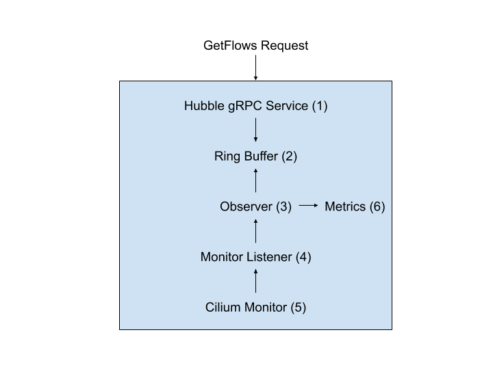

.. only:: not (epub or latex or html)

    WARNING: You are looking at unreleased Cilium documentation.
    Please use the official rendered version released here:
    https://docs.cilium.io

.. _hubble_internals:

****************
Hubble internals
****************

.. note:: This documentation section is targeted at developers who are
          interested in contributing to Hubble. For this purpose, it describes
          Hubble internals.

.. note:: This documentation covers the Hubble server (sometimes referred as
          "Hubble embedded") and Hubble Relay components but does not cover the
          Hubble UI and CLI.

Hubble builds on top of Cilium and eBPF to enable deep visibility into the
communication and behavior of services as well as the networking infrastructure
in a completely transparent manner. One of the design goals of Hubble is to
achieve all of this at large scale.

Hubble's server component is embedded into the Cilium agent in order to achieve
high performance with low-overhead. The gRPC services offered by Hubble server
may be consumed locally via a Unix domain socket or, more typically, through
Hubble Relay. Hubble Relay is a standalone component which is aware of all
Hubble instances and offers full cluster visibility by connecting to their
respective gRPC APIs. This capability is usually referred to as multi-node.
Hubble Relay's main goal is to offer a rich API that can be safely exposed and
consumed by the Hubble UI and CLI.

Hubble Architecture
===================

Hubble exposes gRPC services from the Cilium process that allows clients to
receive flows and other type of data.

Hubble server
-------------

The Hubble server component implements two gRPC services. The **Observer
service** which may optionally be exposed via a TCP socket in addition to a
local Unix domain socket and the **Peer service**, which is served on both
as well as being exposed as a Kubernetes Service when enabled via TCP.

The Observer service
^^^^^^^^^^^^^^^^^^^^

The Observer service is the principal service. It provides three RPC endpoints:
``GetFlows``, ``GetNodes`` and ``ServerStatus``.  While ``ServerStatus`` and
``GetNodes`` endpoints are pretty straightforward (they provides metrics and
other information related to the running instance(s)), ``GetFlows`` is far more
sophisticated and the more important one.

Using ``GetFlows``, callers get a stream of payloads. Request parameters allow
callers to specify filters in the form of allow lists and deny lists to allow
for fine-grained filtering of data.

In order to answer ``GetFlows`` requests, Hubble stores monitoring events from
Cilium's event monitor into a user-space ring buffer structure. Monitoring
events are obtained by registering a new listener on Cilium monitor. The
ring buffer is capable of storing a configurable amount of events in memory.
Events are continuously consumed, overriding older ones once the ring buffer is
full.

Additionally, the Observer service also provides the ``GetAgentEvents`` and
``GetDebugEvents`` RPC endpoints to expose data about the Cilium agent events
and Cilium datapath debug events, respectively. Both are similar to ``GetFlows``
except they do not implement filtering capabilities.

For efficiency, the internal buffer length is a bit mask of ones + 1. The most
significant bit of this bit mask is the same position of the most significant
bit position of 'n'. In other terms, the internal buffer size is always a power
of 2 with 1 slot reserved for the writer. In effect, from a user perspective,
the ring buffer capacity is one less than a power of 2. As the ring buffer is a
hot code path, it has been designed to not employ any locking mechanisms and
uses atomic operations instead. While this approach has performance benefits,
it also has the downsides of being a complex component.

Due to its complex nature, the ring buffer is typically accessed via a ring
reader that abstracts the complexity of this data structure for reading. The
ring reader allows reading one event at the time with 'previous' and 'next'
methods but also implements a follow mode where events are continuously read as
they are written to the ring buffer.

The Peer service
^^^^^^^^^^^^^^^^

The Peer service sends information about Hubble peers in the cluster in a
stream. When the ``Notify`` method is called, it reports information about all
the peers in the cluster and subsequently sends information about peers that
are updated, added, or removed from the cluster. Thus, it allows the caller to
keep track of all Hubble instances and query their respective gRPC services.

This service is exposed as a Kubernetes Service and is primarily used by Hubble
Relay in order to have a cluster-wide view of all Hubble instances.

The Peer service obtains peer change notifications by subscribing to Cilium's
node manager. To this end, it internally defines a handler that implements
Cilium's datapath node handler interface.

.. _hubble_relay:

Hubble Relay
------------

Hubble Relay is the Hubble component that brings multi-node support. It
leverages the Peer service to obtain information about Hubble instances and
consume their gRPC API in order to provide a more rich API that covers events
from across the entire cluster (or even multiple clusters in a ClusterMesh
scenario).

Hubble Relay was first introduced as a technology preview with the release of
Cilium v1.8 and was declared stable with the release of Cilium v1.9.

Hubble Relay implements the Observer service for multi-node. To that end, it
maintains a persistent connection with every Hubble peer in a cluster with a
peer manager. This component provides callers with the list of peers. Callers
may report when a peer is unreachable, in which case the peer manager will
attempt to reconnect.

As Hubble Relay connects to every node in a cluster, the Hubble server
instances must make their API available (by default on port 4244). By default,
Hubble server endpoints are secured using mutual TLS (mTLS) when exposed on a
TCP port in order to limit access to Hubble Relay only.
