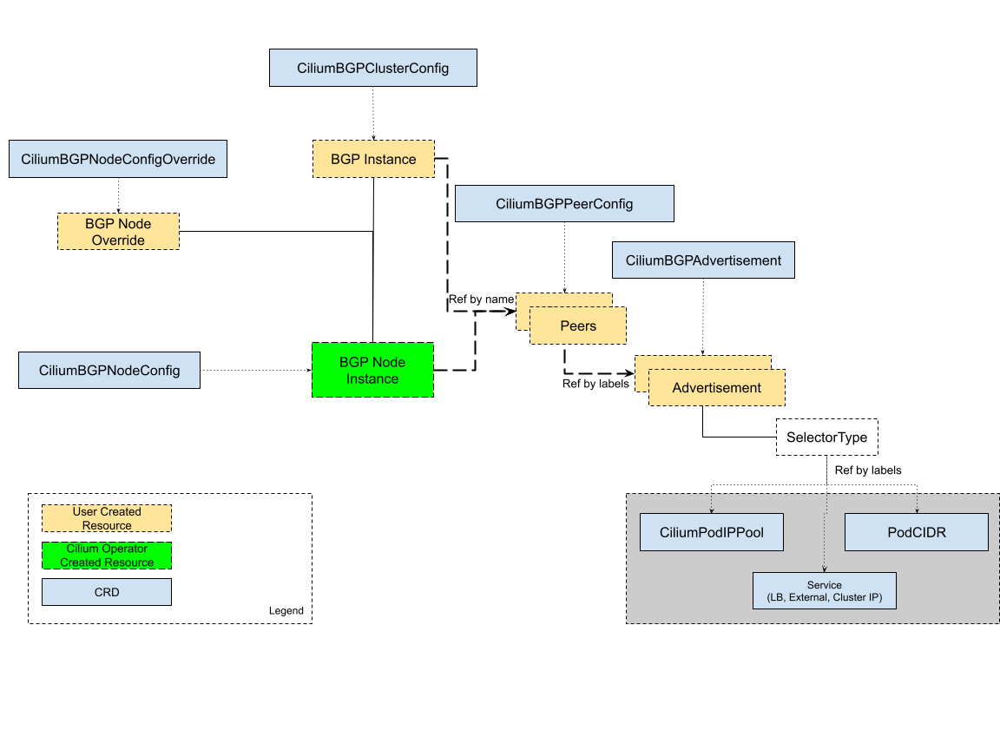

.. only:: not (epub or latex or html)

    WARNING: You are looking at unreleased Cilium documentation.
    Please use the official rendered version released here:
    https://docs.cilium.io

.. _bgp_control_plane_v2:

BGP Control Plane Resources
###########################

Cilium BGP control plane is managed by a set of custom resources which provide a flexible way to
configure BGP peers, policies, and advertisements.

The following resources are used to manage the BGP Control Plane:

* ``CiliumBGPClusterConfig``: Defines BGP instances and peer configurations that are applied to multiple nodes.
* ``CiliumBGPPeerConfig``: A common set of BGP peering setting. It can be used across multiple peers.
* ``CiliumBGPAdvertisements``: Defines prefixes that are injected into the BGP routing table.
* ``CiliumBGPNodeConfigOverride``: Defines node-specific BGP configuration to provide a finer control.

The relationship between various resources is shown in the below diagram:

BGP Cluster Configuration
=========================

``CiliumBGPClusterConfig`` resource is used to define BGP configuration for one or more nodes in
the cluster based on its ``nodeSelector`` field. Each ``CiliumBGPClusterConfig`` defines one or
more BGP instances, which are uniquely identified by their ``name`` field.

A BGP instance can have one or more peers. Each peer is uniquely identified by its ``name`` field. The Peer
autonomous number and peer address are defined by the ``peerASN`` and ``peerAddress`` fields,
respectively. The configuration of the peers is defined by the ``peerConfigRef`` field, which is a reference
to a peer configuration resource. ``Group`` and ``kind`` in ``peerConfigRef`` are optional and default to
``cilium.io`` and ``CiliumBGPPeerConfig``, respectively.

.. warning::

    The ``CiliumBGPPeeringPolicy`` and ``CiliumBGPClusterConfig`` should not be used together. If both
    resources are present and Cilium agent matches with both based on the node selector,
    ``CiliumBGPPeeringPolicy`` will take precedence.

Here is an example configuration of the ``CiliumBGPClusterConfig`` with a BGP instance named ``instance-65000``
and two peers configured under this BGP instance.

.. code-block:: yaml

    apiVersion: cilium.io/v2alpha1
    kind: CiliumBGPClusterConfig
    metadata:
      name: cilium-bgp
    spec:
      nodeSelector:
        matchLabels:
          rack: rack0
      bgpInstances:
      - name: "instance-65000"
        localASN: 65000
        peers:
        - name: "peer-65000-tor1"
          peerASN: 65000
          peerAddress: fd00:10:0:0::1
          peerConfigRef:
            name: "cilium-peer"
        - name: "peer-65000-tor2"
          peerASN: 65000
          peerAddress: fd00:11:0:0::1
          peerConfigRef:
            name: "cilium-peer"

.. _bgp_peer_configuration:

BGP Peer Configuration
======================

The ``CiliumBGPPeerConfig`` resource is used to define a BGP peer configuration. Multiple peers can
share the same configuration and provide reference to the common ``CiliumBGPPeerConfig``
resource.

The ``CiliumBGPPeerConfig`` resource contains configuration options for:

- :ref:`MD5 Password <bgp_peer_configuration_password>`
- :ref:`Timers <bgp_peer_configuration_timers>`
- :ref:`EBGP Multihop <bgp_ebgp_multihop>`
- :ref:`Graceful Restart <bgp_peer_configuration_graceful_restart>`
- :ref:`Transport <bgp_peer_configuration_transport>`
- :ref:`Address Families <bgp_peer_configuration_afi>`

Here is an example configuration of the ``CiliumBGPPeerConfig`` resource. In the next
section, we will go over each configuration option.

.. code-block:: yaml

    apiVersion: cilium.io/v2alpha1
    kind: CiliumBGPPeerConfig
    metadata:
      name: cilium-peer
    spec:
      timers:
        holdTimeSeconds: 9
        keepAliveTimeSeconds: 3
      authSecretRef: bgp-auth-secret
      ebgpMultihop: 4
      gracefulRestart:
        enabled: true
        restartTimeSeconds: 15
      families:
        - afi: ipv4
          safi: unicast
          advertisements:
            matchLabels:
              advertise: "bgp"

.. _bgp_peer_configuration_password:

MD5 Password
------------

``AuthSecretRef`` in ``CiliumBGPPeerConfig`` can be used to configure an `RFC-2385`_ TCP MD5 password
on the session with the BGP peer which references this configuration.

Here is an example of setting ``authSecretRef``:

.. code-block:: yaml

    apiVersion: cilium.io/v2alpha1
    kind: CiliumBGPPeerConfig
    metadata:
      name: cilium-peer
    spec:
      authSecretRef: bgp-auth-secret

``AuthSecretRef`` should reference the name of a secret in the BGP secrets
namespace (if using the Helm chart this is ``kube-system`` by default). The
secret should contain a key with a name of ``password``.

BGP secrets are limited to a configured namespace to keep the permissions
needed on each Cilium Agent instance to a minimum. The Helm chart will
configure Cilium to be able to read from it by default.

An example of creating a secret is:

.. code-block:: shell-session

   $ kubectl create secret generic -n kube-system --type=string secretname --from-literal=password=my-secret-password

If you wish to change the namespace, you can set the
``bgpControlPlane.secretNamespace.name`` Helm chart value. To have the
namespace created automatically, you can set the
``bgpControlPlane.secretNamespace.create`` Helm chart value  to ``true``.

Because TCP MD5 passwords sign the header of the packet they cannot be used if
the session is address-translated by Cilium (in other words, the Cilium Agent's pod
IP address must be the address that the BGP peer sees).

If the password is incorrect, or if the header is otherwise changed, then the TCP
connection will not succeed. This will appear as ``dial: i/o timeout`` in the
Cilium Agent's logs rather than a more specific error message.

.. _RFC-2385 : https://www.rfc-editor.org/rfc/rfc2385.html

If a ``CiliumBGPPeerConfig`` is deployed with an ``authSecretRef`` that Cilium cannot find,
the BGP session will use an empty password and the agent will log an error such as in the following example::

    level=error msg="Failed to fetch secret \"secretname\": not found (will continue with empty password)" component=manager.fetchPeerPassword subsys=bgp-control-plane

.. _bgp_peer_configuration_timers:

Timers
------

BGP Control Plane supports modifying the following BGP timer parameters. For
more detailed description for each timer parameters, please refer to `RFC4271
<https://kubernetes.io/docs/concepts/services-networking/service/#load-balancer-class>`__.

================= ============================ ==========
Name              Field                        Default
----------------- ---------------------------- ----------
ConnectRetryTimer ``connectRetryTimeSeconds``  120
HoldTimer         ``holdTimeSeconds``          90
KeepaliveTimer    ``keepAliveTimeSeconds``     30
================= ============================ ==========

In datacenter networks where Kubernetes clusters are deployed, it is generally
recommended to set the ``HoldTimer`` and ``KeepaliveTimer`` to a lower value
for faster possible failure detection. For example, you can set the minimum
possible values ``holdTimeSeconds=9`` and ``keepAliveTimeSeconds=3``.

.. code-block:: yaml

    apiVersion: cilium.io/v2alpha1
    kind: CiliumBGPPeerConfig
    metadata:
      name: cilium-peer
    spec:
      timers:
        connectRetryTimeSeconds: 12
        holdTimeSeconds: 9
        keepAliveTimeSeconds: 3

.. _bgp_ebgp_multihop:

EBGP Multihop
-------------

By default, IP TTL of the BGP packets is set to 1 in eBGP. Generally, it is
encouraged to not change the TTL, but in some cases, you may need to change the
TTL value. For example, when the BGP peer is a Route Server and located in a
different subnet, you may need to set the TTL value to more than 1.

.. code-block:: yaml

    apiVersion: cilium.io/v2alpha1
    kind: CiliumBGPPeerConfig
    metadata:
      name: cilium-peer
    spec:
      ebgpMultihop: 4 # <-- specify the TTL value

.. _bgp_peer_configuration_graceful_restart:

Graceful Restart
----------------

The Cilium BGP Control Plane can be configured to act as a graceful restart
``Restarting Speaker``. When you enable graceful restart, the BGP session restarts
and the "graceful restart" capability is advertised in the BGP OPEN message.

In the event of a Cilium Agent restart, the peering BGP router does not withdraw
routes received from the Cilium BGP control plane immediately. The datapath
continues to forward traffic during Agent restart, so there is no traffic
disruption.

Optionally, you can use the ``restartTimeSeconds`` parameter. ``RestartTime`` is the time
advertised to the peer within which Cilium BGP control plane is expected to re-establish
the BGP session after a restart. On expiration of ``RestartTime``, the peer removes
the routes previously advertised by the Cilium BGP control plane.

.. code-block:: yaml

    apiVersion: cilium.io/v2alpha1
    kind: CiliumBGPPeerConfig
    metadata:
      name: cilium-peer
    spec:
      gracefulRestart:
        enabled: true
        restartTimeSeconds: 15

When the Cilium Agent restarts, it closes the BGP TCP socket, causing the emission of a
TCP FIN packet. On receiving this TCP FIN, the peer changes its BGP state to ``Idle`` and
starts its ``RestartTime`` timer.

The Cilium agent boot up time varies depending on the deployment. If using ``RestartTime``,
you should set it to a duration greater than the time taken by the Cilium Agent to boot up.

Default value of ``RestartTime`` is 120 seconds. More details on graceful restart and
``RestartTime`` can be found in `RFC-4724`_ and `RFC-8538`_.

.. _RFC-4724 : https://www.rfc-editor.org/rfc/rfc4724.html
.. _RFC-8538 : https://www.rfc-editor.org/rfc/rfc8538.html

.. _bgp_peer_configuration_transport:

Transport
---------

The transport section of ``CiliumBGPPeerConfig`` can be used to configure a custom
destination port for a peer's BGP session.

By default, when BGP is operating in `active mode <https://datatracker.ietf.org/doc/html/rfc4271#section-8.2.1>`_
(with the Cilium agent initiating the TCP connection), the destination port is 179 and the source port is ephemeral.

Here is an example of setting the transport configuration:

.. code-block:: yaml

    apiVersion: cilium.io/v2alpha1
    kind: CiliumBGPPeerConfig
    metadata:
      name: cilium-peer
    spec:
      transport:
        peerPort: 179

.. _bgp_peer_configuration_afi:

Address Families
----------------

The ``families`` field is a list of AFI (Address Family Identifier), SAFI (Subsequent Address
Family Identifier) pairs, and advertisement selector. The only AFI/SAFI options currently supported are
``{afi: ipv4, safi: unicast}`` and ``{afi: ipv6, safi: unicast}``.

By default, if no address families are specified, BGP Control Plane sends both IPv4 Unicast and IPv6 Unicast
Multiprotocol Extensions Capability (`RFC-4760`_) to the peer.

In each address family, you can control the route publication via the ``advertisements`` label selector.
Various advertisements types are defined :ref:`here <bgp-adverts>`.

.. note::

    Without matching advertisements, no prefix will be advertised to the peer.
    Default configuration is to not advertise any prefix.

.. _RFC-4760 : https://www.rfc-editor.org/rfc/rfc4760.html

.. code-block:: yaml

    apiVersion: cilium.io/v2alpha1
    kind: CiliumBGPPeerConfig
    metadata:
      name: cilium-peer
    spec:
      families:
        - afi: ipv4
          safi: unicast
          advertisements:
            matchLabels:
              advertise: "bgp"
        - afi: ipv6
          safi: unicast
          advertisements:
            matchLabels:
              advertise: "bgp"

.. _bgp-adverts:

BGP Advertisements
==================

The ``CiliumBGPAdvertisement`` resource is used to define various advertisement types and attributes
associated with them. The ``advertisements`` label selector defined in the ``families`` field of a
:ref:`peer configuration <bgp_peer_configuration_afi>` may match with one or more of the ``CiliumBGPAdvertisement``
resources.

BGP Attributes
--------------
You can configure BGP path attributes for the prefixes advertised by Cilium BGP
control plane using ``attributes`` field in ``advertisements[*]``. There are two types of Path
Attributes that can be advertised: ``Communities`` and ``LocalPreference``.

Here is an example configuration of the ``CiliumBGPAdvertisement`` resource that advertises
pod prefixes with the community value of "65000:99" and local preference of 99.

.. code-block:: yaml

    apiVersion: cilium.io/v2alpha1
    kind: CiliumBGPAdvertisement
    metadata:
      name: bgp-advertisements
      labels:
        advertise: bgp
    spec:
      advertisements:
        - advertisementType: "PodCIDR"
          attributes:
            communities:
              standard: [ "65000:99" ]
            localPreference: 99

Community
^^^^^^^^^

``Communities`` defines a set of community values advertised in the supported BGP Communities
Path Attributes.

The values can be of three types:

 - ``Standard``: represents a value of the "standard" 32-bit BGP Communities Attribute (`RFC-1997`_)
   as a 4-byte decimal number or two 2-byte decimal numbers separated by a colon (for example: ``64512:100``).
 - ``WellKnown``: represents a value of the "standard" 32-bit BGP Communities Attribute (`RFC-1997`_)
   as a well-known string alias to its numeric value. Allowed values and their mapping to the numeric values
   are displayed in the following table:

    =============================== ================= =================
    Well-Known Value                Hexadecimal Value 16-bit Pair Value
    ------------------------------- ----------------- -----------------
    ``internet``                    ``0x00000000``    ``0:0``
    ``planned-shut``                ``0xffff0000``    ``65535:0``
    ``accept-own``                  ``0xffff0001``    ``65535:1``
    ``route-filter-translated-v4``  ``0xffff0002``    ``65535:2``
    ``route-filter-v4``             ``0xffff0003``    ``65535:3``
    ``route-filter-translated-v6``  ``0xffff0004``    ``65535:4``
    ``route-filter-v6``             ``0xffff0005``    ``65535:5``
    ``llgr-stale``                  ``0xffff0006``    ``65535:6``
    ``no-llgr``                     ``0xffff0007``    ``65535:7``
    ``blackhole``                   ``0xffff029a``    ``65535:666``
    ``no-export``                   ``0xffffff01``    ``65535:65281``
    ``no-advertise``                ``0xffffff02``    ``65535:65282``
    ``no-export-subconfed``         ``0xffffff03``    ``65535:65283``
    ``no-peer``                     ``0xffffff04``    ``65535:65284``
    =============================== ================= =================

 - ``Large``: represents a value of the BGP Large Communities Attribute (`RFC-8092`_),
   as three 4-byte decimal numbers separated by colons (for example: ``64512:100:50``).

.. _RFC-1997 : https://www.rfc-editor.org/rfc/rfc1997.html
.. _RFC-8092 : https://www.rfc-editor.org/rfc/rfc8092.html

Local Preference
^^^^^^^^^^^^^^^^

``LocalPreference`` defines the preference value advertised in the BGP Local Preference Path Attribute.
As Local Preference is only valid for ``iBGP`` peers, this value will be ignored for ``eBGP`` peers
(no Local Preference Path Attribute will be advertised).

Advertisement Types
-------------------

The following advertisement types are supported by Cilium:

- :ref:`Pod CIDR ranges <bgp-adverts-podcidr>`
- :ref:`Service Virtual IPs <bgp-adverts-service>`

.. _bgp-adverts-podcidr:

Pod CIDR Ranges
^^^^^^^^^^^^^^^

The BGP Control Plane can advertise the Pod CIDR prefixes of the nodes. This allows the BGP peers and
the connected network to reach the Pods directly without involving load balancers or NAT. There are
two ways to advertise PodCIDRs depending on the IPAM mode setting.

.. note::

    Cilium BGP control plane advertises pod CIDR allocated to the node and not the entire range.

Kubernetes and ClusterPool IPAM
~~~~~~~~~~~~~~~~~~~~~~~~~~~~~~~

When :ref:`Kubernetes <k8s_hostscope>` or :ref:`ClusterPool
<ipam_crd_cluster_pool>` IPAM is used, set advertisement type to ``PodCIDR``.

.. code-block:: yaml

    apiVersion: cilium.io/v2alpha1
    kind: CiliumBGPAdvertisement
    metadata:
      name: bgp-advertisements
      labels:
        advertise: bgp
    spec:
      advertisements:
        - advertisementType: "PodCIDR"

With this configuration, the BGP instance on the node advertises the
Pod CIDR prefixes assigned to the local node.

.. _bgp-adverts-multipool:

MutliPool IPAM
~~~~~~~~~~~~~~

When :ref:`MultiPool IPAM <ipam_crd_multi_pool>` is used, specify the
``advertisementType`` field to ``CiliumPodIPPool``. The ``selector`` field
is a label selector that selects ``CiliumPodIPPool`` matching the specified ``.matchLabels``
or ``.matchExpressions``.

.. code-block:: yaml

    ---
    apiVersion: cilium.io/v2alpha1
    kind: CiliumPodIPPool
    metadata:
      name: default
      labels:
        pool: blue

    ---
    apiVersion: cilium.io/v2alpha1
    kind: CiliumBGPAdvertisement
    metadata:
      name: pod-ip-pool-advert
      labels:
        advertise: bgp
    spec:
      advertisements:
        - advertisementType: "CiliumPodIPPool"
          selector:
            matchLabels:
              pool: "blue"

This configuration advertises the PodCIDR prefixes allocated from the selected
Cilium pod IP pools. Note that the CIDR must be allocated to a ``CiliumNode`` resource.

If you wish to announce *all* CiliumPodIPPool CIDRs within the cluster, a ``NotIn`` match
expression with a dummy key and value can be used like this:

.. code-block:: yaml

    apiVersion: cilium.io/v2alpha1
    kind: CiliumBGPAdvertisement
    metadata:
      name: pod-ip-pool-advert
      labels:
        advertise: bgp
    spec:
      advertisements:
        - advertisementType: "CiliumPodIPPool"
          selector:
            matchExpressions:
            - {key: somekey, operator: NotIn, values: ['never-used-value']}

There are two special-purpose selector fields that match CiliumPodIPPools based on ``name`` and/or
``namespace`` metadata instead of labels:

=============================== ===================
Selector                        Field
------------------------------- -------------------
io.cilium.podippool.namespace   ``.meta.namespace``
io.cilium.podippool.name        ``.meta.name``
=============================== ===================

For additional details regarding CiliumPodIPPools, see the :ref:`ipam_crd_multi_pool` section.

Other IPAM Types
~~~~~~~~~~~~~~~~

When using other IPAM types, the BGP Control Plane does not support advertising
PodCIDRs and specifying ``advertisementType: "PodCIDR"`` doesn't have any
effect.

.. _bgp-adverts-service:

Service Virtual IPs
^^^^^^^^^^^^^^^^^^^

In Kubernetes, a Service can have multiple virtual IP addresses,
such as ``.spec.clusterIP``, ``.spec.clusterIPs``, ``.status.loadBalancer.ingress[*].ip``
or ``.spec.externalIPs``.

The BGP control plane can advertise the virtual IP address of the Service to BGP peers.
This allows you to directly access the Service from outside the cluster.

.. note::
    Cilium BGP Control Plane advertises exact routes for the VIPs ( /32 or /128 prefixes ).

To advertise the service virtual IPs, specify the ``advertisementType`` field to ``Service``
and the ``service.addresses`` field to ``LoadBalancerIP``, ``ClusterIP`` or ``ExternalIP``.

The ``.selector`` field is a label selector that selects Services matching the specified ``.matchLabels``
or ``.matchExpressions``.

.. code-block:: yaml

    apiVersion: cilium.io/v2alpha1
    kind: CiliumBGPAdvertisement
    metadata:
      name: bgp-advertisements
      labels:
        advertise: bgp
    spec:
      advertisements:
        - advertisementType: "Service"
          service:
            addresses:
              - ClusterIP
              - ExternalIP
              - LoadBalancerIP
          selector:
            matchExpressions:
              - { key: bgp, operator: In, values: [ blue ] }

When your upstream router supports Equal Cost Multi Path (ECMP), you can use
this feature to load-balance traffic to the Service across multiple nodes by
advertising the same virtual IPs from multiple nodes.

.. warning::

   Many routers have a limit on the number of ECMP paths they can hold in their
   routing table (`Juniper
   <https://www.juniper.net/documentation/us/en/software/junos/cli-reference/topics/ref/statement/maximum-ecmp-edit-chassis.html>`__).
   When advertising the Service VIPs from many nodes, you may exceed this
   limit. We recommend checking the limit with your network administrator
   before using this feature.

ExternalIP
~~~~~~~~~~

If you wish to use this together with ``kubeProxyReplacement`` feature  (see :ref:`kubeproxy-free` docs),
please make sure the ExternalIP support is enabled.

If you only wish to advertise the ``.spec.externalIPs`` of a Service, you can specify the
``service.addresses`` field as ``ExternalIP``.

.. code-block:: yaml

    apiVersion: cilium.io/v2alpha1
    kind: CiliumBGPAdvertisement
    metadata:
      name: bgp-advertisements
      labels:
        advertise: bgp
    spec:
      advertisements:
        - advertisementType: "Service"
          service:
            addresses:                  # <-- specify the service types to advertise
              - ExternalIP
          selector:                     # <-- select Services to advertise
            matchExpressions:
              - { key: bgp, operator: In, values: [ blue ] }

ClusterIP
~~~~~~~~~

If you wish to use this together with ``kubeProxyReplacement`` feature  (see :ref:`kubeproxy-free` docs),
specific BPF parameters need to be enabled.
See :ref:`External Access To ClusterIP Services <external_access_to_clusterip_services>` section
for how to enable it.

If you only wish to advertise the ``.spec.clusterIP`` and ``.spec.clusterIPs`` of a Service,
you can specify the ``virtualRouters[*].serviceAdvertisements`` field as ``ClusterIP``.

.. code-block:: yaml

    apiVersion: cilium.io/v2alpha1
    kind: CiliumBGPAdvertisement
    metadata:
      name: bgp-advertisements
      labels:
        advertise: bgp
    spec:
      advertisements:
        - advertisementType: "Service"
          service:
            addresses:          # <-- specify the service types to advertise
              - ClusterIP
          selector:             # <-- select Services to advertise
            matchExpressions:
              - { key: bgp, operator: In, values: [ blue ] }

Load Balancer IP
~~~~~~~~~~~~~~~~

You must first allocate ingress IPs to advertise them. By default, Kubernetes
doesn't provide a way to assign ingress IPs to a Service. The cluster
administrator is responsible for preparing a controller that assigns ingress
IPs. Cilium supports assigning ingress IPs with the :ref:`Load Balancer IPAM
<lb_ipam>` feature.

.. code-block:: yaml

    apiVersion: cilium.io/v2alpha1
    kind: CiliumBGPAdvertisement
    metadata:
      name: bgp-advertisements
      labels:
        advertise: bgp
    spec:
      advertisements:
        - advertisementType: "Service"
          service:
            addresses:          # <-- specify the service types to advertise
              - LoadBalancerIP
          selector:             # <-- select Services to advertise
            matchExpressions:
              - { key: bgp, operator: In, values: [ blue ] }

This advertises the ingress IPs of all Services matching the ``.selector``.

If you wish to announce *all* services within the cluster, a ``NotIn`` match expression
with a dummy key and value can be used like this:

.. code-block:: yaml

    apiVersion: cilium.io/v2alpha1
    kind: CiliumBGPAdvertisement
    metadata:
      name: bgp-advertisements
      labels:
        advertise: bgp
    spec:
      advertisements:
        - advertisementType: "Service"
          service:
            addresses:          # <-- specify the service types to advertise
              - LoadBalancerIP
          selector:             # <-- select all services
            matchExpressions:
             - {key: somekey, operator: NotIn, values: ['never-used-value']}

There are a few special purpose selector fields that don't match on labels but
instead on other metadata like ``.meta.name`` or ``.meta.namespace``.

=============================== ===================
Selector                        Field
------------------------------- -------------------
io.kubernetes.service.namespace ``.meta.namespace``
io.kubernetes.service.name      ``.meta.name``
=============================== ===================

Load Balancer Class
~~~~~~~~~~~~~~~~~~~

Cilium supports the `loadBalancerClass
<https://kubernetes.io/docs/concepts/services-networking/service/#load-balancer-class>`__.
When the load balancer class is set to ``io.cilium/bgp-control-plane`` or unspecified,
Cilium announces the ingress IPs of the Service. Otherwise, Cilium does not announce
the ingress IPs of the Service.

ExternalTrafficPolicy/InternalTrafficPolicy
~~~~~~~~~~~~~~~~~~~~~~~~~~~~~~~~~~~~~~~~~~~

In the case of a load-balancer ingress IP or external IP advertisements,
if the Service has ``externalTrafficPolicy: Cluster``, BGP Control Plane
unconditionally advertises the IPs of the selected Service. When the
Service has ``externalTrafficPolicy: Local``, BGP Control Plane keeps track of
the endpoints for the service on the local node and stops advertisement when
there's no local endpoint.

Similarly, ``internalTrafficPolicy`` is considered for ``ClusterIP`` advertisements.

.. note::

    It is worth noting that when you configure ``service.addresses`` as ``ClusterIP``,
    the BGP Control Plane only considers the configuration of the matching service's ``.spec.internalTrafficPolicy``
    and ignores the configuration of ``.spec.externalTrafficPolicy``. For ``ExternalIP`` and
    ``LoadBalancerIP``, it only considers the configuration of the service's ``.spec.externalTrafficPolicy``
    and ignores the configuration of ``.spec.internalTrafficPolicy``.

.. _bgp-override:

BGP Configuration Override
==========================

The ``CiliumBGPNodeConfigOverride`` resource can be used to override some of the auto-generated configuration
on a per-node basis.

Here is an example of the ``CiliumBGPNodeConfigOverride`` resource, that sets Router ID and local address
used in each peer for the node with a name ``bgpv2-cplane-dev-multi-homing-worker``.

.. code-block:: yaml

    apiVersion: cilium.io/v2alpha1
    kind: CiliumBGPNodeConfigOverride
    metadata:
      name: bgpv2-cplane-dev-multi-homing-worker
    spec:
      bgpInstances:
        - name: "instance-65000"
          routerID: "192.168.10.1"
          localPort: 1790
          peers:
            - name: "peer-65000-tor1"
              localAddress: fd00:10:0:2::2
            - name: "peer-65000-tor2"
              localAddress: fd00:11:0:2::2

.. note::
    The name of ``CiliumBGPNodeConfigOverride`` resource must match the name of the node for which the
    configuration is intended. Similarly, the names of the BGP instance and peers must match with what
    is defined under ``CiliumBGPClusterConfig``.

    This is a per node configuration.

RouterID
--------

When Cilium runs on an IPv4 single-stack or a dual-stack, the BGP Control Plane can use
the IPv4 address assigned to the node as the BGP Router ID because the Router ID is 32 bit-long, and
we can rely on the uniqueness of the IPv4 address to make the Router ID unique which is not the case
for IPv6. Thus, when running in an IPv6 single-stack, or when the auto assignment of the Router ID
is not desired, the administrator needs to manually define it.

In order to configure custom Router ID, you can set ``routerID`` field in an IPv4 address format.

Listening Port
--------------

By default, the BGP Control Plane instantiates each virtual router without a listening port. This means
the BGP router can only initiate connections to the configured peers, but cannot accept incoming connections.
This is the default behavior because the BGP Control Plane is designed to function in environments where
another BGP router (such as Bird) is running on the same node. When it is required to accept incoming
connections, the ``localPort`` field can be used to specify the listening port.

Local Peering Address
---------------------

The source interface and the address used by the BGP Control Plane in order to setup peering with the
neighbor are based on a route lookup of the peer address defined in ``CiliumBGPClusterConfig``. There may be
use cases where multiple links are present on the node and you want tighter control over which link
BGP peering should be setup.

To configure the source address, the ``peers[*].localAddress`` field can be set. It should be an
address configured on one of the links on the node.

Sample Configurations
=====================

Please refer to container lab examples in Cilium repository under `contrib/containerlab/bgpv2
<https://github.com/cilium/cilium/tree/main/contrib/containerlab/bgpv2>`_.
