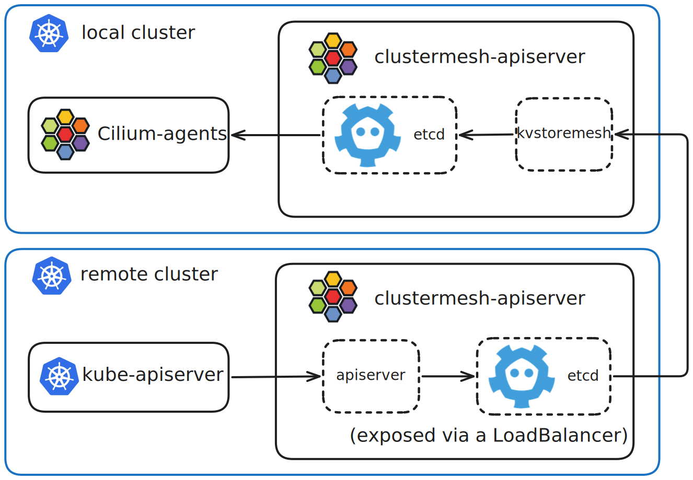

.. only:: not (epub or latex or html)

    WARNING: You are looking at unreleased Cilium documentation.
    Please use the official rendered version released here:
    https://docs.cilium.io

.. _Cluster Mesh:

############################
Multi-Cluster (Cluster Mesh)
############################

Multi-cluster Kubernetes setups are often adopted for reasons like fault
isolation, scalability, and geographical distribution. This approach can lead
to networking complexity. With such multi-cluster setups, traditional networking
models struggle with service discovery, network segmentation, policy enforcement,
and load-balancing across clusters. Cluster Mesh addresses these challenges by
extending Cilium networking across multiple Kubernetes clusters and provides:

* Pod-to-pod connectivity between clusters within a flat IP address space
* Cluster-aware :ref:`network policy enforcement <gs_clustermesh_network_policy>`
* Cross-cluster service discovery and load-balancing with
  :ref:`Global Services <gs_clustermesh_services>` or
  :ref:`MCS-API <gs_clustermesh_mcsapi>`
* :ref:`Service affinity <gs_clustermesh_service_affinity>` controls to
  prefer local or remote backends

See :ref:`gs_clustermesh` for instructions on how to set up Cluster Mesh.

Architecture
============

Cluster Mesh is built around a per-cluster control plane hosted by
``clustermesh-apiserver`` pods. These pods expose the local cluster state to
remote clusters and synchronize remote cluster state into the local cluster.

Cilium agents use local Kubernetes API server state and remote Cluster Mesh
state in a similar way to program the local datapath. Pod-to-pod traffic is
forwarded directly between nodes, including across cluster boundaries, without
requiring any additional proxy or gateway.

The following diagram shows the main Cluster Mesh components and how two
clusters exchange state:

.. The image source can be found at images/clustermesh-architecture.excalidraw

A ``clustermesh-apiserver`` pod typically contains the following containers:

* ``etcd``: Stores the local cluster state that is exposed to remote clusters
  over mTLS, typically through a LoadBalancer or NodePort service. This embedded
  etcd is simple to operate because it is a single instance and does not require
  persistent storage as the entire state is rebuilt from kube-apiserver on startup.
* ``apiserver``: Synchronizes local Cilium and Kubernetes state into the local
  etcd instance.
* ``kvstoremesh``: Synchronizes remote cluster state from other clusters into
  the local cluster.

Cluster Mesh reuses several concepts from :ref:`kvstore mode <kvstore>` to
exchange state between clusters. When Cilium is already running in kvstore mode,
Cluster Mesh extends the existing kvstore etcd instance instead of
deploying an additional embedded etcd instance.
