.. _gs_clustermesh_services:

**********************************
Load-balancing & Service Discovery
**********************************

This tutorial will guide you to perform load-balancing and service
discovery across multiple Kubernetes clusters when using Cilium.

Prerequisites
#############

You need to have a functioning Cluster Mesh setup, please follow the guide
:ref:`gs_clustermesh` to set it up.

Load-balancing with Global Services
###################################

Establishing load-balancing between clusters is achieved by defining a
Kubernetes service with identical name and namespace in each cluster and adding
the annotation ``service.cilium.io/global: "true"`` to declare it global.
Cilium will automatically perform load-balancing to pods in both clusters.

.. code-block:: yaml

  apiVersion: v1
  kind: Service
  metadata:
    name: rebel-base
    annotations:
      service.cilium.io/global: "true"
  spec:
    type: ClusterIP
    ports:
    - port: 80
    selector:
      name: rebel-base

Disabling Global Service Sharing
################################

By default, a Global Service will load-balance across backends in multiple clusters.
This implicitly configures ``service.cilium.io/shared: "true"``. To prevent service
backends from being shared to other clusters, this option should be disabled.

Below example will expose remote endpoint without sharing local endpoints.

.. code-block:: yaml

   apiVersion: v1
   kind: Service
   metadata:
     name: rebel-base
     annotations:
       service.cilium.io/global: "true"
       service.cilium.io/shared: "false"
   spec:
     type: ClusterIP
     ports:
     - port: 80
     selector:
       name: rebel-base

Deploying a Simple Example Service
==================================

1. In cluster 1, deploy:

   .. parsed-literal::

       kubectl apply -f \ |SCM_WEB|\/examples/kubernetes/clustermesh/global-service-example/cluster1.yaml

2. In cluster 2, deploy:

   .. parsed-literal::

       kubectl apply -f \ |SCM_WEB|\/examples/kubernetes/clustermesh/global-service-example/cluster2.yaml

3. From either cluster, access the global service:

   .. code-block:: shell-session

      kubectl exec -ti deployment/x-wing -- curl rebel-base

   You will see replies from pods in both clusters.

4. In cluster 1, add ``service.cilium.io/shared="false"`` to existing global service

   .. code-block:: shell-session

      kubectl annotate service rebel-base service.cilium.io/shared="false" --overwrite

5. From cluster 1, access the global service one more time:

   .. code-block:: shell-session

      kubectl exec -ti deployment/x-wing -- curl rebel-base

   You will still see replies from pods in both clusters.

6. From cluster 2, access the global service again:

   .. code-block:: shell-session

      kubectl exec -ti deployment/x-wing -- curl rebel-base

   You will see replies from pods only from cluster 2, as the global service in cluster 1 is no longer shared.

7. In cluster 1, remove ``service.cilium.io/shared`` annotation of existing global service

   .. code-block:: shell-session

      kubectl annotate service rebel-base service.cilium.io/shared-

8. From either cluster, access the global service:

   .. code-block:: shell-session

      kubectl exec -ti deployment/x-wing -- curl rebel-base

   You will see replies from pods in both clusters again.

Global and Shared Services Reference
####################################

The flow chart below summarizes the overall behavior considering a service present
in two clusters (i.e., Cluster1 and Cluster2), and different combinations of the
``service.cilium.io/global`` and ``service.cilium.io/shared`` annotation values.
The terminating nodes represent the endpoints used in each combination by the two
clusters for the service under examination.

..
   The flow chart was generated on https://mermaid.live with code:

   flowchart LR
      Cluster1Global{Cluster1\nGlobal?}-->|yes|Cluster2Global{Cluster2\nGlobal?}
      Cluster2Global-->|yes|Cluster1Shared{Cluster1\nShared?}

      Cluster1Shared-->|yes|Cluster2Shared{Cluster2\nShared?}
      Cluster2Shared-->|yes|Cluster1BothCluster2Both[Cluster1: Local + Remote\nCluster2: Local + Remote]
      Cluster2Shared-->|no|Cluster1SelfClusterBoth[Cluster1: Local only\nCluster2: Local + Remote]

      Cluster1Shared-->|no|Cluster2Shared2{Cluster2\nShared?}
      Cluster2Shared2-->|yes|Cluster1BothCluster2Self[Cluster1: Local + Remote\nCluster2: Local only]
      Cluster2Shared2-->|no|Cluster1SelfCluster2Self[Cluster1: Local only\nCluster2: Local only]

      Cluster1Global-->|no|Cluster1SelfCluster2Self
      Cluster2Global-->|no|Cluster1SelfCluster2Self
