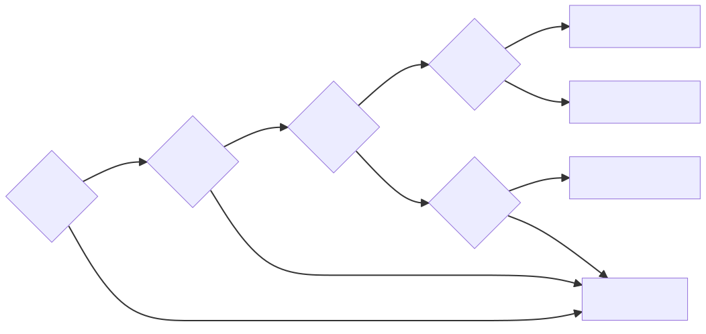

.. _gs_clustermesh_services:

**********************************
Load-balancing & Service Discovery
**********************************

This tutorial will guide you to perform load-balancing and service
discovery across multiple Kubernetes clusters when using Cilium.

Prerequisites
#############

You need to have a functioning Cluster Mesh setup, please follow the guide
:ref:`gs_clustermesh` to set it up.

Load-balancing with Global Services
###################################

Establishing load-balancing between clusters is achieved by defining a
Kubernetes service with identical name and namespace in each cluster and adding
the annotation ``service.cilium.io/global: "true"`` to declare it global.
Cilium will automatically perform load-balancing to pods in both clusters.

.. code-block:: yaml

  apiVersion: v1
  kind: Service
  metadata:
    name: rebel-base
    annotations:
      service.cilium.io/global: "true"
  spec:
    type: ClusterIP
    ports:
    - port: 80
    selector:
      name: rebel-base

Disabling Global Service Sharing
################################

By default, a Global Service will load-balance across backends in multiple clusters.
This implicitly configures ``service.cilium.io/shared: "true"``. To prevent service
backends from being shared to other clusters, this option should be disabled.

Below example will expose remote endpoint without sharing local endpoints.

.. code-block:: yaml

   apiVersion: v1
   kind: Service
   metadata:
     name: rebel-base
     annotations:
       service.cilium.io/global: "true"
       service.cilium.io/shared: "false"
   spec:
     type: ClusterIP
     ports:
     - port: 80
     selector:
       name: rebel-base

.. _namespace_export_control:

Namespace-based Export Control
##############################

By default, all namespaces in a cluster are considered global for ClusterMesh
resource sharing. To enhance security and control which namespaces export
resources to other clusters, you can enable namespace-based export control
through namespace annotations.

Prerequisites
============

For namespace-based export control to work correctly, you need to understand:

* When no namespaces are annotated, the behavior remains exactly the same as
  the traditional ClusterMesh setup (backwards compatible)
* When the first namespace receives the ``clustermesh.cilium.io/global``
  annotation, namespace filtering becomes active
* Only resources from namespaces marked as global will be shared across clusters

Configuration
============

Global Namespace Annotation
---------------------------

To mark a namespace as global and enable resource export to other clusters:

.. code-block:: yaml

   apiVersion: v1
   kind: Namespace
   metadata:
     name: production
     annotations:
       clustermesh.cilium.io/global: "true"

To explicitly mark a namespace as local (non-global):

.. code-block:: yaml

   apiVersion: v1
   kind: Namespace
   metadata:
     name: development
     annotations:
       clustermesh.cilium.io/global: "false"

Default Global Namespace Behavior
---------------------------------

You can configure the default behavior for namespaces without annotations
using the ``clustermesh.defaultGlobalNamespace`` configuration option:

.. parsed-literal::

   helm install cilium |CHART_RELEASE| \\
     --namespace kube-system \\
     --set clustermesh.defaultGlobalNamespace=false

When set to ``false`` (recommended for security), unannotated namespaces are
treated as local by default when namespace filtering is active.

Global Service Requirements
==========================

When namespace-based export control is active, a service must satisfy **both**
conditions to be considered a Global Service:

1. The service must be annotated with ``service.cilium.io/global: "true"``
2. The service must reside within a namespace marked as global

.. code-block:: yaml

   # Global namespace
   apiVersion: v1
   kind: Namespace
   metadata:
     name: production
     annotations:
       clustermesh.cilium.io/global: "true"
   ---
   # Global service within global namespace
   apiVersion: v1
   kind: Service
   metadata:
     name: backend-service
     namespace: production
     annotations:
       service.cilium.io/global: "true"
   spec:
     type: ClusterIP
     ports:
     - port: 80
     selector:
       app: backend

Edge Cases and Behavior
======================

* **Activation**: When the first namespace receives a global annotation,
  filtering becomes active and all resources from non-global namespaces
  are removed from the shared etcd store
* **Deactivation**: When the last annotated namespace is removed or loses
  its annotation, filtering becomes inactive and all namespace resources
  are backfilled into etcd (backwards compatibility mode)
* **Transition**: Resources are dynamically added/removed from etcd as
  namespace annotations change

Testing and Validation
=====================

To test namespace-based export control:

1. Verify initial backwards compatibility (no annotations):

   .. code-block:: shell-session

      cilium clustermesh status --context $CLUSTER1

2. Add global annotation to a namespace and verify filtering activation

3. Check that only resources from global namespaces appear in other clusters

4. Validate global service functionality with both namespace and service annotations

.. _endpointslicesync:

Synchronizing Kubernetes EndpointSlice (Beta)
#############################################

.. include:: ../../beta.rst

By default Kubernetes EndpointSlice synchronization is disabled on non Headless Global services.
To have Cilium discover remote clusters endpoints of a Global Service
from DNS or any third party controllers, enable synchronization by adding
the annotation ``service.cilium.io/global-sync-endpoint-slices: "true"``.
This will allow Cilium to create Kubernetes EndpointSlices belonging to a
remote cluster for services that have that annotation.
Regarding Global Headless services this option is enabled by default unless
explicitly opted-out by adding the annotation ``service.cilium.io/global-sync-endpoint-slices: "false"``.

Note that this feature does not complement/is not required by any other Cilium features
and is only required if you need to discover EndpointSlice from remote cluster on
third party controllers. For instance, the Cilium ingress controller works in a Cluster Mesh
without enabling this feature, although if you use any other ingress controller
you may need to enable this.

This feature is currently disabled by default via a feature flag.
To install Cilium with EndpointSlice Cluster Mesh synchronization, run:

.. parsed-literal::

   helm install cilium |CHART_RELEASE| \\
     --namespace kube-system \\
     --set clustermesh.enableEndpointSliceSynchronization=true

To enable EndpointSlice Cluster Mesh synchronization on an existing Cilium installation, run:

.. parsed-literal::

   helm upgrade cilium |CHART_RELEASE| \\
     --namespace kube-system \\
     --reuse-values \\
     --set clustermesh.enableEndpointSliceSynchronization=true
   kubectl -n kube-system rollout restart deployment/cilium-operator

Known Limitations
-----------------

- This is a beta feature, you may experience bugs or shortcomings.
- Hostnames are synchronized as is without any form of conflict resolution
  mechanisms. This means that multiple StatefulSets with a single governing
  Service that synchronize EndpointSlices across multiple clusters should have
  different names. For instance, you can add the cluster name to the StatefulSet
  name (``cluster1-my-statefulset`` instead of ``my-statefulset``).

Deploying a Simple Example Service
==================================

1. In cluster 1, deploy:

   .. parsed-literal::

       kubectl apply -f \ |SCM_WEB|\/examples/kubernetes/clustermesh/cluster1.yaml
       kubectl apply -f \ |SCM_WEB|\/examples/kubernetes/clustermesh/global-service-example.yaml

2. In cluster 2, deploy:

   .. parsed-literal::

       kubectl apply -f \ |SCM_WEB|\/examples/kubernetes/clustermesh/cluster2.yaml
       kubectl apply -f \ |SCM_WEB|\/examples/kubernetes/clustermesh/global-service-example.yaml

3. From either cluster, access the global service:

   .. code-block:: shell-session

      kubectl exec -ti deployment/x-wing -- curl rebel-base

   You will see replies from pods in both clusters.

4. In cluster 1, add ``service.cilium.io/shared="false"`` to existing global service

   .. code-block:: shell-session

      kubectl annotate service rebel-base service.cilium.io/shared="false" --overwrite

5. From cluster 1, access the global service one more time:

   .. code-block:: shell-session

      kubectl exec -ti deployment/x-wing -- curl rebel-base

   You will still see replies from pods in both clusters.

6. From cluster 2, access the global service again:

   .. code-block:: shell-session

      kubectl exec -ti deployment/x-wing -- curl rebel-base

   You will see replies from pods only from cluster 2, as the global service in cluster 1 is no longer shared.

7. In cluster 1, remove ``service.cilium.io/shared`` annotation of existing global service

   .. code-block:: shell-session

      kubectl annotate service rebel-base service.cilium.io/shared-

8. From either cluster, access the global service:

   .. code-block:: shell-session

      kubectl exec -ti deployment/x-wing -- curl rebel-base

   You will see replies from pods in both clusters again.

Global and Shared Services Reference
####################################

The flow chart below summarizes the overall behavior considering a service present
in two clusters (i.e., Cluster1 and Cluster2), and different combinations of the
``service.cilium.io/global`` and ``service.cilium.io/shared`` annotation values.
The terminating nodes represent the endpoints used in each combination by the two
clusters for the service under examination.

..
   The flow chart was generated on https://mermaid.live with code:

   flowchart LR
      Cluster1Global{Cluster1\nGlobal?}-->|yes|Cluster2Global{Cluster2\nGlobal?}
      Cluster2Global-->|yes|Cluster1Shared{Cluster1\nShared?}

      Cluster1Shared-->|yes|Cluster2Shared{Cluster2\nShared?}
      Cluster2Shared-->|yes|Cluster1BothCluster2Both[Cluster1: Local + Remote\nCluster2: Local + Remote]
      Cluster2Shared-->|no|Cluster1SelfClusterBoth[Cluster1: Local only\nCluster2: Local + Remote]

      Cluster1Shared-->|no|Cluster2Shared2{Cluster2\nShared?}
      Cluster2Shared2-->|yes|Cluster1BothCluster2Self[Cluster1: Local + Remote\nCluster2: Local only]
      Cluster2Shared2-->|no|Cluster1SelfCluster2Self[Cluster1: Local only\nCluster2: Local only]

      Cluster1Global-->|no|Cluster1SelfCluster2Self
      Cluster2Global-->|no|Cluster1SelfCluster2Self

Limitations
###########

* Global NodePort services load balance across both local and remote backends only
  if Cilium is configured to replace kube-proxy (either ``kubeProxyReplacement=true``
  or ``nodePort.enabled=true``). Otherwise, only local backends are eligible for
  load balancing when accessed through the NodePort.

* Global services accessed by a Node, or a Pod running in host network, load
  balance across both local and remote backends only if Cilium is configured
  to replace kube-proxy (``kubeProxyReplacement=true``). This limitation can be
  overcome enabling SocketLB in the host namespace: ``socketLB.enabled=true``,
  ``socketLB.hostNamespaceOnly=true``. Otherwise, only local backends are eligible
  for load balancing.
