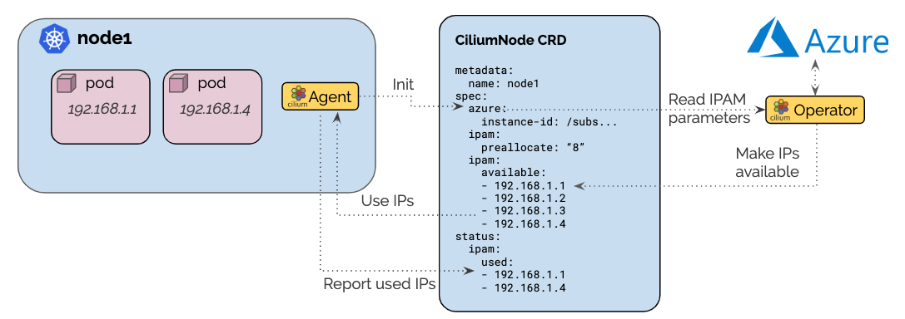

.. only:: not (epub or latex or html)

    WARNING: You are looking at unreleased Cilium documentation.
    Please use the official rendered version released here:
    https://docs.cilium.io

.. _ipam_azure:

##########
Azure IPAM
##########

.. note::

   While still maintained for now, Azure IPAM is considered legacy and is not
   compatible with AKS clusters created in `Bring your own CNI <https://docs.microsoft.com/en-us/azure/aks/use-byo-cni?tabs=azure-cli>`_
   mode. Using BYOCNI is the preferred way to install Cilium on AKS.

The Azure IPAM allocator is specific to Cilium deployments running in the Azure
cloud and performs IP allocation based on `Azure Private IP addresses
<https://docs.microsoft.com/en-us/azure/virtual-network/private-ip-addresses>`__.

The architecture ensures that only a single operator communicates with the
Azure API to avoid rate-limiting issues in large clusters. A pre-allocation
watermark allows to maintain a number of IP addresses to be available for use
on nodes at all time without requiring to contact the Azure API when a new pod
is scheduled in the cluster.

************
Architecture
************

The Azure IPAM allocator builds on top of the CRD-backed allocator. Each node
creates a ``ciliumnodes.cilium.io`` custom resource matching the node name when
Cilium starts up for the first time on that node. The Cilium agent running on
each node will retrieve the Kubernetes ``v1.Node`` resource and extract the
``.Spec.ProviderID`` field in order to derive the `Azure instance ID <https://docs.microsoft.com/en-us/azure/virtual-machine-scale-sets/virtual-machine-scale-sets-instance-ids>`__.
Azure allocation parameters are provided as agent configuration option and are
passed into the custom resource as well.

The Cilium operator listens for new ``ciliumnodes.cilium.io`` custom resources
and starts managing the IPAM aspect automatically. It scans the Azure instances
for existing interfaces with associated IPs and makes them available via the
``spec.ipam.available`` field. It will then constantly monitor the used IP
addresses in the ``status.ipam.used`` field and allocate more IPs as needed to
meet the IP pre-allocation watermark. This ensures that there are always IPs
available

*************
Configuration
*************

* The Cilium agent and operator must be run with the option ``--ipam=azure`` or
  the option ``ipam: azure``  must be set in the ConfigMap. This will enable Azure
  IPAM allocation in both the node agent and operator.

* In most scenarios, it makes sense to automatically create the
  ``ciliumnodes.cilium.io`` custom resource when the agent starts up on a node
  for the first time. To enable this, specify the option
  ``--auto-create-cilium-node-resource`` or  set
  ``auto-create-cilium-node-resource: "true"`` in the ConfigMap.

* It is generally a good idea to enable metrics in the Operator as well with
  the option ``--enable-metrics``. See the section :ref:`install_metrics` for
  additional information how to install and run Prometheus including the
  Grafana dashboard.

Azure Allocation Parameters
===========================

The following parameters are available to control the IP allocation:

``spec.ipam.min-allocate``
  The minimum number of IPs that must be allocated when the node is first
  bootstrapped. It defines the minimum base socket of addresses that must be
  available. After reaching this watermark, the PreAllocate and
  MaxAboveWatermark logic takes over to continue allocating IPs.

  If unspecified, no minimum number of IPs is required.

``spec.ipam.pre-allocate``
  The number of IP addresses that must be available for allocation at all
  times.  It defines the buffer of addresses available immediately without
  requiring for the operator to get involved.

  If unspecified, this value defaults to 8.

``spec.ipam.max-above-watermark``
  The maximum number of addresses to allocate beyond the addresses needed to
  reach the PreAllocate watermark.  Going above the watermark can help reduce
  the number of API calls to allocate IPs.

  If let unspecified, the value defaults to 0.

*******************
Operational Details
*******************

Cache of Interfaces, Subnets, and VirtualNetworks
=================================================

The operator maintains a list of all Azure ScaleSets, Instances, Interfaces,
VirtualNetworks, and Subnets associated with the Azure subscription in a cache.

The cache is updated once per minute or after an IP allocation has been
performed. When triggered based on an allocation, the operation is performed at
most once per second.

Publication of available IPs
============================

Following the update of the cache, all CiliumNode custom resources representing
nodes are updated to publish eventual new IPs that have become available.

In this process, all interfaces are scanned for all available IPs.  All IPs
found are added to ``spec.ipam.available``. Each interface is also added to
``status.azure.interfaces``.

If this update caused the custom resource to change, the custom resource is
updated using the Kubernetes API methods ``Update()`` and/or ``UpdateStatus()``
if available.

Determination of IP deficits or excess
======================================

The operator constantly monitors all nodes and detects deficits in available IP
addresses. The check to recognize a deficit is performed on two occasions:

 * When a ``CiliumNode`` custom resource is updated
 * All nodes are scanned in a regular interval (once per minute)

When determining whether a node has a deficit in IP addresses, the following
calculation is performed:

.. code-block:: go

     spec.ipam.pre-allocate - (len(spec.ipam.available) - len(status.ipam.used))

For excess IP calculation:

.. code-block:: go

     (len(spec.ipam.available) - len(status.ipam.used)) - (spec.ipam.pre-allocate + spec.ipam.max-above-watermark)

Upon detection of a deficit, the node is added to the list of nodes which
require IP address allocation. When a deficit is detected using the interval
based scan, the allocation order of nodes is determined based on the severity
of the deficit, i.e. the node with the biggest deficit will be at the front of
the allocation queue. Nodes that need to release IPs are behind nodes that need
allocation.

The allocation queue is handled on demand but at most once per second.

IP Allocation
=============

When performing IP allocation for a node with an address deficit, the operator
first looks at the interfaces already attached to the instance represented by
the CiliumNode resource.

The operator will then pick the first interface which meets the following
criteria:

 * The interface has addresses associated which are not yet used or the number of
   addresses associated with the interface is lesser than `maximum number of
   addresses
   <https://docs.microsoft.com/en-us/azure/azure-resource-manager/management/azure-subscription-service-limits#networking-limits>`__
   that can be associated to an interface.

 * The subnet associated with the interface has IPs available for allocation

The following formula is used to determine how many IPs are allocated on the
interface:

.. code-block:: go

      min(AvailableOnSubnet, min(AvailableOnInterface, NeededAddresses + spec.ipam.max-above-watermark))

This means that the number of IPs allocated in a single allocation cycle can be
less than what is required to fulfill ``spec.ipam.pre-allocate``.

IP Release
==========

When performing IP release for a node with IP excess, the operator scans the
interface attached to the node. The following formula is used to determine how
many IPs are available for release on the interface:

.. code-block:: go

      min(FreeOnInterface, (TotalFreeIPs - spec.ipam.pre-allocate - spec.ipam.max-above-watermark))

Node Termination
================

When a node or instance terminates, the Kubernetes apiserver will send a node
deletion event. This event will be picked up by the operator and the operator
will delete the corresponding ``ciliumnodes.cilium.io`` custom resource.

.. _ipam_azure_required_privileges:

*******************
Required Privileges
*******************

The following Azure API calls are being performed by the Cilium operator. The
Service Principal provided must have privileges to perform these within the
scope of the AKS cluster node resource group:

 * `Network Interfaces - Create Or Update <https://docs.microsoft.com/en-us/rest/api/virtualnetwork/networkinterfaces/createorupdate>`__
 * `NetworkInterface In VMSS - List Virtual Machine Scale Set Network Interfaces <https://docs.microsoft.com/en-us/rest/api/virtualnetwork/networkinterface%20in%20vmss/listvirtualmachinescalesetnetworkinterfaces>`__
 * `Virtual Networks - List <https://docs.microsoft.com/en-us/rest/api/virtualnetwork/virtualnetworks/list>`__
 * `Virtual Machine Scale Sets - List All <https://docs.microsoft.com/en-us/rest/api/compute/virtualmachinescalesets/listall>`__

.. note::

   The node resource group is *not* the resource group of the AKS cluster. A
   single resource group may hold multiple AKS clusters, but each AKS cluster
   regroups all resources in an automatically managed secondary resource group.
   See `Why are two resource groups created with AKS? <https://docs.microsoft.com/en-us/azure/aks/faq#why-are-two-resource-groups-created-with-aks>`__
   for more details.

*******
Metrics
*******

The metrics are documented in the section :ref:`ipam_metrics`.
