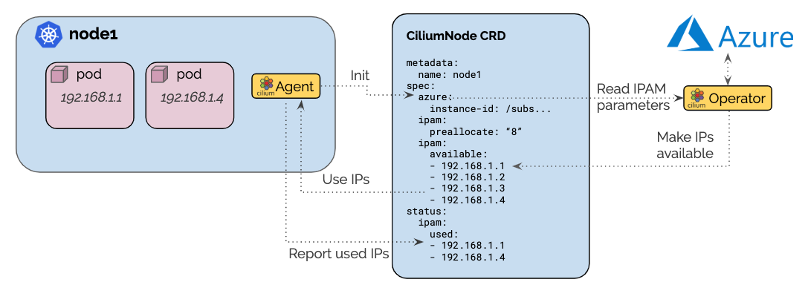

.. only:: not (epub or latex or html)

    WARNING: You are looking at unreleased Cilium documentation.
    Please use the official rendered version released here:
    https://docs.cilium.io

.. _ipam_azure:

##########
Azure IPAM
##########

.. note::

   On AKS, the recommended ways to run Cilium are:

   * `Azure CNI Powered by Cilium <https://learn.microsoft.com/en-us/azure/aks/azure-cni-powered-by-cilium>`__: 
     AKS fully manages Cilium's deployment and configuration. The cluster
     is created with ``--network-dataplane cilium``. IP allocation is
     handled by AKS's own controllers via :ref:`azure_delegated_ipam`.
     See :ref:`aks_install`.

   * `Bring your own CNI <https://learn.microsoft.com/en-us/azure/aks/use-byo-cni?tabs=azure-cli>`__
     (BYOCNI): the cluster is created with ``--network-plugin=none`` and the
     administrator self-manages Cilium (via Helm or the cilium-cli)
     with any Cilium IPAM backend.

   Azure IPAM (this page) is designed for non-AKS self-managed clusters
   running on Azure VMs or VMSSs.

The Azure IPAM allocator is specific to Cilium deployments running in the Azure
cloud and performs IP allocation based on `Azure Private IP addresses
<https://learn.microsoft.com/en-us/azure/virtual-network/private-ip-addresses>`__.

The architecture ensures that only a single operator communicates with the
Azure API to avoid rate-limiting issues in large clusters. A pre-allocation
watermark allows to maintain a number of IP addresses to be available for use
on nodes at all time without requiring to contact the Azure API when a new pod
is scheduled in the cluster.

************
Architecture
************

Azure IPAM coordinates the operator and the agent through a
``ciliumnodes.cilium.io`` custom resource matching the node name. When Cilium
starts, the agent retrieves the Kubernetes ``v1.Node`` resource and uses its
``.spec.providerID`` field to derive the `Azure instance ID <https://learn.microsoft.com/en-us/azure/virtual-machine-scale-sets/virtual-machine-scale-sets-instance-ids>`__.
Azure allocation parameters are provided as agent configuration and copied to
the custom resource.

The Cilium operator listens for new ``CiliumNode`` resources, scans the Azure
instance's interfaces, and publishes the discovered interfaces, their address
provisioning states, and available routing metadata in
``status.azure.interfaces``. Subnet CIDRs and gateways are present only when
the operator can retrieve the corresponding subnet details. The agent treats
each valid address in ``status.azure.interfaces[].addresses`` whose state is
``succeeded`` as a host prefix in the default multi-pool IPAM pool. It reports
its address target in ``spec.ipam.pools.requested`` and records the host
prefixes it is retaining in ``spec.ipam.pools.allocated``. The operator
allocates additional Azure private IP addresses as needed to maintain the
pre-allocation watermark.

*************
Configuration
*************

* The Cilium agent and operator must be run with the option ``--ipam=azure`` or
  the option ``ipam: azure``  must be set in the ConfigMap. This will enable Azure
  IPAM allocation in both the node agent and operator.

* In most scenarios, it makes sense to automatically create the
  ``ciliumnodes.cilium.io`` custom resource when the agent starts up on a node
  for the first time. To enable this, specify the option
  ``--auto-create-cilium-node-resource`` or  set
  ``auto-create-cilium-node-resource: "true"`` in the ConfigMap.

* It is generally a good idea to enable metrics in the Operator as well with
  the option ``--enable-metrics``. See the section :ref:`install_metrics` for
  additional information how to install and run Prometheus including the
  Grafana dashboard.

Operator scope: subscription, resource group, identity
======================================================

The operator talks to Azure using three pieces of context. Each can be
auto-detected from the `Azure Instance Metadata Service (IMDS)
<https://learn.microsoft.com/en-us/azure/virtual-machines/instance-metadata-service>`__
or set explicitly via the ``--azure-*`` :doc:`operator flags </cmdref/cilium-operator-azure>`.

Subscription (``--azure-subscription-id``)
   All Azure SDK clients are bound to a single subscription. If unset, the
   operator detects the subscription of the node it runs on via its IMDS.

Resource group (``--azure-resource-group``)
   Scopes per-resource-group API calls such as listing interfaces, VMSS, and
   Public IP Prefixes. For VMSS nodes, this must be the resource group that
   contains the VMSS. For standalone nodes, private-IP discovery and allocation
   use the resource group that contains the attached network interfaces. When
   static public IP allocation is enabled for a standalone node, the current
   API paths require its VM, primary network interface, and Public IP Prefix to
   be in this configured resource group. If unset, the operator detects the
   resource group of the node it runs on via IMDS; that value is correct only
   when it is also the resource group required by the node topology described
   above.

VNet / subnet resource group
   The operator derives the VNet and subnet resource group from each
   interface's subnet ID at runtime, there is no flag for it. When VNets live
   in a shared networking resource group, the operator's identity needs to have
   read access there.

Authentication
==============

The operator authenticates using the Azure Identity SDK. Two modes are
supported:

Default credential chain (no flag set)
   When ``--azure-user-assigned-identity-id`` is empty, the operator calls
   `DefaultAzureCredential
   <https://learn.microsoft.com/en-us/azure/developer/go/azure-sdk-authentication>`__,
   which tries, in order: environment variables, workload identity (projected
   token), system-assigned managed identity, then Azure CLI. This is the
   recommended path for AKS clusters using `Azure AD Workload Identity
   <https://learn.microsoft.com/en-us/azure/aks/workload-identity-overview>`__.

User-assigned managed identity (``--azure-user-assigned-identity-id``)
   When set, the operator authenticates as a specific user-assigned managed
   identity. The value must be the identity's client ID (a UUID), not its
   full Azure resource ID (``/subscriptions/.../userAssignedIdentities/...``).
   The client ID is visible in the identity's overview blade in the Azure portal
   or via ``az identity show -g <resource-group> -n <name> --query clientId -o tsv``.

Custom Azure IPAM Configuration
===============================

Custom Azure IPAM configuration can be defined from Helm or with a custom CNI
configuration ``ConfigMap``. 

If you configure both helm and Custom CNI for the same field, Custom CNI is 
preferred over Helm configuration.

Helm
----

The Azure IPAM configuration can be specified via Helm, using either the ``--set`` flag
or the helm value file.

The following example configures Cilium to:

* Use the interface ``eth0`` for pod IP allocation.
* Set the minimum number of IPs to allocate to 10.

.. cilium-helm-upgrade::
   :namespace: kube-system
   :extra-args: --reuse-values
   :set: azure.enabled=true
         azure.nodeSpec.azureInterfaceName=eth0
         ipam.nodeSpec.ipamMinAllocate=10

The full list of available options can be found in the :ref:`helm_reference`
section in the ``azure.nodeSpec`` and ``ipam.nodeSpec`` sections.

Create a CNI configuration
--------------------------

Create a ``cni-config.yaml`` file based on the template below. Fill in the
``interface-name`` field:

.. code-block:: yaml

   apiVersion: v1
   kind: ConfigMap
   metadata:
     name: cni-configuration
     namespace: kube-system
   data:
     cni-config: |-
       {
         "cniVersion":"0.3.1",
         "name":"cilium",
         "plugins": [
           {
             "cniVersion":"0.3.1",
             "type":"cilium-cni",
             "azure": {
               "interface-name":"eth0"
             }
           }
         ]
       }

Additional parameters may be configured in the ``azure`` or ``ipam`` section of
the CNI configuration file. See the list of Azure allocation parameters below
for a reference of the supported options.

Deploy the ``ConfigMap``:

.. code-block:: shell-session

   kubectl apply -f cni-config.yaml

Configure Cilium to use the custom CNI configuration 
----------------------------------------------------

Using the instructions above to deploy Cilium and CNI config, specify the
following additional arguments to Helm:

.. code-block:: shell-session

   --set cni.customConf=true \
   --set cni.configMap=cni-configuration

Azure Allocation Parameters
===========================

The following parameters are available to control the IP allocation:

``spec.ipam.min-allocate``
  The minimum number of IPs that must be allocated when the node is first
  bootstrapped. It defines the minimum base socket of addresses that must be
  available. After reaching this watermark, the PreAllocate and
  MaxAboveWatermark logic takes over to continue allocating IPs.

  If unspecified, no minimum number of IPs is required.

``spec.ipam.pre-allocate``
  The number of IP addresses that must be available for allocation at all
  times.  It defines the buffer of addresses available immediately without
  requiring for the operator to get involved.

  If unspecified, this value defaults to 8.

``spec.azure.interface-name``
  The name of the interface to use for IP allocation.

*******************
Operational Details
*******************

Cache of Interfaces and Subnets
===============================

The operator maintains an in-memory cache of the instances and interfaces it
discovers in the configured Azure resource group. It retrieves details only for
the subnets referenced by those interfaces. On startup, it rebuilds the cache
with a blocking initial synchronization.

The operator refreshes the full cache once per minute. A successful private-IP
allocation that changes an instance triggers a targeted synchronization of that
instance.

Publication of available IPs
============================

Following a full or targeted cache update, the operator reconciles the
``CiliumNode`` resources for affected nodes. It publishes each discovered Azure
interface and the provisioning state of each listed address in
``status.azure.interfaces``. When subnet lookup succeeds, it also publishes the
subnet CIDR and gateway. Agents using the multi-pool protocol derive the
default-pool allocation from valid addresses in this status whose state is
``succeeded``. The operator also updates the legacy ``spec.ipam.pool`` map for
agents using the CRD allocator.

The agent writes its address target to the default entry in
``spec.ipam.pools.requested`` and records the host prefixes it is retaining in
``spec.ipam.pools.allocated``.

Native-routing readiness
========================

The agent requires at least one valid IPv4 subnet CIDR in
``status.azure.interfaces[].subnet.cidr`` before it can complete Azure IPAM
initialization. The operator publishes interfaces in interface-ID order, and
the agent selects the first valid IPv4 subnet CIDR in that list. This selection
is independent of ``spec.azure.interface-name``. If
``--ipv4-native-routing-cidr`` is unset, the agent uses the selected subnet CIDR
as its native-routing CIDR. If the option is set, its value must overlap the
selected subnet CIDR or initialization fails. Once startup reaches the
provider-readiness check, the agent waits up to five minutes for such a CIDR
before failing initialization.

Determination of IP deficits or excess
======================================

The operator constantly monitors all nodes and detects deficits in available IP
addresses. The check to recognize a deficit is performed on two occasions:

 * When a ``CiliumNode`` custom resource is updated
 * All nodes are scanned in a regular interval (once per minute)

Agents using the multi-pool protocol report an address target in the default
entry of ``spec.ipam.pools.requested``. The target consists of locally in-use
addresses, outstanding pending allocation requests, and the
``spec.ipam.pre-allocate`` buffer. The operator subtracts that buffer to derive
the effective in-use and pending demand, then applies the configured allocation
watermarks against the successful addresses on the Azure interfaces. For an
agent using the legacy CRD allocator, the operator instead obtains usage from
``status.ipam.used``.

Upon detection of a deficit, the operator schedules pool maintenance for the
node. During interval-based scans, nodes with the largest deficit are scheduled
first. Maintenance can run concurrently for multiple nodes, and Azure API calls
are subject to the operator's configured IPAM API rate limits.

IP Allocation
=============

When performing IP allocation for a node with an address deficit, the operator
first looks at the interfaces already attached to the instance represented by
the CiliumNode resource.

The operator will then pick the first interface which meets the following
criteria:

 * The interface has addresses associated which are not yet used or the number of
   addresses associated with the interface is lesser than `maximum number of
   addresses
   <https://learn.microsoft.com/en-us/azure/azure-resource-manager/management/azure-subscription-service-limits#networking-limits>`__
   that can be associated to an interface.

 * The subnet associated with the interface has IPs available for allocation

The following formula is used to determine how many IPs are allocated on the
interface:

.. code-block:: go

      min(AvailableOnSubnet, min(AvailableOnInterface, NeededAddresses + spec.ipam.max-above-watermark))

This means that the number of IPs allocated in a single allocation cycle can be
less than what is required to fulfill ``spec.ipam.pre-allocate``.

Static Public IP Allocation
----------------------------

Nodes can be assigned static public IPs from tagged Azure Public IP Prefixes.

1. Create and tag a `Public IP Prefix <https://learn.microsoft.com/en-us/azure/virtual-network/ip-services/public-ip-address-prefix>`__
   in the resource group selected by ``--azure-resource-group``:

   .. code-block:: shell-session

      $ az network public-ip prefix create \
        --resource-group $RESOURCE_GROUP \
        --name $PREFIX_NAME \
        --length 28 \
        --tags prefix-tag-key=prefix-tag-value

2. Set ``ipam.static-ip-tags`` in the CNI configuration:

   .. code-block:: json

      {
        "ipam": {
          "static-ip-tags": {
            "prefix-tag-key": "prefix-tag-value"
          }
        }
      }

If the node's primary IP configuration already references a usable public IP,
the operator reuses and records that address without selecting a new prefix.
Otherwise, it selects a successfully provisioned Public IP Prefix that matches
all configured tags and reports available capacity. The assigned or reused
public IP address is stored in the ``CiliumNode`` resource's
``status.ipam.assigned-static-ip`` field.

IP Release
==========

Azure IPAM does not release excess private IP addresses from interfaces.
Addresses that the agent removes from ``spec.ipam.pools.allocated`` remain
attached and can be admitted to the default pool again if demand grows.

Node Termination
================

When a node or instance terminates, the Kubernetes apiserver will send a node
deletion event. This event will be picked up by the operator and the operator
will delete the corresponding ``ciliumnodes.cilium.io`` custom resource.

Masquerading
============

Masquerading is supported via the eBPF :ref:`ip-masq-agent <concepts_masquerading>` or by setting ``--ipv4-native-routing-cidr``.

.. _ipam_azure_required_privileges:

*******************
Required Privileges
*******************

The identity used by the operator (managed identity, service principal, or
workload identity federation) needs Azure RBAC permissions on two or three
scopes depending on topology:

Configured resource group
   Grants read on VMSS and network interfaces, and the writes needed to attach
   IP configurations. On VMSS this is a write on the VMSS instance's VM model;
   on standalone nodes it is a write on the network interface itself (see the
   ``Actions`` breakdown below for the exact permissions). This is the resource
   group passed via ``--azure-resource-group`` or auto-detected from IMDS. The
   required resource placement for VMSS and standalone nodes is described in
   the configuration section above.

VNet / subnet resource group
   Grants read on the VNet and subnets, and the ``subnets/join/action`` used
   when attaching new private IPs. Often the same as the node resource
   group, but can be a separate networking resource group.

Subscription (optional)
   Only required if you want VNet discovery to work across multiple resource
   groups from a single role assignment. ``List`` calls filter by RBAC, so
   subscription-wide Reader is not mandatory, scoping the same actions to
   each relevant resource group is sufficient.

Minimum ``Actions`` for a custom role
=====================================

The set of required ``Actions`` depends on the node type (VMSS instances
vs. standalone VMs) and on whether static public IP allocation is enabled.

Common to every deployment:

.. code-block:: text

   Microsoft.Network/networkInterfaces/read
   Microsoft.Network/virtualNetworks/read
   Microsoft.Network/virtualNetworks/subnets/read
   Microsoft.Network/virtualNetworks/subnets/join/action
   Microsoft.Compute/virtualMachineScaleSets/read

For VMSS-based clusters, add:

.. code-block:: text

   Microsoft.Compute/virtualMachineScaleSets/virtualMachines/read
   Microsoft.Compute/virtualMachineScaleSets/virtualMachines/write

For standalone-VM clusters, add:

.. code-block:: text

   Microsoft.Network/networkInterfaces/write

When using static public IP allocation with Public IP Prefixes, add:

.. code-block:: text

   Microsoft.Network/publicIPPrefixes/read
   Microsoft.Network/publicIPPrefixes/join/action
   Microsoft.Compute/virtualMachines/read

.. note::

   ``Microsoft.Compute/virtualMachineScaleSets/virtualMachines/write`` is a
   broad permission, it authorizes any PATCH on the instance's VM model,
   not just NIC changes. But it is necessary for VMSS topologies. On
   VMSS, per-instance NIC configurations are part of the instance model
   itself (``Properties.NetworkProfileConfiguration``), and there is no
   narrower RBAC action that permits editing only the NIC block. The
   operator uses this permission solely to add or remove IP configurations
   on existing NICs. It does not issue VMSS instance lifecycle operations.
   Standalone-VM deployments don't have this issue because NICs are first-class
   resources edited via ``Microsoft.Network/networkInterfaces/write``.

.. note::

   The configured resource group is not the user-facing resource group of an
   AKS cluster. AKS places managed node resources in a separate, automatically
   managed resource group. See `Why are two resource groups created with AKS? <https://learn.microsoft.com/en-us/azure/aks/faq#why-are-two-resource-groups-created-with-aks->`__
   for more details.

Troubleshooting
===============

``AuthorizationFailed`` on ``Microsoft.Network/virtualNetworks/read``
   The operator's identity does not have read access on the resource group
   that owns the VNet. Add a role assignment scoped to the VNet resource
   group (which may differ from the configured resource group).

No successful addresses appear in ``status.azure.interfaces``
   ``--azure-resource-group`` may point at the wrong resource group. For VMSS
   nodes, verify that it identifies the resource group containing the VMSS. For
   standalone nodes, verify that it identifies the resource group containing
   the attached network interfaces. The IMDS-derived default is only correct
   when the operator's node is in that required resource group.

Successful addresses appear, but the agent waits for an Azure subnet CIDR
   Inspect ``status.azure.interfaces[].subnet.cidr``. Ensure that the operator's
   identity can read the resource group containing the VNet and subnet. If
   multiple interfaces report an IPv4 subnet CIDR, the agent selects the first
   valid one in the published list, independently of
   ``spec.azure.interface-name``. If ``--ipv4-native-routing-cidr`` is set,
   ensure that it overlaps that selected CIDR.

``spec.ipam.pools.requested`` stays empty on a multi-pool agent
   Verify that the agent uses ``--ipam=azure`` and inspect its startup logs.
   An agent using the multi-pool protocol writes its address target to
   ``spec.ipam.pools.requested`` and retained host prefixes to
   ``spec.ipam.pools.allocated``. An agent using the legacy CRD allocator reads
   ``spec.ipam.pool`` and reports usage through ``status.ipam.used``.

``ManagedIdentityCredential authentication failed``
   ``--azure-user-assigned-identity-id`` was set to the full resource ID
   (``/subscriptions/.../userAssignedIdentities/<name>``). Pass the identity's
   client ID (a UUID) instead.

*******
Metrics
*******

The metrics are documented in the section :ref:`ipam_metrics`.
