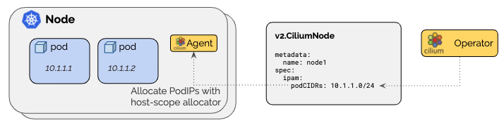

.. only:: not (epub or latex or html)

    WARNING: You are looking at unreleased Cilium documentation.
    Please use the official rendered version released here:
    http://docs.cilium.io

.. _ipam_crd_cluster_pool:

#######################
Cluster Scope (Default)
#######################

The cluster-scope IPAM mode assigns per-node PodCIDRs to each node and
allocates IPs using a host-scope allocator on each node. It is thus similar to
the :ref:`k8s_hostscope` mode. The difference is that instead of Kubernetes
assigning the per-node PodCIDRs via the Kubernetes ``v1.Node`` resource, the
Cilium operator will manage the per-node PodCIDRs via the ``v2.CiliumNode``
resource. The advantage of this mode is that it does not depend on Kubernetes
being configured to hand out per-node PodCIDRs.

************
Architecture
************

This is useful if Kubernetes cannot be configured to hand out PodCIDRs or if
more control is needed.

In this mode, the Cilium agent will wait on startup until the ``podCIDRs`` range
are made available via the Cilium Node ``v2.CiliumNode`` object for all enabled
address families via the resource field set in the ``v2.CiliumNode``:

====================== ==============================
Field                  Description
====================== ==============================
``spec.ipam.podCIDRs`` IPv4 and/or IPv6 PodCIDR range
====================== ==============================

*************
Configuration
*************

For a practical tutorial on how to enable this mode in Cilium, see
:ref:`gsg_ipam_crd_cluster_pool`.

Expanding the cluster pool
==========================

Don't change any existing elements of the ``clusterPoolIPv4PodCIDRList`` list, as
changes cause unexpected behavior. If the pool is exhausted,
add a new element to the list instead. The minimum mask length is ``/30``, with a recommended minimum mask 
length of at least ``/29``. The reason to add new elements rather than change existing elements is that
the allocator reserves 2 IPs per CIDR block for the network and broadcast addresses.
Changing ``clusterPoolIPv4MaskSize`` is also not possible. 

***************
Troubleshooting
***************

Look for allocation errors
==========================

Check the ``Error`` field in the ``status.ipam.operator-status`` field:

.. code-block:: shell-session

    kubectl get ciliumnodes -o jsonpath='{range .items[*]}{.metadata.name}{"\t"}{.status.ipam.operator-status}{"\n"}{end}'
    
Check for conflicting node CIDRs
================================

``10.0.0.0/8`` is the default pod CIDR. If your node network is in the same range
you will lose connectivity to other nodes. All egress traffic will be assumed
to target pods on a given node rather than other nodes.

You can solve it in two ways:

  - Explicitly set ``clusterPoolIPv4PodCIDRList`` to a non-conflicting CIDR
  - Use a different CIDR for your nodes

Fix ``the node CIDR size is too big`` for IPv6
==============================================

When enabling IPv6 with cluster-pool IPAM, ``cilium-operator`` may fail to
start with an error similar to:

.. code-block:: shell-session

    level=fatal msg="Unable to init cluster-pool allocator" error="unable to initialize IPv6 allocator New CIDR set failed; the node CIDR size is too big" subsys=cilium-operator-generic

This happens because the per-node mask size (``clusterPoolIPv6MaskSize``,
``/120`` by default) is only allowed to differ from the mask size of the pool
CIDR (``clusterPoolIPv6PodCIDRList``) by up to 16 bits. For example, a
``/64`` pool CIDR only supports a ``clusterPoolIPv6MaskSize`` of up to
``/80`` (``80 - 64 = 16``); the default of ``/120`` exceeds that difference
and triggers the error above.

To fix this, either:

  - Use a pool CIDR whose mask is at least ``clusterPoolIPv6MaskSize - 16``,
    e.g. a ``/104`` or smaller range instead of ``/64``, for the default
    ``/120`` per-node mask, or
  - Lower ``clusterPoolIPv6MaskSize`` to be within 16 bits of your pool
    CIDR's mask, e.g. ``--set ipam.operator.clusterPoolIPv6MaskSize=80`` for
    a ``/64`` pool CIDR.

This limit comes from the underlying CIDR allocator and mirrors a similar
restriction in upstream Kubernetes.
