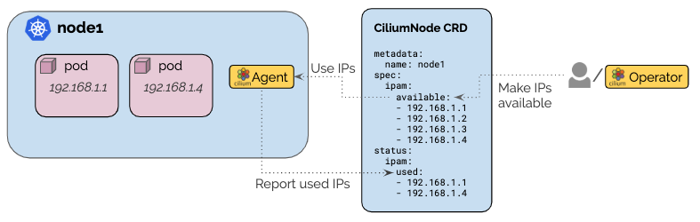

.. only:: not (epub or latex or html)

    WARNING: You are looking at unreleased Cilium documentation.
    Please use the official rendered version released here:
    https://docs.cilium.io

.. _concepts_ipam_crd:

##########
CRD-Backed
##########

The CRD-backed IPAM mode provides an extendable interface to control the IP
address management via a Kubernetes Custom Resource Definition (CRD). This
allows to delegate IPAM to external operators or make it user configurable per
node.

************
Architecture
************

When this mode is enabled, each Cilium agent will start watching for a
Kubernetes custom resource ``ciliumnodes.cilium.io`` with a name matching the
Kubernetes node on which the agent is running.

Whenever the custom resource is updated, the per node allocation pool is
updated with all addresses listed in the ``spec.ipam.available`` field. When an
IP is removed that is currently allocated, the IP will continue to be used but
will not be available for re-allocation after release.

Upon allocation of an IP in the allocation pool, the IP is added to the
``status.ipam.inuse`` field.

.. note::

   The node status update is limited to run at most once every 15 seconds.
   Therefore, if several pods are scheduled at the same time, the update of the
   status section can lag behind.

*************
Configuration
*************

The CRD-backed IPAM mode is enabled by setting ``ipam: crd`` in the
``cilium-config`` ConfigMap or by specifying the option ``--ipam=crd``. When
enabled, the agent will wait for a ``CiliumNode`` custom resource matching the
Kubernetes node name to become available with at least one IP address listed as
available. When connectivity health-checking is enabled, at least two IP
addresses must be available.

While waiting, the agent will print the following log message:

::

	Waiting for initial IP to become available in '<node-name>' custom resource

For a practical tutorial on how to enable CRD IPAM mode with Cilium, see the
section :ref:`gsg_ipam_crd`.

Privileges
==========

In order for the custom resource to be functional, the following additional
privileges are required. These privileges are automatically granted when using
the standard Cilium deployment artifacts:

.. code-block:: yaml

	apiVersion: rbac.authorization.k8s.io/v1
	kind: ClusterRole
	metadata:
	  name: cilium
	rules:
	- apiGroups:
	  - cilium.io
	  resources:
	  - ciliumnodes
	  - ciliumnodes/status
	  verbs:
	  - '*'

**************
CRD Definition
**************

The CiliumNode custom resource is modeled after a standard Kubernetes resource
and is split into a ``spec`` and ``status`` section:

.. code-block:: go

        type CiliumNode struct {
                [...]

                // Spec is the specification of the node
                Spec NodeSpec `json:"spec"`

                // Status it the status of the node
                Status NodeStatus `json:"status"`
        }

IPAM Specification
==================

The ``spec`` section embeds an IPAM specific field which allows to define the
list of all IPs which are available to the node for allocation:

.. code-block:: go

        // AllocationMap is a map of allocated IPs indexed by IP
        type AllocationMap map[string]AllocationIP

        // NodeSpec is the configuration specific to a node
        type NodeSpec struct {
                // [...]

                // IPAM is the address management specification. This section can be
                // populated by a user or it can be automatically populated by an IPAM
                // operator
                //
                // +optional
                IPAM IPAMSpec `json:"ipam,omitempty"`
        }

	// IPAMSpec is the IPAM specification of the node
	type IPAMSpec struct {
                // Pool is the list of IPs available to the node for allocation. When
                // an IP is used, the IP will remain on this list but will be added to
                // Status.IPAM.InUse
                //
                // +optional
                Pool AllocationMap `json:"pool,omitempty"`
	}

	// AllocationIP is an IP available for allocation or already allocated
	type AllocationIP struct {
		// Owner is the owner of the IP, this field is set if the IP has been
		// allocated. It will be set to the pod name or another identifier
		// representing the usage of the IP
		//
                // The owner field is left blank for an entry in Spec.IPAM.Pool
                // and filled out as the IP is used and also added to
                // Status.IPAM.InUse.
		//
		// +optional
		Owner string `json:"owner,omitempty"`

		// Resource is set for both available and allocated IPs, it represents
		// what resource the IP is associated with, e.g. in combination with
		// AWS ENI, this will refer to the ID of the ENI
		//
		// +optional
		Resource string `json:"resource,omitempty"`
	}

IPAM Status
===========

The ``status`` section contains an IPAM specific field. The IPAM status reports
all used addresses on that node:

.. code-block:: go

	// NodeStatus is the status of a node
	type NodeStatus struct {
		// [...]

		// IPAM is the IPAM status of the node
		//
		// +optional
		IPAM IPAMStatus `json:"ipam,omitempty"`
	}

	// IPAMStatus is the IPAM status of a node
	type IPAMStatus struct {
		// InUse lists all IPs out of Spec.IPAM.Pool which have been
		// allocated and are in use.
		//
		// +optional
		InUse AllocationMap `json:"used,omitempty"`
	}
