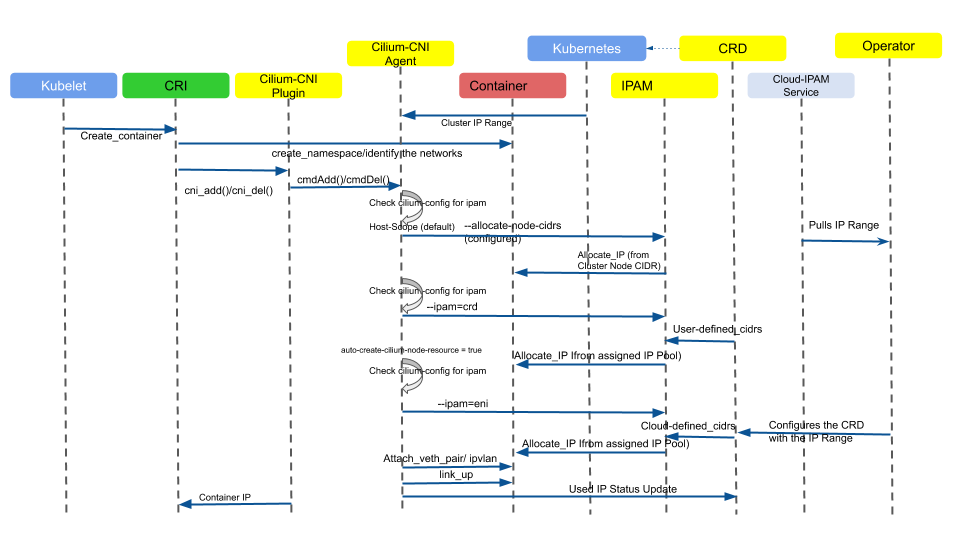

.. only:: not (epub or latex or html)

    WARNING: You are looking at unreleased Cilium documentation.
    Please use the official rendered version released here:
    https://docs.cilium.io

###################
Technical Deep Dive
###################

Cilium Container Networking Control Flow
========================================

The control flow diagram below gives an overview on how endpoints obtain their
IP address from the IPAM for each different mode of Address Management that
Cilium Supports.

