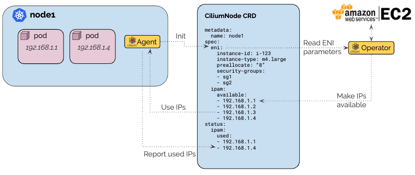

.. only:: not (epub or latex or html)

    WARNING: You are looking at unreleased Cilium documentation.
    Please use the official rendered version released here:
    https://docs.cilium.io

.. _ipam_eni:

#######
AWS ENI
#######

The AWS ENI allocator is specific to Cilium deployments running in the AWS
cloud and performs IP allocation based on IPs of `AWS Elastic Network Interfaces (ENI)
<https://docs.aws.amazon.com/AWSEC2/latest/UserGuide/using-eni.html>`__ by
communicating with the AWS EC2 API.

The architecture ensures that only a single operator communicates with the EC2
service API to avoid rate-limiting issues in large clusters. A pre-allocation
watermark is used to maintain a number of IP addresses to be available for use
on nodes at all time without needing to contact the EC2 API when a new pod is
scheduled in the cluster.

Note that Cilium currently does not support IPv6-only ENIs. Cilium support for
IPv6 ENIs is being tracked in :gh-issue:`18405`, and the related feature of
assigning IPv6 prefixes in :gh-issue:`19251`.

************
Architecture
************

The AWS ENI allocator builds on top of the CRD-backed allocator. Each node
creates a ``ciliumnodes.cilium.io`` custom resource matching the node name when
Cilium starts up for the first time on that node. It contacts the EC2 metadata
API to retrieve the instance ID, instance type, and VPC information, then it
populates the custom resource with this information. ENI allocation parameters
are provided as agent configuration option and are passed into the custom
resource as well.

The Cilium operator listens for new ``ciliumnodes.cilium.io`` custom resources
and starts managing the IPAM aspect automatically. It scans the EC2 instances
for existing ENIs with associated IPs and makes them available via the
``spec.ipam.available`` field. It will then constantly monitor the used IP
addresses in the ``status.ipam.used`` field and automatically create ENIs and
allocate more IPs as needed to meet the IP pre-allocation watermark. This ensures
that there are always IPs available.

The selection of subnets to use for allocation as well as attachment of
security groups to new ENIs can be controlled separately for each node. This
makes it possible to hand out pod IPs with differing security groups on
individual nodes.

The corresponding datapath is described in section :ref:`aws_eni_datapath`.

*************
Configuration
*************

* The Cilium agent and operator must be run with the option ``--ipam=eni`` or
  the option ``ipam: eni``  must be set in the ConfigMap. This will enable ENI
  allocation in both the node agent and operator.

* In most scenarios, it makes sense to automatically create the
  ``ciliumnodes.cilium.io`` custom resource when the agent starts up on a node
  for the first time. To enable this, specify the option
  ``--auto-create-cilium-node-resource`` or  set
  ``auto-create-cilium-node-resource: "true"`` in the ConfigMap.

* If IPs are limited, run the Operator with option
  ``--aws-release-excess-ips=true``. When enabled, operator checks the number
  of IPs regularly and attempts to release excess free IPs from ENI.

* It is generally a good idea to enable metrics in the Operator as well with
  the option ``--enable-metrics``. See the section :ref:`install_metrics` for
  additional information how to install and run Prometheus including the
  Grafana dashboard.

* By default, ENIs will be tagged with the cluster name, to allow Cilium
  Operator to garbage collect these ENIs if left dangling. The cluster name is
  either extracted from Cilium's own ``cluster-name`` flag or from the
  ``aws:eks:cluster-name`` tag on the operator's EC2 instance. If neither
  cluster names are available, a static default cluster name is assumed and
  ENI garbage collection will be performed across all such unnamed clusters.
  You may override this behavior by setting a cluster-specific ``--eni-gc-tags``
  tag set.

Custom ENI Configuration
========================

Custom ENI configuration can be defined with a custom CNI configuration
``ConfigMap``:

Create a CNI configuration
--------------------------

Create a ``cni-config.yaml`` file based on the template below. Fill in the
``subnet-tags`` field, assuming that the subnets in AWS have the tags applied
to them:

.. code-block:: yaml

   apiVersion: v1
   kind: ConfigMap
   metadata:
     name: cni-configuration
     namespace: kube-system
   data:
     cni-config: |-
       {
         "cniVersion":"0.3.1",
         "name":"cilium",
         "plugins": [
           {
             "cniVersion":"0.3.1",
             "type":"cilium-cni",
             "eni": {
               "subnet-tags":{
                 "foo":"true"
               }
             }
           }
         ]
       }

Additional parameters may be configured in the ``eni`` or ``ipam`` section of
the CNI configuration file. See the list of ENI allocation parameters below
for a reference of the supported options.

Deploy the ``ConfigMap``:

.. code-block:: shell-session

   kubectl apply -f cni-config.yaml

Configure Cilium with subnet-tags-filter
----------------------------------------

Using the instructions above to deploy Cilium and CNI config, specify the
following additional arguments to Helm:

.. code-block:: shell-session

   --set cni.customConf=true \
   --set cni.configMap=cni-configuration

ENI Allocation Parameters
=========================

The following parameters are available to control the ENI creation and IP
allocation:

``InstanceType``
  The AWS EC2 instance type

  *This field is automatically populated when using ``--auto-create-cilium-node-resource``*

``spec.eni.vpc-id``
  The VPC identifier used to create ENIs and select AWS subnets for IP
  allocation.

  *This field is automatically populated when using ``--auto-create-cilium-node-resource``*

``spec.eni.availability-zone``
  The availability zone used to create ENIs and select AWS subnets for IP
  allocation.

  *This field is automatically populated when using ``--auto-create-cilium-node-resource``*

``spec.eni.node-subnet-id``
  The subnet ID of the first ENI of a node. Used as a fallback for subnet
  selection in the case where no subnet IDs or tags are configured.

  *This field is automatically populated when using ``--auto-create-cilium-node-resource``*

``spec.ipam.min-allocate``
  The minimum number of IPs that must be allocated when the node is first
  bootstrapped. It defines the minimum base socket of addresses that must be
  available. After reaching this watermark, the PreAllocate and
  MaxAboveWatermark logic takes over to continue allocating IPs.

  If unspecified, no minimum number of IPs is required.

``spec.ipam.max-allocate``
  The maximum number of IPs that can be allocated to the node.
  When the current amount of allocated IPs will approach this value,
  the considered value for PreAllocate will decrease down to 0 in order to
  not attempt to allocate more addresses than defined.

  If unspecified, no maximum number of IPs will be enforced.

``spec.ipam.pre-allocate``
  The number of IP addresses that must be available for allocation at all
  times.  It defines the buffer of addresses available immediately without
  requiring for the operator to get involved.

  If unspecified, this value defaults to 8.

``spec.ipam.max-above-watermark``
  The maximum number of addresses to allocate beyond the addresses needed to
  reach the PreAllocate watermark.  Going above the watermark can help reduce
  the number of API calls to allocate IPs, e.g. when a new ENI is allocated, as
  many secondary IPs as possible are allocated. Limiting the amount can help
  reduce waste of IPs.

  If let unspecified, the value defaults to 0.

``spec.eni.first-interface-index``
  The index of the first ENI to use for IP allocation, e.g. if the node has
  ``eth0``, ``eth1``, ``eth2`` and FirstInterfaceIndex is set to 1, then only
  ``eth1`` and ``eth2`` will be used for IP allocation, ``eth0`` will be
  ignored for PodIP allocation.

  If unspecified, this value defaults to 0 which means that ``eth0`` will
  be used for pod IPs.

``spec.eni.security-group-tags``
  The list tags which will be used to filter the security groups to
  attach to any ENI that is created and attached to the instance.

  If unspecified, the security group ids passed in
  ``spec.eni.security-groups`` field will be used.

``spec.eni.security-groups``
  The list of security group ids to attach to any ENI that is created
  and attached to the instance.

  If unspecified, the security group ids of ``eth0`` will be used.

``spec.eni.subnet-ids``
  The subnet IDs used to select the AWS subnets for IP allocation. This is an
  additional requirement on top of requiring to match the availability zone and
  VPC of the instance. This parameter is mutually exclusive and has priority over
  ``spec.eni.subnet-tags``.

  If unspecified, it will let the operator pick any available subnet in the AZ 
  with the most IP addresses available.

``spec.eni.subnet-tags``
  The tags used to select the AWS subnets for IP allocation. This is an
  additional requirement on top of requiring to match the availability zone and
  VPC of the instance.

  If unspecified, no tags are required.

``spec.eni.exclude-interface-tags``
  The tags used to exclude interfaces from IP allocation. Any ENI attached to
  a node which matches this set of tags will be ignored by Cilium and may be
  used for other purposes. This parameter can be used in combination with
  ``subnet-tags`` or ``first-interface-index`` to exclude additional interfaces.

  If unspecified, no tags are used to exclude interfaces.

``spec.eni.delete-on-termination``
  Remove the ENI when the instance is terminated

  If unspecified, this option is enabled.

*******************
Operational Details
*******************

Cache of ENIs, Subnets, and VPCs
================================

The operator maintains a list of all EC2 ENIs, VPCs and subnets associated with
the AWS account in a cache. For this purpose, the operator performs the
following three EC2 API operations:

 * ``DescribeNetworkInterfaces``
 * ``DescribeSubnets``
 * ``DescribeVpcs``

The cache is updated once per minute or after an IP allocation or ENI creation
has been performed. When triggered based on an allocation or creation, the
operation is performed at most once per second.

Publication of available ENI IPs
================================

Following the update of the cache, all CiliumNode custom resources representing
nodes are updated to publish eventual new IPs that have become available.

In this process, all ENIs with an interface index greater than
``spec.eni.first-interface-index`` are scanned for all available IPs.  All IPs
found are added to ``spec.ipam.available``. Each ENI meeting this criteria is
also added to ``status.eni.enis``.

If this update caused the custom resource to change, the custom resource is
updated using the Kubernetes API methods ``Update()`` and/or ``UpdateStatus()``
if available.

Determination of ENI IP deficits or excess
==========================================

The operator constantly monitors all nodes and detects deficits in available
ENI IP addresses. The check to recognize a deficit is performed on two
occasions:

 * When a ``CiliumNode`` custom resource is updated
 * All nodes are scanned in a regular interval (once per minute)

If ``--aws-release-excess-ips`` is enabled, the check to recognize IP excess
is performed at the interval based scan.

When determining whether a node has a deficit in IP addresses, the following
calculation is performed:

.. code-block:: go

     spec.ipam.pre-allocate - (len(spec.ipam.available) - len(status.ipam.used))

For excess IP calculation:

.. code-block:: go

     (len(spec.ipam.available) - len(status.ipam.used)) - (spec.ipam.pre-allocate + spec.ipam.max-above-watermark)

Upon detection of a deficit, the node is added to the list of nodes which
require IP address allocation. When a deficit is detected using the interval
based scan, the allocation order of nodes is determined based on the severity
of the deficit, i.e. the node with the biggest deficit will be at the front of
the allocation queue. Nodes that need to release IPs are behind nodes that need
allocation.

The allocation queue is handled on demand but at most once per second.

IP Allocation
=============

When performing IP allocation for a node with an address deficit, the operator
first looks at the ENIs which are already attached to the instance represented
by the CiliumNode resource. All ENIs with an interface index greater than
``spec.eni.first-interface-index`` are considered for use.

.. note::

   In order to not use ``eth0`` for IP allocation, set
   ``spec.eni.first-interface-index`` to ``1`` to skip the first interface in
   line.

The operator will then pick the first already allocated ENI which meets the
following criteria:

 * The ENI has addresses associated which are not yet used or the number of
   addresses associated with the ENI is lesser than the instance type specific
   limit.

 * The subnet associated with the ENI has IPs available for allocation

The following formula is used to determine how many IPs are allocated on the ENI:

.. code-block:: go

      // surgeAllocate kicks in if numPendingPods is greater than NeededAddresses
      min(AvailableOnSubnet, min(AvailableOnENI, NeededAddresses + spec.ipam.max-above-watermark + surgeAllocate))

.. note::

   In scenarios where the pre-allocated number is lower than the number of pending pods on the node, the operator will
   pro-actively allocate more than the pre-allocated number of IPs to avoid having to wait for the next allocation
   cycles.

This means that the number of IPs allocated in a single allocation cycle can be
less than what is required to fulfill ``spec.ipam.pre-allocate``.

In order to allocate the IPs, the method ``AssignPrivateIpAddresses`` of the
EC2 service API is called. When no more ENIs are available meeting the above
criteria, a new ENI is created.

IP Release
==========

When performing IP release for a node with IP excess, the operator scans
ENIs attached to the node with an interface index greater than
``spec.eni.first-interface-index`` and selects an ENI with the most free IPs
available for release. The following formula is used to determine how many IPs
are available for release on the ENI:

.. code-block:: go

      min(FreeOnENI, (FreeIPs - spec.ipam.pre-allocate - spec.ipam.max-above-watermark))

Operator releases IPs from the selected ENI, if there is still excess free IP
not released, operator will attempt to release in next release cycle.

In order to release the IPs, the method ``UnassignPrivateIpAddresses`` of the
EC2 service API is called. There is no limit on ENIs per subnet so ENIs are
remained on the node.

ENI Creation
============

As long as an instance type is capable allocating additional ENIs, ENIs are
allocated automatically based on demand.

When allocating an ENI, the first operation performed is to identify the best
subnet. This is done by searching through all subnets and finding a subnet that
matches the following criteria:

 * The VPC ID of the subnet matches ``spec.eni.vpc-id``
 * The Availability Zone of the subnet matches
   ``spec.eni.availability-zone``

If set, ``spec.eni.subnet-ids`` or ``spec.eni.subnet-tags`` are used to further
narrow down the set of candidate subnets. Any subnet with an ID in
``subnet-ids`` is a candidate, whereas a subnet must match all ``subnet-tags``
to be candidate. Note that when ``subnet-ids`` is set, ``subnet-tags`` are
ignored. If multiple subnets match, the subnet with the most available addresses
is selected.

If neither ``subnet-ids`` nor ``subnet-tags`` are set, the operator consults
``spec.eni.node-subnet-id``, attempting to create the ENI in the same subnet as
the primary ENI of the instance. If this is not possible (e.g. if there are not
enough IPs in said subnet), the operator falls back to allocating the IP in the
largest subnet matching VPC and Availability Zone.

After selecting the subnet, the interface index is determined. For this purpose,
all existing ENIs are scanned and the first unused index greater than
``spec.eni.first-interface-index`` is selected.

After determining the subnet and interface index, the ENI is created and
attached to the EC2 instance using the methods ``CreateNetworkInterface`` and
``AttachNetworkInterface`` of the EC2 API.

The security group ids attached to the ENI are computed in the following order:

 1. The field ``spec.eni.security-groups`` is consulted first. If this is set
    then these will be the security group ids attached to the newly created ENI.
 2. The filed ``spec.eni.security-group-tags`` is consulted. If this is set then
    the operator will list all security groups in the account and will attach to
    the ENI the ones that match the list of tags passed.
 3. Finally if none of the above fields are set then the newly created ENI will
    inherit the security group ids of ``eth0`` of the machine.

The description will be in the following format:

.. code-block:: go

     "Cilium-CNI (<EC2 instance ID>)"

If the ENI tagging feature is enabled then the ENI will be tagged with the provided information.

ENI Deletion Policy
===================

ENIs can be marked for deletion when the EC2 instance to which the ENI is
attached to is terminated. In order to enable this, the option
``spec.eni.delete-on-termination`` can be enabled. If enabled, the ENI
is modified after creation using ``ModifyNetworkInterfaceAttribute`` to specify this
deletion policy.

Node Termination
================

When a node or instance terminates, the Kubernetes apiserver will send a node
deletion event. This event will be picked up by the operator and the operator
will delete the corresponding ``ciliumnodes.cilium.io`` custom resource.

.. _ec2privileges:

*******************
Required Privileges
*******************

The following EC2 privileges are required by the Cilium operator in order to
perform ENI creation and IP allocation:

 * ``DeleteNetworkInterface``
 * ``DescribeNetworkInterfaces``
 * ``DescribeSubnets``
 * ``DescribeVpcs``
 * ``DescribeSecurityGroups``
 * ``CreateNetworkInterface``
 * ``AttachNetworkInterface``
 * ``ModifyNetworkInterfaceAttribute``
 * ``AssignPrivateIpAddresses``
 * ``CreateTags``

If ENI GC is enabled (which is the default), and ``--cluster-name`` and ``--eni-gc-tags`` are not set to custom values:

 * ``DescribeTags``

If release excess IP enabled:

 * ``UnassignPrivateIpAddresses``

If ``--instance-tags-filter`` is used:

 * ``DescribeInstances``

*****************************
EC2 instance types ENI limits
*****************************

Currently the EC2 Instance ENI limits (adapters per instance + IPv4/IPv6 IPs per adapter) are
hardcoded in the Cilium codebase for easy out-of-the box deployment and usage.

The limits can be modified via the ``--aws-instance-limit-mapping`` CLI flag on
the cilium-operator. This allows the user to supply a custom limit.

Additionally the limits can be updated via the EC2 API by passing the
``--update-ec2-adapter-limit-via-api`` CLI flag.
This will require an additional EC2 IAM permission:

 * ``DescribeInstanceTypes``

*******
Metrics
*******

The IPAM metrics are documented in the section :ref:`ipam_metrics`.

******************
Node Configuration
******************

The IP address and routes on ENIs attached to the instance will be
managed by the Cilium agent. Therefore, any system service trying to manage
newly attached network interfaces will interfere with Cilium's configuration.
Common scenarios are ``NetworkManager`` or ``systemd-networkd`` automatically
performing DHCP on these interfaces or removing Cilium's IP address when the
carrier is temporarily lost. Be sure to disable these services or configure
your Linux distribution to not manage the newly attached ENI devices.
The following examples configure all Linux network devices named ``eth*``
except ``eth0`` as unmanaged.

.. tabs::

   .. group-tab:: Network Manager

        .. code-block:: shell-session

            # cat <<EOF >/etc/NetworkManager/conf.d/99-unmanaged-devices.conf
            [keyfile]
            unmanaged-devices=interface-name:eth*,except:interface-name:eth0
            EOF
            # systemctl reload NetworkManager

   .. group-tab:: systemd-networkd

        .. code-block:: shell-session

            # cat <<EOF >/etc/systemd/network/99-unmanaged-devices.network
            [Match]
            Name=eth[1-9]*

            [Link]
            Unmanaged=yes
            EOF
            # systemctl restart systemd-networkd
