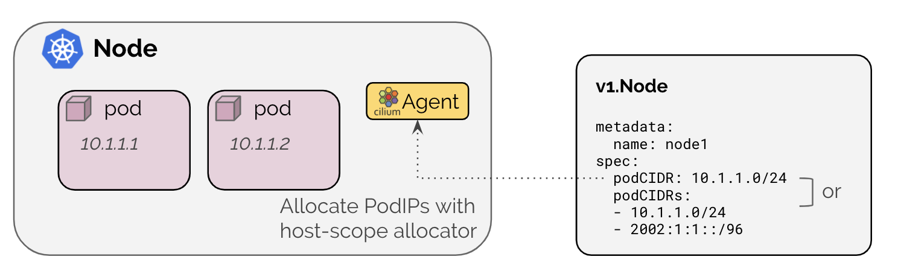

.. only:: not (epub or latex or html)

    WARNING: You are looking at unreleased Cilium documentation.
    Please use the official rendered version released here:
    https://docs.cilium.io

.. _k8s_hostscope:

#####################
Kubernetes Host Scope
#####################

The Kubernetes host-scope IPAM mode is enabled with ``ipam: kubernetes`` and
delegates the address allocation to each individual node in the cluster. IPs
are allocated out of the ``PodCIDR`` range associated to each node by
Kubernetes.

In this mode, the Cilium agent will wait on startup until the ``PodCIDR`` range
is made available via the Kubernetes ``v1.Node`` object for all enabled address
families via one of the following methods:

**via v1.Node resource field**

==================== ============================================================
Field                Description
==================== ============================================================
``spec.podCIDRs``    IPv4 and/or IPv6 PodCIDR range
``spec.podCIDR``     IPv4 or IPv6 PodCIDR range
==================== ============================================================

.. note:: It is important to run the ``kube-controller-manager`` with the flag
	  ``--allocate-node-cidrs`` flag to indicate to Kubernetes that PodCIDR
	  ranges should be allocated.

**via v1.Node annotation**

====================================== ==========================================================
Annotation                             Description
====================================== ==========================================================
``network.cilium.io/ipv4-pod-cidr``    IPv4 PodCIDR range
``network.cilium.io/ipv6-pod-cidr``    IPv6 PodCIDR range
``network.cilium.io/ipv4-cilium-host`` IPv4 address of the cilium host interface
``network.cilium.io/ipv6-cilium-host`` IPv6 address of the cilium host interface
``network.cilium.io/ipv4-health-ip``   IPv4 address of the cilium-health endpoint
``network.cilium.io/ipv6-health-ip``   IPv6 address of the cilium-health endpoint
====================================== ==========================================================

.. note:: The annotation-based mechanism is primarily useful in combination with
	  older Kubernetes versions which do not support ``spec.podCIDRs`` yet
	  but support for both IPv4 and IPv6 is enabled.

.. _hostscope_configuration:

*************
Configuration
*************

The following ConfigMap options exist to configure Kubernetes hostscope:

 * ``ipam: kubernetes``: Enables Kubernetes IPAM mode. Enabling this option will
   automatically enable ``k8s-require-ipv4-pod-cidr`` if ``enable-ipv4`` is
   ``true`` and ``k8s-require-ipv6-pod-cidr`` if ``enable-ipv6`` is ``true``.
 * ``k8s-require-ipv4-pod-cidr: true``: instructs the Cilium agent to wait until
   an IPv4 PodCIDR is made available via the Kubernetes node resource.
 * ``k8s-require-ipv6-pod-cidr: true``: instructs the Cilium agent to wait until
   an IPv6 PodCIDR is made available via the Kubernetes node resource.

With helm the previous options can be defined as:

 * ``ipam: kubernetes``: ``--set ipam.mode=kubernetes``.
 * ``k8s-require-ipv4-pod-cidr: true``: ``--set k8s.requireIPv4PodCIDR=true``,
   which only works with ``--set ipam.mode=kubernetes``
 * ``k8s-require-ipv6-pod-cidr: true``: ``--set k8s.requireIPv6PodCIDR=true``,
   which only works with ``--set ipam.mode=kubernetes``
