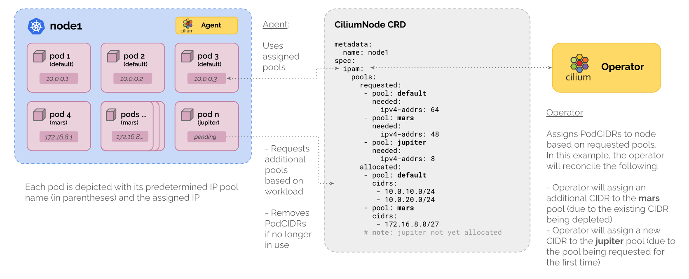

.. only:: not (epub or latex or html)

    WARNING: You are looking at unreleased Cilium documentation.
    Please use the official rendered version released here:
    http://docs.cilium.io

.. _ipam_crd_multi_pool:

Multi-Pool (Beta)
#################

.. include:: ../../../beta.rst

The Multi-Pool IPAM mode supports allocating PodCIDRs from multiple different IPAM pools, depending
on workload annotations and node labels defined by the user.

Architecture
************

When running in the Multi-Pool IPAM mode, Cilium will use the ``ipam.cilium.io/ip-pool`` annotation
on pods and namespaces to determine the IPAM pool from which a pod's IP is allocated from.

  1. If there is an ``ipam.cilium.io/ip-pool=A`` annotation on the pod itself, Cilium will
     allocate the pod's IP from the pool named ``A``.
  2. If there is no annotation on the pod, but the namespace of the pod has an
     ``ipam.cilium.io/ip-pool=B`` annotation, Cilium will
     allocate the pod's IP from the pool named ``B``.
  3. If neither the pod nor the namespace have a ``ipam.cilium.io/ip-pool`` annotation,
     the pod's IP will be allocated from the pool named ``default``.

The annotation is only considered when a pod is created. Changing the ``ip-pool``
annotation on an already running pod has no effect.

The ``CiliumNode`` resource is extended with an additional ``spec.ipam.pools`` section:

``spec.ipam.pools.requested``
  List of IPAM pool requests for this node. Each entry specifies the pool and the number of
  requested IP addresses. This field is owned and written to by the Cilium agent running on
  the particular node. It is read by the Cilium operator to fulfill the requests.

``spec.ipam.pools.allocated``
  List of CIDRs allocated to this node and the pool they were allocated from.
  Cilium operator adds new PodCIDRs to this field. Cilium agent removes PodCIDRs
  it has released and is no longer using.

IP pools are managed using the cluster-wide ``CiliumPodIPPool`` custom resource.
Each ``CiliumPodIPPool`` contains the cluster-wide CIDR from which per-node
PodCIDRs are allocated:

.. code-block:: yaml

  apiVersion: cilium.io/v2alpha1
  kind: CiliumPodIPPool
  metadata:
    name: green-pool
  spec:
    ipv4:
      cidrs:
        - 10.20.0.0/16
        - 10.30.0.0/16
      maskSize: 24
    ipv6:
      cidrs:
        - fd00::/104
      maskSize: 120

New pools can be added at run-time. The list of CIDRs in each pool can also be
extended at run-time. In-use CIDRs may not be removed from an existing pool, and
existing pools may not be deleted if they are still in use by a Cilium node.
The mask size of a pool is immutable and the same for all nodes. Neither restriction
is enforced until :gh-issue:`26966` is resolved. The first and last address of a
``CiliumPodIPPool`` are reserved and cannot be allocated. Pools with less than 3
addresses (/31, /32, /127, /128) do not have this limitation.

Configuration
*************

Multi-Pool IPAM can be enabled using the ``ipam.mode=multi-pool`` Helm value.
To have the Cilium operator automatically create ``CiliumPodIPPools`` custom
resources at startup, use the ``ipam.operator.autoCreateCiliumPodIPPools`` Helm
value. It contains a map which follows the ``CiliumPodIPPools`` CRD schema
described above.

.. code-block:: yaml

  ipam:
    mode: multi-pool
    operator:
      autoCreateCiliumPodIPPools:
        default:
          ipv4:
            cidrs:
              - 10.10.0.0/16
            maskSize: 24
        other:
          ipv4:
            cidrs:
              - 10.20.0.0/16
            maskSize: 24

.. note::

  For a practical tutorial on how to enable this mode in Cilium, see
  :ref:`gsg_ipam_crd_multi_pool`.

Updating existing CiliumPodIPPools
----------------------------------

Once you configure the ``CiliumPodIPPools``, you cannot update the existing pool. For example, 
you can't change the default pool to a different CIDR or add an IPv6 CIDR to the default pool. 
This restriction prevents pods from receiving IPs from a new range while some pods still use 
the old IP pool on the same nodes. If you need to update the existing CiliumPodIPPools, Please
use these steps as the references.

Let's assume you have a Kubernetes cluster and are using the ``multi-pool`` as the IPAM mode. 
You would like to change the existing default pool CIDR to something else and pods will take the IP address from the new CIDR. 
You hope the change will cause the least disruption to your clusters while updating the default pool to another CIDR.

We will pick some of your nodes where you would like to update the CIDR first and call them Node Group 1. 
The other nodes, which will update the CIDR later than Node Group 1, will be called Node Group 2.

1. Update your existing pool through ``autoCreateCiliumPodIPPools`` in helm values.
2. Delete the existing ``CiliumPodIPPools`` from CR and restart the Cilium operator to create new ``CiliumPodIPPools``.
3. Cordon the Node Group 1 and evict pods to the Node Group 2.
4. Delete ``CiliumNodes`` for Node Group 1, restart the Cilium agents and uncordon for Node Group 1.
5. Cordon Node Group 2, and evict pods to Node Group 1 so they can get IPs from the new CIDR from the pool.
6. Delete ``CiliumNodes`` for Node Group 2, restart the Cilium agents and uncordon for Node Group 2.
7. (Optional) Reschedule pods to ensure workload is evenly distributed across nodes in cluster.

Per-Node Default Pool
---------------------

Cilium can allocate specific IP pools to nodes based on their labels. This
feature is particularly useful in multi-datacenter environments where different
nodes require IP ranges that align with their respective datacenter's subnets.
For instance, nodes in DC1 might use the range 10.1.0.0/16, while nodes in DC2
might use the range 10.2.0.0/16.

In particular, it is possible to set a per-node default pool by setting the
``ipam-default-ip-pool`` in a ``CiliumNodeConfig`` resource on nodes matching
certain node labels.

.. code-block:: yaml

    ---
    apiVersion: cilium.io/v2alpha1
    kind: CiliumPodIPPool
    metadata:
      name: dc1-pool
    spec:
      ipv4:
        cidrs:
          - 10.1.0.0/16
        maskSize: 24
    ---
    apiVersion: cilium.io/v2alpha1
    kind: CiliumPodIPPool
    metadata:
      name: dc2-pool
    spec:
      ipv4:
        cidrs:
          - 10.2.0.0/16
        maskSize: 24
    ---
    apiVersion: cilium.io/v2
    kind: CiliumNodeConfig
    metadata:
      name: ip-pool-dc1
      namespace: kube-system
    spec:
      defaults:
        ipam-default-ip-pool: dc1-pool
      nodeSelector:
        matchLabels:
          topology.kubernetes.io/zone: dc1
    ---
    apiVersion: cilium.io/v2
    kind: CiliumNodeConfig
    metadata:
      name: ip-pool-dc2
      namespace: kube-system
    spec:
      defaults:
        ipam-default-ip-pool: dc2-pool
      nodeSelector:
        matchLabels:
          topology.kubernetes.io/zone: dc2

Allocation Parameters
---------------------

Cilium agent can be configured to pre-allocate IPs from each pool. This behavior
can be controlled using the ``ipam-multi-pool-pre-allocation`` flag. It
contains a key-value map of the form ``<pool-name>=<preAllocIPs>`` where
``preAllocIPs`` specifies how many IPs are to be pre-allocated to the local
node. The same number of IPs are pre-allocated for each address family. This
means that a pool which contains both IPv4 and IPv6 CIDRs will pre-allocate
``preAllocIPs`` IPv4 addresses and ``preAllocIPs`` IPv6 addresses.

The flag defaults to ``default=8``, which means it will pre-allocate 8 IPs from
the ``default`` pool. All other pools which do not have an entry in the
``ipam-multi-pool-pre-allocation`` map are assumed to have a ``preAllocIPs`` of
zero, i.e. no IPs are pre-allocated for that pool.

Depending on the number of in-use IPs and the number of pending IP allocation
requests, Cilium agent might pre-allocate more than ``preAllocIPs`` IPs. The
formula Cilium agent uses to compute the absolute number of needed IPs from each
pool is:

.. code-block:: go

  neededIPs = roundUp(inUseIPs + pendingIPs + preAllocIPs, preAllocIPs)

Where ``inUseIPs`` is the number of IPs that are currently in use,
``pendingIPs`` number of IPs that have a pending pod (i.e. pods which have been
scheduled on the node, but not yet received an IP), and ``preAllocIPs`` is the
minimum number of IPs that we want to pre-allocate as a buffer, i.e. the value
taken from the ``ipam-multi-pool-pre-allocation`` map.

Routing to Allocated PodCIDRs
-----------------------------

PodCIDRs allocated from ``CiliumPodIPPools`` can be announced to the network by the
:ref:`bgp_control_plane` (:ref:`bgp_control_plane_multipool_ipam`). Alternatively,
the ``autoDirectNodeRoutes`` Helm option can be used to enable automatic routing
between nodes on a L2 network.

 .. _ipam_crd_multi_pool_limitations:

Limitations
***********

Multi-Pool IPAM is a preview feature. The following limitations apply to Cilium running in
Multi-Pool IPAM mode:

.. warning::
   - IPsec is not supported in native routing mode. IPsec in tunnel mode and WireGuard
     (both in native routing and tunnel mode) are supported.
   - IPAM pools with overlapping CIDRs are not supported. Each pod IP must be
     unique in the cluster due the way Cilium determines the security identity
     of endpoints by way of the IPCache.
   - Multi-Pool IPAM does not support local node routes (``enable-local-node-route``) and
     requires the use of per-endpoint routes (see :ref:`native_routing`) instead.
   - iptables-based masquerading requires ``egressMasqueradeInterfaces`` to be set
     (see masquerading :ref:`masq_modes` and :gh-issue:`22273` for details).
     Alternatively, eBPF-based masquerading is fully supported and may be used instead.
     Note that if the used IPAM pools do not belong to a common native-routing CIDR,
     you may want to use ``ip-masq-agent``, which allows multiple disjunct non-masquerading
     CIDRs to be defined. See :ref:`concepts_masquerading` for details on how to use the
     ``ip-masq-agent`` feature.
