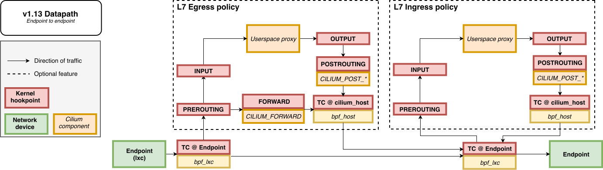

.. only:: not (epub or latex or html)

    WARNING: You are looking at unreleased Cilium documentation.
    Please use the official rendered version released here:
    https://docs.cilium.io

################
Life of a Packet
################

This documentation page overviews the life of a packet from an eBPF datapath perspective
by explaining three different scenarios.

.. admonition:: Video
  :class: attention

  You can also watch a video explanation of this topic that also explores the tools available within Cilium to help
  you understand the life of a packet in `eCHO Episode 51: Life of a Packet with Cilium <https://www.youtube.com/watch?v=0BKU6avwS98&t=494s>`__.

Endpoint to Endpoint
====================

First we show the local endpoint to endpoint flow with optional L7 Policy on
egress and ingress. Followed by the same endpoint to endpoint flow with
socket layer enforcement enabled. With socket layer enforcement enabled for TCP
traffic the
handshake initiating the connection will traverse the endpoint policy object until TCP state
is ESTABLISHED. Then after the connection is ESTABLISHED only the L7 Policy
object is still required.

Egress from Endpoint
====================

Next we show local endpoint to egress with optional overlay network. In the
optional overlay network traffic is forwarded out the Linux network interface
corresponding to the overlay. In the default case the overlay interface is
named cilium_vxlan. Similar to above, when socket layer enforcement is enabled
and a L7 proxy is in use we can avoid running the endpoint policy block between
the endpoint and the L7 Policy for TCP traffic. An optional L3 encryption block
will encrypt the packet if enabled.

.. image:: _static/cilium_bpf_egress.svg

Ingress to Endpoint
===================

Finally we show ingress to local endpoint also with optional overlay network.
Similar to above socket layer enforcement can be used to avoid a set of
policy traversals between the proxy and the endpoint socket. If the packet
is encrypted upon receive it is first decrypted and then handled through
the normal flow.

.. image:: _static/cilium_bpf_ingress.svg

This completes the datapath overview. More BPF specifics can be found in the
:ref:`bpf_guide`. Additional details on how to extend the L7 Policy
exist in the :ref:`envoy` section.
